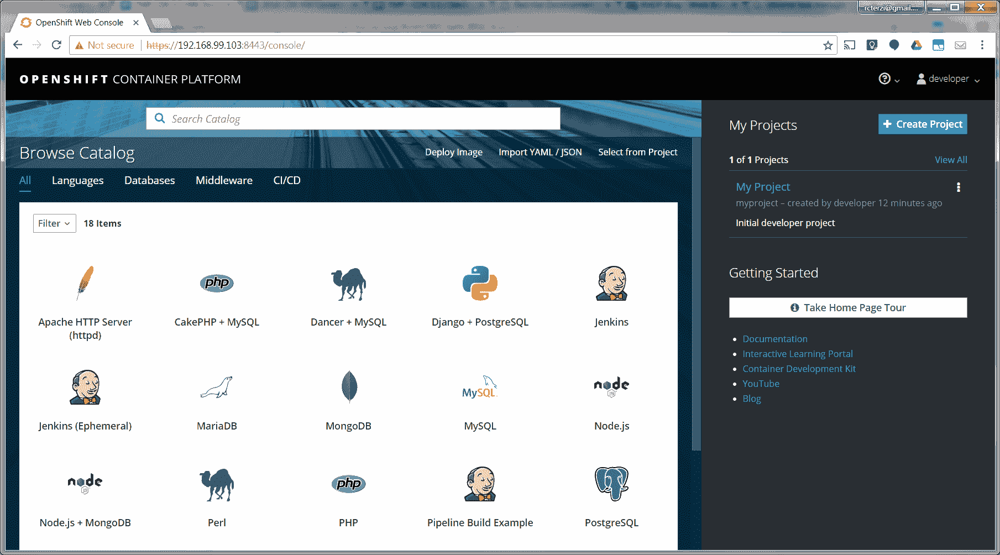

# CDK 3:使用 OpenShift 控制台构建您的第一个应用程序

> 原文：<https://developers.redhat.com/articles/cdk-nodejs-openshift-web-console>

以下步骤将指导您在 Red Hat OpenShift 容器平台上创建您的第一个项目，该项目在 minishift 虚拟机上的 [Red Hat 容器开发工具包](/products/cdk/overview)中运行。该项目是一个 node . js“Hello，World”应用程序，显示当前的点击次数。MongoDB 数据库用于存储点击次数。将创建两个 pod，一个用于 Node.js 应用程序，另一个用于数据库。

该项目的源代码可以在 GitHub 上获得: [openshift/nodejs-ex](https://github.com/openshift/nodejs-ex) 。CDK 的 OpenShift 目录提供了许多项目模板，包括这个 Node.js 示例应用程序。对于本指南，我们将使用 OpenShift 目录中的模板。您将使用 OpenShift web 控制台来构建和管理您的应用程序。

注意:本指南使用 OpenShift web 控制台来构建和管理您的应用程序。或者，您可以使用 oc CLI 来完成相同的步骤。以下命令将创建从 GitHub 提取源代码的应用程序:

```
$ oc new-app https://github.com/openshift/nodejs-ex
```

有关更多信息，请参见 OpenShift 文档开发人员指南部分的[使用 CLI](https://docs.openshift.org/latest/dev_guide/application_lifecycle/new_app.html#using-the-cli) 创建应用程序。

如果你还没有安装 CDK，请遵循这些说明。

启动 CDK/微移虚拟机:

```
$ minishift start
```

虚拟机启动并运行后，在浏览器中启动 web 控制台:

```
$ minishift console
```

注:web 控制台可能无法在某些旧版本的 Safari 上启动。您可以使用以下命令获取用于不同浏览器的 URL:

```
$ minishift console --url
```

使用用户名`developer`和任何密码文本登录 OpenShift 控制台。已经为您创建了一个名为 *My Project* 的默认空项目。或者，您可以使用“创建项目”按钮随时创建一个新的空项目。

## 创建应用程序

按照以下步骤创建、构建和部署应用程序:

1.  After logging in you will see a page with the OpenShift catalog of application templates that have been preloaded into CDK.  
     [](/sites/default/files/01-cdk33-openshift-catalog.png)
2.  点击标有 *Node.js + MongoDB 的图标。*然后点击*下一步*查看项目配置信息。

3.  默认设置都不需要更改，所以单击 *Create* 来创建应用程序。这将创建应用程序并开始构建。点击*关闭*关闭创建对话框。

4.  点击右侧项目列表中的*我的项目*，进入您的项目概述页面。

5.  应用程序将自动构建和部署。您可能需要等待构建完成。
    [](/sites/default/files/02-cdk33-project-overview.png)
6.  当应用程序完成构建和部署时，您应该会看到两个正在运行的 pod。从左侧菜单中选择*应用*。然后选择*路线*。

7.  应用程序模板创建了一个路由，允许 HTTP 流量到达 OpenShift 集群中运行的 Node.js 应用程序 pod。点击*主机名*栏中的 URL 查看您的应用程序。
    T3[T5](/sites/default/files/03-cdk33-routes.png)

至此，您已经在个人 OpenShift 集群上的 OpenShift 上运行的容器中成功构建和部署了 Node.js 和 MongoDB 应用程序。浏览菜单以查看创建的组件、查看日志并浏览 OpenShift。

## 
下一步去哪里？

*   从 [CDK 入门指南](https://access.redhat.com/documentation/en-us/red_hat_container_development_kit/3.3/html-single/getting_started_guide/index)中了解更多关于 CDK 的信息
*   如果你是 OpenShift 的新手，试试 learn.openshift.com 的在线教程
*   阅读 [OpenShift 文档](https://docs.openshift.com/container-platform/3.7/welcome/index.html)
*   关注红帽开发者博客，获取关于 [OpenShift](https://developers.redhat.com/blog/category/openshift/) 、 [CDK](https://developers.redhat.com/blog/category/container-development-kit/) 、[容器](https://developers.redhat.com/blog/category/containers/)以及许多其他主题的文章。

*Last updated: January 6, 2023*