# RHEL 8 VirtualBox 快速安装

> 原文：<https://developers.redhat.com/rhel8/install-rhel8-vbox>

## 概观

本概述涵盖了安装 Red Hat Enterprise Linux 8 的关键步骤，以便您可以开始软件开发。

**本教程不替代*红帽企业 Linux 8 安装指南*。相反，本教程为软件开发人员提供了关键步骤的概述。详细说明见 [RHEL 8 文档](https://access.redhat.com/documentation/en-us/red_hat_enterprise_linux/8/)。**

您将安装一个带有完整图形桌面的系统，您可以用它来探索 RHEL 8。与之前版本的 RHEL 8 不同，没有针对服务器、工作站或台式机的单独下载。

## 开始之前

要遵循本指南中的步骤，您需要:

1.  免费的红帽开发者订阅和 [RHEL 8 二进制 DVD。iso](https://developers.redhat.com/products/rhel/download) 文件。当您通过 developers.redhat.com[网站](https://developers.redhat.com/products/rhel/download)注册和下载时，订阅将自动添加到您的帐户中。
2.  你的红帽用户名和密码。您的帐户是在第一步中创建的。您将需要它来注册系统，并将其附加到您的订阅中。您的系统需要完成这些步骤才能从 Red Hat 下载软件。
3.  满足以下要求的系统:
    *   带有硬件虚拟化辅助的 64 位 x86 机器(英特尔 VT-X 或 AMD-V)。
    *   至少 4 GB 内存。
    *   至少 28 GB 的可用磁盘空间用于虚拟机和。iso 文件。
    *   安装了 VirtualBox。

注意事项:

*   需要在系统的 BIOS/UEFI 设置中启用硬件虚拟化。
*   在 Windows 上，可能需要禁用 Hyper-V 以避免与 VirtualBox 冲突。

## 创建虚拟机

在 VirtualBox 中，按照以下标准创建新的虚拟机:

*   最少 2 GB 内存。建议使用 4 GB 或更大的容量。
*   20 GB 或更大的虚拟磁盘。
*   建议使用 2 个或更多虚拟 CPU。

将虚拟机配置为从 *RHEL 8 二进制 DVD 启动。您之前下载的 iso* 文件。在虚拟机的设置中，在*存储*下，选择 *IDE 控制器*下的光驱。然后，使用右边的 CD 图标下拉菜单选择*选择虚拟光盘文件*。

**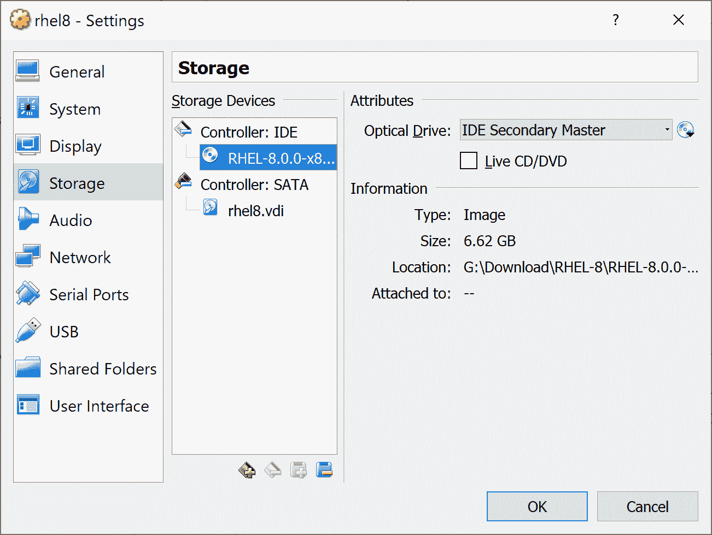**

### 可选虚拟机配置:

#### 建立工作关系网

默认的网络选择 NAT 是最容易使用的，但是您将无法从主机或网络访问在 RHEL 虚拟机上运行的 ssh 或 http 等服务。但是，您可以在网络适配器配置下的*高级*部分定义端口转发来提供访问。

例如，为了使用 ssh，定义一个从*主机端口* 2222 转发到*客户端口* 22 的端口。这将允许您通过使用端口 2222 在主机上使用 ssh:

```
$ ssh -p 2222 root@localhost

```

或者，您可以通过共享主机系统的网络适配器作为桥接网络适配器，将虚拟机直接连接到网络。在这种配置中，虚拟机通常使用网络的 DHCP 服务器获得自己的 IP 地址。虚拟机出现在网络上的方式与拥有自己的硬件 MAC 地址的物理计算机相同。主机的网络适配器由 VirtualBox 安装的设备驱动程序共享。虚拟机的虚拟网络适配器一次只能桥接到一个物理网络适配器。如果您的系统有多个网络适配器，您需要选择要连接的适配器。如果您的系统在有线和无线连接之间切换，那么在有线和无线连接之间切换时，您需要切换虚拟机所桥接的适配器。

#### 使用 virtio 提高网络性能(仅限 Windows 和 Linux 主机)

为了提高 Windows 和 Linux 主机上的虚拟机网络性能，在虚拟机设置中的*网络适配器类型*下，选择*半虚拟化网络(virtio-net* )。半虚拟化适配器消除了模拟硬件网络适配器的大部分开销。

#### 复制并粘贴

在虚拟机设置*常规中，在高级*选项卡上，设置*共享剪贴板*和*拖放*到*双向*。复制和粘贴需要安装 *VirtualBox 来宾附件*。RHEL 虚拟机完全安装并注册后，您可以安装安装 VirtualBox Guest Additions 所需的内核软件包。

**提示:**要在安装 VirtualBox Guest Additions 之前进行复制和粘贴，请在主机的终端窗口中使用`ssh`。您可以在“终端”窗口中拷贝和粘贴文本。

## 装置

现在你已经准备好运行 RHEL 8 安装程序了。

**TL；**博士的安装步骤是:

*   选择要安装的软件。选择 W *orkstation* 基础环境，添加*开发工具*、*图形化管理工具*和*容器工具*。**注意:不要选择带有 GUI 的*服务器。***
*   选择用于安装的磁盘/分区。
*   禁用 kdump 以节省内存。
*   配置**并启用**网络连接，以便在引导时开始联网。可以选择设置主机名。
*   设置 root 密码
*   创建您的普通用户 ID 并将您的 ID 设为管理员，这样您就可以使用`sudo`。

### 1.启动 RHEL 8 安装程序

使用包含 RHEL 8 二进制 DVD 的可引导安装介质引导系统。iso:

[](/sites/default/files/01_rhel8_boot_installer.png)

**注意:在启动过程中，您可以通过点击 *Esc* 键**跳过介质检查步骤

在以下屏幕上，选择安装过程中要使用的首选语言和键盘布局。

现在，您应该会看到用于配置安装的主屏幕:

[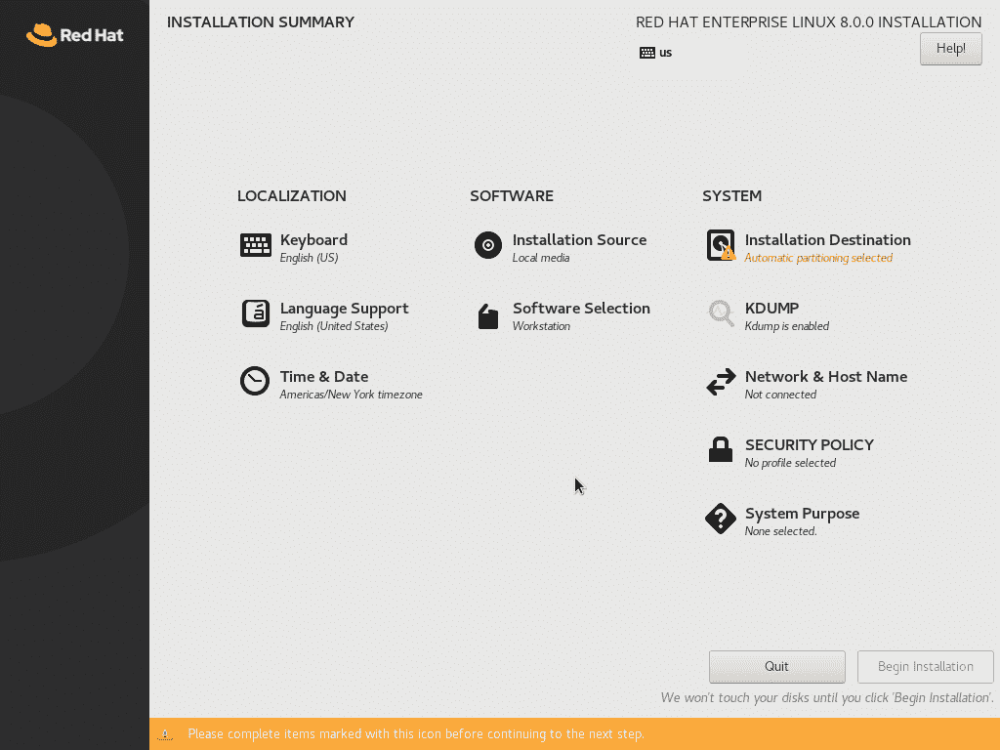](/sites/default/files/10_rhel8_config_screen_initial.png)

### 2.选择要安装的软件

点击*软件*下的软件选择。我们建议您:

*   在*基地环境*下选择左侧*工作站*
*   然后，选择*容器管理、开发工具和图形管理工具*。

**Note: Do not choose *Server with a GUI* as your base environment. There is a known issue that will prevent the graphical desktop from starting**[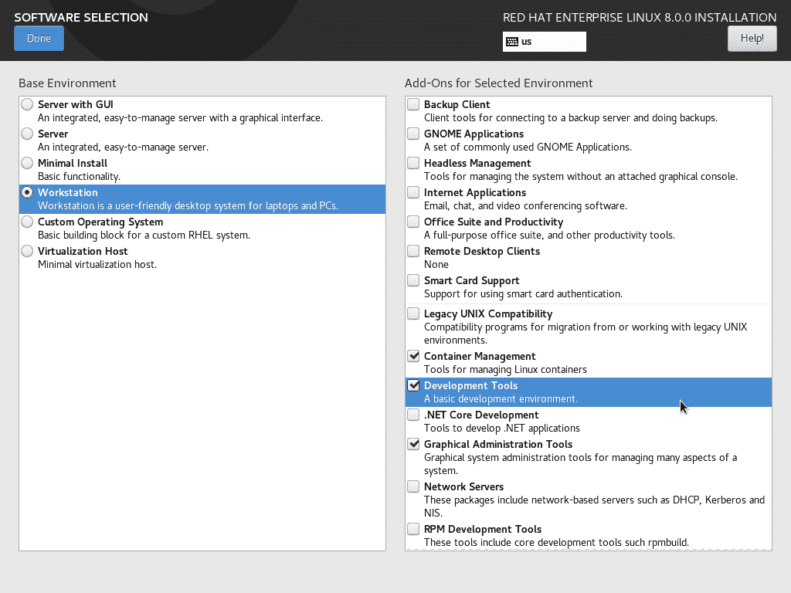](/sites/default/files/20_rhel8_software_selection_0.png)

### 3.选择要安装的磁盘/分区

点击*系统*下的*安装目的地*。选择用于安装 RHEL 的磁盘/分区。详见 [*红帽企业版 Linux 8 安装指南*](https://access.redhat.com/documentation/en-us/red_hat_enterprise_linux/8/html-single/performing_a_standard_rhel_installation/index ) 。

**注意:**如果您的系统只有一个磁盘，并且您使用整个磁盘进行安装，只需点击*完成*

[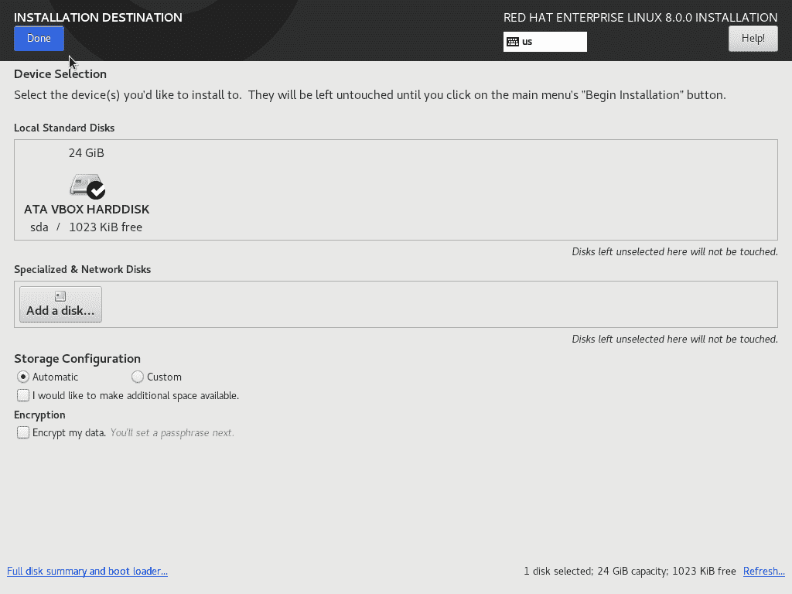](/sites/default/files/30_rhel8_install_destination.png)

### 4.禁用 kdump 以节省内存

接下来，为了节省内存，通过单击系统下的 kdump 来关闭 Kdump。然后，取消勾选*启用 Kdump* 。

[](/sites/default/files/40_rhel8_kdump_disable.png)

### 5.配置并启用网络连接

接下来，配置网络并可选地设置主机名。在*系统*下点击*网络&主机名*。然后:

*   从列表中选择您的网络适配器。如果您需要更改任何网络设置，请点击*配置…* 。
*   点击右上角 *OFF* 按钮右边的开关，打开适配器。
*   或者，您可以在左下角设置系统的主机名。

**注意:如果您不在此处启用网络适配器，当您引导系统**时，您将无法连接网络。

[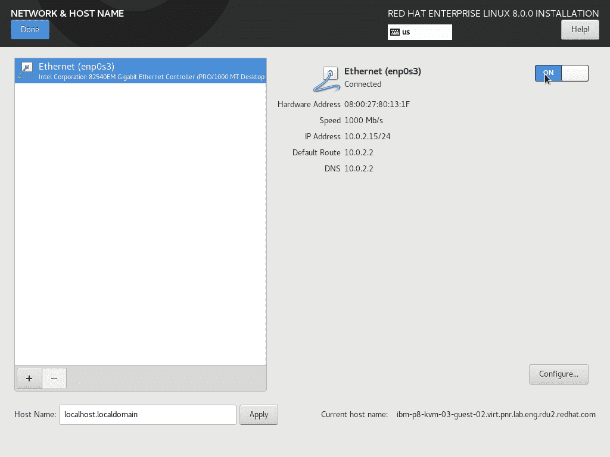](/sites/default/files/50_rhel8_install_network_enable.png)

### 6.开始安装

当您对配置满意时，点击*开始安装。*

[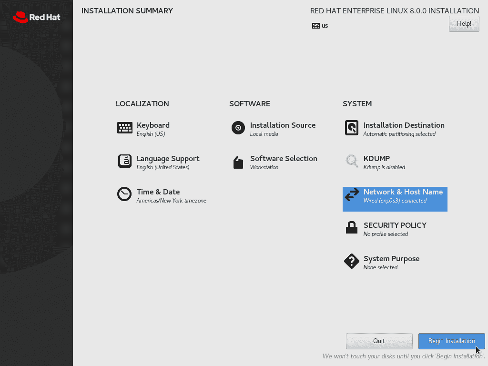](/sites/default/files/60_rhel8_begin_install.png)

### 7.创建您的用户 ID 并设置 root 密码，

安装过程中，点击 *Root Password* 设置 Root(管理员)密码。

接下来，点击*用户创建*，创建您将用来登录系统的常规用户 ID。

**重要提示:**选择*使该用户成为管理员。*这将为您的用户 ID 启用`sudo`。

[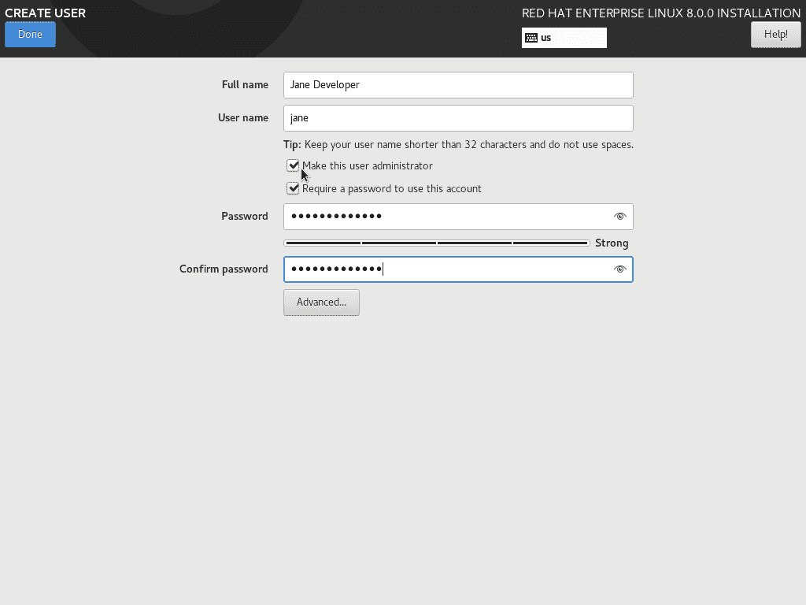](/sites/default/files/70_rhel8_install_create_user.png)

### 8.重新启动并弹出安装媒体

安装完成后，点击右下角的*重启*。

**重要提示**:当您的系统重新启动时，不要忘记弹出安装介质，这样您就不会无意中重新启动到 RHEL 8 安装程序

如果您的计算机(或虚拟机)重启过快，无法弹出安装介质，您可以尝试:

*   在 BIOS 中更改引导顺序
*   关闭系统，然后重新启动系统。在开机自检期间弹出介质，或者使用 BIOS 的相应键(如 F12、F10、Enter)来选择引导设备。
*   在 VirtualBox 上，从虚拟机的窗口菜单中选择*设备，然后选择*光驱*->-*从虚拟光驱中取出光盘*弹出安装 ISO。如果系统已经引导到安装程序，您需要点击*强制卸载*。然后，通过*机器*菜单，或者使用键盘快捷键右键 CTRL + R (Windows/Linux)或左键 Command + R (Mac)来重置虚拟机。然后，虚拟机应该从虚拟硬盘启动。*
*   在 Hyper-V 上，从虚拟机的菜单中选择*媒体*。然后为 RHEL 8 DVD 选择*弹出*。

## 系统注册

### 第一次开机

当系统重启时，点击*许可信息*接受许可协议。在许可信息屏幕上，点击许可文本下的【T2 我接受许可协议】。

[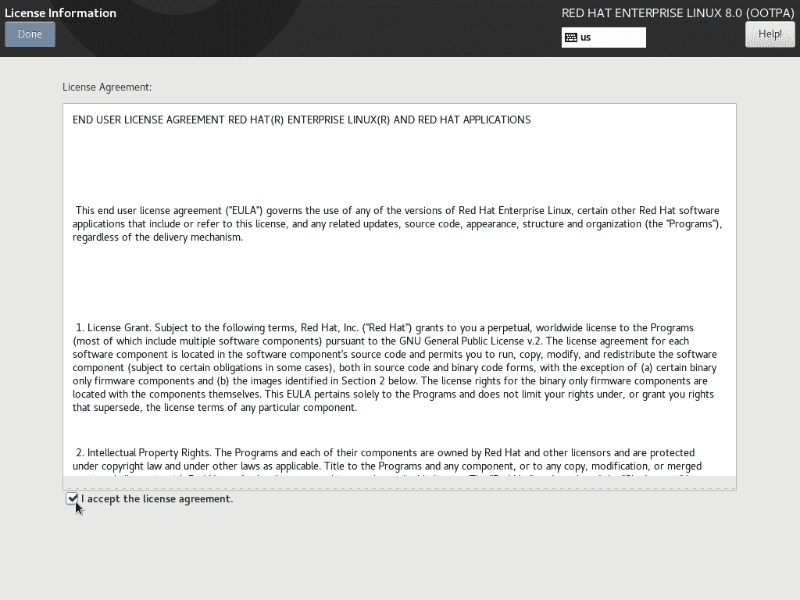](/sites/default/files/85_rhel8_accept_license.png)

### 首次引导期间的系统注册

您的系统需要注册才能从 Red Hat 下载软件和更新。当您加入 Red Hat Developers 时，您的帐户中会添加一个免费的开发者订阅。注册您的系统会将其附加到您的订阅中。

如果您在安装期间配置并启动了网络连接，现在可以使用图形界面注册系统。如果您没有激活网络连接，请按照下面的说明向`subscription-manager` CLI 注册。

要注册您的系统，请点击*订阅管理器*。在下一个屏幕上，如果需要配置代理，点击*配置代理*，否则点击*下一步*。

在下面的屏幕上，输入您的 Red Hat 用户名和密码。当您加入 Red Hat Developers 时，会为您创建一个 Red Hat 帐户。这是您用于红帽网站的登录名，如红帽客户门户网站、[access.redhat.com](https://access.redhat.com/)。然后，单击注册。

[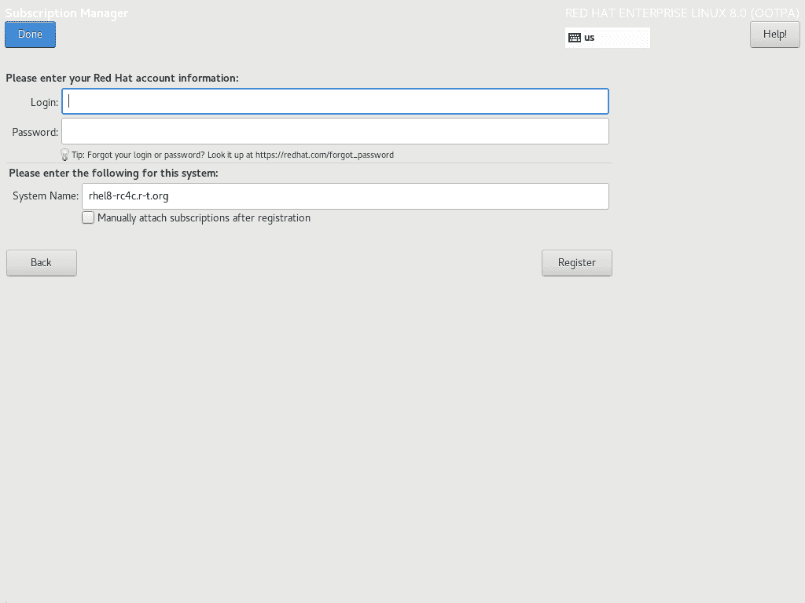](/sites/default/files/90_rhel8_register_gui.png)

在*确认订阅*屏幕上，如果列出了多个订阅，选择*红帽开发者订阅*。然后，点击*附加*。注册完成后，点击*完成*。

接下来，点击*完成配置。*

使用您在安装过程中创建的用户 ID 和密码登录系统。

在您第一次登录时，设置您的语言、键盘布局以及启用或停用定位服务。然后，连接您的在线帐户或点击*跳过*。接下来点击*开始使用红帽企业 Linux* 。在您查看完 GNOME 入门信息后，关闭窗口。

### 从命令行进行系统注册

如果您在第一次引导时没有注册您的系统，您可以在任何时候使用命令行注册。点击左上角的*活动*启动终端窗口。然后选择左下方的*终端*图标。或者，开始在搜索框中键入`terminal`，然后按 enter 键接受终端自动完成。

[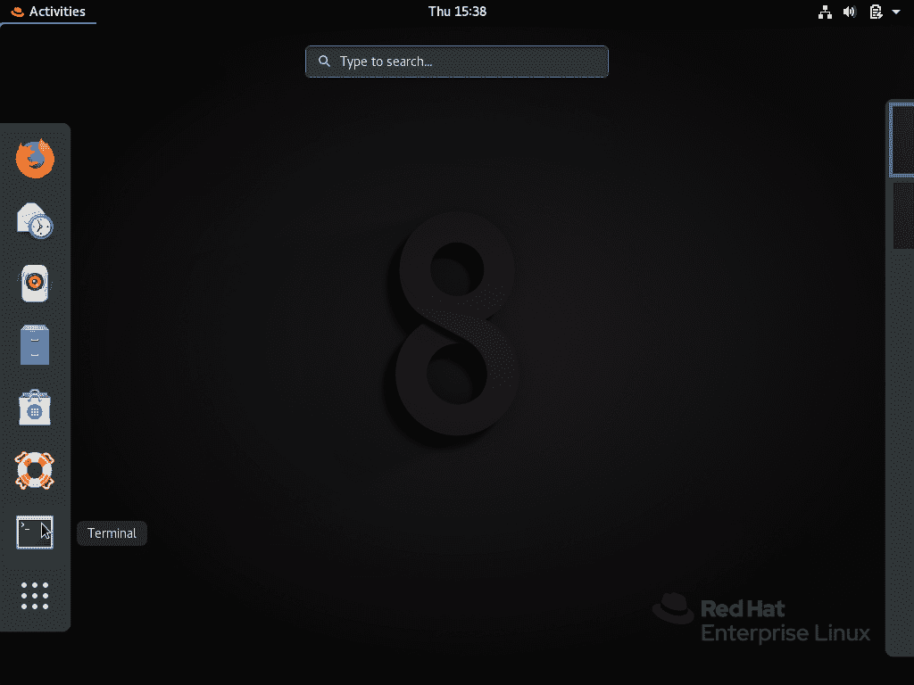](/sites/default/files/95_rhel8_terminal_start.png)

在终端窗口中，启动一个根 shell:

```
$ sudo bash

```

接下来，向 Red Hat 订阅管理注册您的系统:

```
# subscription-manager register --auto-attach

```

输入您的 Red Hat 用户名和密码。注册完成后，您将看到:

```
Installed Product Current Status:
Product Name: Red Hat Enterprise Linux for x86_64
Status:       Subscribed

```

检查您现在是否启用了 *BaseOS* 和 *AppStream* repos 和`yum repolist`:

```
# yum repolist
Updating Subscription Management repositories.
Red Hat Enterprise Linux 8 for x86_64 - AppStream (RPMs)
Red Hat Enterprise Linux 8 for x86_64 - BaseOS (RPMs)
```

## 安装更新

注册系统后，您可以使用命令行或 web 控制台来安装最新的更新。

### 从命令行更新

在终端会话中使用`yum update`表单安装最新更新。

```
$ sudo yum update
```

如果在更新过程中安装了更新的内核包，您应该重新启动系统:

```
$ reboot
```

### 驾驶舱网络控制台

Red Hat Enterprise Linux 8 包括一个名为 *Cockpit* 的基于 web 的控制台，它简化了管理任务，特别是对于不熟悉 Linux 的用户。

### 启用驾驶舱网络控制台

开箱即用，驾驶舱没有启用。我们建议您启用驾驶舱。要启用它，请运行下面的命令一次。不用也不用担心驾驶舱消耗资源。以下命令告诉 systemd 仅在访问 Cockpit 时启动它。

```
$ sudo systemctl enable --now cockpit.socket 

```

默认情况下，系统防火墙将阻止从网络访问驾驶舱。要允许从网络访问:

```
$ sudo firewall-cmd --add-port=9090/tcp
$ sudo firewall-cmd --permanent --add-port=9090/tcp
```

### 使用驾驶舱网络控制台

要访问驾驶舱网络控制台，从活动菜单中启动 Firefox，然后输入 URL: `http://localhost:9090/`

使用您的普通用户 ID 或`root`用户 ID 登录驾驶舱。

从网络使用驾驶舱使用:`https://<hostname>:9090/`

**注意:默认情况下安装自签名 SSL/TLS 证书，这将生成安全异常，因为它不是由可信 CA 签名的。你必须同意继续。**

更多信息请参见 [*使用 Web 控制台管理系统*](https://developers.redhat.com/search?t=Managing+Systems+Using+the+Web+Console)

## VirtualBox 来宾添加

向 RHEL 虚拟机添加 VirtualBox 来宾操作系统可以从多方面提高可用性:

*   支持主机和虚拟机之间的复制和粘贴。
*   消除了虚拟机捕获鼠标指针的需要。集成的鼠标指针流畅多了。
*   VMs 屏幕可动态调整大小，因此您可以有更多的空间进行编辑。
*   文件夹可以很容易地在主机和虚拟机之间共享，从而很容易共享源代码。

首先，确保您已经按照上面的说明安装了最新的更新。在安装过程中，将编译并安装一个内核模块。有几个先决条件。首先，您应该在系统安装期间安装了*开发工具*。如果没有，请使用:

```
$ sudo yum groupinstall "Development Tools"
```

接下来，安装内核开发包，这样您就可以构建可加载的内核模块:

```
$ sudo yum install kernel-devel elfutils-libelf-devel
```

现在，使用虚拟机窗口上的*设备*菜单项插入 *VirtualBox 访客添加 CD 映像*。一个弹出窗口将询问您是否要在光盘映像上运行软件。点击*运行*。

**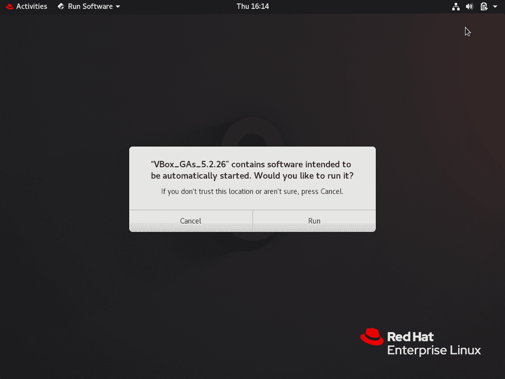**

构建和安装客户机附件时，将弹出一个终端窗口。完成后，按回车键关闭窗口。

****

一些改进，如鼠标指针集成将立即可用。其他改进只有在虚拟机重启后才可用。

## 编码时间

使用这些文档在 Red Hat Enterprise Linux 8 上创建您的第一个应用程序。

*   [RHEL 上的巨蟒 8](https://wp.me/p8e0as-2fsJ)
*   [RHEL 8 上的 node . js](http://developers.redhat.com/rhel8/hw/nodejs)
*   [Java 8 和 11 上 RHEL 8](https://developers.redhat.com/blog/2018/12/10/install-java-rhel8/)

## 应用流

第一步是查看应用程序流(appstream)报告中有哪些模块可用:

```
$ sudo yum module list  # list all available modules in appstream

```

或者，只查找名为“nodejs”的模块

```
$ sudo yum module list nodejs

```

从输出中可以看到 Node.js 10 是要安装的默认模块，注意`[d]`。您可以简单地输入以下命令来安装默认的 nodejs 模块。

```
$ sudo yum module install nodejs

```

甚至用“@”来缩短:

```
$ sudo yum install @nodejs

```

上面的命令已经用默认的概要文件安装了 nodejs。概要文件是模块中的一组包，通常是它们的子集。对于该模块，默认配置文件被命名为“default”。在上面的步骤中，选择了“development”概要文件来安装开发概要文件中的包。

要了解有关模块的更多信息，请使用以下命令之一:

```
$ sudo yum module info nodejs  # get info about the default nodejs module

```

```
$ sudo yum module info nodejs:10   # get info about a specific module stream
```

*Last updated: November 3, 2021*