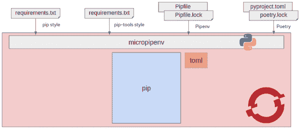

# micropipenv:在容器化的应用程序中安装 Python 依赖项

> 原文：<https://developers.redhat.com/articles/2021/05/19/micropipenv-installing-python-dependencies-containerized-applications>

软件工程行业的趋势表明 [Python 编程语言越来越受欢迎](https://insights.stackoverflow.com/survey/2020#technology-programming-scripting-and-markup-languages)。正确管理 [Python](/blog/category/python/) 依赖对于保证健康的软件开发生命周期至关重要。在本文中，我们将看看如何将 Python 应用程序的 Python 依赖项安装到[容器化环境](/topics/containers)中，这也变得非常流行。特别是，我们引入了 [micropipenv](https://pypi.org/project/micropipenv) ，这是我们在 pip(Python 包安装程序)和相关安装工具之上创建的一个兼容层。本文中讨论的方法确保您的应用程序附带了所需的软件，以实现可追溯性或完整性。这种方法提供了跨不同应用程序构建的可重复的 Python 应用程序。

## Python 依赖管理

开源社区努力提供管理应用依赖的工具。最流行的 Python 工具有:

*   [pip](https://pypi.org/project/pip/) (由 Python 打包权威提供)
*   [画中画工具](https://pypi.org/project/pip-tools/)
*   [Pipenv](https://pypi.org/project/pipenv/) (由 Python 打包权威提供)
*   [诗歌](https://pypi.org/project/poetry/)

这些工具各有利弊，因此开发人员可以根据自己的喜好选择合适的工具。

### 虚拟环境管理

对开发人员来说很重要的一个特性是隐式虚拟环境管理，由 Pipenv 和 poems 提供。在本地开发应用程序时，这个特性可以节省时间，但是在容器映像中安装和提供应用程序时，这个特性可能会有缺点。添加这一层的缺点之一是它对容器映像大小的潜在负面影响，因为这些工具增加了容器映像中软件的体积。

另一方面，在本地开发应用程序时，pip 和 pip 工具需要明确的虚拟环境管理。借助显式虚拟环境管理，应用程序依赖性不会干扰系统 Python 库或跨多个项目共享的其他依赖性。

### 锁定文件

尽管 pip 是安装 Python 依赖项的最基本的工具，但它没有提供管理整个依赖图的隐含机制。这给了 pip-tools 开发者一个机会来设计 pip-tools 来管理锁定的依赖列表，以基于应用需求的直接依赖和传递依赖为特征。

在锁文件中声明所有的依赖关系，可以对在任何时间点安装哪个版本的哪些 Python 依赖关系提供细粒度的控制。如果开发人员没有锁定所有的依赖项，他们可能会面临随着时间的推移而出现的问题，这些问题可能是由于新的 Python 包版本、[突然推出特定的 Python 版本(PEP-592)](https://www.python.org/dev/peps/pep-0592/) ，或者从 Python 包索引中完全删除 Python 包，如 [PyPI](https://pypi.org/) 。所有这些操作都可能引入不希望的和不可预测的问题，这些问题是由所安装的依赖项中的跨版本的更改而产生的。用应用程序维护和运送锁文件避免了这样的问题，并为应用程序维护人员和开发人员提供了可跟踪性。

### 已安装工件的摘要

尽管 pip-tools 在其锁文件中声明了安装在特定版本中的所有依赖项，但我们建议通过为 pip-compile 命令提供 [- generate-hashes 选项来包含已安装工件的摘要，因为默认情况下不会这样做。该选件在安装过程中触发已安装工件的完整性检查。已安装工件的摘要自动包含在由 Pipenv 或 poems 管理的锁文件中。](https://pypi.org/project/pip-tools/)

另一方面，pip 不能生成已经安装的软件包的散列。然而，当工件的摘要被明确提供或者当您提供了 [- require-hashes 选项](https://pip.pypa.io/en/stable/cli/pip_install/)时，pip 会在安装过程中执行检查。

为了支持本节中讨论的所有工具，我们引入了 micropipenv。本文的其余部分将解释它是如何工作的，以及它如何适应 Python 环境。

## 使用 micropipenv 安装 Python 依赖项

micropipenv 解析前面讨论的工具产生的需求或锁文件:`requirements.txt`、`Pipfile` / `Pipfile.lock`和`pyproject.toml` / `poetry.lock`。micropipenv 与其他工具紧密合作，并作为 pip 的一个小补充，它可以在考虑需求文件和锁文件的同时准备依赖安装。核心 pip 安装流程的所有主要优势都保持不变。

通过支持由 pip、pip-tools、Pipenv 和 poem 生成的所有文件，micropipenv 允许用户使用他们选择的工具来安装和管理他们项目中的 Python 依赖项。一旦应用程序准备好在容器映像中发布，开发人员就可以无缝地使用所有最新的基于 Python 3 的 [Python 源到映像](https://github.com/sclorg/s2i-python-container) (S2I)容器映像。这些图像提供了 micropipenv 功能。您可以随后在由 [Red Hat OpenShift](/openshift) 管理的部署中使用这些应用程序。

图 1 显示了 micropipenv 作为在 OpenShift 部署中安装 Python 依赖项的公共层。

[](/sites/default/files/blog/2021/01/Screenshot_2021-01-07_14-56-15.png)micropipenv serving common layer in OpenShift Python S2I.

Figure 1: micropipenv in an OpenShift Python S2I deployment.

为了在 Python [S2I 构建过程](https://docs.openshift.com/container-platform/4.6/builds/build-strategies.html#builds-strategy-s2i-build_build-strategies)中启用 micropipenv，导出`ENABLE_MICROPIPENV=1`环境变量。更多细节参见[文档](https://github.com/sclorg/s2i-python-container/tree/master/3.6#environment-variables)。这个特性在最近所有基于 Python 3 的 [S2I 容器映像](https://github.com/sclorg/s2i-python-container/)中可用，并构建在 Fedora、CentOS Linux、[Red Hat Universal Base Images](/products/rhel/ubi)(UBI)或[Red Hat Enterprise Linux](/products/rhel/overview)(RHEL)之上。尽管 micropipenv 最初是为容器化的 Python S2I 容器映像设计的，但我们相信[它也可以在其他地方找到用例](https://github.com/thoth-station/micropipenv/blob/deed020fb3ee57ab1aa7df8a46419393b501d7f3/README.rst#micropipenv-use-cases)，比如在没有锁文件管理工具的情况下安装依赖项，或者在不同类型的锁文件之间转换。我们还发现工具[适用于协助 Jupyter 笔记本](https://github.com/thoth-station/jupyterlab-requirements/)中的依赖项安装，以[支持可再生的数据科学环境](/blog/2021/03/19/managing-python-dependencies-with-the-thoth-jupyterlab-extension/)。

**注**:如果你对透思的 Python S2I 集成感兴趣，请查看[项目透思 scrum 演示](https://www.youtube.com/watch?v=I-QC83BcLuo&t=8m58s)(micropipenv 演示 9:00 开始)。你还可以查看在 [DevNation 2019](/devnation) 大会上展示的 OpenShift S2I 演讲中的[改进。幻灯片](https://www.youtube.com/watch?v=QT4ConYPSOA)[和演讲](https://github.com/thoth-station/talks/blob/master/2020-09-25-devconf-us/thoth_python_s2i.pdf)的[描述也可以在网上获得。](https://devconfus2020.sched.com/event/dkXi/improvements-in-openshift-python-s2i)

## micropipenv 的优势

我们希望将 Pipenv 或 poem 引入 Python S2I 构建过程，因为它们对开发人员有好处。但是从 RPM 包维护的角度来看，Pipenv 和 poem 都很难按照我们在 Fedora、CentOS 和 RHEL 中使用 RPM 的标准方式进行打包和维护。Pipenv 捆绑了其 50 多个依赖项，这些依赖项的列表会不断变化。像这样的打包工具很复杂，所以维护它们并修复它们捆绑的依赖关系中所有可能的安全问题可能非常耗时。

而且 micropipenv 带来了统一的安装日志。日志并不基于所使用的工具而有所区别，并提供了对安装过程中可能出现的问题的深入了解。

使用 micropipenv 的另一个原因是 pipenv 安装使用超过 18MB 的磁盘空间，对于一个在容器构建期间只需要使用一次的工具来说，这是一个很大的数目。

我们已经将 [micropipenv 打包准备成 RPM 包](https://src.fedoraproject.org/rpms/micropipenv)。PyPI 上也有[；该项目是开源的，在 GitHub 的](https://pypi.org/project/micropipenv) [thoth-station/micropipenv 库](https://github.com/thoth-station/micropipenv/)上开发。

在其核心，micropipenv 只依赖于 pip。当安装了 TOML Python 库时，其他特性也是可用的( [toml](https://pypi.org/project/toml) 或遗留的 [pytoml](https://pypi.org/project/pytoml) 是可选的依赖项)。总的来说，最小的依赖性给了 micropipenv 一种非常轻松的感觉。与大得多的 Pipenv 或诗歌代码库相比，代码库中只有一个文件[有助于项目维护。所有安装程序都是从受支持的](https://github.com/thoth-station/micropipenv/blob/master/micropipenv.py) [pip 版本](https://pypi.org/project/pip)中重用的。

## 使用和开发 micropipenv

您可以通过以下任何一种方式获得 micropipenv:

*   向源到映像容器构建过程提供 [ENABLE_MICROPIPENV=1](https://github.com/sclorg/s2i-python-container/tree/master/3.6#environment-variables)
*   [通过运行

    ```
    $ dnf install micropipenv
    ```

    安装 micropipenv RPM](https://src.fedoraproject.org/rpms/micropipenv)
*   运行

    ```
    $ pip install micropipenv
    ```

    安装 [micropipenv Python 包](https://pypi.org/project/micropipenv)

要开发和改进 micropipenv 或提交功能请求，请访问[Thoth-station/micropipenv](https://github.com/thoth-station/micropipenv/)资源库。

## 承认

micropipenv 是在[项目 Thoth](http://thoth-station.ninja/) 中的[红帽人工智能卓越中心](http://github.com/aicoe)开发的，并由于与红帽 Python 维护团队的合作而带给您。

*Last updated: August 26, 2022*