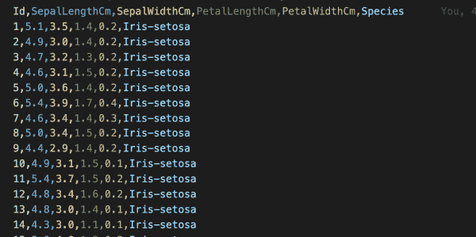
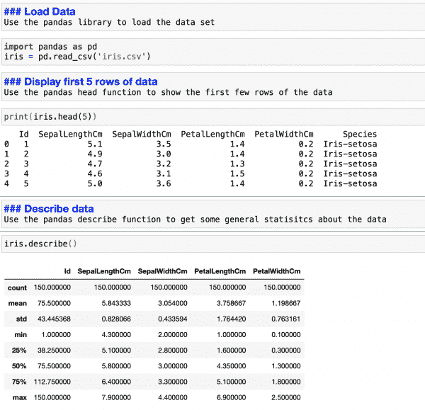
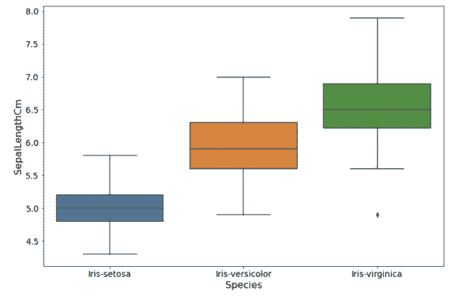
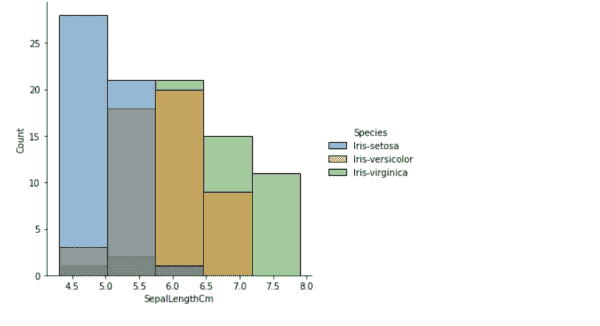
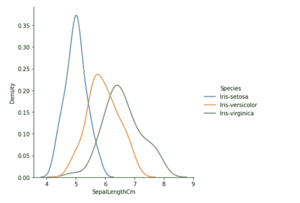

# 机器学习生命周期，第 1 部分:理解数据的方法

> 原文：<https://developers.redhat.com/blog/2021/05/11/the-machine-learning-life-cycle-part-1-methods-for-understanding-data>

我认为[机器学习](/topics/ai-ml)是帮助我们发现数据意义的工具和技术。在本文中，我们将了解理解数据如何帮助我们构建更好的模型。

这是涵盖机器学习项目简单生命周期系列的第一篇文章。在以后的文章中，您将学习如何构建一个机器学习模型，实现超参数调优，以及将模型部署为 REST 服务。

## 理解数据的重要性

机器学习是关于数据的。无论我们的算法有多先进，如果数据不正确或不够，我们的模型就无法按预期执行。

有时有些数据对于给定的训练问题可能没有用。我们如何确保算法只使用正确的信息集？那些单独并不有用的字段怎么办，但是如果我们对一组字段应用一个函数，数据就变得非常有用了？

让你的数据对算法有用的行为叫做*特征工程*。大多数时候，数据科学家的工作是为给定的问题找到正确的数据集。

## 数据分析:优秀机器学习模型的关键

数据分析是数据科学工作的核心。我们试图用数据来解释业务场景或解决业务问题。

数据分析对于建立机器学习模型也是必不可少的。在我创建机器学习模型之前，我需要了解数据的上下文。分析大量的公司数据并将其转化为有用的结果是极其困难的，对于如何做到这一点没有统一的答案。弄清楚哪些数据是有意义的，哪些数据对业务至关重要，以及如何弥合两者之间的差距是一件有趣的事情。

在接下来的部分中，我展示了几种典型的数据分析技术，帮助我们理解我们的数据。这个概述在任何方面都不完整，但是我想说明数据分析是构建成功模型的第一步。

## 虹膜数据集

我在本文中使用的数据集是 iris 数据集。该数据集包含关于三种花的信息:setosa、virginica 和 versicolor。数据包括每个物种的 50 个个案。对于每种情况，数据集提供了四个变量，我们将使用它们作为特征:花瓣长度、花瓣宽度、萼片长度和萼片宽度。我选择这个数据集进行实验，因为它具有易于理解的特性，可以广泛使用。

我们的工作是通过提供给我们的特征集来预测花的种类。先从理解数据开始。

**注**:本文引用的代码可以在 GitHub 上[获得。](https://github.com/masoodfaisal/datascience-series/tree/master/understand_data)

## 我如何开始分析我的数据？

当我得到一组数据时，我首先试图通过仅仅看它来理解它。然后，我仔细研究这个问题，并试图确定哪一组模式对给定的情况有帮助。

很多时候，我需要与拥有相关领域知识的主题专家(SME)合作。假设我正在分析冠状病毒的数据。我不是病毒学领域的专家，所以我应该让一个 SME 参与进来，他可以提供关于数据集、特征关系和数据本身质量的见解。

查看图 1 所示的 iris 数据集细节，我发现该数据包含一个`Id`字段、四个属性(`SepalLengthCm`、`SepalWidthCm`、`PetalLengthCm`和`PetalWidthCM`)和一个`Species`名称。在这种情况下，`Id`字段与预测物种无关；然而，检查每个数据集的每个字段是很重要的。对于某些数据集，此字段可能很有用。

Figure 1: Viewing the iris data set.

好了，盯着数据集看够了。是时候把数据载入我的 Jupyter 笔记本开始分析了。我使用 pandas 库加载文件并查看前五条记录(见图 2)。然后我使用 *describe* 函数来更详细地理解我正在处理的数据。describe 函数为数据集提供最小值、最大值、标准偏差和其他相关数据。这些信息为您提供了有关您正在处理的数据的第一条线索。例如，如果您正在分析每月账单数据，并且您看到最大值是$5，000，您将知道该数据集有问题。

Figure 2: Analyzing the iris data set using a Jupyter notebook.

看了一下数据集，发现`SepalLengthCm`字段是连续的；也就是说，它可以被测量并分解成更小的、有意义的部分。我对查看该字段的数据变化很感兴趣，所以让我们看看如何可视化该变量的统计数据。

## 箱线图

一个[箱线图](https://www.khanacademy.org/math/statistics-probability/summarizing-quantitative-data/box-whisker-plots/a/box-plot-review)是一个可视化和理解数据差异的好方法。箱线图以四分位数显示结果，每个四分位数包含数据集中 25%的值；绘制这些值是为了显示数据是如何分布的。图 3 显示了`SepalLengthCm`数据的箱线图。

Figure 3: A box plot showing the variance of SepalLengthCm values in the iris data set.

箱形图的第一部分是数据集的最小值。然后是较低的四分位数，或最小的 25%值。之后，我们得到 50%数据集的中值。然后是上四分位数，最大 25%的值。在顶部，我们有基于数据集范围的最大值。最后，我们有*异常值*。异常值是指可能会影响分析的极端数据点(偏高或偏低)。

从图 3 的方框图中我们可以了解到什么？我们可以看到`SepalLength`与鸢尾属物种类型有关系。我们可以利用这些知识为我们给定的问题建立一个更好的模型。

现在我看到了数据差异，我想知道我的数据集中的数据分布。输入直方图。

## 直方图

一个[直方图](https://www.khanacademy.org/math/cc-sixth-grade-math/cc-6th-data-statistics/histograms/v/histograms-intro)代表数字数据分布。要创建直方图，首先要将数值范围分成称为*仓*的区间。一旦定义了存放数据的容器数量，数据就会被放入相应容器中的预定义范围内。

图 4 将我们的数据显示为一个直方图，定义了五个区间。图表为`SepalLengthCm`数据创建区间，并将每个区间中的值分组。

Figure 4: The SepalLengthCm data as a histogram.

前面的数据提供了适合每个桶或箱的每个物种的数量。您可以看到，数据被分组到多个容器中，容器的数量由 function 参数定义。

## 密度图

直方图的问题是它们对仓的边界和仓的数量很敏感。分布形状受箱定义方式的影响。如果数据包含更多离散值(如年龄或邮政编码)，直方图可能更适合。否则，另一种方法是使用[密度图](https://www.khanacademy.org/math/ap-statistics/density-curves-normal-distribution-ap/density-curves/v/density-curves)，这是直方图的平滑版本。参见图 5。

Figure 5: The SepalLengthCm values visualized in a density plot.

图 5 所示的密度图有助于我们清楚地看到`SepalLengthCm`值是如何分布的。例如，根据这张密度图，你可以推测，如果萼片长度小于或等于 5 厘米，那么该物种更有可能是刚毛状的。

## 结论

在本文中，您看到了如何理解数据，这是机器学习之旅的第一步。在我看来，这是为你的企业建立有价值的模型的最关键的部分。

Red Hat 提供了一个[端到端的机器学习平台](https://www.redhat.com/en/about/press-releases/red-hat-accelerates-aiml-workflows-and-delivery-ai-powered-intelligent-applications-red-hat-openshift)来帮助您在数据科学工作中提高生产率和效率。Red Hat 的平台为您的组织带来了标准化、自动化和改进的资源管理。也让你的数据科学和数据工程团队自给自足，提高了你团队的效率。欲了解更多信息，请访问[开放数据中心](https://opendatahub.io/)。

*Last updated: October 14, 2022*