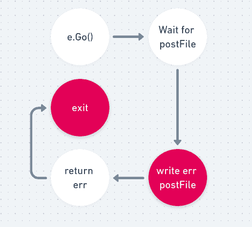
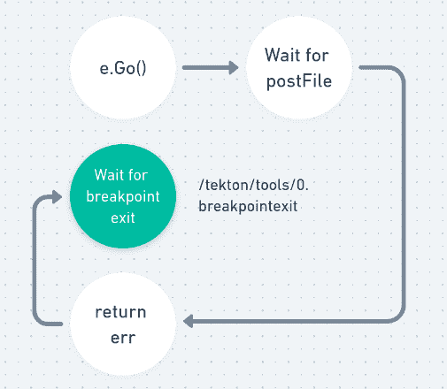

# Tekton 流水线中的实时调试

> 原文：<https://developers.redhat.com/articles/2021/05/26/real-time-debugging-tekton-pipelines>

调试 CI/CD 管道并不总是容易的。当管道需要很长时间运行，并且您想要调试的失败部分在管道末端运行时，尤其如此。在最近的 [Tekton](https://tekton.dev/) 增强提案(TEP)中引入的一个功能将让用户在任何步骤停止流水线，并实时调试。

本文着眼于在 Tekton 中调试任务运行，Tekton 是一个开源框架，它与 [Kubernetes](/topics/kubernetes) 集成在一起，创建云原生 CI/CD 管道。你可以在乔尔·洛德的文章[中了解更多关于泰克顿的基础知识。](https://developers.redhat.com/blog/2020/04/30/creating-pipelines-with-openshift-4-4s-new-pipeline-builder-and-tekton-pipelines/)

提案 [TEP-0042](https://github.com/tektoncd/community/blob/main/teps/0042-taskrun-breakpoint-on-failure.md) 概述了这一特性，并提供了概念证明，描述了 Tekton 的可组合性和[容器支持](/topics/containers/)如何实现这一功能。要全面了解这些概念，请观看克里斯蒂·威尔森(Google)和杰森·霍尔(Red Hat)的演讲:[俄罗斯娃娃:用嵌套流程扩展容器](https://www.youtube.com/watch?v=iz9_omZ0ctk)。

## 调试任务运行:TL；速度三角形定位法(dead reckoning)

在 Tekton 中调试任务运行是可能的，因为它帮助用户创建的基于容器的管道提供了可组合性。任务作为一个 Pod 运行，任务中的每个步骤都在一个容器中运行。对于在容器中运行的每个步骤，我们可以确定容器环境中的变化增量(不在步骤之间共享)与步骤本身直接相关，而与其他无关。任何其他可能发生的事情都是副作用，例如，由于向 TaskRun 注入了 sidecar 容器。这使得 Tekton 非常适合调试管道，因为启动容器的成本肯定远远低于启动云虚拟机(VM)的成本。

考虑到这一点，TEP-0042 将延长 TaskRun 步骤的生命周期(负责编排 TaskRun 容器以连续运行),并添加在出现故障后暂停 TaskRun 步骤的功能。

## 修改步骤的寿命

一个步骤的生命目前看起来如图 1 所示。

Figure 1: The life of a Step in Tekton.

当`e.Go()`运行时，该步骤开始运行。这是 Tekton 调用 TaskRun 中步骤的入口点和运行子流程(实际步骤)的地方。如果子进程成功运行，我们写一个`postFile`作为标志来传达同样的信息。如果失败，我们写一个`err postFile`，传达类似的信息。

为了在失败时停止这一步，我们必须理解当失败发生时这一步的哪些部分做出反应；这就是图 1 所示的`write err postFile`和`exit`。当一个步骤失败时，通过将一个`<step-no>.err`文件写入步骤容器中的`/tekton/tools/`目录来标记失败，该文件与 Pod 中的其他容器共享。该文件由入口点中的后台作业编写。`<step-no>.err`文件还让后续的步骤知道出现了故障，并最终退出 TaskRun。

这种机制需要更新，以支持步骤失败的发现和在步骤退出前停止步骤的能力。这需要禁用`write err postFile`。它不是退出该步骤，而是等待一个标志，该标志将从挂起状态退出该步骤。更新后的流程看起来如图 2 所示。

Figure 2: The proposed update to the Step life cycle in Tekton when TaskRun failure occurs.

一旦该步骤暂停，客户端就可以访问容器环境进行调试。

## 结论

实际上，调试解决方案比这里提供的概述更加细致入微。阅读[完整的 TEP-0042 提案](https://github.com/tektoncd/community/blob/main/teps/0042-taskrun-breakpoint-on-failure.md)了解详情。

这个话题也是 cdCon 2021 演讲的主题:[休斯顿，我们有个问题！:如何在 Tekton](https://cdcon2021.sched.com/event/iotA/houston-weve-got-a-problem-how-to-debug-your-pipeline-in-tekton-in-realtime-vibhav-bobade-vincent-demeester-red-hat) 中调试你的管道？

调试功能预计将于今年晚些时候在 Tekton 中推出，支持不同的 Tekton 客户端，包括 [Red Hat OpenShift Pipelines](https://github.com/openshift/pipelines-tutorial) 命令行界面(`tkn`)和 Tekton dashboard。准备好实时调试 Tekton 管道。

*Last updated: August 26, 2022*