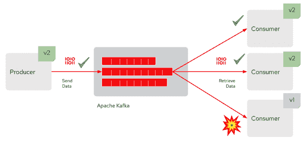
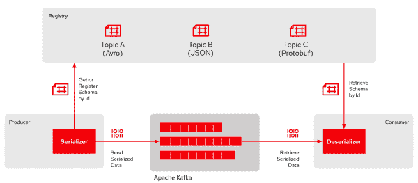

# Apache Kafka 的事件驱动 API 和模式治理:为 2021 年欧洲 Kafka 峰会做好准备

> 原文：<https://developers.redhat.com/blog/2021/05/04/event-driven-apis-and-schema-governance-for-apache-kafka-get-ready-for-kafka-summit-europe-2021>

作为一名开发者，我总是很兴奋能参加今年 5 月 11 日至 12 日举行的 [Kafka 峰会](https://www.kafka-summit.org/)。在[阿帕奇卡夫卡](https://kafka.apache.org/)生态系统中，有如此多解决关键挑战的精彩会议。一个例子是事件驱动 API 的变化是如何引导开发者关注 Kafka 的[契约优先开发](https://www.redhat.com/en/blog/achieving-promise-microservices-one-contract-time)。

为了准备即将到来的 Kafka 峰会，本文讨论了 Kafka 用户为赶上 API 潮流所经历的旅程，以及开发人员如何在不失去对集群中数据的控制的情况下使用契约来描述代理。有效的模式治理的一个关键组件是拥有一个模式注册中心，比如 [Apicurio Registry](/blog/2020/06/11/first-look-at-the-new-apicurio-registry-ui-and-operator/) 。有关红帽在 2021 年欧洲卡夫卡峰会期间的会议信息，请参见文章结尾。

**注意** : *契约优先开发*是一种设计方法，在与开发团队分享之前，业务用户或开发人员事先就服务的预期结构和结果达成一致。

## 分布式、解耦和高度连接的系统

在过去的几年里，现代应用开发已经转向分布式、解耦和高度连接的系统。分布式应用涉及跨多个数据中心、云提供商和地理区域的部署。处理不同应用程序的多个团队要求组件在技术、开发甚至时间方面进行解耦。最后一种类型的解耦对于产生事件和数据变化以供应用程序将来使用的系统来说是至关重要的。在某些情况下，进行更改时，应用程序不在线。在其他情况下，使用事件和数据的应用程序甚至还不存在。最后，没有一个应用程序生活在真空中:每个应用程序都必须适当且有效地连接到其他组件或遗留应用程序。

为了应对这些需求，我们已经看到了[微服务](/topics/microservices)的兴起，这是使用请求-响应模式的基于 HTTP 的应用程序。微服务为团队提供了一种更好的方式来开发他们的领域服务和应用程序，而不会影响其他团队。REST APIs 使用易于理解、可调试的 HTTP 协议来简化应用程序之间的连接。与此同时，我们已经看到由现代消息代理的兴起推动的[事件驱动架构](/topics/event-driven)的复兴。所有这些因素都集中到了民主化的处理模式上，比如事件流分析。

## 代码优先方法中的瓶颈

使用 [Apache Kafka](/topics/kafka-kubernetes) 以及传统的 API 方法实现事件驱动的架构带来了新的挑战和期望。传统的代码优先工作流(首先实现代码，然后共享最终的 API 规范)包括许多阻碍有效进展的瓶颈。开发人员正在为事件流端点的可发现性和访问寻找新的方向。

代码优先的过程引出了如何处理事件提供者和消费者之间关系的问题。从开发人员的角度来看，Apache Kafka 端点必须清楚地记录在案。文档应该包括关于 Kafka 引导服务器或集群安全模型的信息，例如身份验证。这样，文档就变成了对你的卡夫卡经纪人的描述。

另一方面，Apache Kafka 将处理数据结构的责任转移给了客户机。这种委托允许 Kafka 处理高吞吐量和高度可伸缩性。但这也要求开发人员在发送或接收 Kafka 主题的数据时，了解数据格式和数据验证。在小团队中通过非正式渠道分享这些信息很容易，但是当你增加与外部用户和第三方的接触时，这可能会变成一场噩梦。解决这些问题是一项重大挑战。

## 事件驱动的 API 和契约优先工作流

拥有一个简单的格式在所有用户之间共享服务合同是非常有价值的。契约优先流程预先为服务创建契约。通过这种方式，生产者和消费者可以提前知道对服务提供商的期望。

提前了解端点定义允许开发人员独立工作。这也保证了双方的一致性。它为服务契约提供了强有力的保证，因此团队、用户和合作伙伴可以更有效地协作。契约优先的方法还让开发人员通过使用代码生成器和测试工具来节省时间。

使用 REST APIs 的分布式服务通过整合 [OpenAPI](https://swagger.io/specification/) 规范来建模它们的端点，从而促进了契约优先的工作流。围绕这种格式的集会有助于创建一种新的实践，将 [API 合同作为产品](https://developers.redhat.com/blog/2019/12/03/apis-as-a-product-get-started-in-no-time/)单独管理。因此，规范编辑器如 [SwaggerHub](https://swagger.io/tools/swaggerhub/) 和 [Apicurio](/blog/tag/apicurio/) 、OpenAPI 代码生成器和其他工具已经可用。更进一步，规范文档甚至可以帮助模拟使用像 [Microcks](/blog/tag/microcks/) 这样的平台的服务。

处理契约优先协议的另一个秘密武器是 AsyncAPI 规范。AsyncAPI 是一个[开源](/topics/open-source)项目，旨在改善事件驱动架构的现状。AsyncAPI 规范描述了使用消息传递技术的事件驱动 API，如 [MQTT](/blog/2021/04/16/deploying-the-mosquitto-mqtt-message-broker-on-red-hat-openshift-part-1/) 、 [AMQP](/products/amq/overview) 和 Apache Kafka。它最初是 OpenAPI 的姐妹规范，使用相同的语法和 [JSON 模式](https://json-schema.org/)。像任何用 OpenAPI 定义的契约一样，AsyncAPI 帮助您实现事件驱动 API 的可见性和一致性。

## AsyncAPI:作为事件契约的模式

如果你对 OpenAPI 很熟悉，你会很容易发现 AsyncAPI 和 OpenAPI 规范之间的相似之处。服务器信息还在，路径变成了*通道*，操作简化为*发布*和*订阅*。

然而，最关键的部分是*消息部分*。本节定义了消息头和负载的内容类型和结构。来自 Kafka 世界的开发人员将会看到，在实践中，规范的这一部分是用于定义消息的模式。消息部分也可以引用不同类型的模式，比如一个 [Apache Avro](http://avro.apache.org/) 或 JSON 模式。它还可以包括有效载荷和报头的例子。

AsyncAPI 反映了对从 Kafka 发送和接收的数据表达 Kafka 模式概念的需要，在不同的团队中处理生产者和消费者的挑战之一。在通向事件驱动 API 的道路上，模式已经成为用于事件的契约。因此，契约优先策略从传统 REST APIs 中获得的好处同样适用于事件驱动 API。

为了更好地理解这种方法的价值，考虑以下场景:生产者向 Kafka 发送数据，消费者检索数据。然而，Kafka 的异步通信不允许生产者知道谁将消费数据，或者何时消费数据。此外，因为 Kafka topics 中存储的数据处于共享状态，所以新客户机可以处理这些数据。如果制作团队对记录结构进行了突破性的改变，他们可能会联系最初的消费者团队。但是后来添加的新客户端可能会丢失这些信息，所以它们将继续使用旧的反序列化过程。因此，当最新事件到达时，执行将会中断，如图 1 所示。所有这些都说明了为什么存储数据模式并提供给消费者的中央注册中心对于有效的治理至关重要。

Figure 1: A change to the schema creates a compatibility problem.

## Apicurio:事件模式的注册中心

解决模式治理问题的一个常见方法是使用*注册中心*。这个注册中心需要解决成功管理模式的三个主要能力:首先，注册中心需要全面地管理工件。它必须包括存储、浏览、检索和搜索被管理项目的能力。其次，它必须支持不同的数据结构，比如 Apache Avro、Google Protocol Buffers 和 JSON Schema。最后，注册中心应该使用关于有效性和兼容性的规则来跟踪和控制工件内容的发展。

如果注册中心实现了这些功能，它就可以成为模式的中央存储库，生产者和消费者可以在这里共享他们的数据结构和 Kafka 主题。然而，按照契约优先开发的建议方法，注册中心不应该只用于模式。注册中心还应该存储由 Kafka 代理和主题实现的*端点*和*通道*的定义。通过这种方式，您可以为开发人员提供简化的体验。

回到图 1 中的例子，假设生产者客户机的序列化程序代码可以到达注册中心 API，并查询用于编码新数据的模式。有几种方法可以将模式提供给注册中心，从生产者进行自注册到另一个管理模式的团队。在检索到正确的模式后，生产者可以用它来序列化预期格式的数据，并将其发送给 Kafka。最后，消费者将使用相同的策略从注册中心检索模式来反序列化数据，如图 2 所示。

Figure 2: A registry for schemas in action.

## 结论

现代应用程序开发的转变将事件驱动的架构重新拉回聚光灯下。卡夫卡无疑正在崛起，现在已经无处不在。API 的发展允许开发人员从传统的消息传递系统发展到完全启用的、事件驱动的 API。

采用契约优先模式对于简化这一进化过程至关重要。在契约优先的方法中，可以使用 AsyncAPI 定义对 Kafka 代理和主题的访问，就像使用 OpenAPI 定义 HTTP 端点一样。Kafka 记录模式变成了一个*事件契约*，因此，它本身需要作为一个产品来管理。最后，拥有模式注册中心有助于模式治理。

作为一个模式注册中心，Apicurio Registry 是一个端到端的解决方案，用于存储 Kafka 应用程序的 API 定义和模式。该项目包括序列化程序、反序列化程序和其他工具。注册表支持几种类型的工件，包括 OpenAPI、AsyncAPI、GraphQL、Apache Avro、Google Protocol Buffers、JSON、Kafka Connect、WSDL 和 XML Schema (XSD)。Apicurio 还检查这些工件的有效性和兼容性规则。

对于想要一个有企业支持的开源开发模型的开发者来说， [Red Hat Integration](/integration) 让你在 [Red Hat OpenShift](/products/openshift/overview) ，企业 [Kubernetes](/topics/kubernetes) 上部署你的基于 Kafka 的事件驱动架构。[红帽 AMQ 流](/products/amq/overview)、 [Debezium](https://debezium.io/) 和 [Apache Camel Kafka 连接器](https://camel.apache.org/camel-kafka-connector/latest/)都可以通过红帽集成订阅获得。

**注意**:我们刚刚[宣布了](https://www.redhat.com/en/blog/introducing-red-hat-openshift-streams-apache-kafka)新的完全托管服务，为 Apache Kafka 提供 [Red Hat OpenShift 流。现在就开始使用免费的 Apache Kafka 集群](/products/rhosak/overview)！

## 加入我们 2021 年欧洲卡夫卡峰会

为了帮助您了解更多有关实现模式治理和开始使用基于 Apache Kafka 的事件驱动 API 的信息，Red Hat 将于 2021 年 5 月 11 日至 12 日赞助 Kafka Summit Europe 2021。今年的峰会包括许多精彩的主题和演讲人，包括以下分组讨论:

*   **5 月 12 日上午 10:30 GMT**:[分布式系统中的高级变更数据流模式](https://www.kafka-summit.org/sessions/advanced-change-data-streaming-patterns-in-distributed-systems) : Gunnar Morling 和 Hans-Peter Grahsl 向您展示如何使用 Debezium 以开源方式捕获变更数据。
*   **5 月 12 日上午 11:00 GMT**:[Apicurio Registry:事件驱动的 API&Apache Kafka 的模式治理](https://www.kafka-summit.org/sessions/apicurio-registry-event-driven-apis-and-schema-governance-for-apache-kafka) : Fabian Martinez 和 Hugo Guerrero 演示了如何使用 API curio Registry 作为模式的注册中心。
*   **5 月 12 日下午 1:30 GMT**:[你想知道但不敢问的关于 Kubernetes 上的 Kafka 的一切:Jakub Scholz 讨论了在 Kubernetes 上运行 Apache Kafka 所需的资源。](https://www.kafka-summit.org/sessions/everything-you-ever-needed-to-know-about-kafka-on-kubernetes-but-were-afraid)

你可以随时在红帽虚拟展台前停下来，看看有什么新东西。我们很高兴和你聊天！在峰会两天的办公时间内寻找这些话题:

*   **格林威治时间下午 12:00 到 1:00**:Debezium 项目团队的 Debezium 演示和办公时间。
*   **格林威治时间下午 2:00 到 3:00**:API curio 项目团队的注册演示和办公时间。
*   **GMT**下午 4:00 到 6:00:strim zi 项目团队的 [Strimzi](https://strimzi.io/) 演示和办公时间。

*Last updated: May 17, 2021*