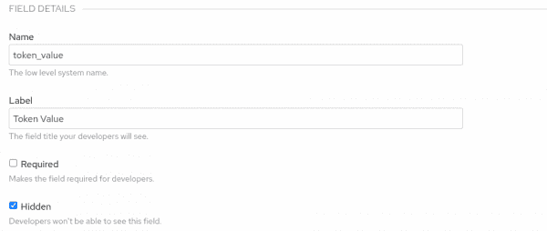
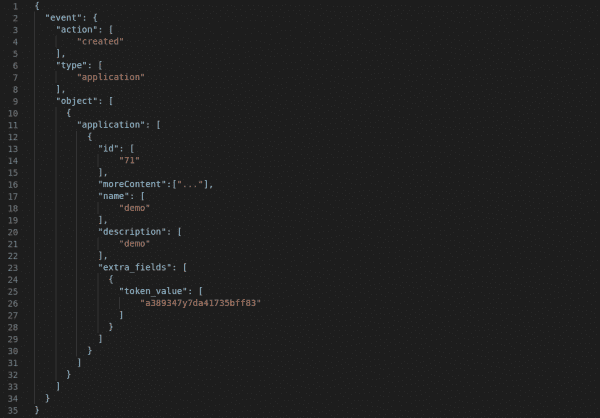

# 设置 3 级访问令牌的 4 个步骤

> 原文：<https://developers.redhat.com/blog/2021/04/29/enhance-application-security-by-rotating-3scale-access-tokens>

在 [Red Hat 3scale API 管理](/products/3scale/overview)，[访问令牌](https://access.redhat.com/documentation/en-us/red_hat_3scale/2-saas/html/admin_portal_guide/tokens)允许针对 3scale API 进行认证。访问令牌可以提供对计费、账户管理和分析 API 的读写访问。因此，小心处理访问令牌至关重要。

本文演示了如何通过使访问令牌短暂来增强安全性。到本文结束时，您将能够设置 3scale 来执行访问令牌轮换。外部 webhook 监听器服务执行实际的令牌撤销。在特定事件触发 webhook 后，旋转会自动发生。

**注意**:本文不*也不*涵盖作为任何 OAuth 或 OpenID 连接流的一部分与 3scale 网关一起使用的访问令牌。

## 轮转访问令牌的 4 步指南

示例场景:我想要一次性访问令牌，以便在 3scale API 令牌使用该令牌创建应用程序后，它会自动撤销该令牌。

### 步骤 1:完成先决条件

*   注册一个 [Red Hat 3scale API 管理帐户](https://www.3scale.net/)(内部版本 2.8 或更高版本，或 Red Hat 3scale API 管理 SaaS)。
*   你可以使用本教程来设置一个 webhook 监听器服务。

### 步骤 2:设置访问令牌

**注意**:在进入“端到端流程运行”部分之前，务必完成以下步骤。

对于本教程，您可以使用示例应用程序 [AccessTokenRevoker](https://github.com/samugi/3scale-AccessTokenRevoker/tree/demo) 。但是，对于真实的场景，建议用您喜欢的语言实现您自己的 webhook 监听器服务。

1.  [在应用对象上创建一个自定义字段定义](https://access.redhat.com/documentation/en-us/red_hat_3scale_api_management/2.9/html/creating_the_developer_portal/custom-signup-fields)，并使其*隐藏*。设置**名称**和**标签**字段，如图 1 所示。对于这个例子，我们将分别使用`token_ value`和`Token Value`。 **Name** 字段在这里很重要，因为这是稍后将从 webhook 对象解析的参数。[](/sites/default/files/blog/2020/10/tokenvalue.png)

    图 1:定义自定义注册表单字段。

    
2.  [配置 3 个 scale webhooks](https://access.redhat.com/documentation/en-us/red_hat_3scale_api_management/2.9/html/creating_the_developer_portal/webhooks#introducing_webhooks) 来交付管理门户动作，特别是针对**应用程序创建的**事件，如图 2 所示。[](/sites/default/files/blog/2020/10/webhook_config.png)

    图 2:配置 3 个 scale webhooks。

3.  将作为外部服务运行的应用程序部署到 3scale，3scale webhooks 将在此进行交付和解析；应用程序随后将对 3scale 进行 API 调用，以轮换访问令牌。请参见[示例应用程序说明](https://github.com/samugi/3scale-AccessTokenRevoker/blob/demo/README.md)来部署和配置应用程序，并遵循相关步骤。下面是一个可以用来启动示例应用程序的示例命令:

    ```
    node app.js --url "https://{TENANT | ACCOUNT}-admin.{WILDCARD_DOMAIN | 3scale.net}"

    ```

4.  对 3scale 的 API 调用应该将自定义字段**令牌值**的值作为`access_token`和`id`参数传递给个人访问令牌删除 API。下面是一个 curl 请求的例子，应用程序应该实现这个请求来成功地撤销令牌:

    ```
    curl -X DELETE "https://{TENANT | ACCOUNT}-admin.{WILDCARD_DOMAIN | 3scale.net}/admin/api/personal/access_tokens/${ACCESS_TOKEN}.json" -d 'access_token=${ACCESS_TOKEN}'
    ```

### 步骤 3:配置 3scale API 来旋转令牌

1.  管理员用户[创建一个访问令牌](https://access.redhat.com/documentation/en-us/red_hat_3scale_api_management/2.9/html/admin_portal_guide/tokens#creating-access-tokens),具有帐户管理 API 的读/写权限和范围。
2.  用户从 3scale API 创建一个应用程序，并需要向“设置访问令牌”一节中创建的字段添加一个值。该字段的值应该等于在步骤 2 中创建的访问令牌。下面是一个对 3scale API 的 curl 请求的例子。您可以使用它来创建新的应用程序并轮换令牌。注意，`token_value`字段包含访问令牌，作为请求的 POST 数据中的一个值:

    ```
    curl -X POST "https://{TENANT | ACCOUNT}-admin.{WILDCARD_DOMAIN | 3scale.net}/admin/api/accounts/${ACCOUNT_ID}/applications.xml" -d 'access_token=${ACCESS_TOKEN}&plan_id=${PLAN_ID}&name=${APPLICATION_NAME}&description=demo&token_value=${ACCESS_TOKEN}'

    ```

3.  应用程序创建的事件触发了 3scale webhook。图 3 是 webhook 请求体的一个例子。令牌值在`req.body.event.object[0].application[0].extra_fields[0].token_value[0]`中作为 extra_fields 对象的一部分可见。[](/sites/default/files/blog/2020/10/object.png)

    图 3: Webhook 的请求体。

    
4.  侦听 3scale webhooks 的外部服务接收此对象。然后，它为先前定义的自定义字段解析正文。在该示例中，`token_value`的值被存储用于对 3scale 的 API 调用。

一旦令牌被删除，它将不再起作用。在这一点上，从应用程序的`hidden`字段中清除它是可选的，因为该字段是隐藏的并且不再有效。

或者，在设置阶段，您可以将自定义字段定义设置为`required`而不是`hidden`。这可以防止用户在没有设置这个重要字段的情况下创建应用程序。这样，如果开发人员有权访问开发人员门户，他们就可以默认看到自定义字段。这可能会在访问令牌仍然有效时造成安全威胁。作为进一步的步骤，您可以通过在开发人员门户中定制 liquid 模板来确保该字段不在 HTML 中呈现。

## 步骤 4:配置工作流

可以配置此工作流，以满足 API 提供者的要求，在图 4 所示的任何受支持的 webhook 事件触发之后轮换令牌。

[](/sites/default/files/blog/2020/10/webhook_events.png)

Figure 4: Events that trigger webhooks.

**注意**:记住，webhooks 将被触发，因为从开发人员门户执行的动作会导致相同的事件发生。

## 结论

在本文中，您了解了 3scale 用户如何利用临时访问令牌来访问通过 3scale API 提供的所有功能，同时牢记安全性。请随意评论这篇文章，并提出任何改进这些内容的建议。

*Last updated: October 14, 2022*