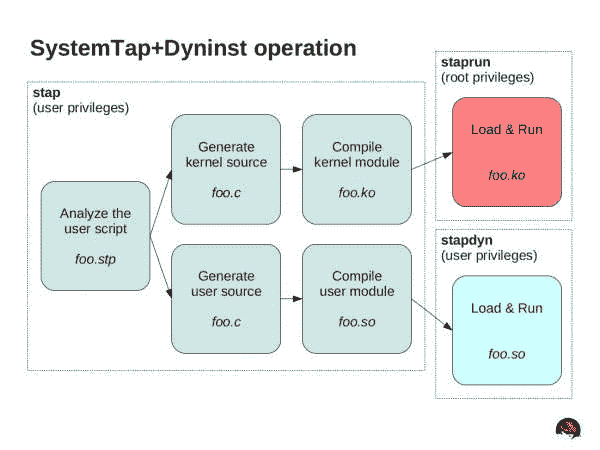

# 使用 SystemTap Dyninst 运行时环境

> 原文：<https://developers.redhat.com/blog/2021/04/16/using-the-systemtap-dyninst-runtime-environment>

SystemTap (stap) 使用命令行界面(CLI)和脚本语言为实时运行的内核或用户空间应用程序编写工具。SystemTap 脚本将处理程序与命名事件相关联。这意味着，当指定的事件发生时，默认的 SystemTap 内核运行时在内核中运行处理程序，就像它是一个快速子例程一样，然后它继续运行。

SystemTap 将脚本翻译成 C，用它创建一个内核模块，加载该模块，并连接被探测的事件。它可以在任意内核位置或用户空间位置设置探测器。虽然 SystemTap 是一个强大的工具，但是加载内核模块需要特权，而这种特权有时会成为使用的障碍。例如，在托管计算机上或在没有必要权限的容器中。在这些情况下，SystemTap 有另一个运行时，它使用 [Dyninst](https://access.redhat.com/documentation/en-us/red_hat_developer_toolset/7/html/user_guide/chap-dyninst) 检测框架来提供内核模块运行时的许多特性，只需要用户特权。

## SystemTap Dyninst 运行时用例

以下示例使用 Dyninst 运行时，例如当内核运行时不可用时，或者使用 Dyninst 运行时本身。可以使用给定的 stap 命令行剪切、粘贴和执行这些示例。

许多程序如 Python、Perl、TCL、编辑器和 web 服务器都使用事件循环。下一个示例演示了 Python 事件循环中的参数更改。这个 Python 程序 pyexample.py 将摄氏温度转换为华氏温度。本例要求为`python3-libs`安装 debuginfo:

```
stap --dyninst varwatch.stp 'process("/usr/lib64/libpython3.8.so.1.0").statement("PyEval_EvalCodeEx@*:*")' '$$parms' -c '/usr/bin/python3 pyexample.py 35'
```

其中`varwatch.stp`是:

```
global var%
probe $1 {
 if (@defined($2)) {
 newvar = $2;
 if (var[tid()] != newvar) {
  printf("%s[%d] %s %s:\n", execname(), tid(), pp(), @2);
  println(newvar);
  var[tid()] = newvar;
 }
}
}
```

什么是`PyEval_EvalCodeEx@*:*`，我们是如何确定的？开发人员将静态探针放在 Python 可执行文件中。有关更多详细信息，请参阅下面的用户空间静态探测器部分。其中一个探针是`function__entry`。对于该探针，搜索该标记的来源，并从该点进行推断。一旦到达`PyEval_EvalCodeEx`函数，`@*:#`部分指示在哪里为函数中的每个语句设置一个探测器。然后，使用这些信息，我们可以设置一个探测器，为 Python 事件循环累积时间统计数据:

```
stap --dyninst /work/scox/stap"PyEval_EvalCodeEx")' -c /scripts/func_time_stats.stp 'process("/usr/lib64/libpython3.8.so.1.0").function('/usr/bin/python3 pyexample.py 35'
```

其中`func_time_stats.stp`是:

```
global start, intervals
probe $1 { start[tid()] = gettimeofday_us() }
probe $1.return {
t = gettimeofday_us()
old_t = start[tid()]
  if (old_t) intervals <<< t - old_t
  delete start[tid()]
}
```

其中输出为:

```
35 Celsius is 95.0 Farenheit
intervals min:0us avg:49us max:6598us count:146 variance:297936
value |-------------------------------------------------- count
0 |@@@@@ 10
1 |@@@@@@@@@@@@@@@@@@@@@@@@@@@@@@@@ 64
2 |@@@@@@@@@@@@@@@@@@@@@ 43
```

然后在`libtcl8.6.so`中的静态标记`cmd__entry`处设置一个探针，以显示 TCL 事件循环中的参数:

```
stap --dyninst -e 'probe process("/usr/lib64/libtcl8.6.so").mark("cmd__entry") {printf("%s %#lxd
%#lxd\n",$$name,$arg1,$arg2)}' -c /usr/bin/tclsh8.6
```

## Systemtap Dyninst 运行时概述

Dyninst 运行时的不同之处在于，它创建一个 C 用户空间源并生成一个共享对象。Dyninst 运行时不需要特殊权限。

图 1 中的 SystemTap+Dyninst 操作图比较了这两种方法。

[](/sites/default/files/blog/2020/11/josh-dyninst-11.jpg)

Figure 1\. Comparison of SystemTap and Dyninst runtime environment and operation.

SystemTap Dyninst 运行时环境支持内核运行时支持的探针的子集。以下部分概述了一些探测器系列以及这些探测器在 Dyninst 运行时的状态。

### 用户空间探测器

用户空间探测器是需要 debuginfo 的源代码级探测器。`varwatch.stp`和`func_time_stats.stp`举例说明了这些类型的探针。示例中的内核运行时可以在没有`-c`命令选项的情况下调用。这允许该示例与运行`/usr/bin/ex`的系统上的任何进程相关联。Dyninst 运行时不能用于这种类型的系统监视。它需要与通过`-x` PID 或`-c`命令选项指定的特定过程相关联。

### 用户空间变量访问

SystemTap 可以访问许多类型的变量。但是，Dyninst 运行时不能访问默认内核运行时可以访问的某些类型的变量。通常，这些是全局变量，需要跟踪虚拟内存地址，这是 Dyninst 运行时没有的特性。例如，在`ex`程序中访问全局变量`Rows`:

```
stap --dyninst -e 'probe process("/usr/bin/ex").function("do_cmdline") {printf("%d\n",@var("Rows@main.c"))}'
```

给出错误:

```
*semantic error: VMA-tracking is only supported by the kernel runtime (PR15052): operator '@var' at <input>:1:68
source: probe process("/usr/bin/ex").function("do_cmdline") {printf("%d\n",@var("Rows@main.c"))}*
```

出现此错误时，请避免尝试访问该特定变量。下一节中提到的-L 选项允许您查找和显示一个可能的替代上下文变量。

### 用户空间静态探测器

SystemTap 可以探测编译到程序和共享库中的符号静态工具。之前的探针`mark ("cmd__entry")`就是这种探针的一个例子。开发人员将静态探测器放在有用的位置。SystemTap 可以在可执行文件或共享对象中列出可用的静态探针。例如，要在`libtcl`共享对象中列出静态探测器:

```
stap -L 'process("/usr/lib64/libtcl8.6.so").mark("*")'
```

```
*process("/usr/lib64/libtcl8.6.so").mark("cmd__entry") $arg1:long $arg2:long $arg3:long*
process("/usr/lib64/libtcl8.6.so").mark("cmd__return") $arg1:long $arg2:long
...
```

静态探头中的`$argN`参考可能会收到 VMA 跟踪错误。在这种情况下，避免使用特定的`$argN`引用。

### 计时器探头

有一个计时器系列的探针。Jiffies timers 称为`timer.jiffie`，是 Dyninst 运行时中没有的内核特性。Dyninst 运行时中还有另一种类型的计时器，称为时间单位计时器(unit-of-time timers)或`timer.ms(N)`。例如，要在两秒钟后退出 SystemTap，SystemTap 脚本可能包括:

```
probe timer.ms(2000) {exit()}
```

### 内核空间探测器

当示例 SystemTap 命令行为:

```
stap -e 'probe kernel.function("bio*") { printf ("%s
-> %s\n", thread_indent(1), probefunc())}'
```

任何调用带有通配符名称`bio*`的内核函数的进程都会显示探测器的名称。如果给定了`–runtime=Dyninst`选项，那么它不会成功，因为 Dyninst 运行时无法探测内核函数。需要内核功能的`syscall.*`和`perf.*`系列探测器也是如此。

### 水龙头

tapset 是一个为重用而设计的脚本，安装在一个特殊的目录中。Dyninst 运行时没有实现所有 tapsets。例如，如果 SystemTap 脚本试图使用`task_utime` tapset，SystemTap 会警告包含`task_utime`的 tapset 在 Dyninst 运行时不可用:

```
stap --dyninst -e 'probe process("/usr/bin/ex").function("do_cmdline") {printf("%d\n",task_utime())}'
```

```
*semantic error: unresolved function task_utime (similar: ctime, qs_time, tz_ctime, tid, uid): identifier 'task_utime' at <input>:1:68*
```

## 探测摘要

Dyninst 运行时不支持以下探测器类型:

*   `kernel.*`
*   `perf.*`
*   `tapset.*` (Dyninst 运行时实现了一些，但不是全部脚本)

Dyninst 运行时支持以下探测器类型:

*   `process.*`(如果用-x 或-c 指定)
*   `process.* {...@var("VAR")}`(如果没有 VMA 问题)
*   `process.mark`
*   `timer.ms`

### 微观基准

这个例子比较了一个微基准测试的运行时，这个微基准测试有八个线程，每个线程运行一个空循环 10，000，000 次，每个循环中触发一个探测器。计时以微秒为单位，在 SystemTap 完成探测设置之后开始，然后基准开始执行。与内核运行时的系统时间相比，Dyninst 运行时的系统时间反映了 Dyninst 运行时在用户空间中运行探测器的事实。

```
     Dyninst Runtime  Kernel Module Runtime
User     7,864,521             8,712,623
System   4,808,738            12,049,084
```

### Dyninst 执行详细信息

Dyninst 可以检测一个运行的动态过程。它还可以检测尚未运行的进程，称为静态进程。虽然插装在进程中运行，但 Dyninst 使用 ptrace 插入插装代码。由于 ptrace 的限制，Dyninst 只能探测进程的一个实例。此外，插入插装的程序称为 mutator，被插装的程序称为 mutatee。

典型的 mutator 可以执行以下操作:

*   附加到正在运行的进程，创建一个新进程，或者加载一个不运行的可执行文件。
*   构建进程的 Dyninst 映像。
*   找到要检测的函数:
    *   创建一个 Dyninst 代码段，它是描述被检测代码的抽象。
    *   例如，在函数调用中:
        *   创建一个 Dyninst 调用片段。
        *   创建 Dyninst 参数片段。
        *   将片段翻译成指令，并将其插入探测点。
    *   动态检测发生在附加或创建进程时，然后它继续。
    *   当流程不执行时，就会出现静态插装。在这种情况下，它会创建一个新的可执行文件。

Dyninst 片段创建了插入探测点的代码的抽象。该代码片段可以创建或访问变量或类型、访问寄存器以及逻辑、条件和算术表达式。Dyninst 将代码片段转换成指令，并将它们插入探测点。

在 SystemTap 的例子中，mutator 是 SystemTap 工具 stapdyn。该工具创建调用 SystemTap 处理程序的代码片段，这些处理程序在共享对象中定义，并对应于探测点。Dyninst 片段不处理 SystemTap 探测。相反，探测处理程序执行该功能，而 Dyninst 片段调用这些处理程序。

## 摘要

SystemTap Dyninst 后端允许使用 SystemTap 来探测用户应用程序，而不需要任何特殊权限。因为探测器在用户空间中运行，所以它们的运行开销很小。下一次用户空间应用程序需要探测时，Dyninst 运行时是一个替代方法。

*Last updated: October 14, 2022*