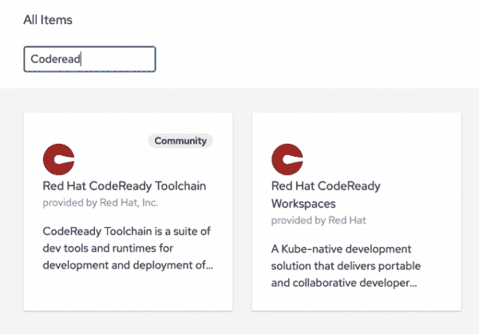
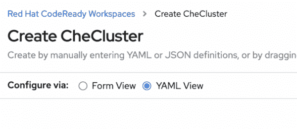
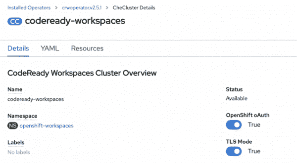
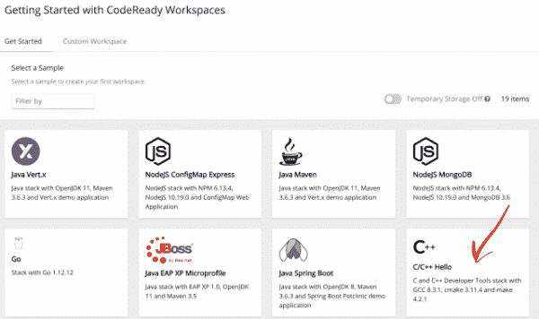

# 使用自定义的 devfile 注册表和 C++与 Red Hat CodeReady 工作区

> 原文：<https://developers.redhat.com/blog/2021/04/14/using-a-custom-devfile-registry-and-c-with-red-hat-codeready-workspaces>

[Red Hat CodeReady 工作区](/products/codeready-workspaces/overview)为团队提供预定义的工作区，以简化应用程序开发。开箱即用，CodeReady Workspaces 支持多种语言和插件。然而，许多组织想要定制一个工作区，并作为标准提供给整个组织的开发人员。在本文中，我将向您展示如何使用定制的 [devfile](/blog/2019/12/09/codeready-workspaces-devfile-demystified/) 注册表来定制 C++开发的工作空间。完成后，我们将使用 Docker 部署一个示例应用程序。

**注意**:一个 *devfile* 指示哪个项目在环境中，哪些工具在终端中可用，等等。有关更多信息，请参考 [CodeReady 工作区文档](https://access.redhat.com/documentation/en-us/red_hat_codeready_workspaces/2.5/html/administration_guide/customizing-the-registries_crw#running-custom-registries_crw)。

## 设置工作空间

要开始使用本文中的示例，请派生以下存储库:

[https://github.com/redhat-developer/codeready-workspaces](https://github.com/redhat-developer/codeready-workspaces)

进入`codeready-workspaces/dependencies/che-devfile-registry/devfiles`目录，该目录保存每个栈或插件的配置文件。每个栈或插件有两个配置文件:`devfile.yaml`和`meta.yaml`。出于这个例子的目的，只需将`05_cpp`文件夹复制到一个名为`05_custom_cpp`的新文件夹中。从那里，您可以编辑文件以满足您的需要:

```
$ cd dependencies/che-devfile-registry/devfiles/
$ cp -r 05_cpp 05_custom_cpp
$ cd 05_custom_cpp/
$ ls
devfile.yaml meta.yaml
```

`meta.yaml`文件基本保持不变，但是您可以编辑显示名称和描述。下面是我的`meta.yaml`:

```
---
displayName: C/C++ Hello
description: C and C++ Developer Tools stack with GCC 8.3.1, cmake 3.11.4 and make 4.2.1
tags: ["UBI8", "C", "C++", "clang", "GCC", "g++", "make", "cmake"]
icon: /images/type-cpp.svg
globalMemoryLimit: 1686Mi

```

您将在`devfile.yaml`文件中进行更多的更新。对于这个例子，我们将简单地更新自动导入到工作区的项目，就像这样:

```
---
apiVersion: 1.0.0
metadata:
  generateName: cpp-custom-
projects:
  -
    name: Hello
    source:
      type: git
      location: 'https://github.com/mmistretta/hello.git'
components:

```

如果你想进一步改变栈，你可以更新 Docker 镜像、插件，甚至开发者点击一个按钮就可以运行的命令。例如，要在堆栈中安装 Docker 或 Podman，请将 Docker 映像编辑为自定义映像。用于该堆栈的`stacks-cpp-rhel8`的 Dockerfile 可以在[Red Hat code ready work spaces-C/c++堆栈网页](https://catalog.redhat.com/software/containers/codeready-workspaces/stacks-cpp-rhel8/5cd5ee485a13467289f43501?container-tabs=dockerfile)中找到，并在那里进行定制。

在继续下一个任务之前，请保存您的文件。

## 构建您的 desfile 注册表映像

接下来，您需要构建注册表映像。对于这个例子，我们将使用 Docker 和[Red Hat Universal Base Image](https://www.redhat.com/en/blog/introducing-red-hat-universal-base-image)(UBI)。从`codeready-workspaces/dependencies/che-devfile-registry`目录中，运行以下命令来构建一个映像并将其推送到您的注册表中。用适合您环境的值替换下面的斜体文本:

```
$ ./build --organization *your-org* --registry *your_registry* --tag *version* --rhel
$ docker push *your-image*

```

为了确保您的映像有效，您可以通过运行以下命令来测试它:

```
$ docker run *your-image*

```

现在，您可以利用您的自定义 devfile 注册表。

## 为 CodeReady 工作区创建您的 Che 集群

现在，确保安装了 CodeReady Workspaces 操作符。作为管理员用户，在 Red Hat OpensShift OperatorHub 中搜索 Operator，如图 1 所示。

[](/sites/default/files/blog/2021/01/Screen-Shot-2021-01-18-at-12.55.04-PM-e1616760775160.png)

Figure 1: Find and select the CodeReady Workspaces Operator in the OperatorHub.

如图 2 所示安装操作器。

[](/sites/default/files/blog/2021/01/Screen-Shot-2021-01-18-at-12.58.00-PM-e1616760961701.png)

Figure 2: Install the CodeReady Workspaces Operator.

安装操作器后，选择它。然后，选择**提供的 API—>code ready 工作区集群**，点击**创建实例**链接，如图 3 所示。

[](/sites/default/files/blog/2021/01/Screen-Shot-2021-01-18-at-12.58.39-PM-e1616766168176.png)

Figure 3: Start creating your instance with the Create Instance link.

通过选项选择 **Yaml 视图**作为**配置，如图 4 所示。**

[](/sites/default/files/blog/2021/01/Screen-Shot-2021-01-18-at-1.00.25-PM-e1616766270546.png)

Figure 4: Select the YAML view as the configuration option.

现在，编辑这个过程创建的 YAML 文件。向下滚动到`server`部分，用您的图像替换`devfileRegistryImage`条目，如下所示:

```
server:
  pluginRegistryImage: ''
  selfSignedCert: false
  devfileRegistryImage: 'quay.io/mcochran/che-devfile-registry:1.2'
  tlsSupport: true
  cheFlavor: codeready
  cheImageTag: ''

```

点击**创建**，等待几分钟，让 Che 集群变为可用。图 5 显示了 CodeReady 工作区在成功创建后显示的屏幕。

[](/sites/default/files/blog/2021/01/Screen-Shot-2021-01-18-at-1.04.27-PM-e1616766781687.png)

Figure 5: The displayed properties of a CodeReady Workspaces cluster.

## 使用工作空间

单击 CodeReady 工作区 URL 并登录集群。如果您在集群配置期间保留了默认权限，那么您可以以任何 OpenShift 用户的身份登录。如果出现提示，请选择“允许所选权限”在 **Getting Started** 登录页面上，您将看到您创建的定制 C++堆栈(在图 6 中用红色箭头表示)。

[](/sites/default/files/blog/2021/01/Screen-Shot-2021-01-18-at-1.08.24-PM-e1616767041385.png)

Figure 6: Available workspaces, including the one you've just created.

选择工作区并观察它的旋转。当它打开时，您应该看到您在 devfile 中指定的 **Hello** 项目。在这里，您可以检查一些文件，例如`hello-main.cpp`:

```
 #include <iostream>

int main(int argc, char const *argv[])
{
   std::cout << "Hello Docker container!" << std::endl;
   return0;
} 
```

现在，您可以打开一个终端来编译和运行代码，如下例所示。您还可以编译并运行`counter-main.cpp`或任何其他 C++代码:

```
$ cd Hello/
$ make hello-main
$ ./hello-main

```

您应该看到程序打印出一个“Hello Docker 容器！”消息，然后终止。在开发的这个阶段，您可以对代码进行任何您想看到的更改，编译它，运行它，并将您的更改推送到 Git，这可能会启动一个部署到 OpenShift 的管道。

## 将应用程序部署为 Docker 实例

在本例中，您的 CodeReady 工作区堆栈中没有安装 Docker 工具，但是 Docker 是使用 Hello Git 项目中的 Docker 文件安装的。如果您想在带有 Docker 工具的环境中测试一些 C++代码，请输入如下命令。在这个例子中，`rhsm.secret.yaml`包含我的注册中心的凭证，我使用组织`mcochran`的`quay.io`作为我的注册中心。请确保将这些变量替换为您自己环境中的变量:

```
$ DOCKER_BUILDKIT=1 docker build --progress=plain --secret id=rhsm,src=rhsm.secret.yaml -t quay.io/mcochran/cpp-hello:latest -f Dockerfile .
$ docker push quay.io/mcochran/cpp-hello:latest

```

然后，使用 Docker 映像创建一个`pod.yaml`文件来部署您的代码:

```
apiVersion: v1
kind: Pod
metadata:
  labels:
    app: hello-cpp
  name: hello-cpp-exec
spec:
  containers:
  - name: hello-cpp
    image: quay.io/mcochran/cpp-hello
    livenessProbe:
      exec:
        command:
        - cat
        - /tmp/healthy
      initialDelaySeconds: 5
      periodSeconds: 5
  restartPolicy: Never

```

保存您的文件，然后从命令行登录 OpenShift 并部署 pod:

```
$ oc login
$ oc create -f pod.yaml

```

因为这个代码只是简单地说“你好”，所以 pod 会运行得很快。之后，您可以在管理控制台的**工作负载—>pod**部分查看已经关闭的 pod 的日志。

## 摘要

本文演示了如何创建一个定制的 devfile 注册表，以便为您的团队提供专用的工作空间。我向您展示了如何使用 devfile 来提供适合您的环境的代码和工具，并且您已经看到了使用 Docker 在 CodeReady 工作区中部署应用程序是多么方便。

*Last updated: October 14, 2022*