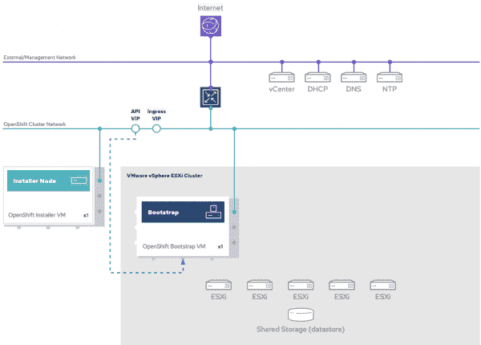
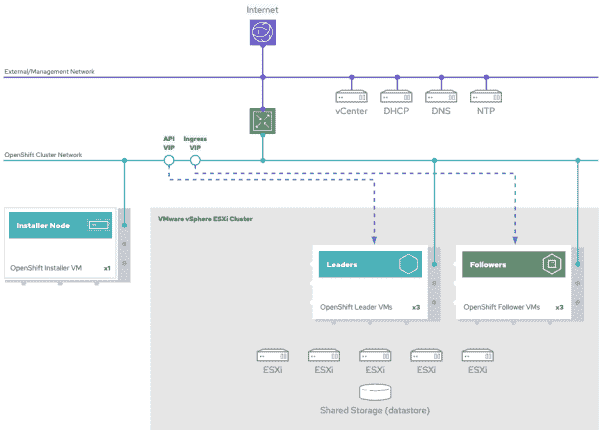
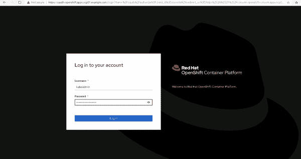
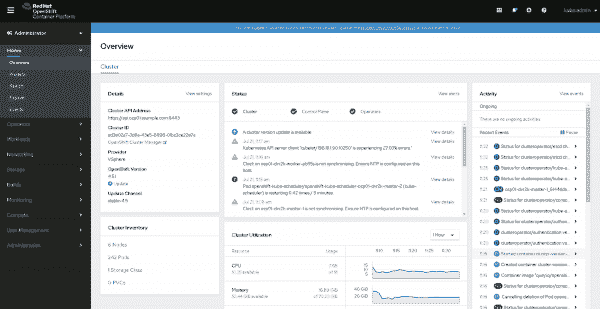
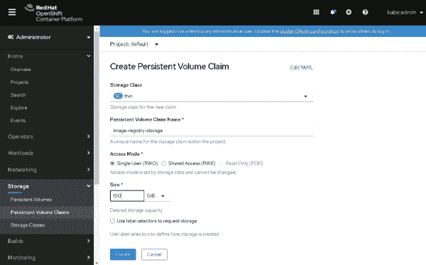
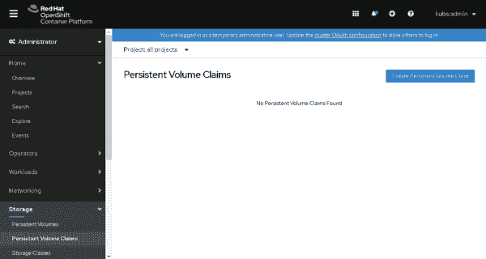
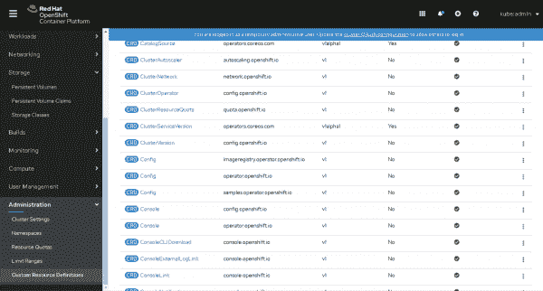
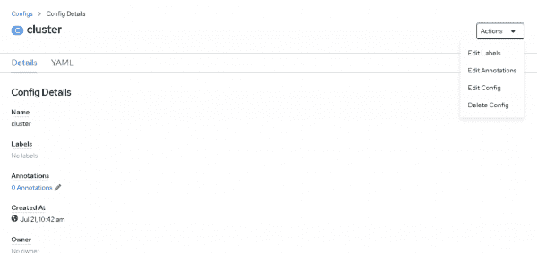
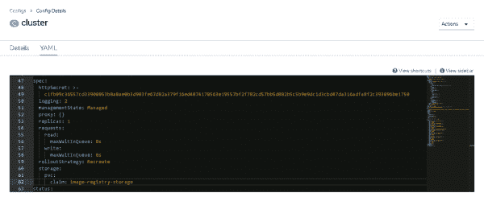
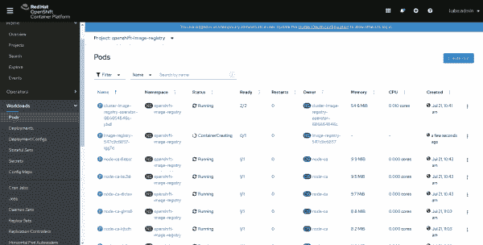

# vSphere 上 Red Hat OpenShift 4.5 安装程序配置的基础架构指南

> 原文：<https://developers.redhat.com/blog/2021/03/09/a-guide-to-red-hat-openshift-4-5-installer-provisioned-infrastructure-on-vsphere>

随着 [Red Hat OpenShift 4](https://developers.redhat.com/products/openshift/overview) ，Red Hat 完全重新设计了开发人员如何安装、升级和管理 OpenShift，以在 [Kubernetes](https://developers.redhat.com/topics/kubernetes) 上开发应用。在引擎盖下，安装过程使用 [OpenShift 安装程序](https://github.com/openshift/installer)来自动提供使用[Red Hat Enterprise Linux](https://developers.redhat.com/topics/linux)(RHEL)CoreOS 的容器主机。这样就很容易初始化集群并设置云域名系统(DNS)、负载平衡器、存储等等。

最初，全自动 OpenShift 安装选项(称为*安装者提供的基础设施*)仅适用于公共云和私有云。在 [OpenShift 4.5](https://docs.openshift.com/container-platform/4.5/welcome/index.html) 中，安装程序进行了更新，以支持 [VMware vSphere](https://www.vmware.com/products/vsphere.html) 上由安装程序调配的基础架构。

本文面向在 vSphere 上运行工作负载的企业 IT 用户和开发人员。我将向您展示如何在 30 分钟内启动 OpenShift 集群，而无需每次都进行手动操作。

## 先决条件

让我们来了解一下在 vSphere 中使用 OpenShift 的安装程序提供的基础架构的先决条件。确保您的开发环境设置如下:

*   要下载并运行 OpenShift 安装程序二进制文件，您需要在笔记本电脑上安装一个 [Linux](https://developers.redhat.com/topics/linux) 虚拟机(VM)或一个 Linux 访客。该主机必须能够访问您的 vCenter 和虚拟机子网。
*   您还需要一个具有以下配置的 VMware 群集:
    *   一个 vCenter 实例。
    *   一个 ESXi 群集，最低配置标准 OpenShift 群集。
    *   vSphere 6.5 硬件版本 13 或 6.7 更新 2。
    *   数据存储区中的 800GB 存储。
    *   18 个或更多虚拟中央处理器(vCPUs)。最低设置是三个领导者，每个节点四个 vcpu，三个追随者，每个节点两个 vcpu。推荐的配置是从站上有四个 vCPUs，即使是出于实验目的。您还需要一个临时 vCPU 用于引导计算机。
    *   88GB 内存。您将需要三个每节点 16GB RAM 的领导者，三个每节点 8GB RAM 的追随者，以及用于引导机的 16GB 临时 RAM。

### 网络配置

您将需要一个启用了动态主机配置协议(DHCP)的网络和子网，并为此池启用长租用时间。例如，我的实验室网络是 IP 地址为 198.18.1.0/24 的虚拟机网络。DHCP 地址池位于 198.18.1.11-200。

对于 DNS 服务器 IP 要求，您将需要一个有两个 A 记录的 DNS 服务器。注意，两个 DNS A 记录指向 API 和入口虚拟 IP 地址。这些将指向 OpenShift 安装程序提供的集群负载平衡器( [HAProxy](https://www.haproxy.com/) 在 OpenShift 节点中作为容器运行)。

以下是 OpenShift vSphere 的安装程序配置基础设施如何简化集群的负载平衡器服务:

*   `api.<cluster-name>.<base-domain>`在同一个集群网络上为 API 虚拟 IP 保留一个 IP 地址。例如，`api.ocp01.example.com`的 IP 地址可能是 198.18.1.201。
*   `*.apps.<cluster-name>.<base-domain>`在同一个集群网络上为入口虚拟 IP 保留一个 IP 地址。例如，`api.ocp01.example.com`的 IP 地址可能是 198.18.1.202。
*   DNS 测试结果应该是这样的:

    ```
    [root@centos7-tools1 ~]# nslookup api.apps.ocp01.example.com Server: 198.18.133.1 Address: 198.18.133.1#53 Name: api.ocp01.example.com Address: 198.18.1.201 [root@centos7-tools1 ~]# nslookup api.apps.ocp01.example.com Server: 198.18.133.1 Address: 198.18.133.1#53 Name: api.ocp01.example.com Address: 198.18.1.201
    ```

### 帐户权限

您还需要配置在 vSphere 上安装集群的 [OpenShift 指南中指定的 vCenter 帐户权限。请在继续阅读本指南之前设置您的帐户权限。](https://docs.openshift.com/container-platform/4.5/installing/installing_vsphere/installing-vsphere-installer-provisioned.html#installation-vsphere-installer-infra-requirements_installing-vsphere-installer-provisioned)

最后，你需要一个红帽账户来访问[cloud.redhat.com](https://cloud.redhat.com)并取回你的 pull secret 用于 OpenShift 自助 60 天试用。

当您完成之后，基础设施准备工作应该类似于图 1 中的图表。

[](/sites/default/files/blog/2021/02/VMware-IPI-step-1.png)Figure 1: Set up your development environment for installer-provisioned infrastructure on vSphere.

Figure 1: Set up your development environment for installer-provisioned infrastructure on vSphere.

一旦您的开发环境设置好了，我们就可以继续下一步了。

## 设置安装程序虚拟机

在启动 OpenShift 安装程序之前，您需要执行一些一次性任务。完成这些任务后，您将能够重用它们来部署任意多的集群。

### 生成 SSH 私有密钥

如果您的`~/.ssh/`目录中没有安全 shell (SSH)私有和公共密钥，那么就生成一个。执行调试任务时，您将需要 OpenShift 节点访问的密钥:

```
ssh-keygen -t rsa -b 4096 -N '' -f ~/.ssh/id_rsa
```

### 获取安装和客户端二进制文件

您可以创建您的免费帐户，并前往[Red Hat Cloud Services Portal——open shift Cluster Manager](https://cloud.redhat.com/openshift/install)获取适用于您的操作系统的安装程序和客户端二进制文件。从门户的 web 用户界面执行以下操作:

*   登录 [OpenShift 集群管理器](https://cloud.redhat.com/openshift/install)。
*   点击**创建一个 OpenShift 集群**。
*   选择**红帽 OpenShift 集装箱平台**。
*   在**上选择基础架构提供商**，选择在 VMware vSphere 上运行的**。**
***   在 OpenShift 安装程序中，选择您的操作系统二进制文件，例如 Linux。然后，点击**下载安装程序**。如果想要最新版本，可以使用这个下载网址:[https://mirror . open shift . com/pub/open shift-v4/clients/OCP/latest/open shift-install-Linux . tar . gz](https://mirror.openshift.com/pub/openshift-v4/clients/ocp/latest/openshift-install-linux.tar.gz)。*   点击**下载拉取密码**或复制拉取密码并保存到文件中。*   点击**下载命令行工具**并选择您的操作系统。或者，你可以使用这个最新 Linux 二进制的 URL:[https://mirror . open shift . com/pub/open shift-v4/clients/OCP/latest/open shift-client-Linux . tar . gz](https://mirror.openshift.com/pub/openshift-v4/clients/ocp/latest/openshift-client-linux.tar.gz)。*   提取安装程序和客户端程序。例如，运行这个命令:

    ```
    tar xvf openshift-install-linux.tar.gz
    tar xvf openshift-client-linux.tar.gz
    cp oc /usr/local/bin/

    ```** 

### **将 vCenter 根 CA 证书添加到您的系统信任中**

 **OpenShift 安装程序需要访问 vCenter 的 API，因此必须信任 vCenter 证书。下载 vCenter 的根证书颁发机构(CA)证书，并将其提取和复制到您的系统信任:

```
export VCENTER=<your vcenter hostname or IP Address>

wget https://${VCENTER}/certs/download.zip --no-check-certificate
unzip download.zip
cp certs/lin/* /etc/pki/ca-trust/source/anchors
update-ca-trust extract

```

您的安装程序机器现在已经设置好了，您可以根据需要多次运行安装程序。

## 演示:部署简单的集群

在本次演示中，我们将部署一个不需要任何定制的快速标准集群。

### 运行安装程序

OpenShift 安装程序是一个命令行界面，要求您输入以下内容:

*   SSH 公钥:比如`/root/.ssh/id_rsa.pub`。
*   平台:vSphere。
*   vCenter:您的 vCenter 主机名，例如`vc1.example.com`。
*   用户名:您的 vCenter 用户名，例如`administrator@vsphere.local`。
*   密码:您的 vCenter 密码。
*   网络:使用您之前设置的 DHCP 选择您的集群网络。OpenShift 安装程序将连接到您的 vCenter，并列出您的网络供您选择。
*   API 的虚拟 IP 地址:这是您分配并映射到`api.<cluster-name>.<base-domain>` DNS 记录的 IP 地址(例如，198.18.1.201)。
*   入口的虚拟 IP 地址:这是您分配并映射到`*.apps.<cluster-name>.<base-domain>` DNS 记录的 IP 地址(例如，198.18.1.202)。
*   基域:这个会和你的`<base-domain>`一样，比如`example.com`。
*   集群名:这个会和你的`<cluster-name>`一样，比如`ocp01`。
*   Pull secret:从 OpenShift 集群管理页面下载或复制的 pull secret。

以下是 OpenShift 安装程序安装过程的输出示例:

```
export INSTALLATION_DIR=$HOME/ocp01-01
mkdir $INSTALLATION_DIR

./openshift-install create cluster --dir=$INSTALLATION_DIR --log-level=info
? SSH Public Key /root/.ssh/id_rsa.pub
? Platform vsphere
? vCenter vc1.example.com
? Username administrator@vsphere.local
? Password [? for help] *************
INFO Connecting to vCenter vc1.example.com
INFO Defaulting to only available datacenter: DC1
INFO Defaulting to only available cluster: DC1-Cluster
INFO Defaulting to only available datastore: NFS_Datastore
? Network: VM Network
? Virtual IP Address for API: 198.18.1.201
? Virtual IP Address for Ingress: 198.18.1.202
? Base Domain: example.com
? Cluster Name: ocp01
? Pull Secret [? for help] ***************

```

### 调配引导计算机和领导节点

OpenShift 安装程序现在将提供一个引导机和三个主节点。您的 API 虚拟 IP 和入口虚拟 IP 将首先托管在引导机上，以便领导节点通过启动和引导过程进行自我初始化。引导阶段的部署将如图 2 所示。

[](/sites/default/files/blog/2021/02/VMware-IPI-step-2.png)Figure 2: Deployment in the bootstrapping stage.

Figure 2: Deployment in the bootstrapping stage.

当引导完成并且所有领导节点的 API 服务器都启动时，OpenShift 引导节点将被安装程序自动销毁。然后，安装程序将开始用 [OpenShift MachineSet](https://docs.openshift.com/container-platform/4.5/machine_management/creating-infrastructure-machinesets.html) 提供从节点。为此，您可以使用 OpenShift web 控制台或命令行工具(`oc`或`kubectl`)进行机器自动缩放，或者稍后手动增加或减少节点。API 虚拟 IP 和入口虚拟 IP 也将在领导者节点和基础设施以及跟随者节点上转移到*托管的*状态。

您在供应阶段的部署将如图 3 所示。

[](/sites/default/files/blog/2021/02/VMware-IPI-step-3.png)Figure 3: Deployment in the provisioning stage.

Figure 3: Deployment in the provisioning stage.

配置 OpenShift 集群通常需要 40 到 60 分钟才能完成。

## 安装后配置

通过将一个`kubeconfig`文件导出到`KUBECONFIG ENV`变量，您可以作为默认系统用户登录到您的集群。该文件是在特定集群的安装过程中创建的，并存储在`$INSTALLATION_DIR/auth/kubeconfig`中。让我们一起来完成安装后的配置过程。

首先，导出`kubeadmin`凭证:

```
export KUBECONFIG=$INSTALLATION_DIR/auth/kubeconfig
```

接下来，验证您可以使用导出的配置成功运行`oc`命令:

```
oc whoami
oc get node

```

基础设施管理员和开发人员可以使用 OpenShift 控制台来处理 Kubernetes 集群。为了第一次访问控制台，安装程序在`$INSTALLATION_DIR/auth/password`文件中生成一个`kubeadmin`凭证。使用`oc`命令获取 OpenShift 控制台的 URL:

```
oc -n openshift-console get route

```

复制 URL 并在您的 web 浏览器中打开它，然后使用初始凭据登录。对于用户名，输入`kubeadmin`；对于密码，使用来自`$INSTALLATION_DIR/auth/kubeadmin_password`的密码，如图 4 所示。

[](/sites/default/files/blog/2020/09/ocp-login.png)

Figure 4: The OpenShift console OAuth login screen.

图 5 显示了 OpenShift 控制台中的概述页面。

[](/sites/default/files/blog/2020/09/ocp-home-overview.png)

Figure 5: The OpenShift console overview page.

## 集装箱登记储存

[Red Hat open shift Container Platform](https://developers.redhat.com/courses/openshift/getting-started)使用内部注册表来升级集群，并支持集群内构建的容器的持续集成和持续部署( [CI/CD](https://developers.redhat.com/topics/ci-cd) )。在部署演示应用程序之前，您需要为 OpenShift 的内部注册表设置存储。

**注意**:在我们的例子中，我们将使用只支持单个注册表实例的读写一次(RWO)存储。对于生产，Red Hat 建议使用需要读写多(RWX)存储的可伸缩注册表。

### 配置 OpenShift 图像注册表

您可以使用 web 控制台或命令行工具来配置 OpenShift 图像注册表。我将向您展示如何用两种方式完成这项任务。如果您不熟悉 Kubernetes，您可能会发现 OpenShift 控制台有助于查看和理解您的集群的状态。另一方面，使用 CLI 工具功能强大，可以通过 JSON 或 YAML 声明快速完成任务。

#### 使用 OpenShift web 控制台

您要做的第一件事是使用 VMware 数据存储区从默认存储类(“精简”)创建一个容量为 100GB 的永久卷声明(PVC):

*   切换到 **openshift-image-registry** 项目。
*   进入**存储>持久卷声明**，点击**创建持久卷声明**，如图 6 所示。
    [](/sites/default/files/blog/2020/09/ocp-registry-pvc-01-1.png)

    图 6:创建持久卷索赔。

*   输入以下参数:
    *   **存储类** : `thin`。
    *   **持久卷索赔名称** : `image-registry-storage`。
    *   **访问模式** : `Single User (RWO)`。
    *   **尺寸** : `100GiB`。
*   然后，点击**创建**，如图 7 所示。
    [](/sites/default/files/blog/2020/09/ocp-registry-pvc-02.png)

    图 7:配置并创建持久卷声明。

    

接下来，您将编辑注册表配置以使用您刚刚创建的 **< PVC 名称>** ，并更新`managementState`和`updateStrategy`:

*   转到**管理>定制资源定义**，如图 8 所示。
    [](/sites/default/files/blog/2020/09/ocp-registry-pvc-01.png)
*   点击`imageregistry.operator.openshift.io`的 **CRD 配置**，如图 9 所示。
    [](/sites/default/files/blog/2020/09/ocp-registry-pvc-04.png)
*   切换到**实例**选项卡并点击配置名称**集群**，如图 10 所示。
    [](/sites/default/files/blog/2020/09/ocp-registry-pvc-06.png)
*   选择**编辑配置**动作，如图 11:
    [](/sites/default/files/blog/2020/09/ocp-registry-pvc-07.png)
*   Edit the following parameters and click **Save**:

    ```
    managementState: Managed
    rolloutStrategy: Recreate
    storage:
      pvc:
        claim: image-registry-storage

    ```

    图 12 显示了在**配置细节**页面上生成的 YAML 文件。

    [](/sites/default/files/blog/2020/09/ocp-registry-pvc-08.png)

    Figure 12: The edited configuration file.

Image Registry Operator 现在将为您的 OpenShift 集群创建一个映像注册表。你可以通过选择**Project = open shift-image-registry**进入 **Workloads > Pods** 进行检查。您将看到`image-registry` pod 正在被创建，如图 13 所示。

[](/sites/default/files/blog/2020/09/ocp-registry-pvc-09.png)

Figure 13: The image-registry pod is being created.

#### 使用 OpenShift CLI

现在，我们将使用 OpenShift CLI 执行相同的任务。同样，我们首先创建一个持久的卷声明:

```
cat <<EOF >> image-registry-pvc.yaml
apiVersion: v1
kind: PersistentVolumeClaim
metadata:
  name: image-registry-storage
  namespace: openshift-image-registry
spec:
  accessModes:
    - ReadWriteOnce
  resources:
    requests:
      storage: 100Gi
  storageClassName: 'thin'
EOF

oc apply -f image-registry-pvc.yaml

```

接下来，修补`imageregistry.operator.openshift.io config`“集群”:

```
$ oc patch configs.imageregistry.operator.openshift.io cluster --type merge --patch '{"spec":{"managementState":"Managed","rolloutStrategy":"Recreate","storage":{"pvc":{"claim":"image-registry-storage"}}}}'
```

就是这样！您的 OpenShift 集群已经准备好构建并部署到您的容器应用程序中。

## 结论和下一步措施

本文向您展示了如何使用 OpenShift 的安装程序提供的基础架构，在 VMware vSphere 上使用 Red Hat OpenShift 容器平台快速创建和配置企业级、生产就绪的 Kubernetes 集群。访问[learn.openshift.com](https://learn.openshift.com/)免费指导动手实验室，继续学习如何部署您的应用或学习基本的 OpenShift 操作。

*Last updated: March 8, 2021***