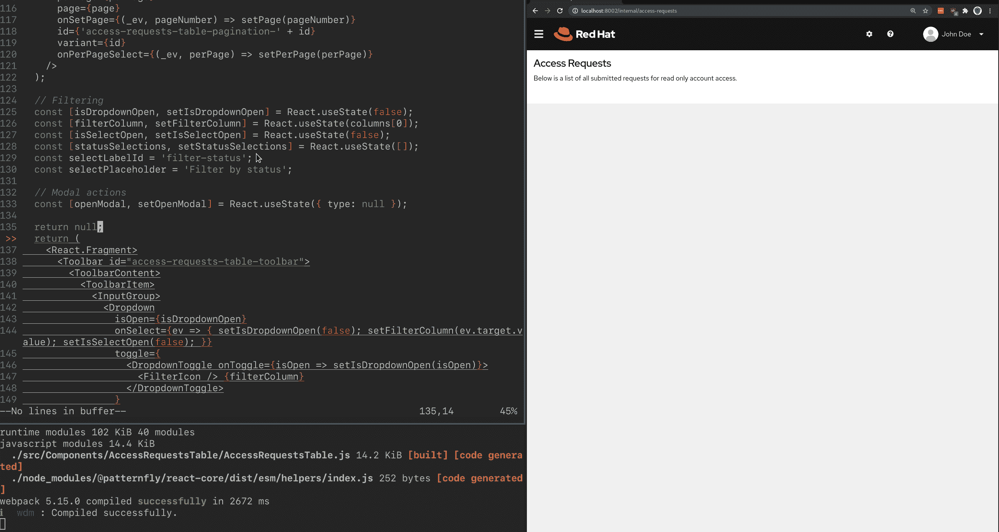
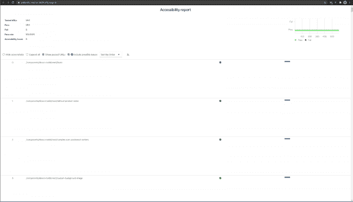

# 如何打造更好的前端开发者体验

> 原文：<https://developers.redhat.com/articles/2021/06/01/how-create-better-front-end-developer-experience>

谁是新功能或新应用的第一批用户？如果你认为他们是顾客，请三思。

第一批用户实际上是前端开发人员，他们测试这些新应用程序和功能的经验使你的第一次[用户体验](/blog/category/uiux/) (UX)。如果您的前端开发人员在开发新产品时有流畅的体验，那么您的用户在使用时几乎总是会有流畅的体验。

以使用 React 开发表单为例。如果开发人员能够毫无困难地开发表单，对客户来说也可能是一种积极的体验。原因？开发人员必须填写表单进行测试。如果调整表单需要一秒钟，而填写表单需要一分钟，开发人员可能会找到减少反馈循环的方法。它可以通过技术手段来减少，如集成自动填充地址栏的浏览器，或建议设计团队将表单拆分，以便更模块化地调整和测试。无论如何，*开发人员倾向于编写与他们的工具一致的软件*。

这就是为什么 UX 设计团队不仅要努力改善产品的最终用户体验，还要简化开发人员的体验。*开发人员体验*指的是开发人员在为每个版本编写、更新和维护代码时所经历的工作流程。从本地构建工具到共享工作流和共享部署，强大的开发人员经验为稳固的 UX 铺平了道路。

在本文中，我们将探讨可能使开发过程复杂化的常见问题，以及如何解决这些问题以培养更好的开发人员体验。

## 什么是好的开发者体验？

前端开发人员希望能够编写代码，在与用户在最终产品中遇到的环境非常相似的环境中添加功能。在提交和推送他们的代码更改后，他们通常会运行测试来确保他们的更改不会意外地破坏任何东西。除了测试验证，前端开发人员可能希望通过与利益相关者共享链接来验证新特性。一旦他们的变更符合涉众的标准，开发人员希望他们的代码进入中央存储库，然后到达最终用户。有时，新功能会在变更合并后立即提供给最终用户，有时，这种过渡会按照基于时间的计划进行。

强大的前端开发人员体验可以平稳地通过每个阶段。不幸的是，很少有前端开发体验是无缝的。

## 前端开发人员的常见难题

常见的前端开发难点跨越三个主要领域:环境、测试和发布。通常，前端开发环境缺乏终端用户环境所具备的关键特性，比如授权或实时数据。通常情况下，缺少网络部件，或者需要正确代理来测试这些环境。说到测试，他们自己不写，不运行，也不分析！

没有解决这些问题的灵丹妙药，但是前端开发人员在这些问题上花费了大量的时间。让我们详细检查一下这些痛点，看看前端开发人员和 [DevOps](/topics/devops/) 工程师可以用来帮助解决它们的方法。

### 棘手问题#1:环境

虽然大多数前端都是独立启动的，但很少有人会独立运行，因为他们通常需要某些后端服务。后端开发者没有前端可以开发，前端开发者没有后端肯定不能开发。一般来说，有三种运行后端服务的解决方案可用于本地前端:

1.  在本地运行后端服务(参见图 1)。
2.  使用共享后端部署。
3.  在前端使用模拟数据。

解决方案一和三允许离线开发。虽然现在互联网连接是一种必然，但对于那些旅行或居住在因天气原因而经历间歇性中断的地方的开发人员来说，离线开发仍然是比在线开发更好的体验。离线开发也不需要 VPN，这在某些设备上可能很难设置。

Figure 1: Hot-reloading changes with Webpack on a local cloud.redhat.com environment with back-end services running locally.

解决方案一和解决方案二要求在开发前端之前额外运行一个命令。本地后端可能需要额外的配置(比如数据库)，共享后端可能需要代理。这导致了更糟糕的开发体验，但有助于比嘲笑数据更早地发现后端错误。

第三种解决方案提供了最佳的整体开发人员体验，但需要的工作量最大，因为每个后端端点都必须被欺骗以返回被欺骗的数据。这需要前端和后端开发人员一起工作来创建模拟。

第一个解决方案提供了最好的后端开发人员体验，因为他们可以针对前端测试本地后端更改。

环境是前端开发人员需要解决的第一个痛点，也是最难解决的常见痛点。能够离线工作是一种很好的体验。不必运行后端来进行前端更改是一种很棒的体验。

### 难点 2:测试

大多数前端一开始并不需要测试。然而，随着它们的增长，重要的是在添加新功能或修复不相关的 bug 时，用户体验不会降级。编写、运行和报告测试可能会很痛苦。让我们看看如何简化两种不同前端测试类别的测试过程:单元测试和集成测试。

#### 单元测试

简化测试编写的最好方法是只编写重要的测试。为定制组件添加自动快照测试有助于捕捉错误。之后，花时间测试事件和状态交互。在开发测试时，大多数工具都有一个监视模式，只有当测试文件发生变化时，才可以使用该模式来运行测试。

#### 集成测试

对于某些框架，有可能[在网页上记录用户交互](https://chrome.google.com/webstore/detail/cypress-recorder/glcapdcacdfkokcmicllhcjigeodacab?hl=en-US),以避免自己编写测试用例。对于大型测试套件，像 [BrowserStack](https://www.browserstack.com/) 这样的工具为免费和开源账户提供了 10 个并发运行者的网格。

#### 报告测试

有几十种报告格式，但是可以上传到 pull request (PR)的 HTML 报告通常是最好的，如图 2 中的[所示。对于单元测试，像](https://github.com/patternfly/patternfly-react/pull/5524) [Codecov](http://codecov.io) 这样的工具也可以帮助维护一定的覆盖率。

Figure 2: An HTML accessibility report for a pull request complete with screenshots.

### 难点 3:释放

当打开一个拉取请求时，以 PR 预览的形式与设计者和其他开发者共享变更通常是有用的。如果你只需要托管静态文件，像 [Netlify](https://www.netlify.com/) 这样的服务可以通过最少的配置工作，或者像 [Surge](https://surge.sh/) 这样的服务可以与现有的持续集成(CI)系统一起工作。对于同样需要后端的站点， [Vercel](https://vercel.com/) 和 [Heroku](https://www.heroku.com/) 有足够的自由层用于大多数部署。

对于发布，像用于普通回购的 [semantic-release](https://github.com/semantic-release/semantic-release) 和用于 monorepos 的 [Lerna](https://lerna.js.org/) (见图 3)这样的工具可以在每次推送到存储库的主分支时发布到 Git、GitHub 或节点包管理器(npm)。当然，总是可以选择编写自己的 bash 脚本来获得完全的灵活性。

Figure 3: Lerna auto-releasing @patternfly/react-* packages to npm from a merged pull request.

## 结论:开发者体验就是用户体验

改善前端开发人员的体验可以降低前端开发的成本，并增强整体用户体验。对于每个项目，解决前端开发人员的棘手问题看起来会有所不同，但回报是相同的:开发人员更顺畅的体验会延续到您的最终用户。

*Last updated: August 26, 2022*