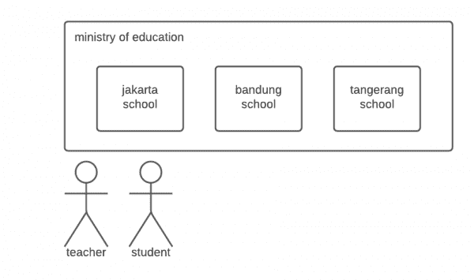
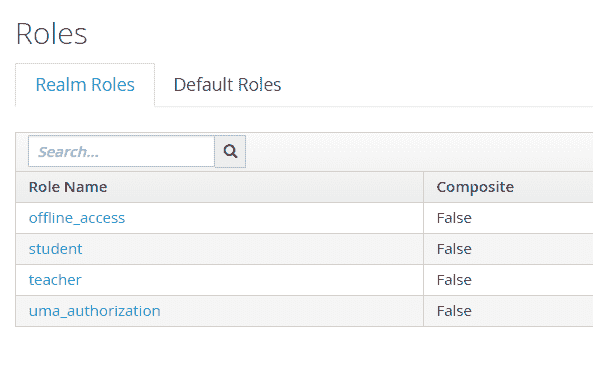
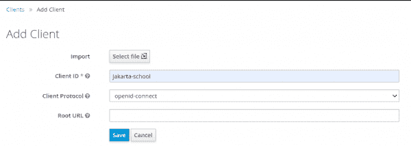
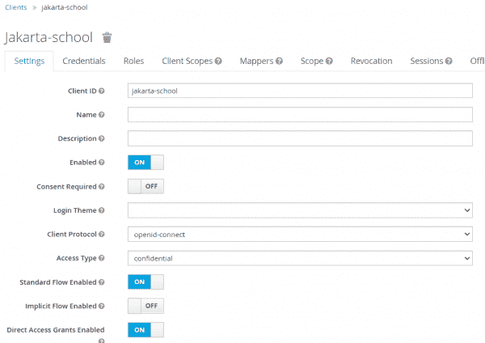
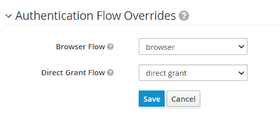
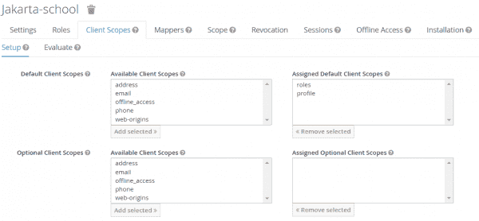
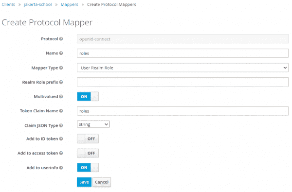
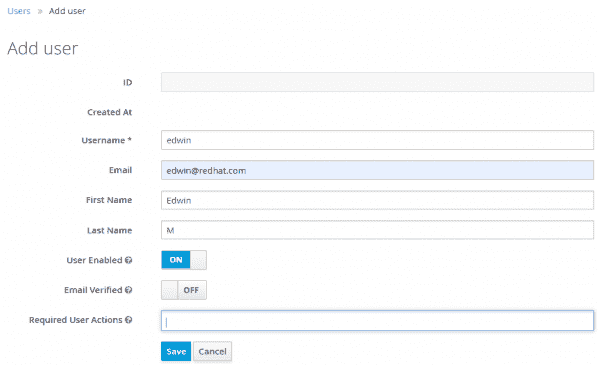
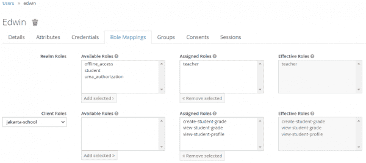

# 使用 Keycloak REST API 进行身份验证和授权

> 原文：<https://developers.redhat.com/blog/2020/11/24/authentication-and-authorization-using-the-keycloak-rest-api>

启用身份验证和授权涉及复杂的功能，不仅仅是简单的登录 API。[在上一篇文章](https://developers.redhat.com/blog/2020/01/29/api-login-and-jwt-token-generation-using-keycloak/)中，我描述了 Keycloak REST 登录 API 端点，它只处理一些认证任务。在本文中，我描述了如何通过使用现成的 Keycloak REST API 功能来启用身份验证和授权的其他方面。

## 认证与授权

但是首先，认证和授权的区别是什么？简单地说，认证意味着*你是谁*，而授权意味着*你能做什么*，每种方法都使用不同的方法进行验证。例如，身份验证使用用户管理和登录表单，授权使用基于角色的访问控制(RBAC)或访问控制列表(ACL)。幸运的是，这些验证方法在 Red Hat 的单点登录(SSO)工具中提供，或者在他们的上游开源项目 Keycloak 的 REST API 中提供。

## Keycloak SSO 案例研究

为了更好地理解使用 Keycloak 进行身份验证和授权，让我们从一个简单的案例研究开始。假设印度尼西亚教育部正计划创建一个与多所学校的单点登录集成。他们计划使用一个集中的平台来维护多所学校的学生和教师的单一帐户 id。这使得每个用户都有相同的角色，但是在每个学校有不同的访问和特权，如图 1 所示。

[](/sites/default/files/blog/2020/08/keycloak-education-00.png)

图 1:每个用户可以使用相同的角色，但是在每个学校有不同的访问权限和特权。">

## Keycloak SSO 演示

让我们通过创建一个钥匙锁领域来开始演示。使用这个部委的 Add realm 对话框(如图 2 所示)。命名领域`education`，在上设置**使能**为**，点击**创建**。**

[](/sites/default/files/blog/2020/08/keycloak-education-01.png)

图 2:为教育部创建一个名为“Education”的 Keycloak 领域">

接下来，转到 Roles 页面，确保选择了 **Realm Roles** 选项卡，如图 3 所示。

[](/sites/default/files/blog/2020/08/keycloak-education-06.png)

Figure 3: Create two separate roles for the education realm: teacher and student.

单击**添加角色**为该领域创建两个独立的角色，分别称为“教师”和“学生”这些新角色将出现在**领域角色**选项卡中，如图 4 所示。

[](/sites/default/files/blog/2020/08/keycloak-education-07.png)

图 4:添加教师和学生角色。">

然后，使用 Clients 页面，点击 **Create** 来添加一个客户端，如图 5 所示。

[](/sites/default/files/blog/2020/08/keycloak-education-02.png)

Figure 5: Add a client.

在 Add Client 页面上，创建一个名为“jakarta-school”的客户端，然后单击 **Save** 来添加这个客户端，如图 6 所示。

[](/sites/default/files/blog/2020/08/keycloak-education-03.png)

在 jakarta-school details 页面上，转到 **Settings** 选项卡并输入以下客户端配置，如图 7 所示:

*   **客户 ID** :雅加达-学校
*   **使能**:开
*   **需要同意**:关
*   **客户端协议** : openid-connect
*   **访问类型**:机密
*   **标准流量启用**:开
*   **冲击流使能**:关
*   **直接访问授权使能**:开

[](/sites/default/files/blog/2020/08/keycloak-education-04.png)

Figure 7: On the jakarta-school details page, enter the client configuration.

在同一页面的底部，在身份验证流覆盖部分，我们可以设置如下，如图 8 所示:

*   **浏览器流程**:浏览器
*   **直接授权流程**:直接授权

[](/sites/default/files/blog/2020/08/keycloak-education-05.png)

图 8:配置认证流覆盖。">

转到**角色**选项卡，单击**添加角色**，为该客户端创建 create-student-grade、view-student-grade 和 view-student-profile 角色，如图 9 所示。每一个都应该设置为**复合**假。

[](/sites/default/files/blog/2020/08/keycloak-education-11.png)

Figure 9: Create roles for this client.

接下来，转到**客户端范围**选项卡，在**默认客户端范围**部分，向**分配的默认客户端范围**添加“角色”和“配置文件”，如图 10 所示。

[](/sites/default/files/blog/2020/08/keycloak-education-08.png)

Figure 10: Set the client scopes.

在 jakarta-school details 页面，选择 **Mappers** ，然后选择 **Create Protocol Mappers** ，设置 Mappers 在 Userinfo API 上显示客户端角色，如图 11 所示:

*   **名称**:角色
*   **映射器类型**:用户领域角色
*   **多值**:开
*   **令牌声明名称**:角色
*   **索赔 JSON 类型**:字符串
*   **添加到 ID 令牌**:关
*   **添加访问令牌**:关
*   **添加到用户信息**:开

[](/sites/default/files/blog/2020/08/keycloak-education-09.png)

Figure 11: Set the mappers to display the client roles.

接下来，进入**用户**页面，选择**添加用户**，新建用户，点击**保存**，如图 12 所示:

*   **用户名**:埃德温
*   **电子邮件**:edwin@redhat.com
*   名字:埃德温
*   **姓氏** : M
*   **用户使能**:开
*   **电子邮件验证**:关

[](/sites/default/files/blog/2020/08/keycloak-education-10.png)

Figure 12: Create the new users.

最后，在**角色映射**选项卡中，为 jakarta-school 中的每个用户选择**客户端角色**，如图 13 所示。这些应该是创建-学生成绩、查看-学生成绩和查看-学生档案。

[](/sites/default/files/blog/2020/08/keycloak-education-12.png)

Figure 13: Select the Client Roles for each user in jakarta-school.

我的 Keycloak 配置演示到此结束。

## 使用 Java 应用程序的键盘锁连接

现在我想演示如何开发一个非常简单的 Java 应用程序。这个应用程序连接到您的 Keycloak 实例，并通过其 REST API 使用 Keycloak 的身份验证和授权功能。

首先，从 pom.xml 文件开始开发 Java 应用程序，如以下示例所示:

```
<?xml version="1.0" encoding="UTF-8"?>
<project 
         xmlns:xsi="http://www.w3.org/2001/XMLSchema-instance"
         xsi:schemaLocation="http://maven.apache.org/POM/4.0.0 http://maven.apache.org/xsd/maven-4.0.0.xsd">
    <modelVersion>4.0.0</modelVersion>

    <groupId>EducationService</groupId>
    <artifactId>com.edw</artifactId>
    <version>1.0-SNAPSHOT</version>

    <parent>
        <groupId>org.springframework.boot</groupId>
        <artifactId>spring-boot-starter-parent</artifactId>
        <version>2.2.1.RELEASE</version>
        <relativePath/>
    </parent>

    <properties>
        <java.version>11</java.version>
    </properties>

    <dependencies>
        <dependency>
            <groupId>org.springframework.boot</groupId>
            <artifactId>spring-boot-starter</artifactId>
        </dependency>
        <dependency>
            <groupId>org.springframework.boot</groupId>
            <artifactId>spring-boot-starter-web</artifactId>
        </dependency>

        <dependency>
            <groupId>com.auth0</groupId>
            <artifactId>jwks-rsa</artifactId>
            <version>0.12.0</version>
        </dependency>

        <dependency>
            <groupId>com.auth0</groupId>
            <artifactId>java-jwt</artifactId>
            <version>3.8.3</version>
        </dependency>

    </dependencies>

    <build>
        <plugins>
            <plugin>
                <groupId>org.springframework.boot</groupId>
                <artifactId>spring-boot-maven-plugin</artifactId>
            </plugin>
        </plugins>
    </build>

</project>
```

Java 应用程序还要求您开发一个简单的属性文件:

```
server.error.whitelabel.enabled=false
spring.mvc.favicon.enabled=false
server.port = 8082

keycloak.client-id=jakarta-school
keycloak.client-secret=197bc3b4-64b0-452f-9bdb-fcaea0988e90
keycloak.scope=openid, profile
keycloak.authorization-grant-type=password

keycloak.authorization-uri=http://localhost:8080/auth/realms/education/protocol/openid-connect/auth
keycloak.user-info-uri=http://localhost:8080/auth/realms/education/protocol/openid-connect/userinfo
keycloak.token-uri=http://localhost:8080/auth/realms/education/protocol/openid-connect/token
keycloak.logout=http://localhost:8080/auth/realms/education/protocol/openid-connect/logout
keycloak.jwk-set-uri=http://localhost:8080/auth/realms/education/protocol/openid-connect/certs
keycloak.certs-id=vdaec4Br3ZnRFtZN-pimK9v1eGd3gL2MHu8rQ6M5SiE

logging.level.root=INFO
```

接下来，从图 14 所示的表单中获取 Keycloak 证书 ID。

[](/sites/default/files/blog/2020/11/keycloak-education-13.png)Figure 14:

Figure 14: Find the Keycloak certificate ID.

之后，也是最重要的，你的下一个任务是开发集成代码；这个动作涉及到几个 Keycloak APIs。注意，我没有详细介绍 Keycloak 登录 API，因为它已经在我以前的文章中描述过了。

从一个简单的注销 API 开始:

```
        @Value("${keycloak.logout}")
        private String keycloakLogout;
```

```
    public void logout(String refreshToken) throws Exception {
        MultiValueMap<String, String> map = new LinkedMultiValueMap<>();
        map.add("client_id",clientId);
        map.add("client_secret",clientSecret);
        map.add("refresh_token",refreshToken);

        HttpEntity<MultiValueMap<String, String>> request = new HttpEntity<>(map, null);
        restTemplate.postForObject(keycloakLogout, request, String.class);
    }
```

首先，我想指出的是，对于注销来说，使用您的`refresh_token`参数而不是`access_token`是很关键的。现在，使用 API 来检查承载令牌是否有效和活动，以便验证请求是否带来了有效的凭证。

```
    @Value("${keycloak.user-info-uri}")
    private String keycloakUserInfo;
```

```
    private String getUserInfo(String token) {
        MultiValueMap<String, String> headers = new LinkedMultiValueMap<>();
        headers.add("Authorization", token);

        HttpEntity<MultiValueMap<String, String>> request = new HttpEntity<>(null, headers);
        return restTemplate.postForObject(keycloakUserInfo, request, String.class);
    }
```

对于授权，您可以使用两种方法来决定给定的角色是否有资格访问特定的 API。第一种方法是通过对照 Keycloak 的 userinfo API 来验证一个无记名令牌所带来的角色，第二种方法是验证无记名令牌中的角色。

对于第一种方法，您可以期待来自 Keycloak 的以下响应:

```
{
    "sub": "ef2cbe43-9748-40e5-aed9-fe981e3082d5",
    "roles": [
        "teacher"
    ],
    "name": "Edwin M",
    "preferred_username": "edwin",
    "given_name": "Edwin",
    "family_name": "M"
}
```

如您所见，这里有一个`roles`标记，一种方法是基于它来验证访问权限。缺点是对于每个请求，您的应用程序和 Keycloak 之间需要多次往返请求，这会导致更长的延迟。

另一种方法是读取通过每个请求发送的 JWT 令牌的内容。为了成功解码您的 JWT 令牌，您必须知道用于签名的公钥。这就是 Keycloak 提供 JWKS 端点的原因。您可以使用 curl 命令查看其内容，如以下示例所示:

```
$ curl -L -X GET 'http://localhost:8080/auth/realms/education/protocol/openid-connect/certs'
```

对于前面的示例，结果如下:

```
{
    "keys": [
        {
            "kid": "vdaec4Br3ZnRFtZN-pimK9v1eGd3gL2MHu8rQ6M5SiE",
            "kty": "RSA",
            "alg": "RS256",
            "use": "sig",
            "n": "4OPCc_LDhU6ADQj7cEgRei4VUf4PZH8GYsxsR6RSdeKmDvZ48hCSEFiEgfc3FIfh-gC4r9PtKucc_nkRofrAKR4qL8KNNoSuzQAOC92Yz6r7Ao4HppHJ8-QVdo5H-d9wfNSlDLBSo5My4b4EnHb1HLuFxDqyhFpGvsoUJdgbt3m_Q3WAVb2yrM83S6HX__vrQvqUk2e7z5RNrI7LSsW3ZOz9fU7pvm8-kFFAIPJ7fOJIC7UQ9wBWg3YdwQ0B2b24jXjVr0QCGzqJ6o1G_UZYSJCDMGQDpDcEuYnvSKBLfVR-0EcAjolRhcSPjHlW0Cp0YU8qwWDHpjkbrMrFmxlO4Q",
            "e": "AQAB"
        }
    ]
}
```

注意，在前面的示例中，`kid`表示密钥 id，`alg`是算法，`n`是用于该领域的公钥。您可以使用这个公钥轻松地解码我们的 JWT 令牌，并从 JWT 声明中读取`roles`。解码后的 JWT 令牌示例如下所示:

```
{
  "jti": "85edca8c-a4a6-4a4c-b8c0-356043e7ba7d",
  "exp": 1598079154,
  "nbf": 0,
  "iat": 1598078854,
  "iss": "http://localhost:8080/auth/realms/education",
  "sub": "ef2cbe43-9748-40e5-aed9-fe981e3082d5",
  "typ": "Bearer",
  "azp": "jakarta-school",
  "auth_time": 0,
  "session_state": "f8ab78f8-15ee-403d-8db7-7052a8647c65",
  "acr": "1",
  "realm_access": {
    "roles": [
      "teacher"
    ]
  },
  "resource_access": {
    "jakarta-school": {
      "roles": [
        "create-student-grade",
        "view-student-profile",
        "view-student-grade"
      ]
    }
  },
  "scope": "profile",
  "name": "Edwin M",
  "preferred_username": "edwin",
  "given_name": "Edwin",
  "family_name": "M"
}
```

您可以通过使用以下示例中显示的代码来读取`roles`标记:

```
    @GetMapping("/teacher")
    public HashMap teacher(@RequestHeader("Authorization") String authHeader) {
        try {
            DecodedJWT jwt = JWT.decode(authHeader.replace("Bearer", "").trim());

            // check JWT is valid
            Jwk jwk = jwtService.getJwk();
            Algorithm algorithm = Algorithm.RSA256((RSAPublicKey) jwk.getPublicKey(), null);

            algorithm.verify(jwt);

            // check JWT role is correct
            List<String> roles = ((List)jwt.getClaim("realm_access").asMap().get("roles"));
            if(!roles.contains("teacher"))
                throw new Exception("not a teacher role");

            // check JWT is still active
            Date expiryDate = jwt.getExpiresAt();
            if(expiryDate.before(new Date()))
                throw new Exception("token is expired");

            // all validation passed
            return new HashMap() {{
                put("role", "teacher");
            }};
        } catch (Exception e) {
            logger.error("exception : {} ", e.getMessage());
            return new HashMap() {{
                put("status", "forbidden");
            }};
        }
    }
```

这种方法最好的地方在于，您可以将 Keycloak 中的公钥放在缓存中，这减少了往返请求，这种做法最终会增加应用程序的延迟和性能。本文的完整代码可以在我的 GitHub 库中找到[。](https://github.com/edwin/java-keycloak-integration)

## 结论

总之，我准备这篇文章首先是为了解释启用身份验证和授权涉及复杂的功能，不仅仅是一个简单的登录 API。然后，我演示了如何使用现成的 Keycloak REST API 功能来启用身份验证和授权的许多方面。

此外，我还演示了如何开发一个简单的 Java 应用程序，该应用程序连接到您的 Keycloak 实例，并通过其 REST API 使用 Keycloak 的身份验证和授权功能。

*Last updated: June 7, 2022*