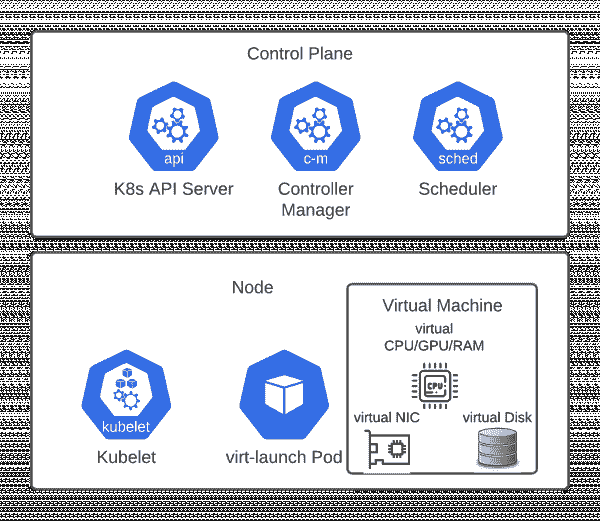
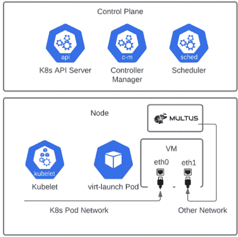
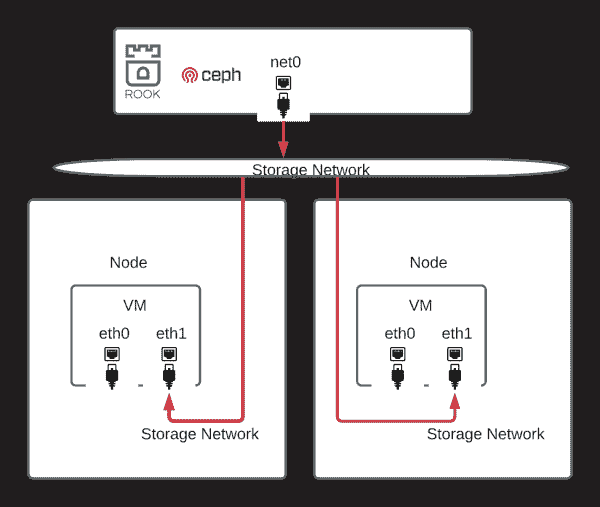
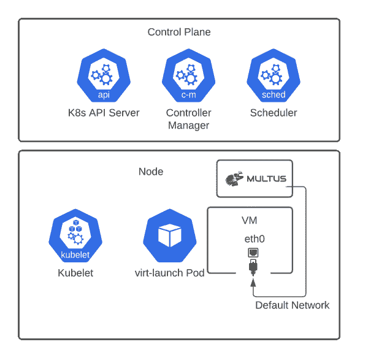
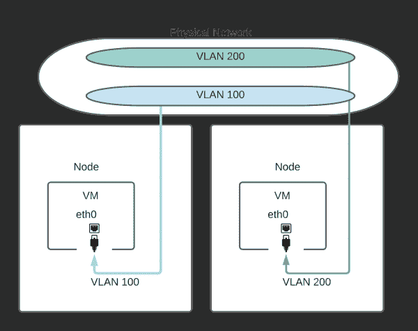
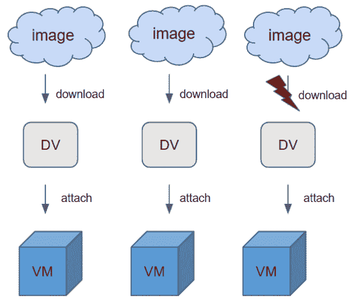
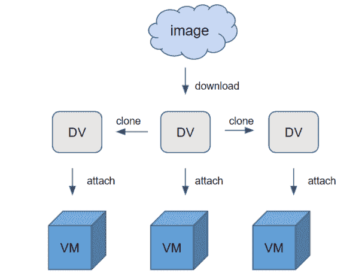
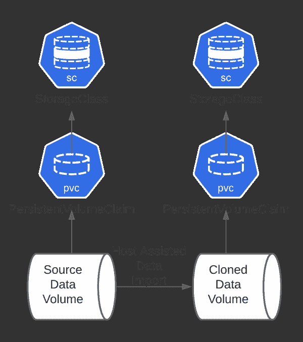
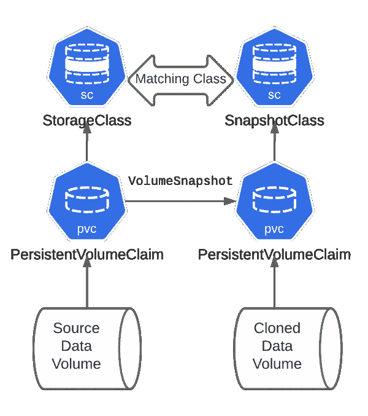

# 在 KubeVirt 中使用 Multus 和 DataVolume

> 原文：<https://developers.redhat.com/blog/2020/11/18/using-multus-and-datavolume-in-kubevirt>

[KubeVirt](https://kubevirt.io/) 是基于 [Kubernetes](https://developers.redhat.com/topics/kubernetes) 的云原生虚拟机管理框架。KubeVirt 协调虚拟机上运行的工作负载，就像 Kubernetes 为[容器](https://developers.redhat.com/topics/containers)所做的一样。KubeVirt 有许多用于管理网络、存储、映像和虚拟机本身的特性。本文主要关注配置网络和存储需求的两种机制:[多 CNI](https://github.com/intel/multus-cni) 和 [CDI 数据卷](https://kubevirt.io/2018/CDI-DataVolumes.html)。您将了解如何为需要高性能、安全性和可伸缩性的用例配置这些 KubeVirt 特性。

**注意**:本文假设您熟悉 Kubernetes、容器化和云原生架构。

## KubeVirt 简介

KubeVirt 是一个云原生虚拟机管理框架，自 2019 年以来一直是[云原生计算基金会(CNCF)沙盒项目](https://github.com/cncf/toc/blob/master/process/sandbox.md)。它使用 Kubernetes 自定义资源定义(CRD)和控制器来管理虚拟机生命周期。

如图 1 所示，KubeVirt 的 [VirtualMachine API](https://kubevirt.io/user-guide/#/architecture) 描述了一个具有虚拟网络接口、磁盘、中央处理器(CPU)、图形处理器(GPU)和内存的虚拟机。VirtualMachine API 包括四个 API 对象:`interfaces`、`disks`、`volumes`和`resources`。

*   **接口 API** 描述了接口可能连接的网络设备、连接机制和网络。
*   **[磁盘和卷 API](https://kubevirt.io/user-guide/#/creation/disks-and-volumes?id=disks-and-volumes")**分别描述了磁盘的类型(数据或`cloudInit`)；创建磁盘的永久卷声明(PVC );和初始磁盘映像。
*   **Resources** API 是内置的 Kubernetes API，它描述了与给定虚拟机相关的计算资源声明的数量。

图 1 展示了一个由 KubeVirt 管理的虚拟机。

[](/sites/default/files/blog/2020/11/image1-1.png)

Figure 1: A KubeVirt managed virtual machine.

以下是部分 YAML 文件片段中的 VirtualMachine API:

```
apiVersion: kubevirt.io/v1alpha3
kind: VirtualMachine
metadata:
  name: my-vm
spec:
  template:
   spec:
     domain:
      devices:
        interfaces:
        resources:
        disks:
      networks:
      volumes:
  dataVolumeTemplates:
    spec:
      pvc:

```

## 什么是木尔图斯-CNI？

[Multus](https://github.com/intel/multus-cni) 是一个元容器网络接口(CNI ),允许一个 pod 拥有多个接口。它使用[NetworkAttachmentDefinition](https://github.com/k8snetworkplumbingwg)API 中的一系列插件进行网络连接和管理。

下面的部分 YAML 文件显示了一个示例`NetworkAttachmentDefinition`实例。`bridge`插件建立网络连接，我们使用了行踪插件进行 IP 地址管理(IPAM)。

```
apiVersion: k8s.cni.cncf.io/v1
kind: NetworkAttachmentDefinition
metadata:
  name: my-bridge
  namespace: my-ns
spec:
  config: '{
    "cniVersion": "0.4.0",
    "name": "my-bridge",
    "plugins": [
        { "name": "my-whereabouts",
          "type": "bridge",
          "bridge": "br1",
          "vlan": 1234,
          "ipam": {
            "type": "whereabouts",
            "range": "10.123.124.0/24",
            "routes": []
          }
        }
      ]
    }'

```

注意，有多个 IPAM 实例可用:一个`host-local`实例管理本地主机范围内的 IP 地址；`static`指定单个 IP 地址；`whereabouts`允许我们集中管理所有 Kubernetes 节点的 IP 地址。

## 在 KubeVirt 中使用 Multus

KubeVirt 在其[网络 API](https://kubevirt.io/user-guide/#/creation/interfaces-and-networks) 中本地支持 Multus。我们可以使用网络 API 来获得多个网络连接。如果目标是完全隔离，我们可以配置 API 使用 Multus 作为默认网络。我们将介绍这两种配置。

### 创建网络扩展

在 KubeVirt 中添加网络包括两个步骤。首先，我们为任何尚不存在的连接创建一个`NetworkAttachmentDefinition`。当编写`NetworkAttachmentDefinition`时，我们必须注意我们想要如何以及在什么范围内管理 IP 地址。我们的选择有`host-local`、`static`或`whereabouts`。如果用例需要物理网络隔离，我们可以使用插件，比如`bridge`插件，来支持虚拟局域网(VLAN)或虚拟可扩展局域网(VXLAN)级别的隔离。

在第二步中，我们使用名称空间/名称格式来引用`VirtualMachine`中的`NetworkAttachmentDefinition`。当一个`VirtualMachine`实例被创建时，[虚拟启动器](https://kubernetes.io/blog/2018/05/22/getting-to-know-kubevirt/) pod 使用引用来找到`NetworkAttachmentDefinition`并应用正确的网络配置。

图 2 展示了网络扩展的配置。在图中，一个虚拟机配置了两个网络接口，`eth0`和`eth1`。网络接口名称可能因操作系统而异。`eth0`接口连接到 Kubernetes pod 网络。`eth1`接口连接到“其他网络”该网络在`NetworkAttachmentDefinition`中描述，并在`VirtualMachine`实例的 Multus `networkName`中引用。

[](/sites/default/files/blog/2020/11/img_5faef77782437.png)

Figure 2: A network extension with Multus.

以下部分 YAML 文件显示了网络扩展的配置。

```
apiVersion: k8s.cni.cncf.io/v1
kind: NetworkAttachmentDefinition
metadata:
  name: my-bridge
  namespace: my-ns
spec:
  config: '{
    "cniVersion": "0.4.0",
    "name": "my-bridge",
    "plugins": [
       {
          "name": "my-whereabouts",
          "type": "bridge",
          "bridge": "br1",
          "vlan": 1234,
          "ipam": {
            "type": "whereabouts",
            "range": "10.123.124.0/24",
            "routes": [
                { "dst": "0.0.0.0/0",
                  "gw" : "10.123.124.1" }
            ]}}]}'

apiVersion: kubevirt.io/v1alpha3
kind: VirtualMachine
metadata:
  name: my-vm
spec:
  template:
    spec:
     domain:
      devices:
        interfaces:
        - name: default
            masquerade: {}
        - bridge: {}
          name: other-net
      networks:
      - name: default
        pod: {}
      - multus:
          networkName:
              my-ns/my-bridge
        name: other-net

```

向虚拟机添加额外网络的一个原因是为了确保高性能的数据传输。默认的 Kubernetes pod 网络由 Kubernetes 节点上运行的所有 pod 和服务共享。因此，所谓的*噪音邻居问题*可能会干扰对网络流量敏感的工作负载。拥有一个独立的专用网络可以解决这个问题。

如图 3 所示，您可以使用 KubeVirt 配置一个虚拟机，使用由 [Rook](https://rook.io) 编排的专用 Ceph 存储网络。Rook 是协调 Ceph 集群的数据服务运营商。它刚从 CNCF 孵化毕业。它现在还支持允许 Ceph 集群通过`NetworkAttachmentDefinition`连接到另一个网络。在这个配置中，Ceph 的公共网络和虚拟机的 Multus 网络引用同一个`NetworkAttachmentDefinition`。

[](/sites/default/files/blog/2020/11/image5-1.png)

Figure 3\. Example of a storage network attachment using Multus.

### 创建一个隔离网络

用于 pod 时，除了 pod 网络的默认接口之外，Multus CNI 还会创建网络接口。然而，在 KubeVirt 虚拟机上，我们可以使用 Multus 网络作为默认网络。虚拟机不需要连接到 pod 网络。如图 4 所示，Multus API 可以是`VirtualMachine`的唯一网络。

[](/sites/default/files/blog/2020/11/image3-1.png)

Figure 4: An isolated network configuration.

这种配置确保了一个虚拟机与运行在同一个 Kubernetes 集群上的其他 pods 或虚拟机完全隔离。隔离提高了工作负载的安全性。此外，`bridge`插件允许网络附件使用 VLANs 来实现物理网络的流量隔离。注意，`NetworkAttachmentDefinition`使用了`bridge`插件和 VLAN 1234。Multus 网络是唯一的网络，因此是虚拟机中的默认网络。

下面的部分 YAML 文件显示了创建隔离网络的配置，如图 4 所示。

```
apiVersion: k8s.cni.cncf.io/v1
kind: NetworkAttachmentDefinition
metadata:
  name: my-bridge
  namespace: my-ns
spec:
  config: '{
    "cniVersion": "0.4.0",
    "name": "my-bridge",
    "plugins": [
       {
          "name": "my-whereabouts",
          "type": "bridge",
          "bridge": "br1",
          "vlan": 1234,
          "ipam": {
            "type": "whereabouts",
            "range": "10.123.124.0/24",
            "routes": [
                { "dst": "0.0.0.0/0",
                  "gw" : "10.123.124.1" }
            ]}}]}'

apiVersion: kubevirt.io/v1alpha3
kind: VirtualMachine
metadata:
  name: my-vm
spec:
  template:
    spec:
     domain:
      devices:
        interfaces:
        - bridge: {}
          name: default-net
      networks:
      - multus:
          networkName:
              my-ns/my-bridge
        name: default-net

```

### 在隔离网络中使用独立的 VLANs

不同的虚拟机可以使用不同的 VLANs 来确保它们连接到专用的隔离网络，如图 5 所示。这种配置需要访问网络基础设施上的本地 VLANs。因为本地 VLAN 在公共云上并不总是可访问的，所以我们建议首先构建一个 VXLAN 隧道，并在 VXLAN 接口上创建网桥，以便可以在 VXLAN 隧道上创建 VLAN。

[](/sites/default/files/blog/2020/11/image6-1.png)

Figure 5: Using Multus and VLAN for separate virtual machines.

## 在 KubeVirt 中使用数据卷

KubeVirt 的[容器化数据导入器](https://github.com/kubevirt/containerized-data-importer) (CDI)项目提供了一个`DataVolume`资源，该资源在一个对象中封装了持久卷声明(PVC)和数据源。创建一个`DataVolume`会创建一个 PVC 并用数据源填充持久卷(PV)。来源可以是一个 URL，也可以是另一个从其克隆出`DataVolume`的现有 PVC。下面的部分 YAML 文件显示了一个从 PVC `my-source-dv`克隆而来的`DataVolume`。

```
apiVersion: cdi.kubevirt.io/v1alpha1
kind: DataVolume
metadata:
  name: my-cloned-dv
spec:
  source:
    pvc:
      name: my-source-dv
      namespace: my-ns
  pvc:
    accessModes:
    - ReadWriteOnce
    resources:
      requests:
        storage: 10Gi
      storageClassName: storage-provisioner

```

KubeVirt 让我们使用一个`DataVolume`来启动一个或多个虚拟机。在大规模部署虚拟机时，预分配的`DataVolume`比使用远程 URL 源的临时`DataVolume`更具可扩展性和可靠性。我们将研究这两种配置。

### 使用 DataVolume 的两种方法

如图 6 所示， *ad hoc DataVolume* 指的是一种配置，其中虚拟机群使用来自远程 URL 的相同磁盘映像。这种配置不需要任何前期工作，并且在重用相同的 DataVolume API 对象时非常有效。然而，因为这种配置需要将每个图像下载到单独的`DataVolume`中，所以它是不可靠或不可扩展的。如果远程映像下载中断，那么`DataVolume`将变得不可用，虚拟机也是如此。

[](/sites/default/files/blog/2020/11/image2-1.png)

Figure 6: Creating an ad hoc DataVolume.

一个*预分配数据卷*需要两步设置。首先，我们创建一个使用远程 URL 源的预分配的`DataVolume`。在我们创建了第一个`DataVolume`之后，我们克隆第二个`DataVolume`，它使用与预分配映像相同的映像。

图 7 展示了创建预分配的`DataVolume`的两步过程。虽然这很麻烦，但当用于启动一大群虚拟机时，这两个步骤的过程是可扩展的和可靠的。

[](/sites/default/files/blog/2020/11/image7-1.png)

Figure 7: Creating a pre-allocated DataVolume.

### 克隆数据卷

在 KubeVirt 中有两种方法可以克隆数据卷。两者都有其优点和局限性。

#### 创建主机辅助的克隆

图 8 展示了创建主机辅助克隆的过程。在这个过程中，我们可以使用同一个`StorageClass`或两个不同的`DataVolume`来供应源`DataVolume`和目标`DataVolume`。CDI pod 装载这两个卷，并将源的磁盘卷复制到目标。数据复制过程适用于任何持久卷类型。但是，请注意，在两个卷之间复制数据非常耗时。大规模执行时，由此产生的延迟会延迟虚拟机的启动。

[](/sites/default/files/blog/2020/11/image9-1.png)

Figure 8: Creating a host-assisted DataVolume clone.

#### 创建智能克隆

如图 9 所示，智能克隆仅适用于具有匹配`StorageClass`的卷，这意味着它们使用相同的存储供应器。智能克隆不会将数据从源复制到目标。相反，它使用一个[卷快照](https://kubernetes.io/docs/concepts/storage/volume-snapshots/)来创建目标持久卷。`VolumeSnapshot`可以利用存储后端上的写入时复制(CoW)快照功能，因此具有很高的效率和可扩展性。这种方法对于减少大规模虚拟机部署期间的启动延迟特别有用。

[](/sites/default/files/blog/2020/11/image8-1.png)

Figure 9: Creating a DataVolume smart clone.

## 结论

作为一个云原生虚拟机管理框架，KubeVirt 采用了云原生技术以及自己的发明。因此，KubeVirt APIs 和控制器支持灵活和可扩展的虚拟机配置和管理，可以与云原生生态系统中的许多技术很好地集成。本文主要关注 KubeVirt 的网络和存储机制。我们期待在未来分享更多令人兴奋的特性，包括 KubeVirt 处理 CPU、内存和直接设备访问的机制。

*Last updated: January 21, 2022*