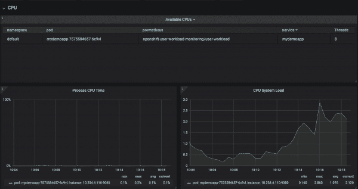

# 开放自由 20.0.0.11 在 Grafana 仪表板中引入了 Kerberos 身份验证和灭霸支持

> 原文：<https://developers.redhat.com/blog/2020/10/30/open-liberty-20-0-0-11-brings-kerberos-authentication-and-thanos-support-in-grafana-dashboards>

这篇文章快速浏览了 Open Liberty 20.0.0.11 新版本中两个激动人心的更新。首先，现在可以使用 Kerberos 身份验证协议来保护 Java 数据库连接(JDBC)数据源。我将在 Open Liberty 的`server.xml`中介绍新的`kerberos`配置元素，并向您展示如何使用 Kerberos 协议来保护数据源。

我们还更新了 Open Liberty 的 Grafana 仪表板，您现在可以使用它来可视化来自灭霸数据源的微轮廓度量数据。这一新功能有利于在 Kubernetes 环境中工作的开发人员，如 T2 红帽开放转移，在这里可以使用灭霸来查询和存储来自多个集群的度量数据。请继续阅读，了解更多关于开放自由 20.0.0.11 的这些更新。

## 使用开放自由 20.0.0.11 运行您的应用程序

使用以下坐标安装带 [Maven](https://openliberty.io//guides/maven-intro.html) 的开放自由 20.0.0.10:

```
<dependency>
  <groupId>io.openliberty</groupId>
  <artifactId>openliberty-runtime</artifactId>
  <version>20.0.0.11</version>
  <type>zip</type>
</dependency>

```

对于[梯度](https://openliberty.io//guides/gradle-intro.html)，使用:

```
dependencies {
    libertyRuntime group: 'io.openliberty', name: 'openliberty-runtime', version: '[20.0.0.11,)'
}

```

如果您使用 Docker，它是:

```
FROM open-liberty

```

## JDBC 数据源的 Kerberos 身份验证

Kerberos 是一种网络身份验证协议，它允许客户端和服务器通过与密钥分发中心(KDC)通信来进行身份验证。从开放自由 20.0.0.11 开始，您可以对由以下数据库之一支持的 JDBC 数据源使用 Kerberos 身份验证:

*   IBM DB2
*   Oracle 数据库
*   microsoft sql server
*   一种数据库系统

Open Liberty 的 Kerberos 认证建立在 JDK 的 [Kerberos 登录模块](https://docs.oracle.com/en/java/javase/11/docs/api/jdk.security.auth/com/sun/security/auth/module/Krb5LoginModule.html) ( `Krb5LoginModule`)和 [Java 通用安全服务 API](https://docs.oracle.com/javase/8/docs/technotes/guides/security/jgss/tutorials/index.html) 之上。Kerberos 登录模块反过来构建在 Kerberos 操作系统库之上，用于正在使用的特定系统。

`kerberos` `server.xml`配置元素为 Open Liberty 服务器提供系统范围的配置选项。例如:

```
  <kerberos keytab="${server.config.dir}/security/krb5.keytab" configFile="${server.config.dir}/security/krb5.conf"/>

```

下面是一个如何使用 Kerberos 协议保护 JDBC 数据源的示例:

```
  <featureManager>
  <feature>jdbc-4.2</feature>
  </featureManager>

  <!-- optional config: This is only needed if you need to customize the location of keytab or krb5.conf -->
  <kerberos keytab="${server.config.dir}/security/krb5.keytab" configFile="${server.config.dir}/security/krb5.conf"/>

  <authData id="myKerberosAuth" krb5Principal="krbUser"/>

  <library id="db2DriverLib">
    <fileset dir="${server.config.dir}/db2"/>
  </library>

  <dataSource jndiName="jdbc/krb/basic" containerAuthDataRef="myKerberosAuth">
    <jdbcDriver libraryRef="db2DriverLib"/>
    <properties.db2.jcc databaseName="${DB2_DBNAME}" serverName="${DB2_HOSTNAME}" portNumber="${DB2_PORT}"/>
  </dataSource>

```

在这个版本之前，对 JDBC 数据源使用 Kerberos 身份验证在技术上是可行的，但是配置很复杂并且没有文档记录。Open Liberty 服务器在对数据源使用 Kerberos 身份验证时也缺乏连接池支持。

## Grafana 仪表板现在支持灭霸

有了 Open Liberty 20.0.0.11，您现在可以使用 Open Liberty Grafana 仪表板来可视化来自灭霸数据源的数据。Grafana 仪表板提供了一系列时间序列的 MicroProfile 度量数据的可视化，包括 CPU 和 servlet 操作、连接池和垃圾收集的性能度量。Grafana dashboard 由 Prometheus 数据源提供支持，配置为从一个或多个 Open Liberty 服务器的`/metrics`端点接收数据。您可以使用仪表板近乎实时地查看性能指标。

Open Liberty 以前只在 Prometheus 是数据源的情况下支持可视化度量数据。然而，像 OpenShift 这样的 Kubernetes 环境使用灭霸来查询和存储来自多个集群的指标数据。在新的 Open Liberty Grafana 仪表板中，如图 1 所示，Kubernetes 和 OpenShift 用户可以将灭霸设置为显示指标数据的数据源。

[](/sites/default/files/blog/2020/10/grafana.png)

Figure 1: The new Open Liberty 20.0.0.11 Grafana dashboard.

## 在新的 Grafana 仪表板上使用灭霸

了解更多关于您可以用新的开放自由 20.0.0.11 Grafana 仪表板做什么:

*   访问 Open Liberty 运营商的 GitHub 知识库，获取安装新的 Open Liberty Grafana 仪表板的指南。
*   查看 Prometheus 主页，了解更多关于使用 Prometheus 创建自定义可视化效果的信息。
*   查看 OpenShift 博客，了解用灭霸监控多个 OpenShift 集群[。](https://www.openshift.com/blog/federated-prometheus-with-thanos-receive)

## 尝试在红帽运行时打开自由 20.0.0.11

Open Liberty 是 Red Hat Runtimes 的一部分，可供 [Red Hat Runtimes 的订户](//access.redhat.com/products/red-hat-runtimes”)使用。要了解更多关于将 Open Liberty 应用部署到 [Red Hat OpenShift](//developers.redhat.com/products/openshift/overview) 的信息，请参见我们的 Open Liberty 指南，*将微服务部署到 Open shift。开放自由 20.0.0.11 可以通过 Maven、Gradle、Docker 获得，也可以下载存档。*

*Last updated: June 3, 2022*