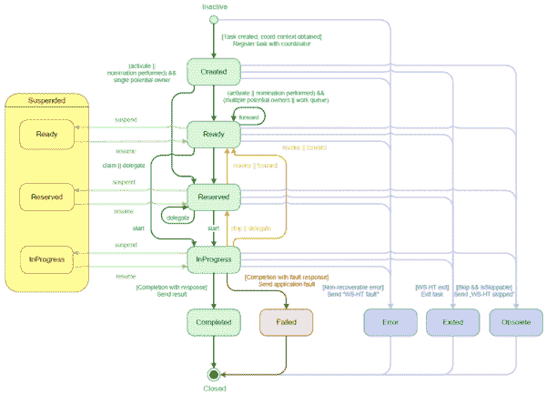
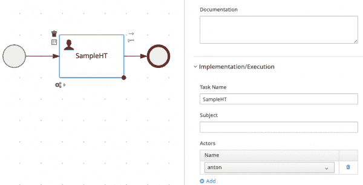
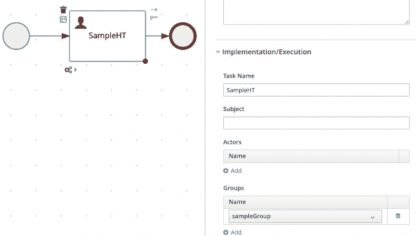

# 在 Red Hat Process Automation Manager 和 Red Hat JBoss BPM Suite 中排除用户任务错误

> 原文：<https://developers.redhat.com/blog/2020/09/22/troubleshooting-user-task-errors-in-red-hat-process-automation-manager-and-red-hat-jboss-bpm-suite>

我在[红帽 JBoss BPM 套件](https://docs.jboss.org/jbpm/release/7.42.0.Final/jbpm-docs/html_single/#jbpmreleasenotes) (jBPM)和[红帽流程自动化管理器](https://developers.redhat.com/products/rhpam/overview) (RHPAM)身边很多年了。在这段时间里，我学到了很多关于这个业务流程管理引擎鲜为人知的方面。

如果您像大多数人一样，您可能认为用户任务是琐碎的，没有必要了解它们的细节。然后，有一天，你会发现自己在排除类似这样的错误:

```
User '[User:'admin']' was unable to execution operation 'Start' on task id 287271 due to a no 'current status' match.

```

收到太多类似的错误消息让我了解了我所知道的关于用户任务的一切，我决定分享我的经验。

用户任务是任何业务流程管理引擎的重要组成部分，jBPM 也不例外。他们的行为由 [OASIS Web 服务—人工任务规范](http://docs.oasis-open.org/bpel4people/ws-humantask-1.1-spec-cs-01.html)定义，它已经被[业务流程模型和符号(BPMN)2.0](https://www.omg.org/spec/BPMN/2.0/About-BPMN/)—业务流程图的标准完全采用。该规范定义了我将在本文中讨论的两件非常重要的事情:用户任务生命周期和任务访问控制。事不宜迟，让我们直接开始吧。

**注**:这些故障排除提示适用于 Red Hat JBoss BPM Suite 6.2 及以上版本和 Red Hat Process Automation Manager 7。

## 用户任务生命周期

图 1 中的图表说明了任务如何从一种状态转换到另一种状态，以及针对每种状态执行的有效可执行操作。

[](/sites/default/files/blog/2020/07/img_5f11a65136c43.png)

为了了解这个图表如何有所帮助，请考虑一个实际的例子。想象一个**开始- >用户任务- >结束**的流程。如图 2 所示，该任务只分配了一个角色`anton`。

[](/sites/default/files/blog/2020/09/user-task-troubleshooting1.png)

Figure 2\. A simple process for a single user.

在开始这个过程时，任务自动转换到保留状态，这由第 4.10.1 节的 [WS-Human Task](http://docs.oasis-open.org/bpel4people/ws-humantask-1.1-spec-cs-01.html) 规范规定:“当任务只有一个潜在所有者时，它转换到*保留的*状态。”

现在，让我们看看当我们执行下面的调用时会发生什么:

```
$ curl -X PUT -u anton:password1!
"http://localhost:8080/kie-server/services/rest/server/containers
/HumanTaskExamples/tasks/1/states/completed?user=anton"
-H "accept: application/json" -H "content-type: application/json" -d "{}"

```

我们将观察到这个错误:

```
Could not commit session: org.jbpm.services.task.exception.PermissionDeniedException: User '[UserImpl:anton]' was unable to execute operation 'Complete' on task id 1 due to a no 'current status' matchCould not commit session: org.jbpm.services.task.exception.PermissionDeniedException: User '[UserImpl:anton]' was unable to execute operation 'Complete' on task id 1 due to a no 'current status' match at org.jbpm.services.task.internals.lifecycle.MVELLifeCycleManager.evalCommand(MVELLifeCycleManager.java:163) at org.jbpm.services.task.internals.lifecycle.MVELLifeCycleManager.taskOperation(MVELLifeCycleManager.java:392)
```

但是没有理由恐慌:我们可以参考图 1 中的图表来理解发生了什么。仔细观察，您会发现从保留状态开始，允许的操作是 Start。这将我们的任务状态移动到 InProgress，这使我们可以执行完整的操作。

所以，为了解决这个错误，我们先调用`start`，然后调用`complete`。或者，如果你不想被任务生命周期的混乱所困扰，使用`auto-progress`选项:

```
$ curl -X PUT -u anton:password1!
"http://localhost:8080/kie-server/services/rest/server/containers
/HumanTaskExamples/tasks/1/states/completed?user=anton&auto-progress=true"
-H "accept: application/json" -H "content-type: application/json" -d "{}"

```

在内部，引擎退回到这个[实现示例](https://github.com/kiegroup/jbpm/blob/7.39.x/jbpm-services/jbpm-kie-services/src/main/java/org/jbpm/kie/services/impl/UserTaskServiceImpl.java#L231)中的逻辑(点击链接查看完整代码):

```
TaskService taskService = engine.getTaskService();
// auto progress if needed
if (task.getStatus().equals(Status.Ready.name())) {
taskService.claim(taskId.longValue(), userId);
taskService.start(taskId.longValue(), userId);
} else if (task.getStatus().equals(Status.Reserved.name())) {
taskService.start(taskId.longValue(), userId);
}
// perform actual operation
taskService.complete(taskId, userId, params);

```

基于当前的任务状态，它执行所有必要的中间步骤(在我们的例子中，中间步骤是**开始**操作)。是否使用`autoProgress`取决于客户的需求:有些客户需要任务状态之间的精细区分，有些客户不在乎。使用`autoProgress`无疑简化了开发人员的生活，但是不管怎样，理解幕后发生的事情是很重要的。

### 研究来源

您可能已经注意到上面的堆栈跟踪提到了有用的类。如果你想深入研究(我偶尔会这样做)，你可以深入研究这些。底层实现细节很重要，原因很简单:源代码从来不会说谎，而文档可能会。就此而言，不要相信图表、文章或文档；相信源代码。

[operations-dsl.mvel](https://github.com/kiegroup/jbpm/blob/master/jbpm-human-task/jbpm-human-task-core/src/main/resources/operations-dsl.mvel) 和[MVELLifeCycleManager.java](https://github.com/kiegroup/jbpm/blob/master/jbpm-human-task/jbpm-human-task-core/src/main/java/org/jbpm/services/task/internals/lifecycle/MVELLifeCycleManager.java)文件保存了任务生命周期的*实际实现*，如图 1 所示。

希望这涵盖了与生命周期相关的错误，并为您提供了足够的信息来帮助排除故障。

## 任务访问控制

处理用户任务的下一个重要方面是任务访问控制。本质上，如果您想要执行与任务相关的操作，用户必须有资格执行该操作。对于一个有资格的用户，引擎必须认为该用户是任务的潜在所有者。

在检查任务访问中起重要作用的组件是[用户组回调](https://github.com/kiegroup/droolsjbpm-knowledge/blob/master/kie-api/src/main/java/org/kie/api/task/UserGroupCallback.java)。这是一个简单的接口，jBPM 允许您插入各种(甚至是定制的)实现。我们稍后会谈到`UserGroupCallback`。

### jBPM 任务访问示例

注意，在 jBPM 中，*潜在所有者*既指个体参与者，也指团队。举例来说，想象一个分配了一个组的任务:`sampleGroup`，如图 3 所示。

[](/sites/default/files/blog/2020/09/user-task-troubleshooting2.png)

Figure 3: Example process with single group as a potential owner

该任务还有两个用户，在[红帽 JBoss 企业应用平台](https://developers.redhat.com/videos/vimeo/95462201)中定义如下:

```
anton1=kie-server,sampleGroup,admin
anton2=kie-server,admin

```

现在，我们执行一个由用户`anton2`验证的*声明*操作:

```
curl -X PUT -u anton2:password1!
"http://localhost:8080/kie-server/services/rest/server/containers
/HumanTaskExamples/tasks/1/states/claimed?user=anton2"
-H "accept: application/json"

```

索赔失败，导致以下错误:

```
12:13:20,117 WARN  [org.jbpm.services.task.persistence.TaskTransactionInterceptor] (default task-8) Could not commit session: org.jbpm.services.task.exception.PermissionDeniedException: User '[UserImpl:anton2]' does not have permissions to execute operation 'Claim' on task id 112:13:20,117 WARN [org.jbpm.services.task.persistence.TaskTransactionInterceptor] (default task-8) Could not commit session: org.jbpm.services.task.exception.PermissionDeniedException: User '[UserImpl:anton2]' does not have permissions to execute operation 'Claim' on task id 1 at org.jbpm.services.task.internals.lifecycle.MVELLifeCycleManager.evalCommand(MVELLifeCycleManager.java:127) at org.jbpm.services.task.internals.lifecycle.MVELLifeCycleManager.taskOperation(MVELLifeCycleManager.java:392) at org.jbpm.services.task.impl.TaskInstanceServiceImpl.claim(TaskInstanceServiceImpl.java:157) at org.jbpm.services.task.commands.ClaimTaskCommand.execute(ClaimTaskCommand.java:52) at org.jbpm.services.task.commands.ClaimTaskCommand.execute(ClaimTaskCommand.java:33)
```

现在，这个错误是意料之中的，也是显而易见的，因为`anton2`不是`sampleGroup`的一部分。jBPM 引擎不认为`anton2`是潜在的所有者，因此操作失败。但是让我们*真的*试着去理解在这次通话中发生了什么。堆栈跟踪为我们提供了所需的所有线索。

### 研究堆栈跟踪

首先—在实际声明之前— [`UserGroupCallback`操作](https://github.com/kiegroup/jbpm/blob/7.39.x/jbpm-human-task/jbpm-human-task-core/src/main/java/org/jbpm/services/task/commands/ClaimTaskCommand.java#L50)被执行(点击链接查看完整源代码):

```
public Void execute(Context cntxt) {
TaskContext context = (TaskContext) cntxt;
doCallbackUserOperation(userId, context, true);
groupIds = doUserGroupCallbackOperation(userId, null, context);
context.set("local:groups", groupIds);
context.getTaskInstanceService().claim(taskId, userId);
return null;
}

```

我们可以看到它将`null`作为`groups`属性的值进行传递。

这将我们带到下一个调用，它最终会执行[注册的`UserGroupCallback`](https://github.com/kiegroup/jbpm/blob/master/jbpm-human-task/jbpm-human-task-core/src/main/java/org/jbpm/services/task/commands/UserGroupCallbackTaskCommand.java#L157) :

```
protected List  doCallbackGroupsOperation(String userId, List  groupIds, TaskContext context) {
...
if (!(userGroupsMap.containsKey(userId) && userGroupsMap.get(userId).booleanValue())) {
  //usergroupcallback invocation
 List  userGroups = filterGroups(context.getUserGroupCallback().getGroupsForUser(userId));
if (userGroups != null && userGroups.size() > 0) {
for (String group: userGroups) {
addGroupFromCallbackOperation(group, context);
}
userGroupsMap.put(userId, true);
groupIds = userGroups;
}
}
}
}
else {
if (groupIds != null) {
for (String groupId: groupIds) {
addGroupFromCallbackOperation(groupId, context);
}
}
}
return groupIds;
}

```

我们将`userId`传递给`getGroupsForUser`回调操作，这将产生用户所属的组列表。默认情况下，jBPM 配置有[JAASUserGroupCallbackImpl](https://github.com/kiegroup/jbpm/blob/master/jbpm-human-task/jbpm-human-task-core/src/main/java/org/jbpm/services/task/identity/JAASUserGroupCallbackImpl.java#L111)回调实现。

这个特定的回调实现将“重担”委托给底层 web 容器。容器返回当前通过身份验证的用户的组列表。用户`anton2`的输出将是包含`kie-server,admin`的列表。

如果我们进一步跟踪代码执行到 [MVELLifeCycleManager](https://github.com/kiegroup/jbpm/blob/master/jbpm-human-task/jbpm-human-task-core/src/main/java/org/jbpm/services/task/internals/lifecycle/MVELLifeCycleManager.java#L223) ，引擎将试图找到在任务上定义的潜在所有者(`sampleGroup`)和我们的认证用户(`anton2`)所属的组之间的交集:

```
private boolean isAllowed(final User user, final List < String > groupIds, final List < OrganizationalEntity > entities) {
for (OrganizationalEntity entity: entities) {
if (entity instanceof User && entity.equals(user)) {
return true;
}
if (entity instanceof Group && groupIds != null && groupIds.contains(entity.getId())) {
return true;
}
}
return false;
}

```

我们的用户`anton2`，属于`kie-server`和`admin`角色。该用户不属于`sampleGroup`。结果，引擎确定`anton2`不是潜在的所有者，并且操作以`PermissionDeniedException`失败。

**注意**:回调实现有很多种，你的真实来源不一定要来自 web 容器。它可以来自一个 [LDAP](https://ldap.com/) 服务器、一个数据库、一个 [Red Hat 单点登录](https://access.redhat.com/products/red-hat-single-sign-on) (SSO)实例，等等。但是`JAASUSerGroupCallback`是一个明智的默认。如果您想了解更多关于其他开箱即用的实现，请参阅模块后面的[及其所有的用户组回调。](https://github.com/kiegroup/jbpm/tree/master/jbpm-human-task/jbpm-human-task-core/src/main/java/org/jbpm/services/task/identity)

## 简化用户任务访问控制

我们已经讨论了任务生命周期、任务访问控制，以及用户组回调如何适应这种情况。这些组件之间的关系提出了一个挑战，尤其是在使用`JAASUserGroupCallback`时。

想象这三个任务:

*   任务 1(第一组)
*   任务 2(第二组)
*   任务 3(第三组)

如果您想要声明这些任务，您必须执行三个单独的声明操作(除非您实现了一个`kie-server`扩展，允许同时声明多个任务，但这是一个单独的主题)。此外，你必须向*三个不同的用户*认证，因为这就是`JAASUserGroupCallback`的工作方式。如果您使用 Java 客户端(`kie-server-client`)，您还必须创建三个不同的`KieServicesClient`实例，并且您可能必须缓存它们以节省时间。

很可能你会得到这样的结果:

```
Map<String,KieServicesClient> clientMap; // String == userId

```

这么说吧，这段代码最多也就是累赘。幸运的是，您可以使用以下系统属性绕过正在执行任务操作的用户的服务器身份验证:

```
org.kie.server.bypass.auth.user = true

```

这个 *bypass 属性*对于我们理解用户任务生命周期和访问来说是一个圣杯，它将测试你到目前为止所学的知识。

**Spring 用户**注意:这是一个*系统属性*，不是 Spring 属性，所以不要放在`application.properties`里。

### 使用绕过属性

那么，当使用这个属性时，最终的实现会是什么样子呢？再次想象这三个任务:

*   任务 1(第一组)
*   任务 2(第二组)
*   任务 3(第三组)

并且想象一下 JBoss EAP 中定义的以下用户:

```
anton1=kie-server,admin,group1
anton2=kie-server,admin,group2
anton3=kie-server,admin,group3
serviceAccount=kie-server,admin

```

我们仍然需要分别打三次电话。但是，在启用了 bypass 属性的情况下，我们只需要认证一次(因此，我们只需要一个`KieServicesClient`实例)，并且我们将在查询参数中传递`user1`、`user2`和`user3`。我们有效地*绕过了*这些用户实例的服务器认证。在内部，引擎根据 bypass 属性的值，选择经过身份验证的用户或查询参数中的用户。然后，所选择的用户被一路传播到`UserGroupCallback`。但是，同样，不要只相信我:检查来自`kie-server` 的[源代码:](https://github.com/kiegroup/droolsjbpm-integration/blob/7.39.x/kie-server-parent/kie-server-services/kie-server-services-jbpm/src/main/java/org/kie/server/services/jbpm/UserTaskServiceBase.java#L70)

```
protected String getUser(String queryParamUser) {
if (bypassAuthUser && queryParamUser != null) {
return queryParamUser;
}
return identityProvider.getName();
}

```

这就是字面上的意思:旁路房产背后的所有魔力。更改`UserGroupCallback`方法的输入参数会完全改变任务访问控制行为。

现在，让我们进一步测试，看看我们是否正确理解了旁路。

认为前面三个任务是活动的。现在，我们想要声明其中一个在服务器端启用了旁路:

```
$ curl -X PUT -u serviceAccount:password1!
"http://localhost:8080/kie-server/services/rest/server/containers
/HumanTaskExamples/tasks/1/states/claimed?user=anton1"
-H "accept: application/json"

```

如您所见，我们对单个用户(`serviceAccount`)进行认证，并绕过请求索赔的用户的认证(`anton1`)。让我们暂停一下:你认为这次行动的结果会是什么？我们启用了 bypass，所以用户`anton1`将作为输入通过`UserGroupCallback`。应该能行。然而，它以这个结尾:

```
WARN  [org.jbpm.services.task.persistence.TaskTransactionInterceptor] (default task-3) Could not commit session: org.jbpm.services.task.exception.PermissionDeniedException: User '[UserImpl:anton1]' does not have permissions to execute operation 'Claim' on task id 1WARN [org.jbpm.services.task.persistence.TaskTransactionInterceptor] (default task-3) Could not commit session: org.jbpm.services.task.exception.PermissionDeniedException: User '[UserImpl:anton1]' does not have permissions to execute operation 'Claim' on task id 1 at org.jbpm.services.task.internals.lifecycle.MVELLifeCycleManager.evalCommand(MVELLifeCycleManager.java:127) at org.jbpm.services.task.internals.lifecycle.MVELLifeCycleManager.taskOperation(MVELLifeCycleManager.java:392
```

这说不通吧？事实上，我们刚刚收到了 jBPM 世界中最令人困惑的错误之一。`anton1`用户显然属于`group1`那么，为什么日志说的正好相反呢？为什么这个世界不再有意义了？

由于`JAASUserGroupCallback` 的[微小实现细节，旁路表现为这样:](https://github.com/kiegroup/jbpm/blob/master/jbpm-human-task/jbpm-human-task-core/src/main/java/org/jbpm/services/task/identity/JAASUserGroupCallbackImpl.java#L114)

```
public List getGroupsForUser(String userId) {
List roles = new ArrayList();
try {
Subject subject = getSubjectFromContainer();
...

```

尽管我们传递的`userId`等于`anton1`(可以在错误消息中看到)，但是`getGroupsForUser`方法忽略了这个参数。它仍然从容器中获取实际的用户。因此，我们的认证用户是`serviceAccount`，但是`serviceAccount`是*而不是*这个任务的潜在所有者。`kie-server`、`admin`、`group1`之间没有交集，所以调用失败。

那么，解决办法是什么呢？光靠搭桥对我们来说解决不了任何问题。我们必须将它与任务管理员或客户`UserGroupCallback`结合使用。

### 任务管理员策略

在 jBPM 中，*任务管理员*是有资格执行所有任务操作的超级用户，即使它没有被定义为潜在的所有者。如果我们将现有的`serviceAccount`用户与任务管理员的能力结合起来，我们将实现我们想要的行为:用户`anton1`将从`serviceAccount`用户那里继承任务管理员的超能力。

默认情况下，任务管理员被定义为一个名为`Administrator`的用户，或者是组`Administrators`的成员。我们可以通过以下属性的[来改变这两个值:](https://github.com/kiegroup/jbpm/blob/7.39.x/jbpm-human-task/jbpm-human-task-workitems/src/main/java/org/jbpm/services/task/wih/util/PeopleAssignmentHelper.java#L54)

```
public static final String DEFAULT_ADMIN_USER = System.getProperty("org.jbpm.ht.admin.user", "Administrator");
public static final String DEFAULT_ADMIN_GROUP = System.getProperty("org.jbpm.ht.admin.group", "Administrators");

```

为了简单起见，让我们将`Administrators`角色添加到`serviceAccount`用户，然后再次测试:

```
serviceAccount=kie-server,admin,Administrators

```

现在这个呼叫终于成功了:

```
$ curl -X PUT -u serviceAccount:password1!
"http://localhost:8080/kie-server/services/rest/server/containers
/HumanTaskExamples/tasks/1/states/claimed?user=anton1"
-H "accept: application/json"

```

我们现在可以使用单个用户(在本例中为`serviceAccount`)来认证`kie-server`请求的所有。这极大地简化了与`kie-server`的集成。

**注意**:如果使用`kie-server-client` API 与`kie-server`交互，需要将`org.kie.server.bypass.auth.user`属性设置为`true`，即使在客户端也是如此。否则，您想要绕过的用户将不会被传递到`queryParameter`，您将再次以令人困惑的行为结束。

### 警告

将任务管理器与 bypass 属性结合起来有一个重要的结果，在这一点上不应该感到意外。

假设我们有`Task1(group1)`和`user anton2=kie-server,admin,group2`。你认为发出这个呼叫后会发生什么？

```
$ curl -X PUT -u serviceAccount:password1!
"http://localhost:8080/kie-server/services/rest/server/containers
/HumanTaskExamples/tasks/1/states/claimed?user=anton2"
-H "accept: application/json"

```

它会成功，即使`anton2`是*而不是*潜在的所有者(这个用户不是`group1`的一部分)。调用成功，因为我们已经从认证用户那里收到了角色，这个用户就是`serviceAccount`。这个用户设置了`Administrators`角色，所以我们的用户`anton2`现在是超级用户，因此有资格对任何任务执行任何操作。

同样，你认为这次通话后会发生什么？

```
$ curl -X PUT -u serviceAccount:password1!
"http://localhost:8080/kie-server/services/rest/server/containers
/HumanTaskExamples/tasks/2/states/claimed?user=totallyRandomNonExistentUser"
-H "accept: application/json"

```

在这种情况下，我们传递一个甚至不存在于容器中的用户，操作仍然成功。如果这是意料之外的，那也不应该。[JAASUserGroupCallbackImpl](https://github.com/kiegroup/jbpm/blob/7.39.x/jbpm-human-task/jbpm-human-task-core/src/main/java/org/jbpm/services/task/identity/JAASUserGroupCallbackImpl.java)只寻找经过认证的用户(`serviceAccount`)。在这种情况下，用户通过`Administrators`角色拥有超能力。我们的`totallyRandomNonExistentUser`继承了这些力量。

### 自定义用户组回调策略

如果您(或您的客户)不愿意接受这种行为，您可以选择使用自定义的`UserGroupCallback`，而不是任务管理。出于测试目的，重用已经存在的`application-roles.properties`将是最容易的。[JBossUserGroupCallbackImpl](https://github.com/kiegroup/jbpm/blob/7.39.x/jbpm-human-task/jbpm-human-task-core/src/main/java/org/jbpm/services/task/identity/JBossUserGroupCallbackImpl.java)已经和这个文件兼容了，所以至少我们不用实现自定义逻辑来解析它。这个回调实现尊重作为输入参数传递的用户:它忽略经过身份验证的用户，而是返回在属性文件中定义的该用户的角色列表。

同样，您可以使用 LDAP 或数据库作为用户组映射的来源。这是最终的配置:

```
<property name="org.kie.server.bypass.auth.user" value="true"/>
<property name="jbpm.user.group.mapping" value="file:///Users/agiertli/Documents/work/rhpam77/standalone/configuration/application-roles.properties"/>
<property name="org.jbpm.ht.callback" value="props"/>

```

值`props`有误导性，但它默认为[JBossUserGroupCallbackImpl](https://github.com/kiegroup/jbpm/blob/7.39.x/jbpm-human-task/jbpm-human-task-core/src/main/java/org/jbpm/services/task/identity/JBossUserGroupCallbackImpl.java)。同样，如果你不相信我(你不应该相信)，你可以仔细检查[的源代码](https://github.com/kiegroup/jbpm/blob/c4eda77138c976016b301383db1369416b76029b/jbpm-runtime-manager/src/main/java/org/jbpm/runtime/manager/impl/identity/UserDataServiceProvider.java#L80):

```
          } else if ("props".equalsIgnoreCase(USER_CALLBACK_IMPL)) {
callback = new JBossUserGroupCallbackImpl(true);

```

我们现在可以从`serviceAccount`中移除`Administrators`角色，因此`application-roles.properties`看起来像这样:

```
anton1=kie-server,admin,group1
anton2=kie-server,admin,group2
anton3=kie-server,admin,group3
serviceAccount=kie-server,rest-all

```

下面的调用也有效:

```
$ curl -X PUT -u serviceAccount:password1!
"http://localhost:8080/kie-server/services/rest/server/containers
/HumanTaskExamples/tasks/1/states/claimed?user=anton1"
-H "accept: application/json"

```

希望大家清楚为什么上面的配置行得通。我们将`anton1`(相对于认证用户)作为用户传入回调。然后,[JBossUserGroupsCallbackImpl](https://github.com/kiegroup/jbpm/blob/7.39.x/jbpm-human-task/jbpm-human-task-core/src/main/java/org/jbpm/services/task/identity/JBossUserGroupCallbackImpl.java)解析`application-roles.properties`以给出`anton1`所属的组的列表。该列表为`anton1=kie-server,admin,group1`，设置在`Task1`上的组为`group1`。看到这两个组件之间的交集，引擎将用户`anton1`标记为`claim`操作的潜在所有者，因此操作成功。

## 结论

我希望您现在有足够的资源来调试、排除故障和配置 jBPM 用户任务所需的一切。正如我在本文的例子中所展示的那样，用户任务可能看起来微不足道，直到突然之间，它们不再是了。欢迎在评论中分享您的用户任务故障排除故事！

*Last updated: September 21, 2020*