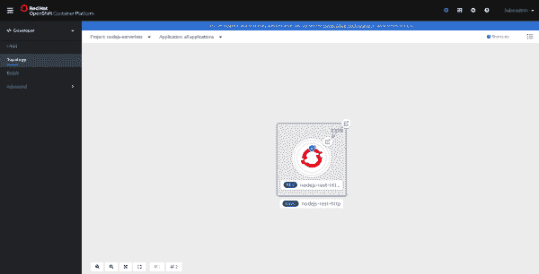
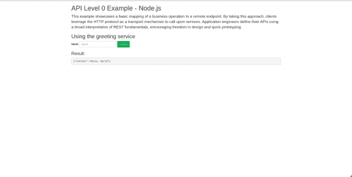

# 在 Red Hat OpenShift 上部署无服务器 Node.js 应用程序，第 1 部分

> 原文：<https://developers.redhat.com/blog/2020/09/15/deploying-serverless-node-js-applications-on-red-hat-openshift-part-1>

[Red Hat open shift server less](https://developers.redhat.com/topics/serverless-architecture)最近正式上市，随之而来的是应用程序部署的新选择。本文介绍了其中一种新的选择， [Knative 发球](https://developers.redhat.com/topics/serverless-architecture)。我将概述 OpenShift 无服务器和主动服务，然后向您展示如何部署一个 [Node.js 应用程序](https://developers.redhat.com/blog/category/node-js/)作为主动服务服务。

## 什么是 OpenShift 无服务器？

根据 [OpenShift 无服务器 GA 发布](https://www.openshift.com/blog/openshift-serverless-now-ga):

> OpenShift Serverless 使开发人员能够使用他们需要的任何工具和语言，在任何时候构建他们想要的东西。开发人员可以使用无服务器计算快速启动和部署他们的应用程序，并且他们不必为此构建和维护更大的容器映像。

OpenShift 无服务器是基于 [Knative](https://knative.dev) 开源 [Kubernetes](https://developers.redhat.com/topics/kubernetes) 无服务器项目。虽然它有几个不同的部分，但我们将重点放在部署一个无服务器 Node.js 应用程序作为一个服务。

## 美味的服务

那么，什么是主动发球呢？官方的 OpenShift 文档中有一个关于它的章节，但是我们最感兴趣的是扩展到零的能力。

运行在 OpenShift 和 Kubernetes 上的应用程序运行在一个[容器](https://developers.redhat.com/topics/containers/)或*容器*中。如果我们希望用户能够访问我们的应用程序，OpenShift pod 需要 *up* 。部署为 Knative Serving 服务的容器化应用程序可以*关闭*，直到有请求进入——这就是我们所说的“扩展到零”当请求进来时，应用程序启动并开始接收请求。Knative 策划了这一切。

## 开始使用 Knative 服务

如果您想按照示例进行操作，您需要在您的 OpenShift 集群上安装 OpenShift Serverless。OpenShift 无服务器文档有关于[设置 OpenShift 无服务器](https://docs.openshift.com/container-platform/4.5/serverless/installing_serverless/installing-openshift-serverless.html)和[设置 Knative Serving](https://docs.openshift.com/container-platform/4.5/serverless/installing_serverless/installing-knative-serving.html) 的说明。

对于本地开发，我使用[Red Hat code ready Containers](https://developers.redhat.com/products/codeready-containers/overview)(CRC)在本地运行 OpenShift。请注意，安装了 OpenShift Serverless 的 CRC 可能会占用一些内存。

### 部署 Node.js 应用程序

[OpenShift 文档](https://docs.openshift.com/container-platform/4.3/applications/application_life_cycle_management/odc-creating-applications-using-developer-perspective.html)中的例子展示了如何使用 GitHub 上托管的 Git 存储库，将应用程序部署为 Knative 服务。这很好，但是如果我在笔记本电脑上进行开发和编码，我不想仅仅为了看到我的应用程序运行而将我的更改推送到 GitHub。

另一种选择是使用已经构建的映像来创建一个 Knative 服务。该服务的 YAML 可能如下所示:

```
apiVersion: serving.knative.dev/v1
kind: Service
metadata:
  name: hello
  namespace: default
spec:
  template:
    spec:
      containers:
        - image: docker.io/openshift/hello-openshift
          env:
            - name: RESPONSE
              value: "Hello Serverless!"

```

但是，这个例子显示了一个托管在 Docker Hub 上的图像，这带来了与从 GitHub 部署相同的困境。

对于本地开发，我更喜欢使用 Nodeshift 模块。我已经在别处[介绍过 Nodeshift](https://developers.redhat.com/blog/2019/08/30/easily-deploy-node-js-applications-to-red-hat-openshift-using-nodeshift/) 了，这里就不多写了。

### Node.js 示例应用程序

对于这个例子，我将使用一个我以前用过的应用程序，一个用 [Express.js](https://expressjs.com) 构建的基本 [REST 应用程序](https://github.com/nodeshift-starters/nodejs-rest-http)。作为补充，Express.js 应用程序有一个输入表单，它接受一个名称并将其发送给 REST 端点，后者生成一个问候。当您传入一个名字时，它会被附加到问候语并被发回。要查看本地运行的应用程序，请输入以下命令:

```
$ npm install && npm start

```

要将 Node.js 应用程序部署为一个 Knative 服务，我们只需用实验性的`--knative`标志调用 Nodeshift。该命令类似于以下内容:

```
$ npx nodeshift --knative

```

这个命令将我们的源代码归档并发送到 OpenShift，在这里，一个源到映像(S2I)构建产生一个`ImageStream`。这都是标准的节点转移。构建完成后，Nodeshift 创建一个 Knative 服务，它使用我们刚刚构建的`ImageStream`作为它的输入。这个过程类似于从 Docker Hub 中提取一个图像，但是在这个例子中，图像存储在 OpenShift 的内部注册表中。

### 运行应用程序

我们可以使用`oc`命令来查看我们的应用程序正在运行，但是使用更直观的方式更容易理解发生了什么。让我们使用 OpenShift web 控制台的新拓扑视图，如图 1 所示。

[](/sites/default/files/blog/2020/06/crc-nodejs-serverless.png)

Figure 1\. View the running application in OpenShift's Topology view.

该应用程序被部署为一个 Knative 服务。最有可能的情况是，蓝色圆圈(表示 pod 正在成功运行)没有填满。我们的应用程序目前被缩放到零，并在启动前等待请求。

单击应用程序右上角的链接图标可以打开它。这是我们第一次访问该应用程序，因此需要几秒钟来加载。我们的应用程序现在正在启动。这是一个基本的 Express.js 应用程序，所以启动很快，如图 2 所示。

[](/sites/default/files/blog/2020/06/nodejs-serverless-applicaiton.png)

Figure 2\. The Express.js application running successfully in a browser.

拓扑视图中的应用程序现在有了熟悉的蓝色圆圈，如图 3 所示。

[](/sites/default/files/blog/2020/06/crc-nodejs-serverless-scaled.png)

Figure 3\. The blue circle indicates that the Knative Serving service application has started.

默认情况下，300 秒(5 分钟)后，正在运行的 pod 终止，并缩放回零。下次访问该应用程序时，启动循环将再次发生。

## 结论

在本文中，我已经向您展示了 OpenShift Serverless 的一小部分功能。在以后的文章中，我们将研究更多的特性以及它们与 Node.js 的关系。本文重点关注将 Node.js 应用程序部署为 Knative 服务，但是您可能已经注意到 Knative 和 OpenShift Serverless 并不关心您使用什么类型的应用程序。在以后的文章中，我将讨论在创建作为无服务器应用程序部署的 Node.js 应用程序时应该考虑的事情。

*Last updated: September 14, 2020*