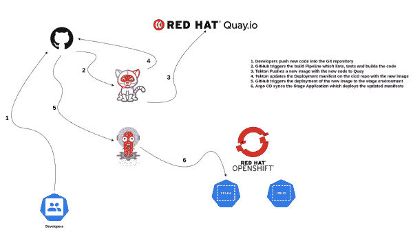
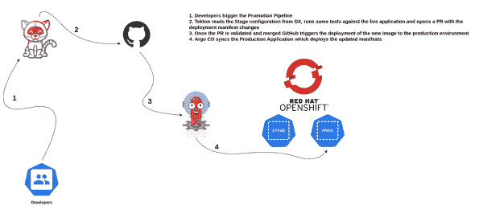
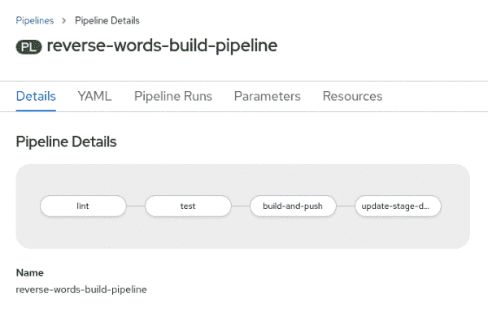
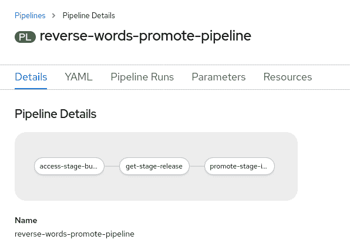

# 使用 OpenShift 管道和 Argo CD 从代码到产品

> 原文：<https://developers.redhat.com/blog/2020/09/10/from-code-to-production-with-openshift-pipelines-and-argo-cd>

我们团队负责一个小的 [GoLang](https://developers.redhat.com/blog/category/go/) 应用。应用程序的开发人员不断地向主分支发送代码变更，因此在过去的两年里，我们的团队使用 [GitOps](/learn/openshift/develop-gitops "Develop with GitOps") 进行[持续集成](https://developers.redhat.com/topics/ci-cd) (CI)。我们开始使用 GitOps 将应用程序部署到我们的测试集群；然后，我们开始使用它在我们的集群中运行第二天的操作。

从那里，我们选择了 [Argo CD](https://argoproj.github.io/argo-cd/) 作为我们的持续部署(CD)工具。当我们开始时，它最适合我们的工作流程。它作为一个 GitOps 工具完美地工作，并且很容易与[红帽 OpenShift](https://developers.redhat.com/products/openshift) 集成。

当 [OpenShift Pipelines](https://developers.redhat.com/blog/2020/04/27/modern-web-applications-on-openshift-part-4-openshift-pipelines/) 发布时，我们决定尝试一下，因为我们的应用程序将受益于自动化的 CI 管道。我们开始创建管道，以便每当新的提交到达主分支时，自动构建我们的应用程序。一旦我们对这些工具有了足够的经验，我们就考虑自动化我们的 CI 和 CD 工作流，这样我们就不需要担心任何事情，只需要编写代码。

本文包括我们的 [CI/CD](https://developers.redhat.com/topics/ci-cd/) 管道的演示，并向您展示如何建立一个演示环境，以便您可以自己运行下面详述的示例应用程序。我还将向您展示构建和生产管道的两个视频。

## 设置您的演示环境

为了遵循本文中的示例，需要在您的开发环境中安装以下软件:

*   [红帽 OpenShift 4.5.4](https://developers.redhat.com/products/openshift/getting-started) 集群:
    *   [阿尔戈 CD 版本 1.6.1](https://github.com/argoproj/argo-cd/releases)
    *   [红帽 OpenShift 管道版本 1.0.1](https://docs.openshift.com/container-platform/4.5/pipelines/understanding-openshift-pipelines.html)
*   演示应用程序:
    *   [应用程序存储库](https://github.com/mvazquezc/reverse-words)
    *   [App CI/CD 库](https://github.com/mvazquezc/reverse-words-cicd)

## Argo CD 和 OpenShift 管道

首先，这里简单介绍一下 Argo CD 和 OpenShift 管道。Argo CD 是一个以声明方式在 Kubernetes 上进行 GitOps 连续交付的工具。你可以[在这里](https://www.openshift.com/blog/introduction-to-gitops-with-openshift)了解更多关于 GitOps 的信息。

OpenShift Pipelines 是基于 [Tekton](https://tekton.dev/) 的 CI/CD 解决方案。它增加了 Tekton 的构建模块，并通过与 OpenShift 的紧密集成提供了 CI/CD 体验。你可以[在这里](https://www.openshift.com/learn/topics/pipelines)了解更多泰克顿。

## 应用场景

我们希望主分支的每个新提交都在我们的阶段环境中进行测试、构建和部署，而无需人工干预。因此，这个示例应用程序以一个负责林挺、测试和构建代码的持续集成管道为特色。Argo CD 管理连续部署，并被配置为将应用程序部署到登台和生产环境。

我们使用 Git 中的 [webhooks，在新的提交到达我们存储库中的特定分支时，自动触发管道和部署。](https://docs.github.com/en/developers/webhooks-and-events/creating-webhooks)

### CI 管道

我们有两个不同的管道:一个构建代码并部署到产品化，另一个将构建提升到产品化。在讨论管道之前，让我们回顾一下我们将使用的两个 Git 存储库:

1.  应用程序库(`reverse-words`):
    *   用途:存储我们的应用程序的源代码。
    *   Webhooks:当新的提交到达主分支时通知 Tekton。
2.  应用 CI/CD 存储库(`reverse-words-cicd`):
    *   使用:存储 CI 清单(Tekton 配置)和部署清单(由 Argo CD 使用)。
    *   Webhooks:当部署文件更新时通知 Argo CD。

### 构建管道

图 1 展示了构建管道的工作流程。

[](/sites/default/files/blog/2020/08/BuildWorkflow.png)

Figure 1: The build pipeline workflow from the developer to staging.

工作流程如下:

1.  开发人员向应用程序存储库发送新的提交。
2.  GitHub 通知 Tekton。
3.  Tekton 链接、测试、构建并推送一个带有新代码的新容器映像到 [Quay.io](https://quay.io/) 。
4.  Tekton 使用新的映像版本更新应用程序 CI/CD 存储库中 stage 环境的部署文件。
5.  GitHub 通知 Argo CD。
6.  Argo CD 运行用于暂存的应用程序部署。

### 晋升渠道

图 2 显示了促销渠道的工作流程。

[](/sites/default/files/blog/2020/08/PromoteWorkflow.png)

Figure 2: The promotion pipeline workflow from developer to production.

工作流程如下:

1.  开发者运行推广管道。
2.  Tekton 在登台环境上运行测试；如果一切正常，它将向应用程序 CI/CD 存储库打开一个推送请求(PR ),为生产环境更新部署文件。
3.  一旦 PR 合并，GitHub 通知 Argo CD。
4.  Argo CD 为生产运行应用程序部署。

## 准备部署了吗？

让我们看看我们在 OpenShift 集群中配置的两条管道。图 3 显示了构建管道。

[](/sites/default/files/blog/2020/08/build-pipeline.png)

Figure 3: The reverse-words build pipeline.

图 4 显示了促销渠道。

[](/sites/default/files/blog/2020/08/promote-pipeline.png)

图 4:反向词提升管道。">

我们已经创建了 Argo CD 应用程序，接下来让我们来看看这些应用程序。首先是 staging 应用程序，如图 5 所示。

[](/sites/default/files/blog/2020/08/stage-argo-app.png)

Figure 5: The state of each component in the reverse-words staging application.

接下来是生产应用程序，如图 6 所示。

[](/sites/default/files/blog/2020/08/prod-argo-app.png)

Figure 6: The state of each component in the reverse-words production application.

此时，我们已经做好了创建新应用程序的一切准备，然后自动构建和部署它。让我们检查一下目前运行的应用程序版本。图 7 显示了输入以下命令后的 stage 应用程序版本:

```
$ oc -n reverse-words-stage get route -l app-reversewords-stage
$ curl http://reversewords-dev.apps.codetoprod.b999.sandbox313.opentlc.com
```

[](/sites/default/files/blog/2020/08/app-stage.png)

Figure 7: Check the stage application version in the console.

图 8 显示了输入以下命令后的生产应用程序版本:

```
$ oc -n reverse-words-production get route -l app-reversewords-prod
$ curl http://reversewords-prod.apps.codetoprod.b999.sandbox313.opentlc.com
```

[](/sites/default/files/blog/2020/08/app-prod.png)

Figure 8: Check the production application version in the console.

在试运行阶段，我们运行的是演示应用的版本 0.0.14，在生产阶段，我们运行的是应用版本 0.0.13。接下来，我们将创建一个新的版本 0.0.15，并将其自动部署到 staging。如果一切正常，我们将会把这个新版本推广到生产中。

## 查看运行中的演示应用程序

在下面的第一个视频中，我们将应用程序更新到版本 0.0.15，并将更改推送到 Git 应用程序存储库。当提交命中主分支时，会创建一个新的管道运行。管道链接、测试并构建我们的代码。最后，它为应用程序 CI/CD 存储库中的临时环境更新应用程序部署文件。部署文件更新后，临时应用程序会自动更新。

所有这些都显示在“构建管道”视频中。

[https://www.youtube.com/embed/ipLm3Anca98?autoplay=0&start=0&rel=0](https://www.youtube.com/embed/ipLm3Anca98?autoplay=0&start=0&rel=0)

在“推广渠道”视频中，我们将阶段发布推广到生产。首先，管道查询 stage 应用程序以确保一切正常运行。然后，它使用 PipelineRun 更新应用程序 CI/CD 存储库中生产环境的应用程序部署文件。一旦合并了 PipelineRun，从而更新了部署文件，生产应用程序就会自动更新。

[https://www.youtube.com/embed/lardCvBrrn8?autoplay=0&start=0&rel=0](https://www.youtube.com/embed/lardCvBrrn8?autoplay=0&start=0&rel=0)

## 下一步是什么？

今天就可以开始使用 [Tekton](https://docs.openshift.com/container-platform/4.5/pipelines/understanding-openshift-pipelines.html) 和 [Argo CD](https://argoproj.github.io/argo-cd/) 了。如果你不知道从哪里开始，我们有几个 Katacoda 场景供你尝试:

*   [打开移位管道](https://learn.openshift.com/middleware/pipelines/)
*   [GitOps 简介](https://learn.openshift.com/introduction/gitops-introduction/)
*   [多集群 GitOps](https://learn.openshift.com/introduction/gitops-multicluster/)

如果您想在自己的环境中运行本文中的演示，您可以在演示库中找到所需的一切。如果你已经有使用 Tekton 的经验，我们鼓励你去看看 [Tekton 中心](https://hub-preview.tekton.dev/)。您可以使用 hub 贡献您的任务和管道，以便社区可以从中受益。

*Last updated: August 3, 2022*