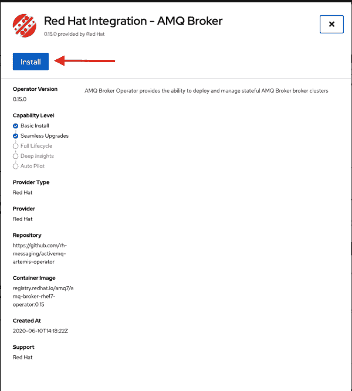
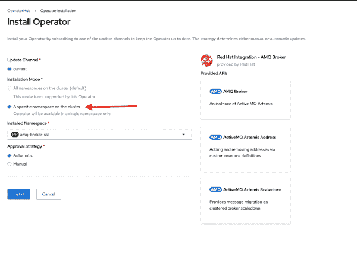
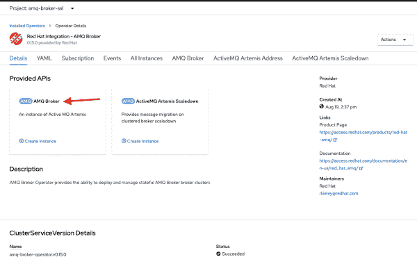
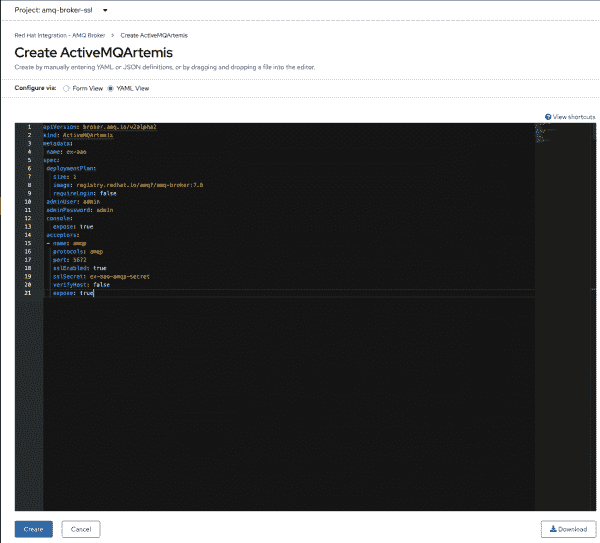
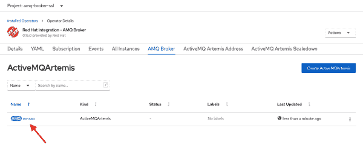
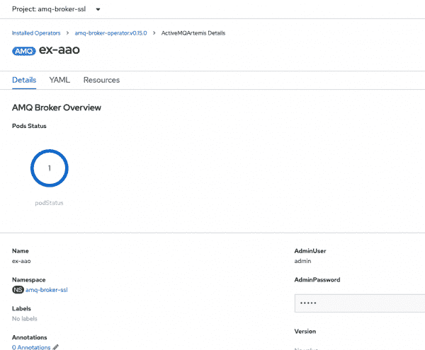
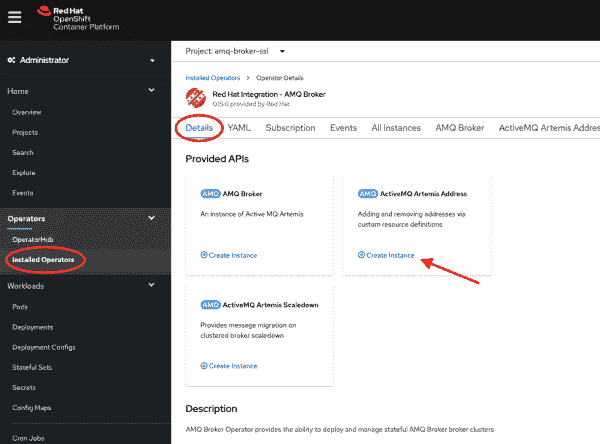
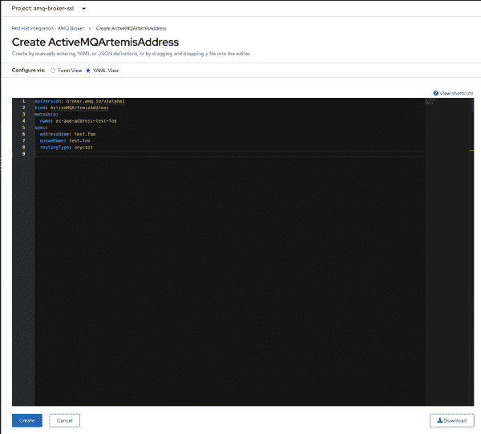
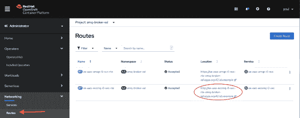
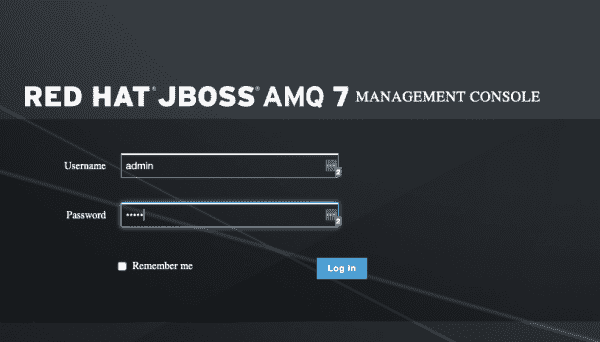

# 将外部客户连接到 Red Hat OpenShift 上的 Red Hat AMQ 经纪人

> 原文：<https://developers.redhat.com/blog/2020/08/26/connecting-external-clients-to-red-hat-amq-broker-on-red-hat-openshift>

在[红帽 OpenShift](https://developers.redhat.com/products/openshift) 上部署[红帽 AMQ](https://developers.redhat.com/products/amq/overview) 的开发者经常想知道如何使用传输层安全(TLS)协议将外部客户端连接到 AMQ 代理，该协议是安全套接字层(SSL)协议的改进版本。

在本文中，您将学习如何做到这一点。步骤如下:

1.  生成 TLS 凭据。
2.  安装 AMQ 代理操作员。
3.  部署 AMQ 代理实例。
4.  定义使用 TLS 的高级消息队列协议(AMQP)接受者。
5.  创建一个任播地址。
6.  连接外部 AMQP 客户端并发送和接收消息。

## 先决条件

要了解本文中的示例，您需要:

*   [红帽 OpenShift 集装箱平台(OCP)](https://developers.redhat.com/products/openshift/overview) 4.3 或更高。
*   OCP 安装的集群管理访问权限。
*   熟悉 [`oc`、OpenShift 命令行界面(CLI](https://docs.openshift.com/container-platform/4.5/cli_reference/openshift_cli/getting-started-cli.html) )。

让我们开始吧。

## 第 1 部分:为 TLS 连接生成凭证

在本节中，我们将配置一个单向 TLS 连接，并创建和存储我们的 TLS 凭据。

### 单向 TLS

单向 TLS 是验证您正在访问的服务器的真实性并形成到它的安全通道的最常见的方法。在这种认证机制中，被验证的内容是服务器本身的真实性。客户端永远不会被验证。

### 存储 TLS 凭据

将 AMQ 代理部署到 OpenShift 时，任何通过 TLS 保护的已定义连接器都必须存储 TLS 凭据。您可以使用以下任何一种保密机制来存储凭据:

*   一个`broker.ks`，它必须是 Base64 编码的密钥库。
*   一个`client.ts`，它必须是 Base64 编码的信任库。
*   一个`keyStorePassword`，必须在原始文本中指定。
*   一个`trustStorePasswordspecified`，必须在原始文本中指定。

对于 TLS 连接，AMQ 需要一个代理密钥库、一个客户端密钥库和一个包含代理密钥库的客户端信任库。在下一节中，我们将创建代理密钥库，导出代理证书，创建客户端信任库，将代理证书导入客户端信任库，然后创建代理信任库。

### 步骤 1:创建代理密钥库

注意，我使用了 [Java Keytool](https://docs.oracle.com/javase/7/docs/technotes/tools/windows/keytool.html) 来为这个例子生成必要的证书和存储。首先，为代理密钥库生成一个自签名证书。当询问密码时，使用`password`:

```
$ keytool -genkey -alias broker -keyalg RSA -keystore broker.ks
```

接下来，导出证书，以便可以与客户端共享:

```
$ keytool -export -alias broker -keystore broker.ks -file broker_cert
```

创建导入代理证书的客户端信任库:

```
$ keytool -import -alias broker -keystore client.ts -file broker_cert
```

为代理信任存储生成自签名证书:

```
$ keytool -genkey -alias broker -keyalg RSA -keystore broker.ts
```

**注意**:当你导入`broker_cert`时，确保你指定`yes`到对话框:`Trust this certificate? [no]:  yes`。默认设置为`no`。

### 步骤 2:创建秘密名称

在这个例子中，我们在生成证书和存储之后创建秘密*。默认情况下，机密名称具有以下格式:*

```
<CustomResourceName>-<AcceptorName>-secret
```

按照这种格式，我将这个秘密命名为`ex-aao-amqp-secret`。您可以使用您喜欢的任何命名格式。我们将在 ActiveMQ Artemis 的定制资源中提供这个秘密名称，稍后我们将使用它来部署代理。

## 第 2 部分:配置 OpenShift

接下来，我们作为系统管理员登录到我们的 OpenShift 集群，创建一个名为`amq-broker-ssl`的项目，并为该项目创建一个秘密(在我的例子中是`ex-aao-amqp-secret`)。注意，我在这个例子中使用的是 OpenShift 4.4。

### 步骤 1:创建项目和秘密

通过输入以下命令登录 OpenShift:

```
$ oc login <CLUSTER_API_URL>
```

创建新项目:

```
$ oc new-project amq-broker-ssl
```

创造秘密:

```
$ oc create secret generic ex-aao-amqp-secret \
--from-file=broker.ks \
--from-literal=keyStorePassword=password \
--from-file=client.ts=broker.ts \
--from-literal=trustStorePassword=password

```

**注意**:在片段`--from-file=client.ts=broker.ts`中，我们提供了`broker.ts`，这是正确的。然而，我们在《秘密》中将它别名为`client.ts`。别名是代理映像在秘密中寻找的值。

### 步骤 2:在 OpenShift 中打开项目

接下来，登录 OpenShift 控制台，点击**项目**。如图 1 所示，您将看到我们刚刚创建的项目。

[](/sites/default/files/blog/2020/08/Fig1-1.png)

Figure 1: Find and click your new project in the OpenShift console's Projects screen.

图 2 显示了项目细节。

[](/sites/default/files/blog/2020/08/Fig2.png)Figure 2: Click the project's secrets to view them.">

在图 2 所示的**库存**面板中点击**秘密**。找到`ex-aao-amqp-secret`，它出现在图 3 所示的秘密列表中。

[](/sites/default/files/blog/2020/08/Fig3.png)Figure 3: Click the secret to view details.">

如果您深入到`ex-aao-amqp-secret`，如图 4 所示，您将看到`broker.ks`、`client.ts`以及它们各自的密码，这些密码是我们在创建秘密时提供的。

[](/sites/default/files/blog/2020/08/Fig4.png)Figure 4: View secret details to verify broker.ks, client.ts, keyStorePassword and trustStorePasswords were added.">

我们已经创建了 TLS 凭据，并将它们存储在一个名称空间 secret 中。接下来，让我们安装 AMQ 代理。

## 第 3 部分:安装 AMQ

在本节中，我们将 OperatorHub 中的 AMQ 代理操作器安装到 OpenShift 集群中。要安装操作员，您必须拥有 OpenShift 集群的集群管理权限。

在我们安装 AMQ 经纪人，让我们先看看它是什么。下面是一个简要的概述，如果你想了解更多关于 AMQ 经纪人和其他 AMQ 产品，请前往[红帽 AMQ 7](https://access.redhat.com/documentation/en-us/red_hat_amq/7.7/html/introducing_red_hat_amq_7/index)

AMQ 代理是一个基于 ActiveMQ Artemis 的高性能消息传递实现。它使用异步日志来实现快速消息持久化，并支持多种语言、协议和平台。

Red Hat AMQ 代理 7.7(截至本文发布时的最新版本)以容器化映像的形式提供，用于 OpenShift 容器平台(OCP) 3.11 和更高版本。

OCP 的 AMQ 代理提供了与红帽 AMQ 代理相似的功能，但是某些方面的功能需要专门配置，以便与 OpenShift 容器平台一起使用。

### 安装 AMQ 代理操作员

以集群管理员身份登录 web 控制台。在左侧导航栏上，展开 **Operators** 并点击 **OperatorHub** 。在搜索字段中，键入 **AMQ** ，并选择**红帽集成-AMQ 经纪人**标题，如图 5 所示。

[](/sites/default/files/blog/2020/08/Fig5.png)Figure 5: Find and click the Operator in the OpenShift OperatorHub.">

在安装界面上，点击**安装**按钮，如图 6 所示。

[](/sites/default/files/blog/2020/08/Fig6-1.png)Figure 6: Click Install to install the Operator.">

确保在集群上选择一个特定的名称空间，并保留默认的**更新通道**和**批准策略**。选择**已安装名称空间*** 下的`amq-broker-ssl`，如图 7 所示。

[](/sites/default/files/blog/2020/08/Fig7.png)Figure 7: Select your specific namespace and then click install to add the AMQ Broker Operator.">

等待几分钟，让操作员安装。一旦成功安装，您应该看到状态变为 **Succeeded** ，如图 8 所示。

[](/sites/default/files/blog/2020/08/Fig8.png)

Figure 8: Verify that AMQ Broker Operator is successfully installed.

## 第 4 部分:部署 AMQ 代理

接下来，我们将部署一个代理，它带有一个定义好的由 TLS 保护的 [AMQP](https://www.amqp.org) 连接器。

### 步骤 1:创建 AMQ 代理实例

在 **Installed Operators** 页面上，点击**红帽集成- AMQ 经纪人**链接，可以看到如图 9 所示的运营商详情。

[](/sites/default/files/blog/2020/08/Fig9.png)Figure 9: The listing of installed Operators.

Figure 9: Click the Operator's name to view its details.

在 Operator details 中，您将看到每个 Operator APIs 的标题。点击 **AMQ 代理**块中的**创建实例**链接，如图 10 所示。

[](/sites/default/files/blog/2020/08/Fig10.png)Figure 10: Details for the AMQ Broker OperatorFigure 10: Find the Operator API you want to use and click Create Instance beneath it.">

### 步骤 2:创建 ActiveMQ Artemis 实例

现在，将下面的 **ActiveMQArtemis** 自定义资源复制并粘贴到**创建 ActiveMQArtemis** YAML 编辑器中。注意 YAML 文件中的 acceptors 节，在这里我们定义了 AMQP 接受者:

```
apiVersion: broker.amq.io/v2alpha2
kind: ActiveMQArtemis
metadata:
 name: ex-aao
spec:
 deploymentPlan:
   size: 1
   image: registry.redhat.io/amq7/amq-broker:7.6
   requireLogin: false
 adminUser: admin
 adminPassword: admin
 console:
   expose: true
 acceptors:
 - name: amqp
   protocols: amqp
   port: 5672
   sslEnabled: true
   sslSecret: ex-aao-amqp-secret
   verifyHost: false
   expose: true

```

另外，注意我设置了`sslEnabled: true`。当您为接受者设置`sslEnabled: true`时，您需要指定包含密钥`broker.ks`、`client.ts`、`keyStorePassword`和`trustStorePassword`的命名秘密。代理映像将在命名的 secret 中寻找这些。如果它们不存在，OpenShift 将无法调度代理 pod，直到它找到它们。

如图 11 所示，我将秘密的名称指定为`sslSecret: ex-aao-amqp-secret`。

[](/sites/default/files/blog/2020/08/Fig11-1.png)Figure 11: Create the ActiveMQ Artemis instanceFigure 11: Create the ActiveMQ Artemis instance.">

编辑完文件后，点击**创建**。您将看到我们刚刚创建的代理的一个实例。点击**前 aao** 链接，查看如图 12 所示的 **AMQ 经纪人概况**。

[](/sites/default/files/blog/2020/08/Fig12.png)Figure 12: Click the new broker instance in the ActiveMQArtemis Operator Details screen.">

如图 13 所示，pod 状态表示一个 pod 就绪。

[](/sites/default/files/blog/2020/08/Fig13.png)Figure 13: The AMQ Broker Overview shows that one pod is ready

Figure 13: View the status of your new pod in the AMQ Broker Overview screen.

### 步骤 3:创建 AMQ 代理地址

接下来，我们将定义我们的地址`test.foo`，我们的客户端应用程序将从该地址发送和接收消息。点击左侧导航面板中**操作员**下的**已安装操作员**，进入**红帽集成- AMQ 经纪人**。然后，点击 **AMQ 代理地址**块中的**创建实例**链接，如图 14 所示。

[](/sites/default/files/blog/2020/08/Fig14.png)Figure 14: Click the 'Create Instance' link in the AMQ Broker Address tileFigure 14: Click Create Instance to view the configuration before proceeding.">

将以下用于自定义资源 **ActiveMQArtemisAddress** 的 YAML 复制并粘贴到 YAML 编辑器中:

```
apiVersion: broker.amq.io/v2alpha1
kind: ActiveMQArtemisAddress
metadata:
  name: ex-aao-address-test-foo
spec:
  addressName: test.foo
  queueName: test.foo
  routingType: anycast

```

完成后点击 **Create** ，如图 15 所示。

[](/sites/default/files/blog/2020/08/Fig15.png)Figure 15: Create ActiveMQArtemisAddressFigure 15: Create your ActiveMQArtemisAddress instance.">

我们在正在运行的代理 pod 上创建了一个名为`test.foo`的地址，这将创建一个点对点消息队列。接下来，我们将测试发送和接收消息的能力。

## 第 5 部分:发送和接收消息

对于示例的这一部分，我使用现成的 ActiveMQ Artemis CLI 客户端来发送和接收消息。CLI 客户机捆绑在 [Apache ActiveMQ Artemis 发行版](https://activemq.apache.org/components/artemis/download/)中。一旦你下载了发行版并解压或解压到一个目录中，你会在`bin`目录中找到`artemis`可执行文件。从那里，您可以运行以下步骤中的命令。

### 步骤 1:生成消息

使用以下命令向`test.foo`发送 10 条消息(如果您的 URL 和信任库的位置与我示例中的不同，请更改 URL 和位置)。如果您还记得，在我们将协议定义为`amqp`的 **ActiveMQArtemis** 自定义资源中，我们设置了`expose: true`，这创建了一个服务和路由。我使用的 URL 来自于`ex-aao-amqp-0-svc-rte`路线中指定的位置，用`amqps`替换了`https`，并添加了端口 443:

```
$ ./bin/artemis producer --url 'amqps://ex-aao-amqp-0-svc-rte-amq-broker-ssl.apps.ocp42.lab.example:443?jms.username=admin&jms.password=admin&transport.trustStoreLocation=/opt/playground/amq76-ocp-deploy/client.ts&transport.trustStorePassword=password&transport.verifyHost=false'  --threads 1 --protocol amqp --message-count 10 --destination 'queue://test.foo'

Producer ActiveMQQueue[test.foo], thread=0 Produced: 10 messages
Producer ActiveMQQueue[test.foo], thread=0 Elapsed time in second : 0 s
Producer ActiveMQQueue[test.foo], thread=0 Elapsed time in milli second : 192 milli seconds

```

**注意**:你需要更改`client.ts`的网址和位置。如果您使用了不同的密码，也请更改该密码。

### 步骤 2:在 AMQ 代理控制台中查看消息

如果您还记得，当我们使用 **ActiveMQArtemis** 定制资源创建代理时，我们设置了以下属性来公开代理控制台:

```
console:
   expose: true

```

我们部署中的 broker pod 有一个提供控制台访问的服务。这个服务有一个对应的路由，`ex-aao-wconsj-0-svc-rte`。要获得访问代理控制台的 URL，请在左侧导航窗格**中点击**网络**下的**路线**。你会看到两条路线。如图 16 所示，单击对应于该路由的链接**

[](/sites/default/files/blog/2020/08/Fig16-1.png)Figure 16: List of routes.Figure 16: Click the Location for the route you want.">

单击该链接将打开一个页面，该页面呈现另一个到**管理控制台**的链接。单击链接，如图 17 所示。

[](/sites/default/files/blog/2020/06/Fig18.png)

Figure 17: Click Management Console to go to AMQ Broker Management Console.

进入管理控制台后，使用`admin`作为用户名和密码登录，如图 18 所示。

[](/sites/default/files/blog/2020/06/Fig19.png)

Figure 18: Log into the AMQ Broker Management Console with admin/admin.

从管理控制台中，点击左上角的 **Artemis** ，然后点击顶部导航栏中的 **Queues** 。注意我们之前使用 ActiveMQArtemisAddress 定制资源创建的`test.foo`地址和队列。如图 19 所示，消息计数应该是 10。

[](/sites/default/files/blog/2020/08/Fig19.png)Figure 19: The list of queues in the AMQ Broker Management Console

Figure 19: There are now 10 messages in the test_foo queue.

### 步骤 3:消费消息

使用以下命令消费这 10 条消息(根据需要更改信任库的 URL 和位置):

```
$ ./bin/artemis consumer --url 'amqps://ex-aao-amqp-0-svc-rte-amq-broker-ssl.apps.ocp42.lab.example:443?jms.username=admin&jms.password=admin&transport.trustStoreLocation=/opt/playground/amq76-ocp-deploy/client.ts&transport.trustStorePassword=password&transport.verifyHost=false'  --threads 1 --protocol amqp --message-count 10 --destination 'queue://test.foo'

Consumer:: filter = null
Consumer ActiveMQQueue[test.foo], thread=0 wait until 10 messages are consumed
Consumer ActiveMQQueue[test.foo], thread=0 Consumed: 10 messages
Consumer ActiveMQQueue[test.foo], thread=0 Elapsed time in second : 0 s
Consumer ActiveMQQueue[test.foo], thread=0 Elapsed time in milli second : 42 milli seconds
Consumer ActiveMQQueue[test.foo], thread=0 Consumed: 10 messages
Consumer ActiveMQQueue[test.foo], thread=0 Consumer thread finished

```

**注意**:你需要更改`client.ts`的网址和位置。如果您使用了不同的密码，也请更改该密码。回到代理管理控制台，确保您正在查看队列列表，并单击**重置**按钮。消息计数应该为零。

## 摘要

在本文中，我们介绍了如何:

*   使用 AMQ 代理配置单向 TLS
*   在 OpenShift 上安装 AMQ 代理操作员
*   创建一个代理实例和 TLS 安全 AMQL 接受者，并定义一个任播地址
*   使用 Apache Artemis CLI 作为客户机来建立到代理的安全连接，并生成和使用消息

仅此而已。希望这篇文章对你有所帮助。

*Last updated: August 21, 2020*