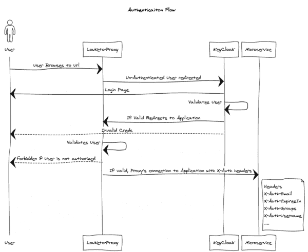
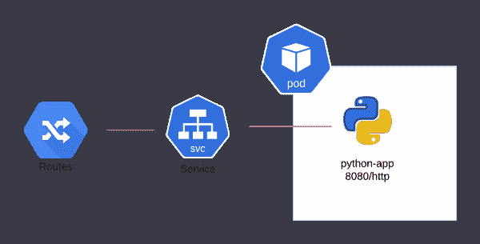
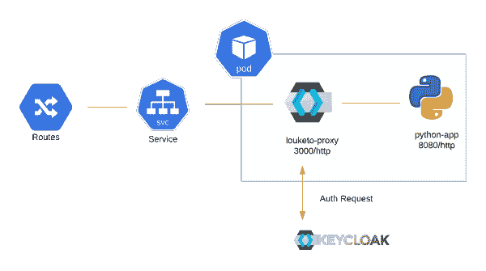
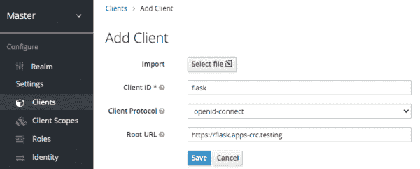
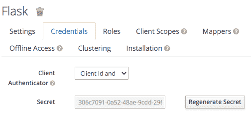
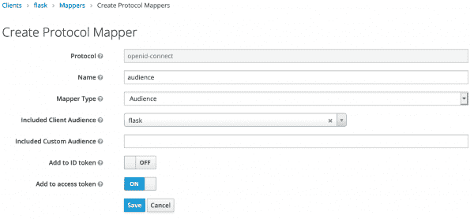
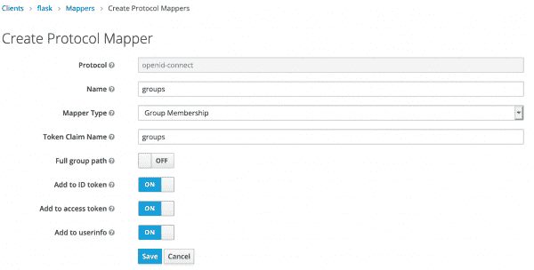
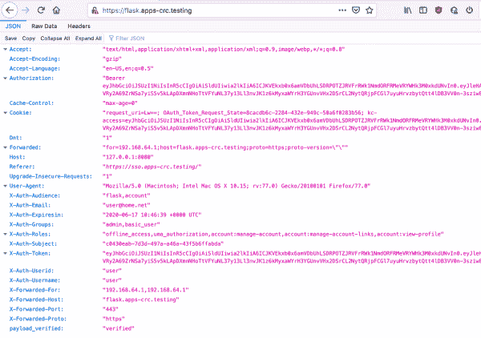

# 使用 Louketo 代理授权多语言微服务

> 原文：<https://developers.redhat.com/blog/2020/08/03/authorizing-multi-language-microservices-with-louketo-proxy>

**更新 2020 年 8 月 25 日**:娄克托代理团队已经宣布[日落娄克托项目](https://github.com/louketo/louketo-proxy/issues/683)。阅读链接了解更多信息，并关注我们网站上的一篇新文章，该文章详细介绍了如何使用不同的方法授权多语言微服务。

如果您需要为用不同语言编写的几个[微服务](https://developers.redhat.com/topics/microservices)提供认证，该怎么办？您可以使用[红帽单点登录](https://developers.redhat.com/blog/2019/02/07/red-hat-single-sign-on-give-it-a-try-for-no-cost) (SSO)来处理认证，但是您仍然需要将每个微服务与 [Keycloak](https://www.keycloak.org) 集成。如果一个服务可以处理认证流程，并将用户的详细信息直接传递给你的微服务，这不是很好吗？在本文中，我将介绍一种服务来实现这一点！

## 洛克托代理

Louketo Proxy (之前的 Keycloak-Gatekeeper)与 [OpenID Connect](https://openid.net/connect/) (OIDC)兼容的提供商如 Keycloak 集成。Louketo 代理将身份验证交给 Keycloak，然后将授权和用户详细信息作为头属性传递给微服务。图 1 中的图表展示了 Louketo 代理、Keycloak 和微服务之间的认证流程。

[](/sites/default/files/blog/2020/06/Auth-Sequence-1.png)

Figure 1: Louketo Proxy authenticates a microservice with Keycloak.

有了 Louketo Proxy，您就不必担心如何支持用于微服务的不同语言的认证流程。作为一个额外的好处，Louketo Proxy 使得向不支持 OIDC 的遗留的现成应用提供认证变得容易。

## OpenShift 中的 Louketo 代理

在开始之前，有必要探索一下同时运行 Louketo 代理和微服务所需的架构。在一个 [Red Hat OpenShift](https://developers.redhat.com/products/openshift/overview) 部署中，通常的模式是单个 pod 运行单个容器，如图 2 所示。

[](/sites/default/files/blog/2020/06/single-pod.png)

Figure 2: A typical OpenShift deployment where one pod runs one container.

为了让我们的 Louketo 代理模式工作，我们需要一个 pod 来运行两个容器。Louketo 代理和微服务将驻留在同一个 pod 中，并共享与该 pod 相关的资源，包括网络。为了防止冲突，Louketo 代理和微服务需要监听不同的网络端口。Louketo 代理实例还必须能够在不穿越任何网络链接的情况下与微服务进行通信。这种设置减少了延迟，使执行中间人(MITM)攻击变得困难，从而改进了安全模型。图 3 显示了带有微服务的 Louketo 代理的 OpenShift 部署模式。

[](/sites/default/files/blog/2020/06/sidecar.png)

Figure 3: The Louketo Proxy instance and microservice run in the same pod and share the pod's resources.

通常，我们会创建一个绑定到微服务的服务，并通过路由公开它。在这种情况下，我们只创建一个绑定到 Louketo 代理实例的服务，并通过路由公开它。消费者只能通过 Louketo 代理实例访问微服务。这种安排加强了安全模型。

## Louketo 代理入门

对于这个例子，我们部署了一个简单的 [Flask 应用程序](https://palletsprojects.com/p/flask/)，它公开了 Louketo 代理传递的认证头。如果您愿意，您可以在[Red Hat code ready Containers](https://developers.redhat.com/products/codeready-containers/overview)(CRC)上运行示例代码。否则，您将需要更新代码以在您的 OpenShift 集群上运行。

### 步骤 1:部署键盘锁

第一步是在 CodeReady 容器上部署 Keycloak。要快速跟踪该过程，请从终端运行以下命令。这将在 OpenShift 上创建一个项目，部署 Keycloak，并创建一条路线:

```
$ oc new-project sso-test
$ oc new-app --name sso --docker-image=quay.io/keycloak/keycloak -e KEYCLOAK_USER='admin' -e KEYCLOAK_PASSWORD='louketo-demo' -e PROXY_ADDRESS_FORWARDING='true’
$ oc create route edge --service=sso --hostname=sso.apps-crc.testing

```

### 创建并配置 Flask 客户端

浏览到**https://SSO . apps-CRC . testing**，使用用户名`admin`和密码`louketo-demo`登录。在那里，从左侧菜单中选择**客户端**，并使用图 4 所示的字段创建一个新的客户端。

[](/sites/default/files/blog/2020/06/add-client.png)

Figure 4: Add a new Flask client.

创建客户端后，您可以选择将客户端访问类型从公共切换到机密，如图 5 所示。

[](/sites/default/files/blog/2020/06/select-confidential.png)

Figure 5: Use the Settings dialog to switch client access to confidential.

CodeReady 容器将生成一个客户端秘密，您可以在图 6 所示的**凭证**选项卡下查看它。当我们配置 Louketo 代理时，您将需要这个秘密，所以请记下来。

[](/sites/default/files/blog/2020/06/secret.png)

Figure 6: Check under the Credentials tab to see the generated client secret.

#### 配置映射器

此时，我们仍在配置 Flask 客户端。选择**映射器**选项卡，添加两个映射器:

*   **组**:
    *   名称:组
    *   映射器类型:组成员资格
    *   令牌声明名称:组
*   **观众**:
    *   名称:观众
    *   映射器类型:受众
    *   包括的客户受众:flask

图 7 显示了观众映射器的配置。

[](/sites/default/files/blog/2020/06/protocol-mappers-audience.png)

Figure 7: Configure the Flask client's Audience mapper.

图 8 显示了组映射器的配置。

[](/sites/default/files/blog/2020/06/protocol-mappers-groups.png)

Figure 8: Configure the Flask client's group-membership mapper.

### 配置用户组

现在从左侧菜单中选择**组**并添加两个组:

*   `admin`
*   `basic_user`

### 配置用户

再次从左侧菜单中，选择**用户**并添加一个用户。确保为用户输入电子邮件并设置密码，然后将用户添加到您刚刚创建的`basic_user`和`admin`组。接下来，我们将配置 Louketo 代理和示例应用程序。

## 步骤 2:配置 Louketo 代理和应用程序

我们需要来自 Keycloak 服务器的以下详细信息(请注意，您将输入您在步骤 1 中保存的客户端密码):

*   客户 ID: flask
*   客户机密
*   探索网址:https://sso.apps-crc.testing/auth/realms/master
*   组:基本用户

### 创建配置映射

首先，我们将使用 ConfigMap 来配置 Louketo 代理。Louketo Proxy 支持显示定制页面(登录页面、禁止页面等)，这些页面可以与相关微服务的外观相匹配。对于我们的用例，我们将把所有未经验证的请求重定向到 Keycloak。确保用 Keycloak 生成的配置图替换下面配置图中的`client-secret`:

```
apiVersion: v1
kind: ConfigMap
metadata:
 name: gatekeeper-config
data:
 keycloak-gatekeeper.conf: |+
   # The URL for retrieving the OpenID configuration - normally the /auth/realms/
   discovery-url: https://sso.apps-crc.testing/auth/realms/master
   # skip tls verify
   skip-openid-provider-tls-verify: true
   # the client ID for the 'client' application
   client-id: flask
   # the secret associated with the 'client' application
   client-secret: < Paste Client Secret here >
   # the interface definition you wish the proxy to listen to, all interfaces are specified as ':', unix sockets as unix://|
   listen: :3000
   # whether to enable refresh-tokens
   enable-refresh-tokens: true
   # the location of a certificate you wish the proxy to use for TLS support
   tls-cert:
   # the location of a private key for TLS
   tls-private-key:
   # the redirection URL, essentially the site url, note: /oauth/callback is added at the end
   redirection-url: https://flask.apps-crc.testing
   secure-cookie: false
   # the encryption key used to encode the session state
   encryption-key: nkOfcT6jYCsXFuV5YRkt3OvY9dy1c0ck
   # the upstream endpoint which we should proxy request
   upstream-url: http://127.0.0.1:8080/
   resources:
   - uri: /*
     groups:
     - basic_user

```

接下来，我们将为 Flask 应用程序创建一个 ConfigMap。在创建配置映射之前，我们需要获得 Keycloak 的公钥。要获得公钥，请登录到 Keycloak 管理页面，然后进入**领域设置>密钥**。从那里，选择 **RS256 公钥**，如图 9 所示。

[](/sites/default/files/blog/2020/06/public-key.png)

Figure 9: Select the RSA-generated public key.

Flask 应用程序使用这个公钥来检查 Louketo 代理传递的 JSON Web 令牌(JWT)的有效性。以下是 Flask 应用程序的配置图:

```
kind: ConfigMap
apiVersion: v1
metadata:
 name: sso-public-key
data:
 PUBLIC_KEY: |
   -----BEGIN PUBLIC KEY-----
   < Paste in the Keycloak public key here >
   -----END PUBLIC KEY-----

```

### 绑定服务

现在我们需要将一个服务绑定到 Louketo 代理监听端口。我们在 Louketo 代理的 ConfigMap 中的`listen`参数下定义了监听端口。以下是服务绑定:

```
apiVersion: v1
kind: Service
metadata:
 name: flask
spec:
 ports:
 - port: 3000
   protocol: TCP
   targetPort: 3000
 selector:
   app: flask

```

### 配置路线

我们使用路由向消费者公开我们的服务。在这种情况下，我们在路由器上公开 Louketo 代理服务和终端 TLS:

```
kind: Route
apiVersion: route.openshift.io/v1
metadata:
 name: flask
spec:
 host: flask.apps-crc.testing
 to:
   kind: Service
   name: flask
   weight: 100
 port:
   targetPort: 3000
 tls:
   termination: edge
   insecureEdgeTerminationPolicy: Redirect
 wildcardPolicy: None

```

### 应用部署配置

现在我们已经创建了配置映射、服务和路由，我们可以应用 OpenShift DeploymentConfig 了。如果您仔细查看下面的配置，您会看到我们在同一个 DeploymentConfig 中部署了两个容器。正如我在本文开头所说的，我们的架构要求在同一个 pod 中部署两个容器:

```
kind: DeploymentConfig
apiVersion: apps.openshift.io/v1
metadata:
 name: flask
 labels:
   app: flask
spec:
 strategy:
   type: Rolling
 replicas: 1
 selector:
   app: flask
 template:
   metadata:
     labels:
       app: flask
   spec:
     containers:
       - name: flask
         image: quay.io/rarm_sa/flask-sso-gatekeeper
         ports:
           - containerPort: 8080
             protocol: TCP
         envFrom:
           - configMapRef:
               name: sso-public-key
         imagePullPolicy: IfNotPresent
       - name: gatekeeper
         image: 'quay.io/louketo/louketo-proxy'
         args:
           - --config=/etc/keycloak-gatekeeper.conf
         ports:
           - containerPort: 3000
             name: gatekeeper
         volumeMounts:
           - name: gatekeeper-config
             mountPath: /etc/keycloak-gatekeeper.conf
             subPath: keycloak-gatekeeper.conf
     volumes:
       - name : gatekeeper-config
         configMap:
           name: gatekeeper-config

```

## 测试配置

要测试您的配置，请浏览到位于**https://flask . apps-CRC . testing**的示例应用程序。您将被重定向到 Keycloak，并看到一个如图 10 所示的登录屏幕。输入应用程序用户的用户名和密码。

[](/sites/default/files/blog/2020/06/login.png)

Figure 10: The Keycloak login screen.

一旦您对用户进行了身份验证，您将被重定向到返回 JSON 文件的应用程序页面。该文件公开了 Louketo 代理传递的头，如图 11 所示。

[](/sites/default/files/blog/2020/06/flask.png)

Figure 11: The Flask application returns a JSON file that exposes the Louketo Proxy headers.

## 结论

本文向您介绍了 Louketo Proxy，这是一种为您的应用程序提供身份验证的简单方法，无需在您的微服务中编写自己的 OpenID Connect 客户端。一如既往，我欢迎你在评论中提出问题和反馈。

*Last updated: August 25, 2020*