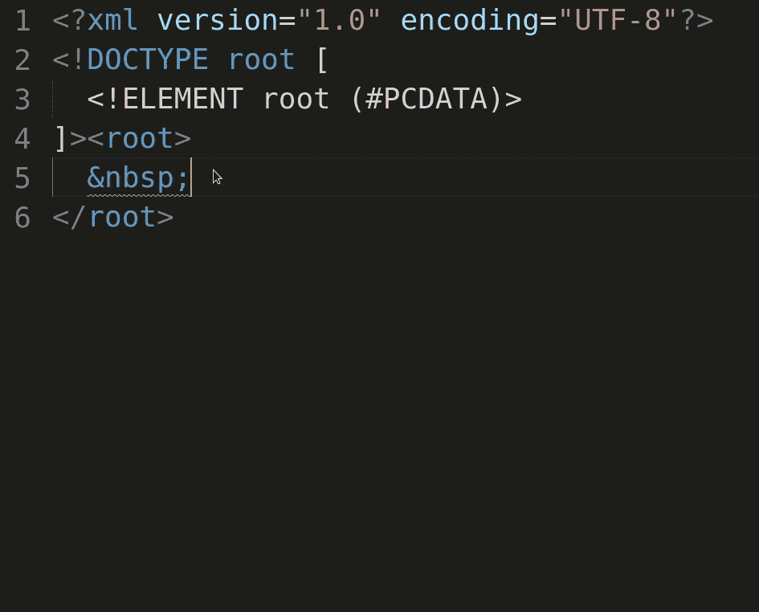
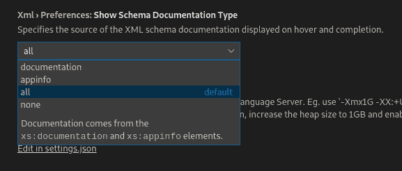
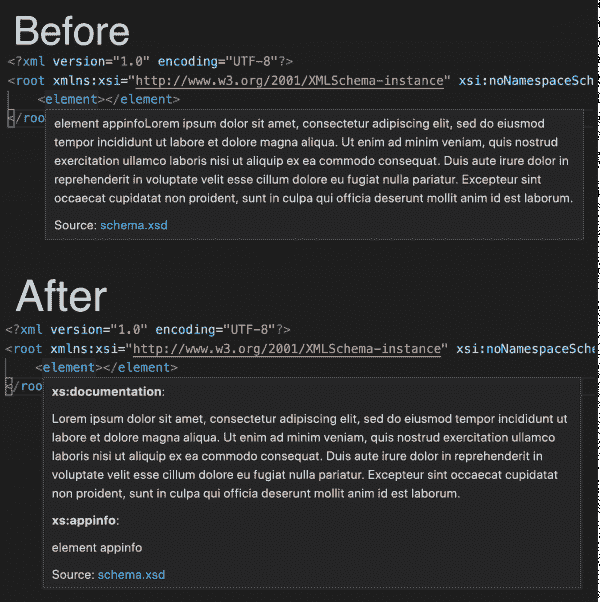
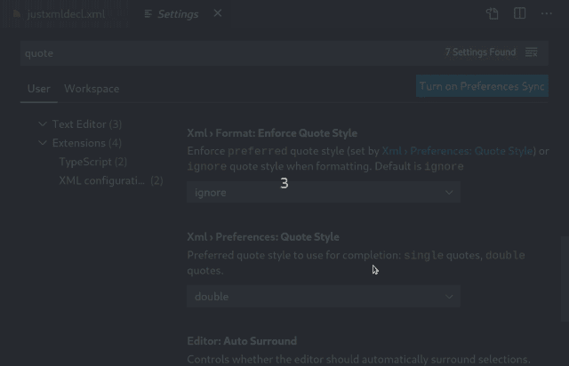
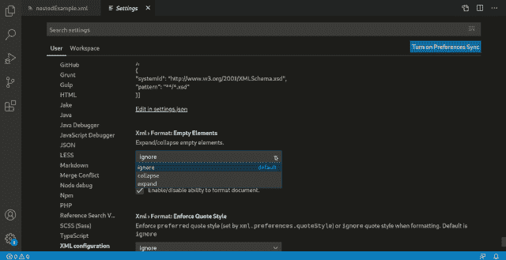
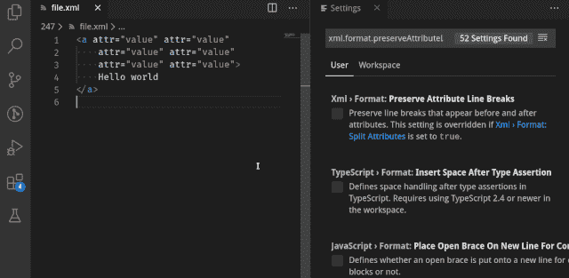
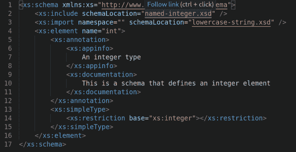
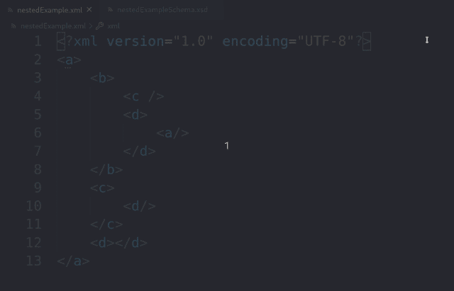
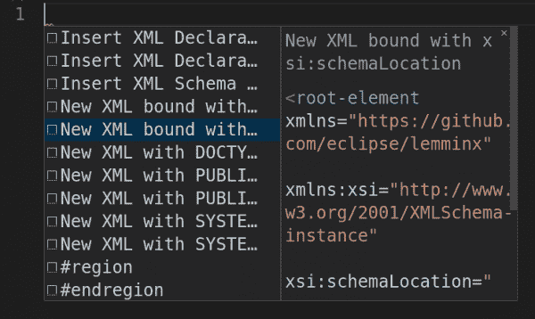
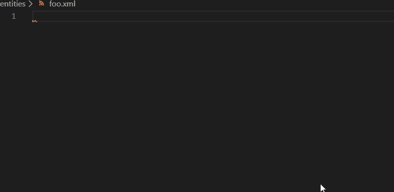

# 针对 VS 代码 0.12.0 和 LemMinX 的 Red Hat XML extension 中改进了模式绑定和更多功能

> 原文：<https://developers.redhat.com/blog/2020/07/02/improved-schema-binding-and-more-in-red-hat-xml-extension-for-vs-code-0-12-0-and-lemminx>

Visual Studio 代码 (VS 代码)的 [Red Hat XML 扩展的最新更新版本 0.12.0，打包了错误修复和新功能。它包括新版本的底层](https://developers.redhat.com/products/vscode-extensions/overview) [Eclipse LemMinX XML 语言服务器](https://developers.redhat.com/blog/2020/03/27/red-hat-xml-language-server-becomes-lemminx-bringing-new-release-and-updated-vs-code-xml-extension/)。在这次更新中，我们简化了编写 XML 模式定义(XSD)和文档类型定义(DTD)的过程。我们还添加了将 XML 文档绑定到这两种 XML 语法的快捷方式。

本文展示了 VS 代码的 XML 扩展 0.12.0 更新的亮点，包括减少视觉混乱的新格式化选项、对`<?xml-model … ?>`的支持，以及帮助将文档绑定到 XML 模式的上下文感知片段。关于 50 多个增强和错误修复的完整列表，请参见 VS 代码变更日志的 [XML 扩展](https://github.com/redhat-developer/vscode-xml/blob/master/CHANGELOG.md)。您还可以在此观看新功能的视频演示:

[https://www.youtube.com/embed/3Gd-cGDRBcw?autoplay=0&start=0&rel=0](https://www.youtube.com/embed/3Gd-cGDRBcw?autoplay=0&start=0&rel=0)

**注意**:VS 代码的 XML 扩展版本 0.12.0 和底层的 LemMinX XML 语言服务器现在都可以在 [Visual Studio 代码市场](https://marketplace.visualstudio.com/items?itemName=redhat.vscode-xml)中获得。

## 实体验证和完成

Red Hat 针对 VS 代码的 XML 扩展现在支持实体验证和实体名称完成，并支持本地和外部声明的实体的悬停和定位定义。

将鼠标悬停在实体上，会显示它所代表的值以及指向定义该值的文件的链接。转到实体定义会将光标移动到文件中声明实体的那一行，无论该实体是在同一个文件中还是在外部文件中。如果一个实体被引用但还没有被声明，您可以使用新的快速修复在 doctype 声明中定义它。图 1 展示了所有这些选项。

Figure 1: The new entity validation and completion features with hover-over and go-to definitions.

## XSD 文档设置

在这个版本之前，将鼠标悬停在 XSD 元素上会在一行中显示该元素的所有可用的`xs:documentation`和`xs:appinfo`，以及一个到 XSD 模式文件的链接。在这个版本中，我们引入了一个新的设置来帮助消除一些视觉混乱，如图 2 所示。

Here are the options available for displaying XSD element documentation

Figure 2: New options for displaying the XSD element documentation.

现在，您可以使用`xml.preferences.showSchemaDocumentationType`设置来指定当您将鼠标悬停在某个元素上时您希望看到的内容:`xs:documentation`、`xs:appinfo`，这两个元素，或者什么都不显示。此外，如图 3 所示，当`xs:documentation`和`xs:appinfo`元素同时出现时，字幕会将它们分开，使得定义更容易阅读。

Hovering over which has xs:documentation and xs:appinfo in its XSD schema declaration while xml.preferences.showSchemaDocumentationType is set to all

Figure 3: The hover feature now uses subtitles to separate app info and documentation.

## 格式化(`xml.format)`

我们为 XML 扩展的格式化特性引入了几个新的设置。

### 强制报价样式:忽略或首选

`xml.format.enforceQuoteStyle`设置表示格式化程序应该用首选报价类型(在`xml.preferences.quoteStyle`中设置)替换所有报价，或者忽略首选报价类型，保留报价不变(默认设置)。图 4 中的演示展示了新的报价风格选项。

Figure 4: The default Enforce Quote Style setting is to ignore the quote style.

Figure 4: The default Enforce Quote Style setting is to ignore the quote style.

### 空元素:忽略、折叠或展开

`xml.format.emptyElements`设置告诉格式化程序是使用开始和结束标记(`</img>`)还是使用简写符号(``)来编写空元素。作为默认设置，您可以选择保留已经使用的格式。图 5 中的演示展示了这些选项。

Figure 5: The formatter can expand or turn off self-closing elements depending on the Empty Elements setting.

### 保留属性换行符:真或假

如果启用`xml.format.preserveAttributeLineBreaks`设置，格式化程序将保留属性前后的换行符。默认情况下，格式化程序将每个属性放在一行上，因此该设置对于指示属性应该位于各自的行上很有用。图 6 中的演示展示了格式化程序在属性前后放置换行符。

Figure 6: The formatter can preserve line breaks before and after attributes.

Figure 6: The formatter can preserve line breaks before and after attributes.

## 文档链接

在 VS 代码的新 XML 扩展中，在 XML 文档和它们的模式之间导航变得更加容易。扩展现在在`xs:include`和`xs:import`模式元素的`schemaLocation`属性中提供了文档链接，并且在`href`属性中为`xml-model`处理指令提供了另一个文档链接。图 7 显示了具有`xs:include`和`xs:import`元件的`xs:schema`。

## 新的 XML 模型支持

VS 代码的 XML 扩展现在支持将 XML 文档绑定到其模式的`<?xml-model … ?>`方法。XML 文档将根据模式进行验证，提供通过现有模式绑定方法已经支持的所有相同功能。我们添加了一个文档链接，将`<?xml-model … ?>`指令的`href`属性链接到引用的模式文档。正如下一节所讨论的，我们还添加了代码片段来帮助编写 XML 模型模式引用。

图 8 展示了一个 XML 文档通过`<?xml-model … ?>`处理指令绑定到`.xsd`文档的例子。

Figure 8: An XML document is bound to an <code>.xsd</code> document through the <code>&lt;?xml-model … ?&gt;</code> processing instruction.

## 片段

我们做了一些改变来改进代码片段。以前，代码片断是 VS 代码的 XML 扩展的一部分。在这次更新中，我们使用 JSON 格式将它们移到了扩展(LemMinX)的服务器端。这一改变不仅允许我们向所有的[语言服务器协议(LSP)](https://code.visualstudio.com/api/language-extensions/language-server-extension-guide) 客户端(比如 Eclipse with Wild Web Developer、Emacs 等等)提供代码片段，而且代码片段是上下文感知的。例如，只有当文档没有 XML 声明，并且光标位于文档的第一行时，我们才能提供 *XML 声明*片段。我们还添加了新的代码片段，比如 doctype 声明。添加这些代码片段的总体目标是使将文档绑定到模式变得更加容易。

### 片段演示

图 9 中的演示展示了一些可能的代码片段完成。

Here are several examples of the snippets now available in the new VS Code XML extension update

Figure 9: Examples of snippets now available in the new XML extension for Visual Studio Code.

在图 10 中，我们使用代码片段快速创建一个 XML 文档，通过`schemaLocation`和`noNamespaceSchemaLocation`绑定到`.xsd`模式。然后，我们使用代码片段编写一个带有 doctype 声明的 XML 文档。

在图 11 中，我们使用一个代码片段来快速生成一个 doctype 声明，该声明声明了 XML 文档的根元素。

Figure 11: Using snippets to generate a doctype declaration.

在未来的版本中，我们希望提供从现有 XML 文档生成模式的代码片段和快速修复。

## 符号的新轮廓限制

出于性能原因，我们为**大纲**视图设置了 6000 个符号树条目的默认限制，该视图位于 XML 扩展的**浏览器**中。您可以使用使用`xml.symbols.maxItemsComputed`设置来手动配置限制。

当达到特定文件的符号限制时，将出现一个通知，提供当前限制和一个**配置限制**按钮，该按钮导航到 VS 代码设置 UI 中的`xml.symbols.maxItemsComputed`设置。图 12 显示了错误和新按钮。

A large file, file.xml has been opened. Since file.xml contains more than 6000 elements, the symbols tree has been capped at 6000 items.

Figure 12: A large file with the symbols tree capped at 6,000 items.

## 结论

我们对 0.12.0 版本的 Red Hat Visual Studio 代码的 XML 扩展的目标是改进编写 XML 模式和将 XML 文档绑定到语法的工作流程。在下一个版本中，我们的目标是通过提供快速修复和代码片段来改进模式编写工作流，这使得为特定的 XML 文档生成模式变得更加容易。如果你在这个版本中遇到了意想不到的行为，请随意[打开一个 GitHub 问题](https://github.com/redhat-developer/vscode-xml)。

**注意**:特别感谢 [Balduin Landolt](https://github.com/BalduinLandolt) ，他贡献了`<?xml-model … ?>`片段，以及一个修复，如果光标在 XML prolog 之前，则禁用片段。

## 进一步的信息

*   在 Visual Studio Marketplace 上获取 [vscode-xml 扩展](https://marketplace.visualstudio.com/items?itemName=redhat.vscode-xml)。
*   在 GitHub 上获取 [vscode-xml 扩展](https://github.com/redhat-developer/vscode-xml)。
*   查看 GitHub 上的 XML 语言服务器 LemMinX。
*   在 [LemMinX GitHub 页面](https://github.com/eclipse/lemminx/issues/new/choose)打开一个新的问题。
*   查看 LemMinX 的[变更日志。](https://github.com/eclipse/lemminx/blob/master/CHANGELOG.md)
*   了解更多关于 [LemMinX 被迁移到 Eclipse Foundation](https://developers.redhat.com/blog/2020/03/27/red-hat-xml-language-server-becomes-lemminx-bringing-new-release-and-updated-vs-code-xml-extension/) 的信息。

*Last updated: January 24, 2022*