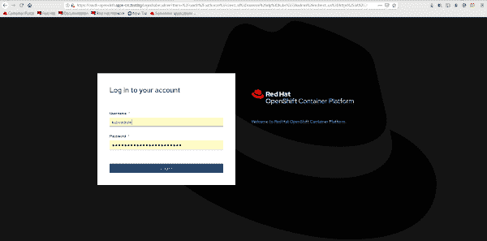
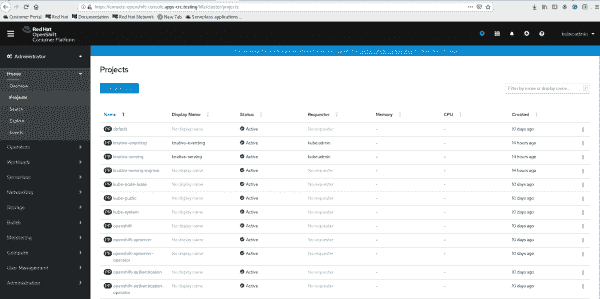
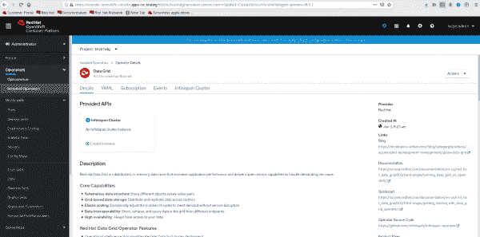
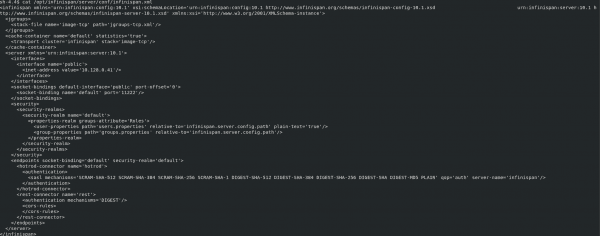
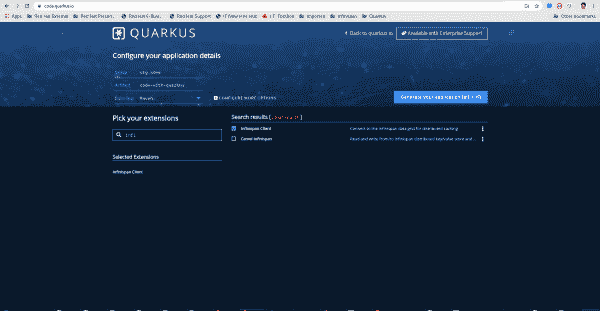

# 使用 Red Hat Data Grid 8.0 在 Red Hat CodeReady 容器上开发和测试 Quarkus 客户端

> 原文：<https://developers.redhat.com/blog/2020/06/19/develop-and-test-a-quarkus-client-on-red-hat-codeready-containers-with-red-hat-data-grid-8-0>

这篇文章讲述了我在[Red Hat code ready Containers(CRC)](https://developers.redhat.com/products/codeready-containers/overview)上安装 [Red Hat Data Grid (RHDG)](https://developers.redhat.com/products/datagrid/overview) 的经历，这样我就可以建立一个本地环境来开发和测试一个 Quarkus Infinispan 客户机。我从安装 CodeReady 容器开始，然后安装了 Red Hat Data Grid。我也在学习 [Quarkus](https://developers.redhat.com/products/quarkus/getting-started) ，所以我的最后一步是将 [Quarkus Infinispan](https://quarkus.io/guides/infinispan-client) 客户端集成到我的新开发环境中。

最初，我尝试将 Quarkus 客户机连接到我的本地运行的数据网格实例。后来，我决定创建一个环境，在那里我可以在 [Red Hat OpenShift 4](https://developers.redhat.com/products/openshift/overview) 上测试和调试数据网格。我尝试在共享环境中的 OpenShift 4 上安装 Data Grid，但是维护这个环境很有挑战性。通过反复试验，我发现最好在 CodeReady 容器上安装 Red Hat Data Grid，并将其用于我的本地开发和测试环境。

在这个快速教程中，我将指导您设置一个本地环境来开发和测试一个 Quarkus 客户机——在本例中是 Quarkus Infinispan。该过程包括三个步骤:

1.  安装并运行 CodeReady 容器。
2.  在 CodeReady 容器上安装数据网格。
3.  将 Quarkus Infinispan 客户端集成到新的开发环境中。

## 步骤 1:安装并运行 CodeReady 容器

首先，[下载 CodeReady 容器的当前版本](https://developers.redhat.com/products/codeready-containers)。如果您需要安装说明，请参见 CodeReady 容器开发团队的[指南。](https://developers.redhat.com/blog/2019/09/05/red-hat-openshift-4-on-your-laptop-introducing-red-hat-codeready-containers/)

在我安装了 CodeReady 容器之后，我运行了以下命令来设置它，并以相同的顺序启动它:

```
# crc setup
# crc start

```

启动 CRC 安装会自动启动 OpenShift。可以查看 https://api.crc.testing:6443 的日志，确认 OpenShift 正在运行。在日志中，您还会看到以下登录详细信息:

```
[INFO]"To access the cluster, first set up your environment by following 'crc oc-env' instructions"
[INFO]"Then you can access it by running 'oc login -u developer -p developer https://api.crc.testing:6443'"
[INFO]"To login as an admin, run 'oc login -u kubeadmin -p 8rynV-SeYLc-h8Ij7-YPYcz https://api.crc.testing:6443'"

```

这是第一步。

## 步骤 2:在 CodeReady 容器上安装 Red Hat 数据网格

接下来，您想要在 [Red Hat OpenShift 容器平台](https://developers.redhat.com/products/openshift/overview) (OCP)上安装数据网格操作器。您可以使用命令行界面(CLI)或 OCP 用户界面(UI)。我选择使用 UI 进行安装。以下是安装步骤:

1.  登录到 OCP 控制台，如图 1 所示。
    [](/sites/default/files/blog/2020/06/Screenshot-from-2020-06-09-11-50-07-CROP.png)

    图 1。登录 OpenShift 集装箱平台控制台。

    
2.  创建一个项目来安装数据网格操作符，如图 2 所示。
    [](/sites/default/files/blog/2020/06/Screenshot-from-2020-06-09-11-49-42-CROP.png)

    图 2。创建一个项目来安装数据网格操作符。

    
3.  创建数据网格运算符的实例。这样做还会创建数据网格窗格，如图 3 所示。
    [](/sites/default/files/blog/2020/06/Screenshot-from-2020-06-09-12-28-09-CROP.png)

    图 3。创建数据网格操作符

    的实例
4.  查看 OCP 上的运行吊舱:

    ```
    $ oc get pods
    NAME                                    READY   STATUS      RESTARTS   AGE
    example-infinispan-0                    1/1     Running     0          6d4h
    infinispan-operator-77cd666d7d-xjqcj    1/1     Running     0          6d4h

    ```

### 为下次安装收集信息

确认安装了数据网格后，记下数据网格服务的服务 IP。安装 Quarkus Infinispan 客户端时，您将需要这些信息。

```
$ oc get svc
NAME                           TYPE        CLUSTER-IP      EXTERNAL-IP   PORT(S)     AGE
example-infinispan             ClusterIP   172.30.51.239   &amp;amp;amp;lt;none&amp;amp;amp;gt;        11222/TCP   6d4h

```

接下来，检查数据网格的用户 ID 和`clustered-openshift.xml`:

```
$ oc rsh example-infinispan-0
sh-4.4$ cat /opt/infinispan/server/conf/users.properties
#$REALM_NAME=default$
#Tue Jun 09 03:58:58 GMT 2020
developer=RSRKP8snxVdCbQP3
operator=brw2JVxLQw1gsF4M

```

最后，检查您的`sasl-mechanism`的配置文件细节:

```
$ oc rsh example-infinispan-0
sh-4.4$ cat /opt/infinispan/server/conf/infinispan.xml

```

图 4 显示了正确的输出:

[](/sites/default/files/blog/2020/06/Screenshot-from-2020-06-10-09-25-59-CROP.png)

Figure 4\. The output from a successful Red Hat Data Grid installation.

## 安装并运行 quartus infinispan 客户端

最后，您可以安装并运行 Quarkus Infinispan 客户端。

1.  [从 Quarkus.io](https://code.quarkus.io/) 下载客户端，如图 5 所示。
    [](/sites/default/files/blog/2020/06/Screenshot-from-2020-06-09-12-44-08-CROP.png)

    图 5。从 Quarkus.io 下载 Quarkus Infinispan 客户端

2.  一旦有了 Quarkus Infinispan，就提取客户端代码。针对您的本地数据网格实例测试代码，以确保它能够正常工作。
3.  假设代码有效，将以下值添加到 Infinispan 客户端的`application.properties`文件中(有关这些值，请参见`pod/service`目录):

    ```
    # The IP should be CLUSTER-IP shown by oc get svc for RHDG deployment
    Quarkus.infinispan-client.server-list=172.30.51.239:11222

    #The following would be the authentication details for the RHDG installed
    Quarkus.infinispan-client.auth-username=developer
    Quarkus.infinispan-client.auth-password=RSRKP8snxVdCbQP3
    Quarkus.infinispan-client.use-auth=true
    Quarkus.infinispan-client.sasl-mechanism=DIGEST-MD5 #you can choose the sasl machenism and set it here
    Quarkus.kubernetes-client.trust-certs=true
    Quarkus.infinispan-client.client-intelligence=BASIC

    #The following properties are required to push the build to OCP
    Quarkus.openshift.expose=true
    Quarkus.kubernetes.deployment-target=openshift
    Quarkus.s2i.base-jvm-image=registry.access.redhat.com/openjdk/openjdk-11-rhel7

    ```

4.  After you have updated the `application.properties` file, run this command at the project's base directory:

    ```
    ./mvnw clean package -DQuarkus.kubernetes.deploy=true

    ```

    应用程序将被部署到 CodeReady 容器中，您应该会看到以下日志:

    ```
    [INFO] [io.Quarkus.kubernetes.deployment.KubernetesDeployer] Deploying to openshift server: https://api.crc.testing:6443/ in namespace: testrhdg.
    [INFO] [io.Quarkus.kubernetes.deployment.KubernetesDeployer] Applied: ServiceAccount infinispan-client-quickstart.
    [INFO] [io.Quarkus.kubernetes.deployment.KubernetesDeployer] Applied: Service infinispan-client-quickstart.
    [INFO] [io.Quarkus.kubernetes.deployment.KubernetesDeployer] Applied: ImageStream infinispan-client-quickstart.
    [INFO] [io.Quarkus.kubernetes.deployment.KubernetesDeployer] Applied: ImageStream openjdk-11-rhel7.
    [INFO] [io.Quarkus.kubernetes.deployment.KubernetesDeployer] Applied: BuildConfig infinispan-client-quickstart.
    [INFO] [io.Quarkus.kubernetes.deployment.KubernetesDeployer] Applied: DeploymentConfig infinispan-client-quickstart.
    [INFO] [io.Quarkus.kubernetes.deployment.KubernetesDeployer] Applied: Route infinispan-client-quickstart.
    [INFO] [io.Quarkus.deployment.QuarkusAugmentor] Quarkus augmentation completed in 120321ms
    [INFO] ------------------------------------------------------------------------
    [INFO] BUILD SUCCESS
    [INFO] ------------------------------------------------------------------------
    [INFO] Total time:  02:06 min
    [INFO] Finished at: 2020-06-10T07:04:53+05:30
    [INFO] ------------------------------------------------------------------------

    ```

### 检查您的安装

您可以运行额外的检查来确保 Infinispan 客户端在您的开发环境中运行。首先，检查用 Quarkus Infinispan 版本创建的新 pod:

```
$ oc get pods
NAME                                    READY   STATUS      RESTARTS   AGE
example-infinispan-0                    1/1     Running     0          6d22h
infinispan-client-quickstart-1-build    0/1     Completed   0          2m50s
infinispan-client-quickstart-1-deploy   0/1     Completed   0          72s
infinispan-client-quickstart-1-hlwg6    1/1     Running     0          66s
infinispan-operator-77cd666d7d-xjqcj    1/1     Running     0          6d22h

```

其次，检查新部署的服务的路由并访问它:

```
$ oc get routes
NAME                           HOST/PORT                                                PATH   SERVICES                       PORT    TERMINATION   WILDCARD
infinispan-client-quickstart   infinispan-client-quickstart-testrhdg.apps-crc.testing   /      infinispan-client-quickstart   8081                  None

```

现在，您可以在 http://infini span-client-quick start-testrhdg . apps-CRC . testing/infini span 上的任何 web 浏览器中，或者在命令行上访问客户端，并使用它。例如，您可以向客户端代码添加更多的接口，这将允许您使用 Red Hat Data Grid 执行不同的操作。

## 结论

在本文中，我向您展示了如何在 Quarkus 的帮助下为 Infinispan 创建一个客户端。我还向您展示了如何针对已安装的 Red Hat Data Grid 8.0 实例在 OpenShift 4.x 上运行客户端。可能有更复杂的方法来实现相同的解决方案或从 OpenShift 集群中查找值。希望分享我的经验对别人有帮助。

从 GitHub 上我的[Infinispan Client quick start](https://github.com/durgeshanaokar/testprojects/tree/master/infinispan-client-quickstart)下载这些例子的源代码。

*Last updated: June 25, 2020*