# 如何在受限的 OpenShift 4 环境中安装 CodeReady 工作区

> 原文：<https://developers.redhat.com/blog/2020/06/12/how-to-install-codeready-workspaces-in-a-restricted-openshift-4-environment>

这是你作为一名刚从大学毕业的 Java 程序员的第一天。您已经收到了您的徽章，一台崭新的笔记本电脑，并且您所有的软件申请都已获得批准。一切似乎都很顺利。

您在新的开发环境中安装 Eclipse 并设置所需的 Java 开发工具包(JDK)。您从公司的 GitHub 存储库中克隆一个项目，修改代码，并进行第一次提交。你很兴奋能参与你的第一个项目。

但是，几个小时后，一位高级程序员问你用的是什么版本的 JDK。管道似乎在报告项目失败。您所做的只是提交 Java 源代码，而不是二进制代码，它在您的本地机器上运行得非常好。哪里出了问题？

## 在受限环境中编码

我描述的问题在程序员中是众所周知的，即"[它在我的计算机上工作，我不知道为什么它在你的计算机上不能工作](https://imgs.xkcd.com/comics/inexplicable.png)"问题。幸运的是，这种类型的问题[Red Hat code ready work spaces(CRW)](https://developers.redhat.com/products/codeready-workspaces/overview)可以帮你解决。CodeReady Workspaces 是一个基于云的 IDE，基于 [Che](https://github.com/eclipse/che) 。尽管 Che 是一个开源项目，但 CRW 是一个企业就绪的开发环境，它提供了许多公司所需的安全性、稳定性和一致性。你所要做的就是在网页浏览器中打开 CRW 链接，用你的用户证书登录，然后在浏览器中编码。

在本文中，我将向您展示如何在受限的 [Red Hat OpenShift 4](https://developers.redhat.com/products/openshift/getting-started) 环境中安装 CodeReady 工作区。

## 示例设置和先决条件

理想情况下，您应该能够直接从 [Red Hat Registry](https://catalog.redhat.com/software/containers/explore) 中提取图像，并将其用于您的安装。毕竟，Red Hat 注册表中的图像是安全且经过认证的。然而，在某些情况下，您会发现公司的网络位于防火墙之后，或者网络策略不允许您直接从 Red Hat 注册表中提取图像。对于本文，我假设您既不能从 Red Hat Registry 提取图像，也不能让代理直接从 Red Hat Registry 提取图像。相反，我将向您展示如何提取所需的图像，并将它们存储在公司的私有注册表中，比如 Artifactory 或 Nexus。然后，您可以使用私有存储的映像来安装 CodeReady 工作区。

我假设您的环境和安装过程如下:

*   **云平台是 OpenShift 4** :你要有一个运行 OpenShift 4 的环境，你要知道如何使用 OpenShift 用户界面(UI)或者命令行界面(CLI)。
*   **我们正在安装 CodeReady Workspaces 版本 2.0 或更高版本**:本教程的大部分内容适用于 CRW 1.2，但我假设您使用的至少是 CodeReady Workspaces 2.0。
*   **我们将使用 OpenShift 4 的 OperatorHub 进行安装**:您可以使用另一种方法来安装 CodeReady 工作区，但我将演示如何使用 OpenShift 4 的内置 OperatorHub。
*   **环境是一个受限的网络**:虽然您可以在一个非受限的环境中设置示例，但是我假设您在一个受限的网络中工作。
*   **您可以访问 Red Hat 注册表**:您应该能够登录并从 Red Hat 注册表中检索容器图像。
*   **您可以访问私有注册表**:从 Red Hat 注册表中提取容器图像后，您需要将它们存储在私有注册表中，如 Artifactory 或 Nexus。

注意，我的例子也是基于*气隙安装*，这是一种支持在受限环境中工作的非连接安装。

让我们开始吧。

## 步骤 1:从 Red Hat 注册表中提取所需的 CRW 图像

在受限环境中安装 CRW 2.0 需要从 [Red Hat 容器注册表](https://catalog.redhat.com/software/containers/explore)中提取 13 个映像，如图 1 所示。

[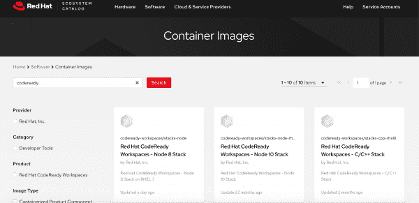](/sites/default/files/blog/2019/11/Screen-Shot-2019-11-19-at-8.58.58-PM.png)CRW Images Can Be Found in Red Hat Certified Image CatalogFigure 1\. Find the required images for your CodeReady Workshop installation in the Red Hat Container Registry.">

从 CodeReady Workspaces 1.2 开始就需要前五个映像，部署 CRW 2.0 需要八个新映像:

1.  `codeready-workspaces/server-operator-rhel8:2.0`:code ready work spaces 操作员协调和管理安装过程。为 OpenShift 4.x 安装这个操作符尤其重要。
2.  `codeready-workspaces/server-rhel8:2.0`:这是 Che 服务器。它提供了管理工作区和项目方面的主要平台，例如编程堆栈、用户组和工厂。您还将使用 Che 服务器来查看您的项目仪表板。
3.  `redhat-sso-7/sso73-openshift:latest` : CRW 使用红帽单点登录(SSO)，基于 [Keycloak](https://www.keycloak.org/) 。这个企业实现符合 SAML 2.0 和 OpenID。您将需要它来验证、授权和管理 CodeReady 工作区中的用户。

**注意:** Factory 是定义元素的 JavaScript Object Notation (JSON)文件，包括在哪里找到工作区的源代码、项目中使用什么语言、在 IDE 中为工作区预先填充的命令，以及在工作区构建后自动执行的任何加载后操作。

4.  `rhscl/postgresql-96-rhel7:latest` : Keycloak 写入 PostgreSQL 数据库。您将需要这个映像来存储与用户相关的数据。
5.  通用基础映像(UBI)提供了一个永久卷，您将使用它来存储工作区的数据以及 CRW 所需的任何其他数据。

您还需要导入以下图像:

*   `registry.redhat.io/codeready-workspaces/pluginregistry-rhel8:2.0`:可以在 CodeReady 工作区的同一个实例的所有用户之间共享插件定义。只有在注册表中发布的插件才能在 devfile 中使用。
*   `registry.redhat.io/codeready-workspaces/devfileregistry-rhel8:2.0`:保存 CodeReady 工作区栈的定义。当选择**创建工作区**时，这些都可以在 CodeReady 工作区用户仪表板上找到。它包含带有示例项目的 CodeReady Workspaces 技术堆栈示例列表。
*   `registry.redhat.io/codeready-workspaces/pluginbroker-rhel8:2.0`:通过该操作员确保所有已安装的插件被正确处理。
*   `registry.redhat.io/codeready-workspaces/pluginbrokerinit:2.0`:作为 init 容器运行，确保所有安装的插件都被正确处理。
*   `registry.redhat.io/codeready-workspaces/jwtproxy-rhel8:2.0`:在基于 JWT 代理的专用服务上实现自签名的每工作空间 JWT 令牌及其验证。
*   `registry.redhat.io/codeready-workspaces/machineexec-rhel8:2.0`:为 CRW 工作区的机器执行人员运行 Go-lang 服务器端创建。
*   `registry.redhat.io/codeready-workspaces/theia-rhel8:2.0`:基于[忒伊亚项目](https://github.com/eclipse-theia/theia)为工作区定义默认的 web IDE。
*   与上面的 theia-rhel8 图像相似，这为 CRW 的 IDE 外观添加了忒伊亚组件。

从 CRW 2.1 开始，上面列出的所需映像似乎有了重大更新。例如:

*   `codeready-workspaces/server-operator-rhel8:2.0`不见了，取而代之的是`codeready-workspaces/crw-2-rhel8-operator:2.1`。
*   `pluginbroker-rhel8`和`pluginbrokerinit:2.0`替换为`codeready-workspaces/pluginbroker-artifacts-rhel8:2.1`和`codeready-workspaces/pluginbroker-metadata-rhel8:2.1`。
*   `theia-dev-rhel8:2.1`被添加到图片列表中。

如果您最终使用 CRW 2.1，请进行适当的更改。

### 下载图片

当您找到您需要的容器图像时，选择该图像，并单击**标签**选项卡以查看图像名称和版本信息。稍后您将指定此信息，以便从 Red Hat 容器注册表中提取图像。在撰写本文时，CodeReady Workspaces 操作符的版本号是 2.0，如图 2 所示。

[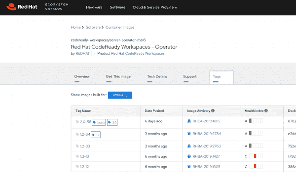](/sites/default/files/blog/2019/12/Screen-Shot-2019-12-02-at-4.30.03-PM.png)CodeReady Workspaces Operator Image in Red Hat Container Registry CatalogFigure 2\. Locate the CodeReady Workspaces Operator in the Red Hat Container Registry.">

除非您可以访问公共服务帐户或其他身份验证机制，否则您需要创建一个帐户，然后才能从注册表下载图像。打开图 3 所示的**获取该图像**选项卡，并按照详细说明进行操作。

[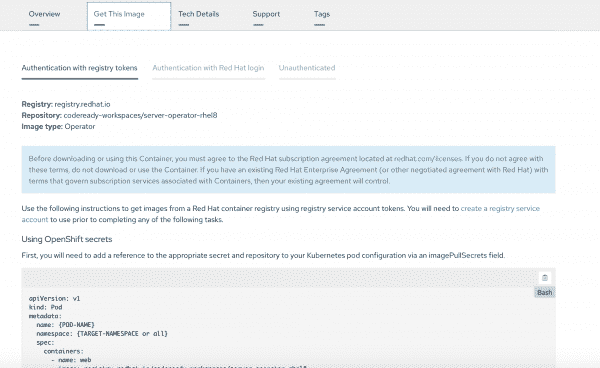](/sites/default/files/blog/2019/11/Screen-Shot-2019-11-20-at-10.52.50-PM.png)Creare Red Hat Registry Service AccountFigure 3\. Create a service account for the Red Hat Registry.">

每个私有注册中心都有自己的获取和存储图像的方法。对于 Artifactory，您可以使用类似下面的`curl`命令，您可以用自己的变量值更新它:

```
$ curl -u JFROG_USERNAME:JFROG_PASSWORD ARTIFACTORY_URL/IMAGE_NAME/metadata/IMAGE_VERSION -k

```

遵循您的注册中心指定的说明，以及您的组织特定的任何要求。

### 验证图像

一旦您从 Red Hat 注册表中提取图像，请验证它们是否存储在您的私有注册表中。图 4 是我的 Artifactory 注册表的一个屏幕截图，其中存储了 CodeReady 工作区安装所需的图像。

[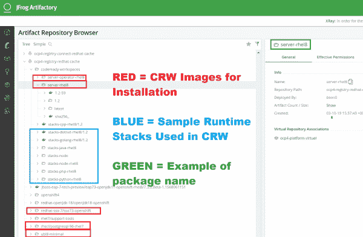](/sites/default/files/blog/2019/11/artifactory_screen.png)CodeReady Workspace Images in ArtifactoryFigure 4\. Find the CodeReady Workspaces images stored in Artifactory.">

我用红色标出的图像是安装 CodeReady 工作区所必需的。使用可从 Red Hat 注册表获得的最新版本。蓝色轮廓的图像是*栈*，代表不同的编程运行时。您的 CRW 安装不需要堆栈，但是您将结合使用它们和`devfile`来创建新项目。我将在第 2 部分向您介绍导入栈的过程。绿色轮廓的图像(在截图的右上角)是一个包名。

**注意**:目前，只有 OpenShift 4 支持 CodeReady Workspaces 操作符，这是本文描述的安装的关键。虽然理论上您可以在 Kubernetes 中安装 CodeReady 工作区，但我假设您是在 OpenShift 4 上安装的。

## 步骤 2:创建一个新的 OpenShift 4 项目

无论使用 OpenShift 3 还是 OpenShift 4，在 OpenShift 中创建新项目都是一样的。无论哪种方式，您都可以使用 OpenShift 用户界面(UI)或 [OpenShift 命令行界面(CLI)](https://docs.openshift.com/container-platform/4.2/cli_reference/openshift_cli/getting-started-cli.html) 。

### 使用 OpenShift UI 创建新项目

OpenShift 的用户界面很容易使用。点击**创建项目**，并在剩余的字段中输入您的项目信息。请注意，您只需要指定项目名称。OpenShift 使用这些信息创建一个名称空间。在图 5 所示的项目对话框中，我输入了项目名称:`crw-demo`。

[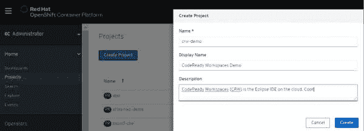](/sites/default/files/blog/2019/11/crw_creation-1.jpg)Creating New Openshift ProjectFigure 5\. Create a new OpenShift project.">

### 使用 OpenShift CLI 创建新项目

您的另一个选择是使用 OpenShift 容器平台(OCP) CLI。在这种情况下，您可以打开命令行并输入命令`oc new-project`:

```
$ oc new-project crw-demo

```

我再次将我的新项目命名为`crw-demo`。

当您创建一个新项目时，OpenShift 会为该项目创建新的资源，包括您稍后将使用的两个服务帐户。这些被命名为**默认**和**构建器**。

接下来，我们将生成一个访问令牌，并将其添加到您的 OpenShift 秘密中。您将需要这个令牌从您的私有注册表中提取图像。

## 步骤 3:生成一个访问令牌并将其添加到 OpenShift secrets 中

图 6 中的图表显示了生成访问令牌的一般过程，您将使用它来验证您的用户 ID 并获得对您的私有注册中心的访问。实际过程会因应用程序、策略和环境而异。

[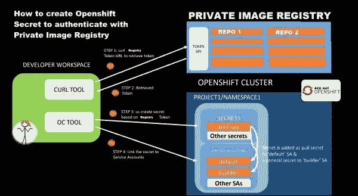](/sites/default/files/blog/2019/11/2_diagram_token.jpg)Openshift Secret to Authenticate to Private RepFigure 6\. Create an OpenShift secret, which you will use to authenticate your ID in the private registry.">

授权包括四个步骤:

1.  从诸如 [OAuth](https://oauth.net) 的服务请求访问令牌。该服务将生成令牌并将其发送到私有注册中心。(在某些情况下，您可以使用代理来请求令牌。)
2.  调用私有注册表并检索令牌。
3.  使用令牌创建一个 OpenShift secret 作为 Docker 注册表。
4.  将包含令牌的 OpenShift secret 添加到 CodeReady 工作区中的每个服务帐户。(CodeReady Workspaces 操作员需要各种服务帐户进行安装。我稍后会进一步解释这一点。)

**注意**:在某些环境中，生成和验证令牌的过程由开发人员完成，而在其他环境中，则由代理来完成。无论哪种方式，选择不会过期的令牌都是非常重要的。另一种选择是使用类似于[金库](https://www.vaultproject.io)的工具来旋转令牌并刷新 OpenShift 的秘密机制。描述这个过程超出了本文的范围。

### 手动生成令牌

如果您正在手动生成访问令牌，您可以使用像下面这样简单的`curl`命令:

```
$ curl -u PRIVATE_REGISTRY_USERNAME:PRIVATE_REGISTRY_PASSWORD -X POST PRIVATE_REGISTRY_TOKEN_URL

```

其中:

*   `PRIVATE_REGISTRY_USERNAME`是您登录私人注册表的用户名。
*   `PRIVATE_REGISTRY_PASSWORD`是您登录私人注册表的密码。
*   `PRIVATE_REGISTRY_URL`是从私有注册表生成访问令牌的网址。

同样，该机制将根据您的环境和其他因素而有所不同。在尝试生成访问令牌之前，请查阅您的私有注册表的文档或向您的团队寻求建议。

### 创建 OpenShift 秘密

一旦生成了令牌，就可以创建一个 OpenShift secret 来将令牌存储在 Docker 注册表中。为此，您可以在 OC CLI 上使用`create secret`命令:

```
$ oc create secret docker-registry PULL_SECRET_NAME
    --docker-server=URL_IMAGE_PRIVATE_REGISTRY \
    --docker-username=USERNAME_PRIVATE_REGISTRY \
    --docker-password=TOKEN_PRIVATE_REGISTRY \
    --docker-email=EMAIL_PRIVATE_REGISTRY

```

其中:

*   `PULL_SECRET_NAME`是 OpenShift 的秘密名称。
*   `URL_IMAGE_PRIVATE_REGISTRY`是包含您要提取的图像的私有注册表路径。
*   `USERNAME_PRIVATE_REGISTRY`是您访问私人注册表的用户名。
*   `TOKEN_PRIVATE_REGISTRY`是您刚刚生成的私有注册表令牌。
*   `EMAIL_PRIVATE_REGISTRY`是您与私人注册表关联的电子邮件。

在图 7 中，您可以看到我的令牌， **artif-ocp4-sec** ，被存储为 OpenShift secret。

[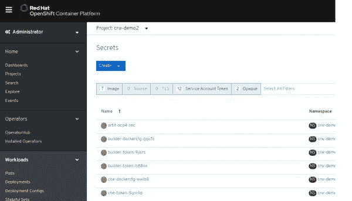](/sites/default/files/blog/2019/11/secret1.jpg)Check Openshift Secret for Private Registry TokenFigure 7\. Find your private-registry token stored as an OpenShift secret.">

至此，您已经创建了一个 Openshift secret，它具有从您的私有注册中心提取图像所必需的凭证。您仍然需要将 OpenShift 秘密链接到您的服务帐户。在我向您展示如何做到这一点之前，您必须安装 CodeReady 工作区。

## 步骤 4:使用 OpenShift OperatorHub 安装 CodeReady 工作区

安装 CodeReady 工作区的一种方法是利用`[chectl](https://github.com/che-incubator/chectl)`，这是 Che 的命令行界面。从 OpenShift 4 开始，另一种方法是使用 OpenShift OperatorHub。图 8 显示了从 OperatorHub 定位和安装 CodeReady Workspaces 操作符的对话框。(注意 OperatorHub 还包含 Che 操作符。)

[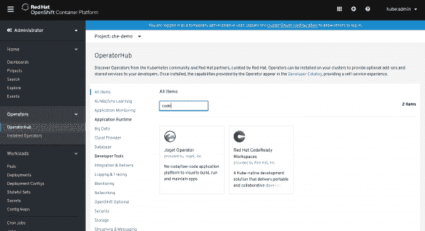](/sites/default/files/blog/2019/11/Screen-Shot-2019-09-17-at-12.25.00-PM.png)CodeReady Workspace in Operator HubFigure 8\. Find the CodeReady Workspaces Operator in the OpenShift Operator Hub.">

**注意**:如果您在 OperatorHub 中没有看到 CodeReady Workspaces 操作器，请查看 Red Hat OpenShift 4.3 文档中的[操作器安装说明](https://access.redhat.com/documentation/en-us/openshift_container_platform/4.3/html/operators/olm-adding-operators-to-a-cluster#olm-installing-operators-from-operatorhub_olm-adding-operators-to-a-cluster)。

### 从 OperatorHub 安装 CRW

如果您转到 OpenShift OperatorHub 并选择 CodeReady Workspaces 操作符，您应该会看到一个安装它的选项。在按下**安装**按钮之前，如图 9 所示，记下 CRW 操作器版本(目前为 2.0)和容器图像的位置。默认情况下，该位置指向 **registry.redhat.io** 。稍后，您将更改此位置以指向您的私有注册表。

[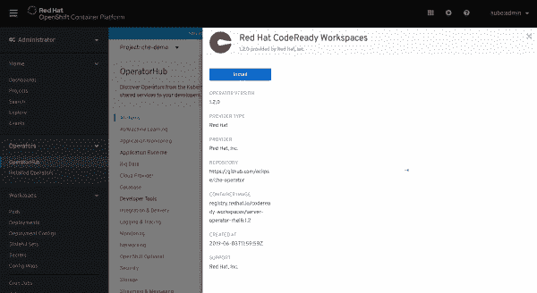](/sites/default/files/blog/2019/11/Screen-Shot-2019-09-17-at-12.25.17-PM.png)Install CodeReady Workspaces Through OperatorHubFigure 9\. Install the CodeReady Workspaces Operator from the OpenShift Operator Hub.">

点击**安装**后，会要求您创建一个运营商套餐。确保您位于正确的名称空间中。点击**订阅**按钮，订阅 CodeReady Workspaces Operator，如图 10 所示。

[](/sites/default/files/blog/2019/11/Screen-Shot-2019-09-17-at-12.25.36-PM.png)Create Operator Subscription for CRWFigure 10\. Create a subscription for the CodeReady Workspaces Operator.">

安装可能需要一段时间，请耐心等待。一旦安装完成，单击**code ready work spaces Operator**链接打开新的 CRW 实例，如图 11 所示。

[](/sites/default/files/blog/2019/11/Screen-Shot-2019-09-17-at-12.25.54-PM.png)CodeReady Workspaces Operator Getting InstalledFigure 11\. Find the CodeReady Workspaces Operator installed in your project namespace.">

接下来，我们将建立一个 CRW 集群。

## 步骤 5:修改 CRW 的自定义资源定义文件

到目前为止，您可能想知道这个 CRW 安装对于在受限环境中工作有什么独特之处。这将随着这一步而改变，我们首先创建一个新的 CodeReady Workspaces 集群，然后修改 CRW 的定制资源定义(CRD)文件。

从图 11 所示的 CRW 项目名称空间页面，单击新的 CodeReady 工作区操作符的链接。您可以选择创建一个新的 Red Hat CodeReady Workspaces 集群实例。点击**创建实例**选项，如图 12 所示。

[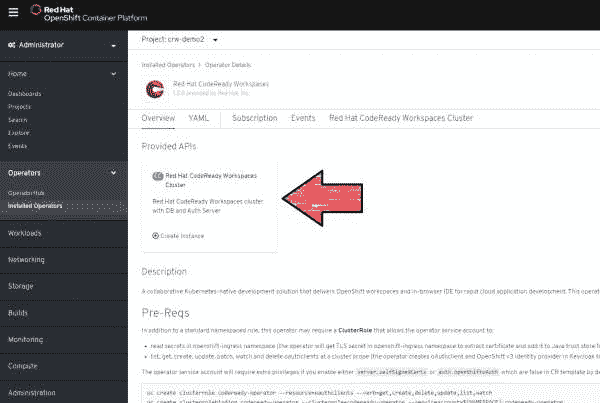](/sites/default/files/blog/2019/11/create_cluster1.jpg)Create CodeReady Workspaces Operator ClusterFigure 12\. Create a new CodeReady Workspaces Operator cluster.">

现在，您将获得 CodeReady Workspaces 操作符的定制资源定义文件。在将 CRW 安装到 OpenShift 之前，您需要定制这个文件，如图 13 所示。

[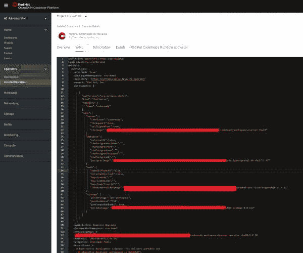](/sites/default/files/blog/2019/11/create_cluster2.jpg)Modify CRW's Custom Resource Definition FileFigure 13\. The custom resource definition file in YAML format.">

CRD 定义是 YAML 格式的，但是注意文件的一部分是用 JSON 格式化的。您将修改属性以包含以下七个图像，这些图像是我们在步骤 1 中从 Red Hat 注册表中提取的:

```
codeready-workspaces/server-operator-rhel8:2.0
cheImage: codeready-workspaces/server-rhel8:2.0
identityProviderImage: redhat-sso-7/sso73-openshift:latest
postgresImage: rhscl/postgresql-96-rhel7:latest
pvcJobsImage: ubi8-minimal:latest
devfileRegistryImage: codeready-workspaces/devfileregistry-rhel8:2.0
pluginRegistryImage: codeready-workspaces/pluginregistry-rhel8:2.0

```

您可以在 [Che Operator 的 GitHub 库](https://github.com/eclipse/che-operator/blob/master/deploy/crds/org_v1_che_cr.yaml)上找到 Che Operator 的完整 CRD 文件。

### 更新 CRD 文件

注意`codeready-workspaces/server-operator-rhel8:2.0`在 CRD 文件中被引用了两次。您需要添加其他图像作为新属性，如下例所示:

```
"spec": {
  "server": {
    ... // Other Properties,
    # server image used in Che deployment
    "cheImage": ""
  },
  "database": {
    ... // Other Properties,
    "postgresImage": ""
  },
  "storage": {
    ... // Other Properties,
    "pvcJobsImage": ""
  },
  "auth": {
    ... // Other Properties,
    "identityProviderImage": ""
  }

```

您还可以更改该文件中的其他属性。例如，在部署我的 CRW 时，我必须将以下两个属性更改为 true。

*   `tlsSupport: true`
*   `selfSignedCert: true`

### 处理分离舱故障

当您继续安装新的 CRW 实例时，您的 pod 可能会失败。要在 OpenShift 控制台中检查这一点，请转到**工作负载**->**pod**，然后单击您感兴趣的 pod。例如，你可以点击**日志**。

如果您喜欢使用 OpenShift CLI，请输入`oc get pods`，然后输入`oc logs -f po/POD_NAME`。对于`POD_NAME`，输入您想要验证的 pod。

如果您检查这个错误，您将会看到 image-pull 事件失败，并显示一条错误消息:`ErrImagePull`。在下一节中，我将向您展示如何通过将您的 OpenShift secret 添加到在受限环境中运行 CodeReady 工作区所需的服务帐户来修复这个错误。

## 第六步:将你的 OpenShift 密码添加到新的服务账户中

CodeReady Workspaces 部署使用 CRW 操作员来安装和管理 CRW 的所有生命周期流程。这些流程还需要利用各种服务帐户。总的来说，流程如下所示:

1.  初始化`codeready-operator`服务帐户，并尝试获取`codeready-workspaces/server-operator-rhel8`映像。
2.  `deployer`和`builder`服务帐户试图获取额外的所需图像，如`redhat-sso-7/sso73-openshift`、`rhscl/postgresql-96-rhel7`和`ubi8-minimal`。
3.  创建`che`服务帐户是为了拉取`codeready-workspaces/server-rhel8`映像。
4.  一旦 CRW 启动，`che-workspace`服务帐户就用于获取各种运行时的堆栈映像。

你可以在 OpenShift 控制台中通过点击 **Explore** 找到上述服务账户，浏览到 **ServiceAccounts** 页面，如图 14 所示。

[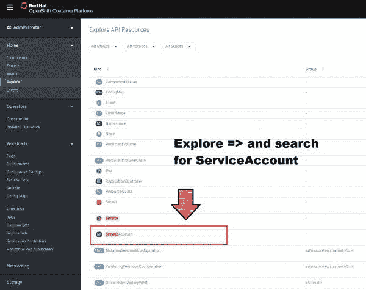](/sites/default/files/blog/2019/11/serviceaccount1.jpg)How to find Service Accounts in Openshift 4Figure 14\. Find the ServiceAccounts page in the OpenShift 4 console.">

或者，在命令行上，您可以输入`oc get sa`。

### 添加更多服务帐户

第一次尝试安装 CRW 时，您应该只会看到`codeready-operator`服务帐户，它们是**默认**、**构建者**和**部署者**。您必须使用您的 OpenShift 密码来添加额外的服务帐户。在自定义资源定义文件中，在`imagePullSecrets`下创建一个新行，并在那里添加一个新的 OpenShift secret。或者，您可以覆盖前面的 OpenShift 秘密，如图 15 所示。

[](/sites/default/files/blog/2019/11/serviceaccount3.jpg)Add Openshift Secret to Service AccountFigure 15\. Add your OpenShift secret to the service accounts you want to add.">

对 CodeReady 工作区部署所需的所有服务帐户重复此步骤。

### 更新部署脚本

简单地修改您的服务帐户不会自动触发在受限环境中部署 CRW 应用程序所需的更改。您还需要修改您的部署脚本，如图 16 所示。

[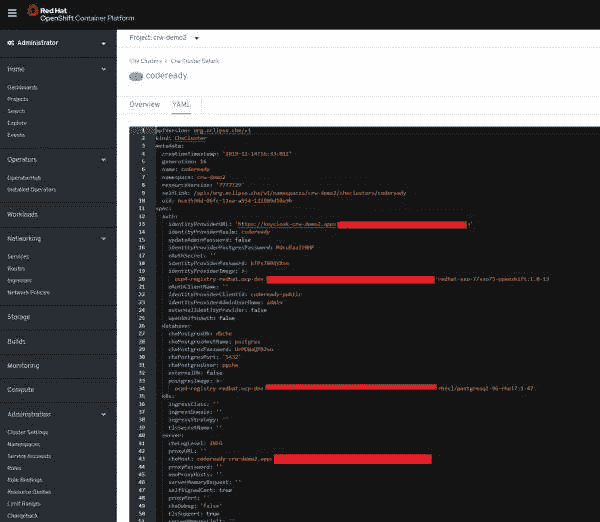](/sites/default/files/blog/2019/11/success3.jpg)Modify Openshift Deployment to RedeployFigure 16\. Modify your OpenShift deployment script to redeploy the application.">

完成这些更改后，检查 pod 及其日志，看看您是否能够成功地获取部署所需的映像，如图 17 所示。对任何其他服务帐户重复上述步骤，以提取您需要的图像。

[](/sites/default/files/blog/2019/11/serviceaccount2.jpg)Service Accounts of CRW

Figure 17\. View all of your pod instances in the Service Accounts page.

## 步骤 7:检查您的 pod 并部署 CodeReady 工作区

一旦一切都启动并运行，您应该看到所有的 pod 都处于**运行**状态，如图 18 所示。

[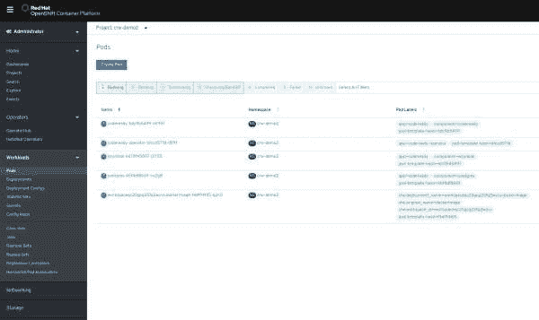](/sites/default/files/blog/2019/11/pod1-1.jpg)CRW Pods When Installed SuccessfullyFigure 18\. Check the Running tab on the Pods page to find out whether your pods are successfully installed.">

如果您注意到正在运行的 pod 有任何问题，请检查日志或事件错误，如图 19 所示。

[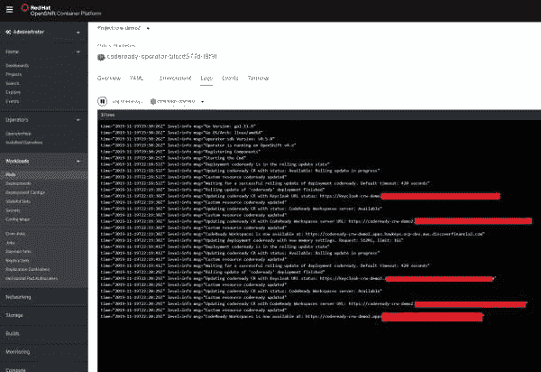](/sites/default/files/blog/2019/11/pod2.jpg)Check Openshift Pod for Any Log or ErrorFigure 19\. Check for logging or event errors in your running pods.">

假设您的所有 pods 都运行顺利，那么您现在可以在一个受限的环境中部署您的 CodeReady Workspaces 实例，如图 20 所示。

[](/sites/default/files/blog/2019/11/7.jpg)Route for Successful Che DeploymentFigure 20\. The route for a successful Che deployment.">

## 结论

这应该就是安装和部署 CodeReady 工作区的方法。您可能会遇到与在受限环境中工作相关的额外挑战。

现在，您至少应该已经安装了 CodeReady 工作区，并准备好在 OpenShift 4 中使用。然而，这仅仅是你通往 CodeReady 工作空间的旅程的开始。在我的下一篇文章中，我将介绍如何在安装后进一步配置 CRW，如何在 CRW 尝试各种开发选项，以及如何在 CRW 安装像 Prometheus 和 Grafana 这样的监控解决方案。在那之前，下次见，欢迎留言评论。

*Last updated: June 25, 2020*