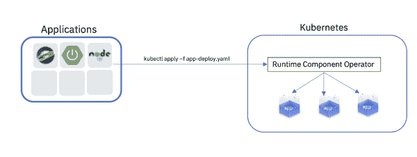
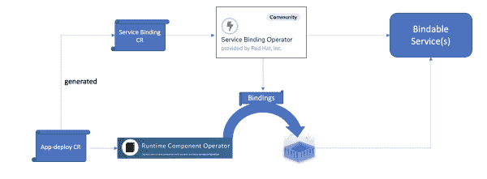

# 通过 Kubernetes 运营商部署和绑定企业级微服务

> 原文：<https://developers.redhat.com/blog/2020/05/18/deploy-and-bind-enterprise-grade-microservices-with-kubernetes-operators>

将企业级运行时组件部署到 [Kubernetes](https://developers.redhat.com/topics/kubernetes/) 中可能会令人望而生畏。你可能会想:

*   如何为我的应用程序获取证书？
*   使用水平窗格自动缩放器自动缩放资源的语法是什么？
*   如何将我的容器与数据库和 Kafka 集群链接起来？
*   我的度量标准会送到普罗米修斯吗？
*   还有，我如何用 [Knative](https://developers.redhat.com/topics/serverless-architecture/) 缩放到零？

运营商可以满足所有这些需求，甚至更多。在本文中，我将介绍三个操作符——运行时组件操作符、服务绑定操作符和 Open Liberty 操作符——它们协同工作，帮助您像专家一样部署容器。

## 运行时组件操作员:微服务的私人助手

有什么比给你的微服务配备一个私人助理更好的方法来把你的微服务提升到高管级别呢？除了听起来很酷之外，它还会使您的 Kubernetes 部署更加容易。

要开始，请访问 [OperatorHub.io](https://operatorhub.io/) 。注意屏幕左侧下拉列表中的操作员类别。点击**应用运行时**操作符的链接，然后过滤到**能力级别**下的两个[自动驾驶](https://operatorhub.io/?category=Application+Runtime&capabilityLevel=%5B%22Auto+Pilot%22%5D)条目。(这些是 5 级，OperatorHub 上的最高级别。)你会看到两个选项:[运行时组件操作符](https://github.com/application-stacks/runtime-component-operator)和[打开自由操作符](https://github.com/OpenLiberty/open-liberty-operator)。

这两个工具是相关的:运行时组件操作符是支持 Open Liberty 操作符的上游社区。我将首先介绍运行时组件操作符。在本文的后面，我将介绍几个 Open Liberty 操作符的独特特性。

### 运行时组件运算符概述

如图 1 所示，运行时组件操作符允许您部署任何运行时容器— [Liberty](https://developers.redhat.com/blog/2019/11/14/open-liberty-java-runtime-now-available-to-red-hat-runtimes-subscribers/) 、 [JBoss](https://developers.redhat.com/products/eap/overview) 、 [Quarkus](https://developers.redhat.com/products/quarkus/getting-started) 、 [Node.js](https://developers.redhat.com/blog/category/node-js/) 、 [Spring Boot](https://developers.redhat.com/topics/spring-boot/) 等等。

[](/sites/default/files/blog/2020/04/Screen-Shot-2020-04-15-at-7.56.59-PM.png)

Figure 1\. Runtime Component Operator in a Kubernetes deployment.

运行时组件操作员可以帮助您完成以下任何日常部署活动:

*   创建和部署 k8s 资源。
*   切换以创建 Knative 或[无服务器](https://developers.redhat.com/topics/serverless-architecture/)资源。
*   从图像流中部署图像(包括与`BuildConfig`的集成)。
*   使用水平 Pod 自动缩放器自动缩放。
*   管理资源限制。
*   与普罗米修斯集成(内置)。
*   与证书管理器集成。
*   创建具有传输层安全性(TLS)的路由。
*   在微服务之间实现 TLS。
*   探查就绪或活性。
*   设置环境变量。
*   设置简单的两步卷持久性。
*   集成 kAppNav 和 [Red Hat OpenShift](https://developers.redhat.com/openshift) 的拓扑视图
*   绑定应用到应用的服务。
*   将应用程序绑定到资源服务。

而这还只是入围名单。详见[运行时组件操作员用户指南](https://github.com/application-stacks/runtime-component-operator/blob/master/doc/user-guide.adoc)。

接下来，让我们看看运行时组件操作符如何帮助您解决现实世界中的问题。

### 相互 TLS 信任

假设您想要部署两个或更多已经建立了相互 TLS 信任的微服务。您计划使用由群集证书颁发机构(CA)颁发的证书。您*可以*尝试手动设置部署，或者您可以简单地使用如下配置:

```
apiVersion: app.stacks/v1beta1
kind: RuntimeComponent
metadata:
  name: my-app
  namespace: test
spec:
  applicationImage: registry.connect.redhat.com/ibm/open-liberty-samples:springPetClinic
  service:
    port: 9080
    certificate: {}

```

### 图像流

再举一个例子，假设您想要使用 Knative 部署一个图像流(可能是一个`BuildConfig`的结果)。这个简单的配置实现了它:

```
apiVersion: app.stacks/v1beta1
kind: RuntimeComponent
metadata:
  name: my-app
  namespace: test
spec:
  applicationImage: my-namespace/my-image-stream:1.0
  createKnativeService: true
  expose: true

```

只需一次切换(`createKnativeService`)，您就可以从使用普通的 Kubernetes 资源切换到 Knative(无服务器)资源。`expose`元素会自动为您的微服务创建一条路线。

### 连接 RESTful 服务

现在假设您想要连接两个或更多 RESTful 服务。没问题。只是让运行时组件操作者知道您想要公开或消费服务，就像这样:

```
apiVersion: app.stacks/v1beta1
kind: RuntimeComponent
metadata:
  name: my-provider
  namespace: test
spec:
  applicationImage: appruntime/samples:service-binding-provider
  service:
    port: 9080
    provides:
      category: openapi
      context: /my-context

```

在这种情况下，YAML 部署提供微服务，并使其自身可绑定到其他微服务，然后其他微服务可以请求绑定:

```
apiVersion: app.stacks/v1beta1
kind: RuntimeComponent
metadata:
  name: my-consumer
  namespace: test
spec:
  applicationImage: appruntime/samples:service-binding-consumer
  service:
    port: 9080
    consumes:
      - category: openapi
        name: my-provider

```

这就是你需要做的。运行时组件操作者将把请求的绑定信息注入到消费微服务中。

这令人印象深刻，但是如果您需要绑定到运行时组件操作符不拥有的资源呢？接下来，我将向您展示如何针对该场景使用新的服务绑定规范和 [Red Hat 服务绑定操作符](https://developers.redhat.com/blog/2019/12/19/introducing-the-service-binding-operator/)。

## 服务绑定规范:为绑定带来秩序

几个月前，Kubernetes 内部形成了一个新的社区来标准化服务绑定。这种合作产生了服务绑定规范的第一个候选版本。

该规范关注以下与服务绑定相关的问题:

*   我们如何使一些东西变得可绑定？
*   要公开的绑定模式是什么？
*   我们如何请求绑定？
*   绑定数据是如何注入或挂载到微服务中的？

该规范详细阐述了这些主题中的每一个——例如，它基于`x-descriptor` s 和`annotation`s[详尽地说明了数据模型](https://github.com/application-stacks/service-binding-specification/blob/master/annotations.md)

### Red Hat 服务绑定操作符

规范有助于为服务生产者和消费者创建一致的路径。拥有一个参考实现就更好了。 [Red Hat 服务绑定操作符](https://developers.redhat.com/blog/2019/12/19/introducing-the-service-binding-operator/)与运行时组件操作符一起工作，以改进 Kubernetes 部署中的服务绑定。

服务绑定操作符是绑定的核心:它监视和管理传入的`ServiceBindingRequest`定制资源(CRs)。这些是描述我们正在绑定的服务的 YAML 工件。

开箱即用的服务绑定操作符处理来自可绑定服务的符合规范的注释。它还有一个非常有用的`autoDetect`模式，允许它遍历拥有的`Secret`、`ConfigMap`、`Route`等等。然后，它可以公开从这些资源中提取的绑定数据。这种“零代码更改”的方法是处理现有服务的一种很好的方式，甚至在它们遵守新的服务绑定规范之前。

运行时组件操作员的角色是检测(自动或通过引用)链接到其部署的微服务之一的`ServiceBindingRequest`。然后，它将注入或装载相应的信息。

查看[运行时组件操作符用户指南](https://github.com/application-stacks/runtime-component-operator/blob/master/doc/user-guide.adoc)的“服务绑定”一节，了解关于一起部署运行时组件操作符和服务绑定操作符的更多信息。

### 快速演示

如果您想了解这两个操作符是如何协同工作的，请查看我们的[示例应用程序](https://github.com/application-stacks/sample-service-binding-postgresql):将 PostgreSQL 操作符数据库绑定到 [Spring Boot](https://developers.redhat.com/topics/spring-boot/) 应用程序。操作员管理 PostgreSQL 操作员数据库，运行时组件操作员使用服务绑定操作员部署和管理 Spring Boot 应用程序。

在演示中，我们首先部署一个[数据库 CR](https://github.com/application-stacks/sample-service-binding-postgresql/blob/master/manifests/create-postgresql-db-instance.yaml) ，PostgreSQL 操作符使用它来创建我们的数据库。

接下来，我们部署一个由服务绑定操作符处理的 [ServiceBindingRequest CR](https://github.com/application-stacks/sample-service-binding-postgresql/blob/master/manifests/bind-postgresql-to-application.yaml) 。

最后，我们部署我们的 [RuntimeComponent CR](https://github.com/application-stacks/sample-service-binding-postgresql/blob/master/app-deploy.yaml) (在本例中，是一个 Spring Boot 微服务)，它由运行时组件操作者管理。

### 未来的增强

未来的增强将包括能够从给定的`RuntimeComponent` CR 生成`ServiceBindingRequest` CR。图 2 显示了我们想要实现的模式:

[](/sites/default/files/blog/2020/04/Screen-Shot-2020-04-22-at-7.27.21-AM.png)

图二。服务绑定操作符从给定的 RuntimeComponent CR 生成 ServiceBindingRequest CR。">

然后，应用程序代码可以通过顶级`SERVICE_BINDINGS`环境变量安全地导航其所有绑定，如下所示:

```
SERVICE_BINDINGS = {
  "bindingKeys": [
    {
      "name": "KAFKA_USERNAME",
      "bindAs": "envVar"
    },
    {
      "name": "KAFKA_PASSWORD",
      "bindAs": "volume",
      "mountPath": "/platform/bindings/secret/"
    }
  ]
}

```

## 开放自由运营商:优化您的部署

在本文的开始，我注意到运行时组件操作符是 Open Liberty 操作符的上游项目。到目前为止，就功能和绑定而言，您所看到的一切都适用于 Open Liberty Operator。

更好的是，如果您知道运行时是 Open Liberty，您可以在 Open Liberty Operator 中使用特定于该运行时的特性的配置。我们将了解其中的两种功能。

### Liberty 的单点登录集成

Open Liberty Operator 支持 Liberty 的单点登录(SSO)社交媒体登录功能。因此，它可以将应用程序用户的身份验证委托给外部提供商，如 Google、脸书、LinkedIn、Twitter、GitHub 或任何 OpenID Connect (OIDC)或 OAuth 2.0 客户端。

你的第一步是[在你的代码](https://openliberty.io/blog/2019/08/29/securing-microservices-social-login-jwt.html)中启用社交媒体登录。一旦你完成了这些，你就可以创建合适的社交媒体登录密码(比如 GitHub `clientID`)并配置你的`OpenLibertyApplication`部署来将它们连接在一起。您可以在 [Open Liberty Operator 用户指南](https://github.com/OpenLiberty/open-liberty-operator/blob/master/doc/user-guide.adoc)中找到详细信息和代码示例。

### 第二天的操作

Day-2 Operations 特性是一个流行的 Open Liberty 运行时特性，用于收集跟踪和触发 JVM 转储。在 Open Liberty Operator 中，这些操作都可以在高度专业化的自定义资源定义(CRD)中使用，这确保了极简的用户体验。

下面简单介绍一下如何设置跟踪:

```
apiVersion: openliberty.io/v1beta1
kind: OpenLibertyTrace
metadata:
  name: example-trace
spec:
  podName: my-pod
  traceSpecification: "*=info:com.ibm.ws.webcontainer*=all"
  maxFileSize: 20
  maxFiles: 5

```

如您所见，对于 Open Liberty 用户来说，代码是简单直观的。请访问 [Open Liberty Operator 用户指南](https://github.com/OpenLiberty/open-liberty-operator/blob/master/doc/user-guide.adoc)了解完整的配置详情。

## 准备好开始了吗？

运行时组件操作符和开放自由操作符都可以从 Red Hat OpenShift OperatorHub 获得。您可以在集群范围内快速安装它们，也可以通过 Operator Lifecycle Manager (OLM)框架使用命名空间范围的安装。这两个操作符都是开源的，所以没有使用限制。拿起您最喜欢的运行时组件，用这些操作符之一试一试——您会立即注意到企业级的提升。

当您准备好进入生产场景并需要支持时，我鼓励您查看包含 Open Liberty 的 [Red Hat Runtimes](https://www.redhat.com/en/products/runtimes) 。

*Last updated: May 30, 2022*