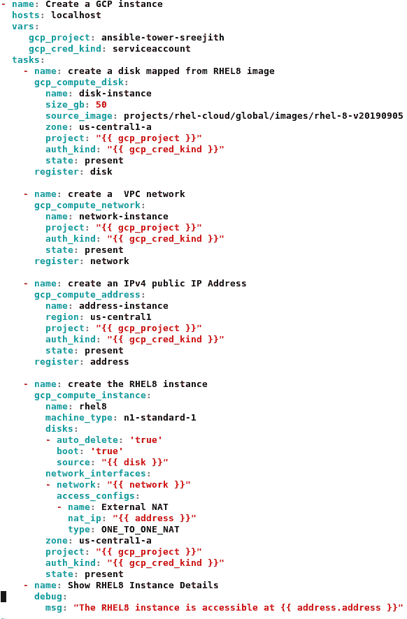
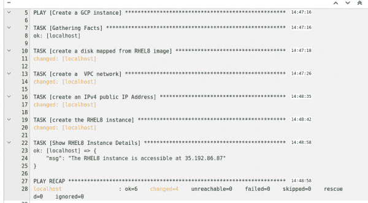
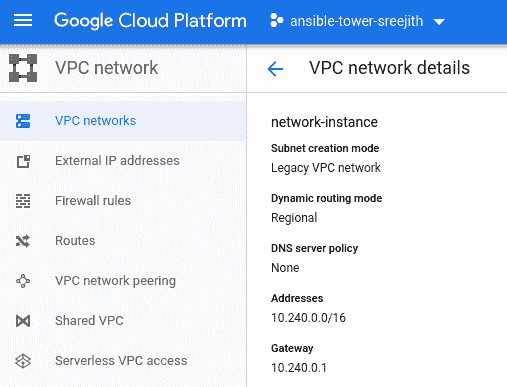

# 使用 Ansible 自动化 Google 云平台

> 原文：<https://developers.redhat.com/blog/2020/05/06/using-ansible-to-automate-google-cloud-platform>

在本文中，您将了解如何使用新的 [Red Hat Ansible](https://www.ansible.com/) 模块和您的 [Red Hat Ansible Tower](https://www.ansible.com/products/tower) 凭证无缝地自动提供谷歌云平台(GCP)资源。

## 关于新的 GCP 模块

从 [Ansible 2.6](https://docs.ansible.com/ansible/latest/roadmap/ROADMAP_2_6.html) 开始，红帽[与谷歌](https://www.redhat.com/en/partners/programs/CCSP)合作，发布一套新的模块，用于自动化谷歌云平台资源管理。这种合作关系已经产生了[超过 100 个 GCP 模块](https://docs.ansible.com/ansible/latest/scenario_guides/guide_gce.html)和一致的命名方案`gcp_*`。虽然我们仍然可以访问原来的模块，但是建议开发人员尽可能使用新的模块。

这篇文章让你很快开始使用 [Red Hat Ansible](https://www.ansible.com/?extIdCarryOver=true&sc_cid=701f2000000RmAOAA0) 和 [Red Hat Ansible Tower](https://www.ansible.com/products/tower?extIdCarryOver=true&sc_cid=701f2000000RmAOAA0) 中的新模块。我们首先将一个 Google 云平台服务帐户连接到您的 Red Hat Ansible Tower 环境。然后，我们将能够使用 Ansible Tower 运行一个简单的 Ansible 剧本，该剧本将为 Red Hat Enterprise Linux 8 的自动化实例提供新的虚拟机(VM)磁盘、虚拟专用云(VPC)网络和 IP 地址。您还将看到如何使用 Ansible Tower 的动态库存特性来发现 Google 云平台上新创建的 Red Hat Enterprise Linux 8 实例。

## 将您的 GCP 服务帐户连接到 Ansible Tower

本节假设你已经有一个[谷歌云平台服务账户](https://developers.google.com/identity/protocols/oauth2/service-account#creatinganaccount)。如果您知道您的帐户详细信息，首先要做的是向 Ansible Tower 提供身份验证凭据。从 Ansible Tower 控制台中，选择**凭证- >新凭证**。然后选择**谷歌计算引擎**作为**凭证类型**。图 1 显示了这个序列。

图一。选择凭据类型。">

接下来，您需要提供您的 Google 云平台服务帐户的详细信息，以及您计划在其中创建资源的项目的名称。你可以在你的谷歌云平台控制台中找到所有这些信息。

图 2 显示了您将输入与您的 Google 云平台服务帐户相关的电子邮件地址的字段。

图二。输入与您的 Google 云平台服务帐户关联的电子邮件地址">

接下来，将要求您输入与您的服务帐户电子邮件地址相关联的隐私增强邮件(PEM)文件的内容，如图 3 所示。

图 3。输入您帐户的私钥。">

最后，您将输入 Google 云平台项目 ID，如图 4 所示。

图 4。输入谷歌云平台项目 ID。">

如果您愿意，您可以上传一个包含您的服务帐户详细信息的 JSON 文件，而不是复制并粘贴它们。图 5 显示了选择和上传 JSON 文件的选项。

图 5。选择并上传一个 JSON 文件。">

图 6 显示了 Google Cloud Platform 服务帐户、相关的电子邮件地址以及我们到目前为止设置的环境的项目 ID。

图 6。谷歌云平台服务帐户的配置。">

虽然没有显示，但我也配置了 Google 计算引擎 API ( `compute.googleapis.com`)来访问 Google 云平台项目，并将身份和访问管理(IAM)角色设置为所有者。

## 为 Red Hat Enterprise Linux 8 实例创建新的行动手册

配置好我们的环境后，下一步是创建一个可行的行动手册。我们将使用 Ansible 剧本创建一个虚拟机磁盘、一个 VPC 网络、一个 IPv4 地址，最后是我们的 Red Hat Enterprise Linux 8 的新实例。

我将图 7 中的 Ansible playbook 显示为一个截屏，以保留缩进。您也可以[下载行动手册](http://people.redhat.com/sanujan/gcp_resources.yml)并将其用作示例。

图 7。创建 Red Hat Enterprise Linux 8 实例的 Ansible playbook。">

让我们快速看一下行动手册中的每项任务:

*   **任务 1:创建虚拟机磁盘**:我们可以使用源映像创建虚拟机磁盘，并使该磁盘可引导。在这种情况下，我们将使用 Google Cloud Platform 提供的经过认证的 Red Hat Enterprise Linux 8 映像。`gcp_compute_disk`模块使用`rhel-8-v20190905`映像为我们的 Red Hat Enterprise Linux 8 实例添加一个持久磁盘。
*   **任务 2:创建 VPC 网络**:接下来，`gcp_compute_network`模块创建 VPC 网络。Red Hat Enterprise Linux 实例将有一个与该网络相关联的接口。
*   **任务 3:创建 IPv4 地址**:`gcp_compute_address`模块分配一个外部 IPv4 地址与 Red Hat Enterprise Linux 实例相关联。
*   **任务 4:创建 Red Hat Enterprise Linux 实例**:`gcp_compute_instance`模块使用前面任务中的资源创建 Red Hat Enterprise Linux 8 的实例。
*   **任务 5:检查 IPv4 地址**:调试模块显示与 Red Hat Enterprise Linux 8 实例关联的 IPv4 地址。

请注意，我们将在 Ansible Tower 中执行剧本。我们将使用`auth_kind`属性来引用每个任务所需的 Google 云平台凭证。然后，我们将使用`gcp_cred_kind`变量将任务映射到我们的谷歌云平台`serviceaccount`。

在执行过程中，Ansible Tower 将使用`GCP_AUTH_KIND`环境变量来引用 Google 云平台服务帐户的电子邮件、项目和私钥内容，并将其传递给剧本。

### 执行行动手册

接下来，我们想要创建一个新的作业模板，以便在 Ansible Tower 中执行剧本。在我们这样做之前，我们需要创建一个清单和一个引用剧本的项目。对于本演示，项目为 **GCP** ，存货为**GCP _ 供应 _ 资源**，如图 8 所示。

图 8。创建一个库存和一个引用您想要运行的行动手册的项目。">

### 运行作业模板

现在，我们可以运行作业模板。检查 Google Cloud Platform 控制台，查看每个任务执行时创建的新资源。从图 9 所示的作业模板输出中，您可以看到新资源已经创建。

图 9。作业模板输出显示新资源已经创建。">

也可以使用谷歌云平台控制台来验证资源。在图 10 中，您可以看到虚拟机磁盘`disk-instance`，创建时大小为 50 GB。

图 10。虚拟机磁盘已创建。">

图 11 显示 VPC 网络`network-instance`创建在子网 10.240.0.0/16 上。

图 11。VPC 网络已经建立。">

图 12 显示了 35.192.86.87 的外部公共 IPv4 地址与新创建的 Red Hat Enterprise Linux 8 实例相关联。

Figure 12\. The external public IPv4 address is listed.

最后，在图 13 中，我们看到新的 Red Hat Enterprise Linux 8 实例已经创建。新实例`rhel8`的内部 IP 地址为 10.240.0.2，公共外部 IP 地址为 35.192.86.87。

Figure 13\. The new Red Hat Enterprise Linux 8 instance has been created.

## 为 GCP 实例创建动态清单

Ansible Tower 允许您定期与 Google Cloud API 同步，以查找 Google Cloud 平台上托管的资源的实时实例计数和详细信息。

要创建新的清单，选择 **Google 计算引擎**作为源，然后选择您在本文开始时创建的 Google 云平台凭证。或者，您可以将同步限制在特定的 GCP 地区，如图 14 所示。

图 14。创建新的库存。">

接下来，使用**库存同步**按钮来同步**美国中部(A)** 地区中新创建的实例`rhel8`。

同步后，检查清单中的新主机。如图 15 所示，列出了新的实例。

图 15。将列出新实例。">

## 结论

在本文中，您看到了如何使用新的`gcp_*`模块来自动化 Google 云平台上的资源供应。我还快速展示了如何创建一个新的动态清单来定期与 Google Cloud API 同步，并查找 Google Cloud 平台上托管的资源的实时实例计数和详细信息。对于大型、快速变化的云环境，使用动态清单功能是一种推荐的做法，在这种环境中，系统经常被部署、测试和移除。

这里有一个视频演示了本文所涉及的活动。

[https://www.youtube.com/embed/v6dwOPkA-bA?autoplay=0&start=0&rel=0](https://www.youtube.com/embed/v6dwOPkA-bA?autoplay=0&start=0&rel=0)

## 了解更多信息

请参阅以下参考资料，了解关于本文主题的更多信息:

*   [关于 Ansible](https://docs.ansible.com/ansible/latest/index.html)
*   [关于易变塔](https://docs.ansible.com/ansible-tower/)
*   [ansi ble 的新谷歌云平台模块](https://docs.ansible.com/ansible/latest/scenario_guides/guide_gce.html)
*   [可变塔的安装说明](https://docs.ansible.com/ansible-tower/latest/html/quickinstall/prepare.html)
*   [谷歌云的安装和设置说明](https://cloud.google.com/deployment-manager/docs/step-by-step-guide/installation-and-setup)

*Last updated: January 4, 2022*