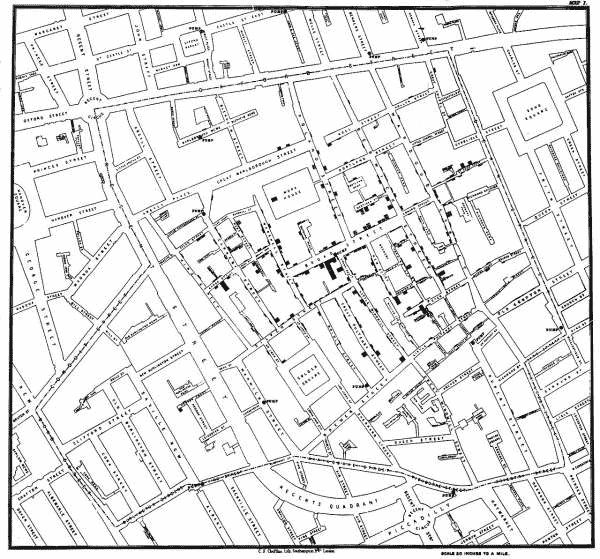
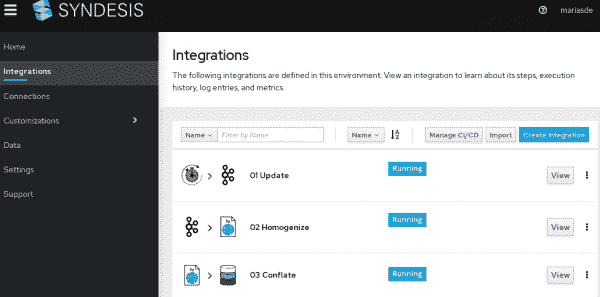
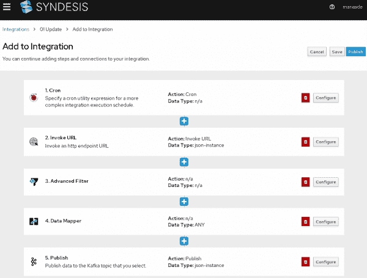

# 使用大空间数据工作流(或者，约翰·斯诺会怎么做？)

> 原文：<https://developers.redhat.com/blog/2020/05/05/working-with-big-spatial-data-workflows-or-what-would-john-snow-do>

随着社交网络的兴起，人们因与世隔绝而有了更多的空闲时间，看到大量地图和图表变得越来越流行。这些是使用大空间数据来解释新冠肺炎是如何扩张的，为什么它在一些国家更快，以及我们如何才能阻止它。

其中一些地图和图表是由经验不足的业余爱好者制作的，他们可以访问大量原始和经过处理的大空间数据。但是他们中的大多数不确定如何处理这些数据。一些没有意识到的业余爱好者混合不同的来源，而不关心首先使数据均匀化。有些人将新旧数据混在一起。最后，大多数人忘记添加相关变量，因为手动处理的数据太多了。

专业人士会如何处理这一切？

## 霍乱的爆发

在我们必须处理大空间数据的情况下，我不禁想知道:约翰·斯诺会怎么做？我说的不是那个寒冷北方打僵尸的[大侠。我说的是最初的](https://en.wikipedia.org/wiki/Jon_Snow_(character))[约翰·斯诺](https://en.wikipedia.org/wiki/John_Snow)，一位来自十九世纪的英国医生，他利用空间数据研究了一次霍乱爆发。

让我们回到 1854 年，伦敦，霍乱爆发造成了重大伤亡。当时大多数医生不知道细菌，以为是由 T2 瘴气引起的，这是一种污染人们的不良空气，使他们生病。

### 约翰·斯诺数据分析

但是约翰不相信这个理论。他对真正的原因有一个假设，怀疑与水有关的问题。他收集了被感染的人住在哪里以及他们从哪里取水的数据，并进行了一些空间数据分析来证明这些想法。图 1 显示了他的原始地图之一。

Original map by John Snow showing the clusters of cholera cases in the London epidemic of 1854Figure 1: Original map by John Snow showing the clusters of cholera cases in the London epidemic of 1854.">

有了这些准确的数据，他能够生成一个显示疾病传播的聚类图。这项工作帮助他证明了他关于霍乱水源的理论。他只有几个数据来源，但都是同质的。此外，他能够直接在现场收集数据，确保数据准确并满足他的需求。

重要的是要注意，因为他使用了正确的数据，所以他得出了正确的结论。他研究了离群值，比如那些人饮用的水源与他们家最近的水源不同。因此，他能够将数据与适当的来源融合在一起，进行管理。对数据来源进行均质化和合并是得出正确结论的相关步骤。

John Snow 必须手动合并和分析所有数据，这是一个不错的选择。他处理的数据量适合用笔和纸工作。但在我们的情况下，当我们试图合并全球所有可用的来源时，我们真正面临的是大空间数据，这是不可能手动处理的。

## 大空间数据

我们不仅有具体的相关数据，而且还有关于不同隔离或社会距离规范、医疗保健、个人储蓄、获得清洁水、饮食、人口密度、人口年龄和以前的医疗保健问题的数据。可用的相关数据量是巨大的。

请记住，如果你的数据能装进一个硬盘，那就不算是大数据。我们在这里讨论的是需要在服务器场上进行无休止的数据存储的数据量。没有分析师可以手动更新、合并和分析所有数据。我们需要工具，好的工具，来提供可靠的结果。

考虑到不同的数据收集者几乎实时但以不同的速率更新他们的数据，每个国家都有自己的统计数据和自己衡量每个变量的方法。因此，在合并这些来源之前，您需要进行转换和均质化。

怎样才能做到不疯不落伍？在您完成图 2 所示的工作流的一半之前，就有新的数据在等着您。

We need to run this workflow continuouslyFigure 2: We need to run this workflow continuously to always use the newest big spatial data available.">

约翰·斯诺会怎么做？嗯，我很肯定他希望我们所有人都使用合适的工具来工作。所以才叫[地点*情报*T3。](https://en.wikipedia.org/wiki/Location_intelligence)

## 中间件拯救世界

关于这四个步骤，有三个可以自动化:更新、均匀化和合并。所有这些都是乏味且重复的任务，使得开发人员很快就开始编写粗糙的代码。我们知道当我们快速编写支持代码时会发生什么:我们倾向于犯别人已经纠正的同样的错误。

嗯，我们很幸运。我们有几个免费的开源软件库和框架可以帮助我们完成这些任务。这些工具可以在[红帽 Fuse 集成平台](https://www.redhat.com/en/technologies/jboss-middleware/fuse)中找到。

### 阿帕奇骆驼

我们的第一选择应该总是使用 [Apache Camel](https://camel.apache.org/) 来帮助我们创建复杂的数据工作流。有了这个框架，我们可以定期从不同的来源提取最新的数据，自动转换和合并。我们甚至可以使用 [Camel K](https://developers.redhat.com/blog/2019/08/27/devnation-live-kubernetes-enterprise-integration-patterns-with-camel-k/) 并让它在某个 Kubernetes 容器上运行，同时我们专注于工作中的非自动化步骤。

在 Camel 中定义工作流很容易。你可以使用[不同的通用语言](https://camel.apache.org/manual/latest/languages.html)比如 [Java](https://camel.apache.org/manual/latest/java-dsl.html) 、 [Javascript](https://camel.apache.org/camel-k/latest/languages/javascript.html) 、 [Groovy、](https://camel.apache.org/camel-k/latest/languages/groovy.html)或者特定的[特定领域语言(DSL)](https://camel.apache.org/manual/latest/dsl.html) 。有了 [Camel 的数百个组件](https://camel.apache.org/components/latest/index.html)，您可以为您的工作流程提供几乎任何来源的数据，处理数据，并以分析所需的格式输出处理后的数据。

### 捆扎

对于那些不太懂技术、觉得编写 Camel 脚本太复杂的数据分析师，我们还有 [Syndesis](https://syndesis.io/) 。借助 Syndesis，您可以[以更直观的方式定义数据工作流](https://developers.redhat.com/blog/2020/03/25/low-code-microservices-orchestration-with-syndesis/)，如图 3 所示。

We can define several processes on Syndesis, each running based on a different trigger.Figure 3: We can define several processes on Syndesis, each running based on a different trigger.">

这意味着您可以更新大量的空间数据，而无需编写任何代码。或者，也许您只是想加快工作流创建过程，以便直接进入分析。

我们既可以创建一个单一的工作流，也可以将其分解成几个工作流，如图 4 所示。例如，第一个进程可以由计时器触发，下载不同的数据源，并将原始数据发送给 Kafka 代理。然后，第二个进程可以监听该代理，转换和均匀化先前下载的数据，并将其存储在某个公共数据存储上。最后，第三个过程可以从具有同质数据的公共存储中提取几个数据源，合并这些数据源，并为进一步的分析或阐述准备数据。

We can easily add steps to the workflow using that plus button.Figure 4: We can easily add steps to the workflow using that plus button.">

请注意，每一步都可以过滤、转换和使用来自不同来源的数据，从而使我们能够以简单直观的方式创建复杂的工作流。我们可以通过不同的 API、XSLT 转换、数据映射和过滤器来运行数据，以确保我们最终得到的数据可供分析。

## 最后一笔

既然我们已经更新、均质化、转换和合并了数据，我们就可以开始分析了。由于 Camel 和 Syndesis 都可以提供不同格式的输出，我们可以将它连接到我们需要进行分析的任何软件。从类似于 [PostgreSQL](https://www.postgresql.org/) 的数据库到类似于 [KML](https://en.wikipedia.org/wiki/Keyhole_Markup_Language) 的基于 XML 的数据格式，我们可以按照我们需要的方式提供我们的分析工具。

比如我们可以使用 [QGIS](https://qgis.org) ，这是一个高级的数据分析桌面应用。您可以将所有那些已经转换和合并的大空间数据源添加到 QGIS 中，以创建漂亮的图形和地图作为输出。之后，你可以用 [OpenLayers](https://openlayers.org/) 或者[传单](https://leafletjs.com/)发布你的地图。

让约翰·斯诺感到骄傲！并且使用免费的开源软件来完成。

*Last updated: June 26, 2020*