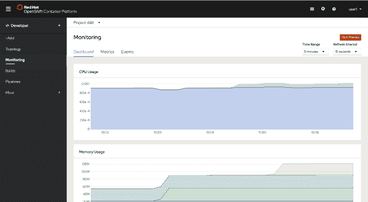
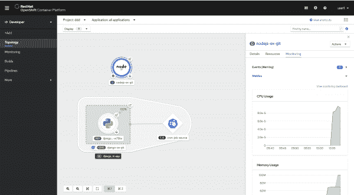

# OpenShift 4.4:洞察您的应用

> 原文：<https://developers.redhat.com/blog/2020/04/30/openshift-4-4-getting-insights-into-your-application>

Red Hat open shift Container Platform 4.4 的 web 控制台中的开发者体验现在包括了一个基于指标的仪表板。借助这个仪表板，您可以深入了解您的应用指标，而不是依赖外部工具。开发人员视角的监控部分提供了这一技术预览功能，提供了对仪表板、指标和事件的访问。资源侧面板上也提供了监控信息，可在拓扑和工作负载视图中访问。

### 监控仪表板

在开发者视角的监控部分下可以找到**监控**->-**仪表盘**页面，如图 1 所示。仪表板有 10 个指标图表，显示项目的相关指标。这些图表提供了对各种指标的深入了解，包括 CPU 使用率、内存使用率、接收带宽、传输带宽、接收数据包的速率、传输数据包的速率、接收数据包的丢弃率和传输数据包的丢弃率。

Figure 1: The Monitoring Dashboard.Figure 1: The Monitoring Dashboard.">

单击图表可以让您更深入地了解指标，包括所有窗格和相关指标值的列表，如图 2 所示。

Figure 2: The Monitoring Metrics.Figure 2: The Monitoring Metrics.">

### 监控指标

现在，在 Monitoring 部分可以看到 Metrics 页面，如图 3 所示。该页面包括五个现成的查询，同时保留了执行自定义查询的能力。

Figure 3: Out-of-the-box metrics queries.Figure 3: Out-of-the-box metrics queries.">

### 监控事件

您可以在 Monitoring 部分的 events 页面上查看与您的项目相关联的事件，如图 4 所示。

Figure 4: Monitoring Events.Figure 4: Monitoring Events.">

## 使用拓扑进行监控

拓扑页面的侧面板上有一个新的 Monitoring 选项卡。此选项卡显示与所选工作负荷相关联的关联事件和度量，并且仅在选择工作负荷时显示。Metrics 部分包括 CPU 使用情况、内存使用情况和接收带宽图表，以及一个链接，用于查看上下文中所选资源的监视仪表板，如图 5 所示。

Figure 5: Monitoring tab in the Topology side panel.Figure 5: Monitoring tab in the Topology side panel.">

监控部分是我们为开发人员提供应用程序监控解决方案的第一步，允许他们解决应用程序的问题。我们已经在考虑未来版本中会出现什么，比如保存自定义查询、额外的开箱即用查询、添加提醒以及添加通知抽屉。

## 准备好开始了吗？

[今天试试 OpenShift】。](http://www.openshift.com/try)

## 提供您的反馈

[在此分享您的想法](https://forms.gle/6HArjszuqyE1xr3f8)并向我们提供您的反馈或想法，以改善应用监控体验。加入我们的 [OpenShift 开发者体验谷歌小组](https://groups.google.com/forum/#!forum/openshift-dev-users)，参与讨论并了解我们的办公时间会议，在这里您可以与我们合作并提供反馈。

## 了解更多信息

如果您有兴趣了解更多关于 OpenShift 的应用程序开发，请从 OpenShift 上的[应用程序开发](https://developers.redhat.com/openshift)[了解更多](https://developers.redhat.com/blog/2020/04/30/whats-new-in-the-openshift-4-4-web-console-developer-experience/)。

*Last updated: June 29, 2020*