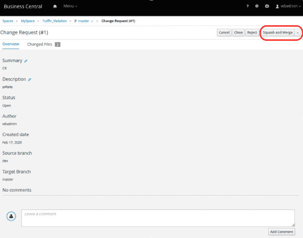
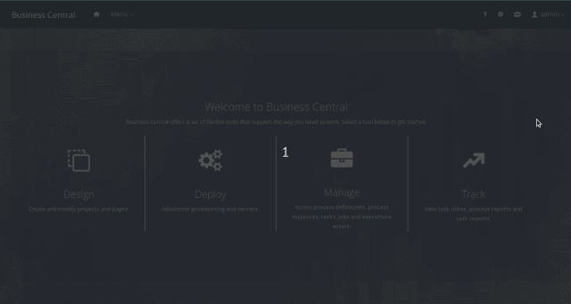
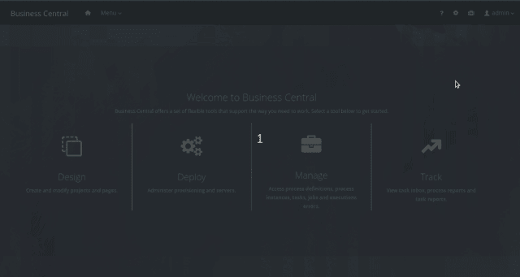
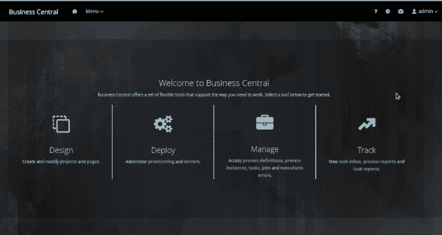
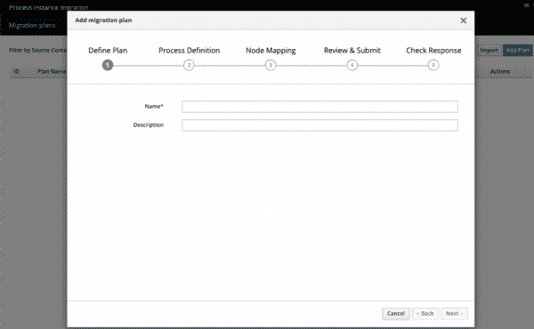

# Red Hat 过程自动化 7.7 带来了更新、修复和技术预览

> 原文：<https://developers.redhat.com/blog/2020/04/29/red-hat-process-automation-7-7-brings-updates-fixes-and-tech-previews>

[Red Hat Process Automation Manager](https://developers.redhat.com/products/rhpam/download)(RHPAM)和[Red Hat Decision Manager](https://developers.redhat.com/products/red-hat-decision-manager/download)(RHDM)7.7 带来了流程、规则、测试、执行和云场景的创作特性。除了这些新特性、可用性和性能改进，7.7 版本还带来了 120 多个错误修复。这些更新是 3 月 18 日发布的中间件业务自动化堆栈 Red Hat 的一部分。

让我们来看看有什么新内容。

## **商业中心:挤压提交和合并**

默认情况下，Business Central 创作环境会在每次更改时提交。Business Central 现在包括了在通过 business central 处理 pull 请求和团队协作时压缩提交的选项，如图 1 所示。

Figure 1: Business Central's Change Request section now has a new Squash and Merge feature.

从简化的角度来看，压缩提交时发生的情况是，在拉请求中提交的一组提交被组合成一个提交。一旦完成，用户就可以合并源和目标分支。这个特性允许用户保持项目历史的整洁，这提高了项目的可维护性。

## **商务中心:项目模板**

组织内的一个常见实践是使用*模板*(基础项目)来帮助新项目的创建。在这种情况下，开发人员通过基于这些现有模板创建新项目并遵循预定义的模式来节省时间。Business Central 用户现在也可以基于模板创建新项目。这些模板可以带来预定义的配置、依赖关系，甚至是流程、规则、数据对象等资产。

业务中心对项目模板的支持是基于对 *Maven 原型*的使用。要开始使用这些模板:

1.  从头开始生成原型(模板)或基于 Kie Group 提供的[这个示例原型](https://github.com/caponetto/awesome-template)。
2.  将原型安装在可由 Business Central 访问的 Maven 存储库中。
3.  将原型添加到 Business Central 的管理设置中，如图 2 所示。

Figure 1:

4.  让您的模板在空间上可用，如图 3 所示。

Figure 2:

现在，您可以基于预定义的模板创建新的项目，如图 4 所示。

Figure 3:

## **通过 REST APIs 管理分支**

Business Central 现在提供了 management REST APIs，帮助您从头开始创建一个新环境，直到您的项目分支编译、测试和部署。通过只使用 REST API 调用，您可以创建新的空间、导入项目以及创建和管理您的分支。以下是 7.7 中提供的新 API:

*   编译分支
*   安装分支
*   测试分支
*   部署分支
*   获取分支
*   添加分支
*   移除分支

您可以在这里找到关于如何使用这些 API 来管理您的业务自动化项目环境的完整分步指南:*[Business Central 上的新 REST 端点- kie-tooling](https://medium.com/kie-foundation/new-rest-endpoints-on-business-central-45d3c39d1c43)* 。

## **业务优化器 Spring Boot 启动器**

Business Optimizer(又名 OptaPlanner)现在包括一个 Spring Boot 启动器。它附带了一个预先配置的`application.properties`文件，该文件设置了默认的自动发现规划解决方案和带有`@PlanningSolution`或`@PlanningEntity`注释的实体。除此之外，Business Optimizer 还添加了 [`SolverManager`](https://www.optaplanner.org/download/releaseNotes/releaseNotes7.html) ，这是一个新的包装器，通过 REST 方便了与一个或多个求解器的交互。

## **DMN 1.3 对 DMN 建模器的兼容性和改进**

RHPAM 和 RHDM 与 DMN 1.3 规范兼容。除了错误修复和改进之外，DMN 建模器现在在盒装表达式中有了基本感觉表达式的智能感知。

## **技术预览:商业中心在 OpenShift 4.x 上创作高可用性**

现在，在 Openshift 4.x 的基础上使用 Business Central，同时使用 RHPAM 和 RHDM 时，您可以访问这一技术预览功能。拥有一个高度可用的 RHPAM 或 RHDM 创作环境意味着您在一个节点上提交的所有工作都会在其他节点上反映出来，并且总是被保留下来。业务自动化操作员负责提供允许用户在故障安全环境中工作的基础设施。换句话说，如果一台服务器出现故障，用户可以在任何其他可用的服务器/pod 上继续工作。

您可以通过使用 Openshift Operator Hub 中可用的 Business Automation Operator 来部署一个高可用性环境，从而测试这个特性。

关于这个特性如何工作的详细信息可以在这里找到: *[商业中心高可用性- kie-tooling](https://medium.com/kie-foundation/business-central-high-availability-b2d55fb33ffd)* 。

## **技术预览:流程实例迁移独立服务**

Red Hat Process Automation Manager 提供了支持流程实例迁移的独立服务，允许您定义在特定流程定义上运行的流程实例应该如何迁移到新的目标流程定义。在 7.7 版中，您现在有了该迁移工具的独立版本，不仅有后端服务，还有前端用户界面。

Figure 4:

Figure 4: Define your process instance migration's behavior.

## **结论**

总之，这些变化提供了更快的项目创建、更简单的项目管理，以及对 Spring Boot、DMN 1.3 和智能感知的支持。为高可用性支持和更简单的实例迁移添加技术预览，您就有了构建更智能的业务应用程序的诀窍。

这个版本由 jBPM、Drools 和 OptaPlanner 上游社区项目的 7.33 版本支持。它通过了 Red Hat 质量工程团队的广泛测试，以提供一个可信的、生产就绪的业务自动化平台。我们建议您保持您的 Red Hat Business Automation 产品始终是最新的，以便您可以享受新的功能，并利用新的改进和错误修复。

*Last updated: June 29, 2020*