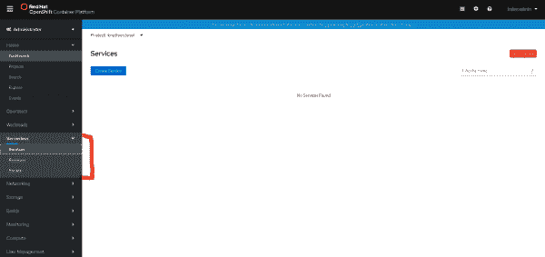

# 使用 Camel K 和 Red Hat OpenShift 无服务器 1.5.0 技术预览版构建和部署无服务器应用程序

> 原文：<https://developers.redhat.com/blog/2020/04/24/build-and-deploy-a-serverless-app-with-camel-k-and-red-hat-openshift-serverless-1-5-0-tech-preview>

[红帽 OpenShift 无服务器](https://www.openshift.com/learn/topics/serverless) 1.5.0(目前在技术预览版)运行在[红帽 OpenShift 容器平台](https://developers.redhat.com/products/openshift/overview) 4.3 上。它支持[有状态、无状态和无服务器工作负载](https://developers.redhat.com/blog/2020/04/08/why-kubernetes-native-instead-of-cloud-native/)在单一的多云容器平台上运行。Apache Camel K 是一个轻量级集成平台，在 Kubernetes 上本地运行。骆驼 K 有无服务器超能力。

在本文中，我将向您展示如何使用 OpenShift Serverless 和 Camel K 来创建一个无服务器的 Java 应用程序，您可以根据需要对其进行伸缩。

## 先决条件

在开始本练习之前，需要安装以下三项技术:

*   [红帽 OpenShift 集装箱平台 4.3](https://docs.openshift.com/container-platform/4.3/architecture/architecture-installation.html)
*   [红帽 OpenShift 无服务器 1.5.0 技术预览版](https://docs.openshift.com/container-platform/4.3/serverless/serverless-release-notes.html)
*   [阿帕奇骆驼 K 操作员 1.0.0 RC1](https://github.com/apache/camel-k/releases)

## 使用的其他技术

作为本练习的一部分，将安装 Knative Serving 和 Kamel(Camel K CLI 工具)。OpenShift 容器平台 4.3 上的 Knative Serving 构建在 Kubernetes 和 [Kourier](https://github.com/knative/net-kourier) 之上，以支持部署和服务无服务器应用。它创建了一组自定义资源定义(CRD ),用于定义和控制 OpenShift 集群上无服务器工作负载的行为。

CLI 工具与 Camel K 集成框架交互，允许我们配置集群并运行集成。与 Knative Serving 一起，这个工具帮助我们构建和部署无服务器应用程序，并测试我们的集成。Kamel CLI 将在本地运行，将您的 Camel 路线直接部署到 Kubernetes 或 OpenShift 集群上。

## 安装 OpenShift 无服务器操作器

OpenShift 无服务器 1.5.0 技术预览版兼容 [OpenShift 容器平台(OCP) 4.3](https://docs.openshift.com/container-platform/4.3/architecture/architecture-installation.html) 。假设您的开发环境中有 OpenShift Container Platform 4.3，在 web 控制台中导航到 OCP 的 **OperatorHub** 。在可用操作员列表中选择 **OpenShift 无服务器操作员**，然后点击**安装**，如图 1 所示。

[](/sites/default/files/blog/2020/03/blog1.png)Figure 1: Select OpenShift Serverless Operator from the list of available operators.">

在我们继续之前，让我们验证一下我们已经安装了 OpenShift 无服务器操作器:

```
$ oc get csv -n openshift-operators

```

您应该会收到以下确认信息:

```
NAME                       DISPLAY                       VERSION REPLACES                    PHASE
serverless-operator.v1.5.0 OpenShift Serverless Operator 1.5.0    serverless-operator.v1.4.1 Succeeded

```

## 安装有创意的服务

接下来，我们将安装 [Knative Serving](https://knative.dev/docs/serving/) ，我们将使用它来部署我们的无服务器应用程序。`serving.yaml`文件在`knative-serving`名称空间中创建一个`KnativeServing`对象:

```
apiVersion: v1
kind: Namespace
metadata:
  name: knative-serving
---
apiVersion: operator.knative.dev/v1alpha1
kind: KnativeServing
metadata:
  name: knative-serving
  namespace: knative-serving

```

输入以下命令以应用对象:

```
$ oc apply -f serving.yaml
namespace/knative-serving created
knativeserving.operator.knative.dev/knative-serving created

```

## 检查豆荚

安装完`KnativeServing`对象后，检查新的`knative-serving-ingress`和`knative-serving`名称空间中的窗格:

```
$ oc get pods -n knative-serving-ingress

```

您应该会看到在`knative-serving-ingress`名称空间中创建了以下窗格:

```
NAME                                    READY STATUS  RESTARTS AGE
3scale-kourier-control-568f886865-fptx4 1/1   Running 0        27m
3scale-kourier-gateway-785c6bd959-b2t6c 1/1   Running 0        27m

```

现在，检查一下`knative-serving`名称空间:

```
NAME                            READY STATUS   RESTARTS AGE
activator-7cc6dbf497-4zwdf      1/1   Running  0        27m
autoscaler-798cfcd656-gqkdc     1/1   Running  0        27m
autoscaler-hpa-5cb5655744-cxff2 1/1   Running  0        27m
controller-55c7dd95f6-9qftj     1/1   Running  0        27m
webhook-769f994744-mjsrr        1/1   Running  0        27m

```

您还应该在 OpenShift 容器平台的**管理员**控制台中看到一个新的**无服务器**选项卡，如图 2 所示。

[](/sites/default/files/blog/2020/03/blog21.png)Figure 2\. The new Serverless tab in OpenShift Container Platform's Administrator console.">

## 安装 Camel K 操作器

接下来，我们将安装 Camel K 操作符。首先为它创建一个新项目:

```
$ oc new-project camelknative

```

从 OpenShift 容器平台的 OperatorHub 安装 Camel K 操作符，如图 3 所示。

[](/sites/default/files/blog/2020/03/blog3.png)Figure 3\. Select the Camel K Operator from the OperatorHub.">

选择`camelknative`名称空间，如图 4 所示。

[](/sites/default/files/blog/2020/03/blog4.png)Figure 4\. Select the camelknative namespace from the Operator Subscription page.">

验证安装状态:

```
$ oc get csv -n camelknative

```

您应该得到安装成功的确认:

```
NAME                        DISPLAY          VERSION   REPLACES                    PHASE
camel-k-operator.v1.0.0-rc2 Camel K Operator 1.0.0-rc2 camel-k-operator.v1.0.0-rc1 Succeeded

```

在我们继续之前，我们需要`kamel`二进制文件，我们将使用它来配置我们的集群并在其上运行集成。

## 安装 kamel

在这里查看[最新的`kamel`版本。一旦你下载了`kamel`，把它添加到你的系统路径中。在 Linux 上，这将是`/usr/bin/kamel`。](https://github.com/apache/camel-k/releases)

验证您是否安装了`kamel`:

```
$ kamel version
Camel K Client 1.0.0-M4

```

我们的开发环境已经完成。接下来，我们将尝试一个简单的部署。

## 展开骆驼路线

我们将从一个简单的路由开始，它使用[under flow](https://camel.apache.org/components/latest/undertow-component.html)作为它的 HTTP 消费者:

```
// Sample.java
import org.apache.camel.builder.RouteBuilder;

public class Sample extends RouteBuilder {

   @Override
   public void configure() throws Exception {
           from("undertow:http://0.0.0.0:8080/test")
          .setBody(constant("{{env:CAMEL_SETBODY}}"))
          .log("Hello Camel-K");
   }
}

```

运行以下命令来构建和部署`Sample.java`路线:

```
$ kamel run Sample.java --name sample --dependency camel-undertow --env CAMEL_SETBODY="Response received from POD : {{env:HOSTNAME}}"
integration "sample" created

```

## 测试集成

现在我们将测试我们的集成。首先，确保它正在运行:

```
$ oc get it
```

您应该会看到以下确认信息:

```
NAME      PHASE     KIT                        REPLICAS
sample    Running   kit-bppjp84iis5hj6nb3vk0   0

```

接下来，我们称我们的豆荚为:

```
$ oc get pods

```

没有一个单元满足请求，因此集成当前被缩放到零:

```
NAME                                       READY     STATUS      RESTARTS   AGE
camel-k-kit-bppjp84iis5hj6nb3vk0-1-build   0/1       Completed   0          18m
camel-k-operator-775dfccddf-5r7zg          1/1       Running     0          56m

```

```
$ oc get deployment sample-4srfn-deployment
NAME                      READY     UP-TO-DATE   AVAILABLE   AGE
sample-4srfn-deployment   0/0       0            0           8m3s

```

当我们向应用程序发送请求时，它会自动扩展为:

```
$ curl http://sample.camelknative.apps.shsinghocp43.lab.com/test
Response received from POD : sample-4srfn-deployment-5dfbf746c5-dw8wr

```

再次调用`$ oc get pods`，您应该会看到以下内容:

```
NAME                                       READY     STATUS      RESTARTS   AGE
camel-k-kit-bppjp84iis5hj6nb3vk0-1-build   0/1       Completed   0          28m
camel-k-operator-775dfccddf-5r7zg          1/1       Running     0          66m
sample-4srfn-deployment-5dfbf746c5-dw8wr   2/2       Running     0          14s

```

示例集成已经扩展到一个:

```
$ oc get it
NAME      PHASE     KIT                        REPLICAS
sample    Running   kit-bppjp84iis5hj6nb3vk0   1

```

```
$ oc get deployment sample-4srfn-deployment
NAME                      READY     UP-TO-DATE   AVAILABLE   AGE
sample-4srfn-deployment   1/1       1            1           14m

```

一旦 pod 是理想的(当应用程序不提供流量服务时)，它会自动缩小到零:

```
NAME                                       READY     STATUS      RESTARTS   AGE
camel-k-kit-bppjp84iis5hj6nb3vk0-1-build   0/1       Completed   0          31m
camel-k-operator-775dfccddf-5r7zg          1/1       Running     0          69m

```

```
$ oc get it
NAME      PHASE     KIT                        REPLICAS
sample    Running   kit-bppjp84iis5hj6nb3vk0   0

```

## 删除应用程序

当您完成集成测试后，您可以使用`kamel`删除我们用 Camel K 创建的简单路线:

```
$ kamel delete sample
Integration sample deleted

```

## 结论

我希望这篇文章已经给了你一个用 OpenShift Serverless 和 Camel K 开发无服务器应用的快速入门，再次注意[Red Hat open shift server less 1 . 5 . 0](https://www.openshift.com/blog/announcing-openshift-serverless-1-5-0-tech-preview-a-sneak-peek-of-our-ga)目前在技术预览中。

*Last updated: June 29, 2020*