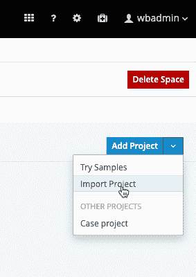
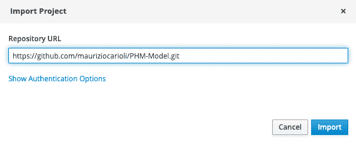
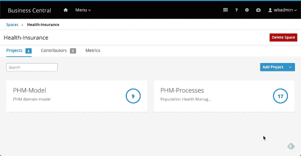
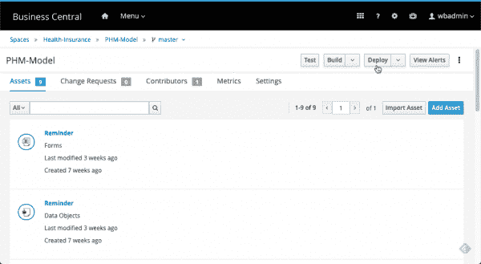
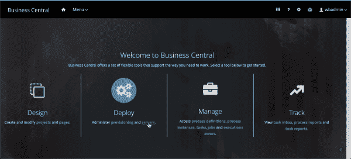
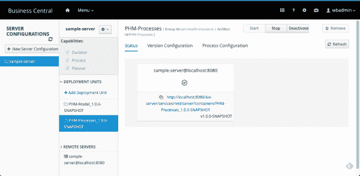

# 通过几个场景运行事件驱动的健康管理业务流程:第 1 部分

> 原文：<https://developers.redhat.com/blog/2020/03/31/running-an-event-driven-health-management-business-process-through-a-few-scenarios-part-1>

在之前的系列文章中， *[大规模设计事件驱动的业务流程:健康管理示例](https://developers.redhat.com/blog/2020/02/19/designing-an-event-driven-business-process-at-scale-a-health-management-example-part-1/)* (您需要阅读该文章以全面理解本文)，您为人口健康管理用例设计并实现了事件驱动的可伸缩业务流程。现在，您将在几个场景中运行这个过程。通过这种方式，您将:

*   对业务流程的运作方式有了深入的了解。
*   有机会验证您的实现是否正确。
*   了解如何连接由业务流程驱动的业务应用程序的用户界面。

最终，本系列将展示一个人口健康管理解决方案，其中包含除业务流程管理(BPM)之外的多种技术，如决策管理(业务规则)、数据流、监控和分析等。未来的文章将讨论如何实现和集成各种组件。

## 先决条件

您需要安装 [Java](https://openjdk.java.net/) 、 [Git](https://git-scm.com/) 和 [Maven](https://maven.apache.org/) 来阅读本文。为了确保您有一个兼容的 Java 版本，请在控制台上运行以下命令(版本 8 或 11 都可以):

```
$ java -version
```

您还需要能够在您的系统上下载、安装和运行 jBPM 。在本文中，我假设 jBPM 安装的目录是`jbpm-server-7.33.0.Final-dist`。然而，您应该使用解压缩 jBPM single zip 发行版后获得的实际名称。

## 事件监听器

现在，确保 jBPM 没有运行。如果是你开始的，就停止它或者杀了它。您需要克隆包含项目的 Git 存储库，这些项目包含您将用来跟踪流程活动的事件侦听器:

```
$ git clone git@github.com:mauriziocarioli/Tracing.git
Cloning into 'Tracing'...

remote: Enumerating objects: 135, done.
remote: Counting objects: 100% (135/135), done.
remote: Compressing objects: 100% (61/61), done.
remote: Total 135 (delta 66), reused 122 (delta 53), pack-reused 0
Receiving objects: 100% (135/135), 50.28 KiB | 1.03 MiB/s, done.
Resolving deltas: 100% (66/66), done.

$ git clone git@github.com:mauriziocarioli/PHM-Tracing.git
Cloning into 'PHM-Tracing'...

remote: Enumerating objects: 58, done.
remote: Counting objects: 100% (58/58), done.
remote: Compressing objects: 100% (27/27), done.
remote: Total 58 (delta 28), reused 53 (delta 23), pack-reused 0
Receiving objects: 100% (58/58), 21.15 KiB | 21.15 MiB/s, done.
Resolving deltas: 100% (28/28), done.

```

进入`Tracing`目录并运行:

```
$ mvn install
[INFO] Scanning for projects...
[INFO]

[INFO] -------------------< com.redhat.batigerteam:tracing >-------------------
[INFO] Building tracing 1.0.0

[INFO] --------------------------------[ jar ]---------------------------------

```

**注意:**第一次运行时，它会从 Maven 中央存储库中下载许多 jar 文件，这可能需要很长时间。

在`mvn install`成功结束后，将`target/tracing-1.0.0.jar`复制到`jbpm-server-7.33.0.Final-dist/standalone/deployments/kie-server.war/WEB-INF/lib`中。

现在向上进入`PHM-Tracing`目录。再次运行`mvn install`，然后将`target/phm-tracing-1.0.0.jar`复制到与前一个 jar 文件相同的目录中。

恭喜，您安装了跟踪罐。

## jBPM 项目

现在，启动 jBPM。例如，在 Mac 或 Linux 上，运行:

```
$ jbpm-server-7.33.0.Final-dist/bin/standalone.sh -c standalone.xml -b 0.0.0.0
```

或者在 Windows 上，运行:

```
$ jbpm-server-7.33.0.Final-dist/bin/standalone.bat -c standalone.xml -b 0.0.0.0
```

如果你已经完成了前一系列中的[，你就已经知道接下来该怎么做了。即便如此，如果您想从头开始而不必重做实现，这些信息对您还是很有用的。](https://developers.redhat.com/blog/2020/02/19/designing-an-event-driven-business-process-at-scale-a-health-management-example-part-1/)

项目`PHM-Processes`的`src/main/sh`目录下有两个脚本。如果你在 macOS 或者 Linux 上，运行脚本`add-users.sh`。如果你使用的是 Windows(PowerShell ),运行`add-users.ps1`。这些脚本创建了测试这些场景所需的所有用户和组。

jBPM 启动后，打开浏览器，转到`http://localhost:8080/business-central/kie-wb.jsp`，以`wbadmin`的身份登录，密码为`wbadmin`。

### 建立您的共享空间

在**商务中心**(图 1)，找到**设计**板块，点击**项目**链接。这是设计和实现流程的地方。

[](/sites/default/files/blog/2020/03/2020-02-20_14-34-40.png)Figure 1: Business Central - Design - projectsFigure 1: Start designing your jBPM project.">

你会发现自己在**设计**区的*空间*层。*设计工件*被组织在*项目*中，这些项目位于*空间*中。这是一个基本的组织层次结构，可以在空间和项目级别应用选择性权限。您需要创建一个名为 **Health-Insurance** 的新空间，然后进入这个空间，这样项目中任何设计工件的顶部路径都将是`com/health_insurance`。

### 添加示例项目

在**健保**空间，点击**添加项目**下拉列表，选择**导入项目**，如图 2 所示。

[](/sites/default/files/blog/2020/03/2020-02-20_14-36-19.png)Figure 2: Add Project - Import ProjectFigure 2: Import a project into the space.">

然后，输入到包含数据模型的 [Git 项目存储库的 GitHub 链接，如图 3 所示。](https://github.com/mauriziocarioli/PHM-Model.git)

[](/sites/default/files/blog/2020/03/2020-02-20_14-37-34.png)Figure 3: Import Project - Repository URLFigure 3: Enter the data model project's Git repository URL.">

点击**导入**继续。现在，使用包含业务流程和子流程的 [Git 存储库重复项目导入。](https://github.com/mauriziocarioli/PHM-Processes.git)

现在在**健康保险**空间中有两个项目(图 4)。

[](/sites/default/files/blog/2020/03/2020-02-24_09-28-02.png)Figure 4: Business Central - Projects.

Figure 4: One space containing multiple projects.

### 部署项目和服务器

进入 **PHM-Model** 项目，等待索引完成，然后点击 **Deploy** 按钮，如图 5 所示。

[](/sites/default/files/blog/2020/03/2020-02-24_09-35-34.png)Figure 5: Business Central - Deploy project.

以同样的方式部署 **PHM-Processes** 项目。然后，进入**商务中心**，找到**部署**板块，点击**服务器**(图 6)。

[](/sites/default/files/blog/2020/03/2020-02-24_09-43-34.png)Figure 6: Business Central - Deploy - servers.

Figure 6: Start designing your jBPM project's servers.">

您应该看到如图 7 所示的两个部署单元。这些是定制的 jar 文件(kjar 文件),包含部署到流程服务器(或 KIE 服务器)的每个项目的可执行工件。

[](/sites/default/files/blog/2020/03/2020-02-24_10-02-09.png)Figure 7: Business Central - Server configurations and deployment units.

Figure 7: View the deployment units that this server is running.

### 克隆获取数据存储库

您几乎完成了所有设置。[你只需要](https://gist.github.com/mauriziocarioli/62675d8759c4126f8e1a586a9d567bea)克隆获取数据服务 REST API 的 Git 存储库(在[之前的系列文章](https://developers.redhat.com/blog/2020/02/19/designing-an-event-driven-business-process-at-scale-a-health-management-example-part-1/)中有描述)，安装依赖项，并在 Node.js 上启动服务:

```
4> git clone https://github.com/mauriziocarioli/PHM-API.git
Cloning into 'PHM-API'...
remote: Enumerating objects: 17, done.
remote: Counting objects: 100% (17/17), done.
remote: Compressing objects: 100% (13/13), done.
remote: Total 17 (delta 6), reused 15 (delta 4), pack-reused 0
Unpacking objects: 100% (17/17), done.
[ec2-user@ip-172-31-33-184.ec2.internal/~/Demos]
5> cd PHM-API
[ec2-user@ip-172-31-33-184.ec2.internal/~/Demos/PHM-API]
6> ls -al
total 44
drwxrwxr-x.  3 ec2-user ec2-user   127 Feb  5 15:23 .
drwxrwxr-x. 10 ec2-user ec2-user   236 Feb  5 15:23 ..
-rw-rw-r--.  1 ec2-user ec2-user  3636 Feb  5 15:23 app.js
drwxrwxr-x.  8 ec2-user ec2-user   163 Feb  5 15:23 .git
-rw-rw-r--.  1 ec2-user ec2-user   256 Feb  5 15:23 .gitignore
-rw-rw-r--.  1 ec2-user ec2-user 11357 Feb  5 15:23 LICENSE
-rw-rw-r--.  1 ec2-user ec2-user   360 Feb  5 15:23 package.json
-rw-rw-r--.  1 ec2-user ec2-user 14282 Feb  5 15:23 package-lock.json
-rw-rw-r--.  1 ec2-user ec2-user   595 Feb  5 15:23 README.md
[ec2-user@ip-172-31-33-184.ec2.internal/~/Demos/PHM-API]
7> npm install
npm WARN phmapi@1.0.0 No repository field.

added 50 packages from 37 contributors and audited 158 packages in 0.781s
found 0 vulnerabilities

[ec2-user@ip-172-31-33-184.ec2.internal/~/Demos/PHM-API]
8> npm start

> phmapi@1.0.0 start /home/ec2-user/Demos/PHM-API
> node app.js

running at port 3200

```

## 结论

在运行这个人口健康管理应用程序的一些场景之前，您需要安装和配置几个组件。

*   事件监听器，对于监控流程中的活动以及对其做出反应非常重要。
*   jBPM 项目本身。
*   Node.js REST 服务，用于提供 jBPM 流程执行所需的数据。

现在你已经准备好去经历下一篇文章中的场景了。

*Last updated: June 29, 2020*