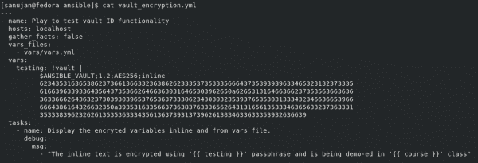

# Red Hat Ansible 和 Red Hat Ansible Tower 中的金库 id

> 原文：<https://developers.redhat.com/blog/2020/01/30/vault-ids-in-red-hat-ansible-and-red-hat-ansible-tower>

本文演示了通过 vault IDs 使用多个 vault 密码。您将学习如何使用 vault IDs 来加密文件和字符串。一旦它们被加密，金库 ID 可以在剧本中引用，并在[红帽城堡](https://www.ansible.com/)和[红帽城堡](https://www.ansible.com/products/tower)中使用。

## 从 Ansible 2.4 及更高版本开始，支持 vault IDs

保险库 id 帮助您使用不同的密码加密不同的文件，以便在剧本中引用。在 Ansible 2.4 之前，每个 Ansible 剧本中只能使用一个保险库密码。实际上，每个文件都需要使用相同的保险库密码进行加密。

首先，需要在您的`ansible.cfg`文件中预先创建和引用保险库 id。以下节选自`ansible-config list`，用于配置`DEFAULT_VAULT_IDENTITY_LIST`:

```
default: []
description: A list of vault-ids to use by default. Equivalent to multiple --vault-id
args. Vault-ids are tried in order.
env:
- {name: ANSIBLE_VAULT_IDENTITY_LIST}
ini:
- {key: vault_identity_list, section: defaults}
name: Default vault ids
type: list
yaml: {key: defaults.vault_identity_list}
```

您可以在`ansible.cfg`中引用多个保险库 id 及其对应的保险库文件。`default`部分下的`vault_identity_list`键用于将保险库 id 映射到文件。

`ansible.cfg`具有以下配置:

```
[sanujan@fedora ansible]$ cat ansible.cfg
[defaults]
inventory = inventory
remote_user = root
vault_identity_list = inline@~/ansible/.inline_pass , files@~/ansible/.files_pass
```

出于本文的目的，我使用上面的最后一行在`$HOME/ansible`目录中预先创建了两个具有适当权限的 vault 密码文件。最后一行将 vault-id `inline`映射到`/home/sanujan/ansible/.inline_pass`，将 vault-id `files`映射到`/home/sanujan/ansible/.files_pass`。

这些密码文件的内容如下所示:

```
[sanujan@fedora ansible]$ cat ~/ansible/.files_pass
REDHAT
[sanujan@fedora ansible]$ cat ~/ansible/.inline_pass
redhat
[sanujan@fedora ansible]$ ls -l ~/ansible/.files_pass ~/ansible/.inline_pass
-r--------. 1 sanujan sanujan 7 Sep 23 06:25 /home/sanujan/ansible/.files_pass
-r--------. 1 sanujan sanujan 7 Sep 23 06:25 /home/sanujan/ansible/.inline_pass
```

这段代码创建了一个样例剧本，包含加密的文本和对加密的`vars`文件的引用，(`vars/vars.yml`)，如图 1 所示。

[](/sites/default/files/blog/2019/12/Sample_Playbook_with_vault.png)Figure 1: Your playbook with its new encrypted vault contents.">

下一节将详细介绍如何加密字符串和变量文件。

## **加密剧本中包含/引用的文件**

要为文件创建加密部分，请运行:

```
[sanujan@fedora ansible]$ ansible-vault encrypt --encrypt-vault-id files vars/vars.yml
```

`--encrypt-vault-id files`是我们如何引用 vault ID“文件”来加密剧本目录中的文件`vars/vars.yml`。这个命令没有提示我们输入密码，因为它引用了来自`ansible.cfg`的 ID“文件”。

配置文件映射到`~/ansible/.files_pass`，其中密码短语`REDHAT`是硬编码的。在`vars/vars.yml`文件中，用键`course`和值`DO457`初始化一个变量。

要查看加密文件，您可以使用`ansible-vault`的查看选项。这里，Ansible 自动获取密码短语，因为它在`ansible.cfg`中被引用:

```
[sanujan@fedora ansible]$ ansible-vault view vars/vars.yml 
course: DO457
```

## **加密将在剧本中使用的字符串**

要加密拟在 Ansible 剧本中使用的字符串，请使用类似于以下内容的格式:

```
[sanujan@fedora ansible]$ ansible-vault encrypt_string --encrypt-vault-id inline -n testing this-is-the-secret
```

`--encrypt-vault-id inline`部分是我们引用用于加密字符串`this-is-the-secret`的保险库 ID `inline`的方式。接下来，我们使用`-n testing`将`testing`变量设置为`this-is-the-secret`的值。

该命令不会提示我们输入密码。相反，它引用来自`ansible.cfg,`的 ID `inline`，该 ID 映射到带有密码短语`redhat`的`~/ansible/.inline_pass`。该命令的结果如图 2 所示。

[](/sites/default/files/blog/2019/12/encrypt_string_output.png)Figure 2: Encrypting a string to put in your Ansible playbook.">

输出细分如下:

*   变量名`testing`，后跟`!vault |`，表示保险库是加密的。
*   支持保险库 ID 的保险库版本是`1.2`。
*   256 位的 AES 密码用`AES256`表示。
*   正在使用的保险库 ID 是`inline`。

**注意:**标题中可以看到保险库 ID。

现在，您可以复制并粘贴内容，包括变量名(在我们的例子中是`testing,`)，一直到`Encryption Successful`之前的那一行。

## **执行剧本**

要执行本行动手册，请运行:

```
[sanujan@fedora ansible]$ ansible-playbook vault_encryption.yml
```

结果如图 3 所示。

[](/sites/default/files/blog/2019/12/ansible_playbook_execution_output.png)Figure 3: Executing your new playbook.">

## **在剧本执行期间提示保险库密码**

如果在`ansible.cfg`中引用了`vault_identity_list`键，Ansible 将总是从左到右读取这些密码文件，检查可能的密码匹配，并忽略波浪号(`~`)字符之前的保险库 id。如果您喜欢 Ansible 提示您输入密码来解密 vault 字符串/文件，您可以在`ansible.cfg`中注释掉`vault_identity_list`键。

要在需要提示时执行行动手册，请使用`--vault-id id@prompt`:

```
[sanujan@fedora ansible]$ ansible-playbook --vault-id inline@prompt --vault-id files@prompt vault_encryption.yml
```

图 4 显示了一个例子。

[](/sites/default/files/blog/2019/12/Vault_Prompt_Password.png)Figure 4: Being prompted while executing your new playbook.">

如您所见，该命令提示您两次:一次是输入 vault ID `inline`的密码，另一次是输入`files`的密码。

## **易变塔中的保险库 id**

从塔 3.3 开始，Ansible 塔也支持保险库 id。您可以在创建类型为`Vault`的凭证时引用这些保险库 id，如图 5 所示。

[](/sites/default/files/blog/2019/12/Vault_in_Tower.png)Figure 5: Using Vault IDs in Ansible Tower.">

## **总结**

保管库 id 可以灵活地选择多个密码来加密不同的文件和字符串。Ansible Tower 在创建`Vault`凭证时也支持保险库 id。

## **了解更多信息**

要了解更多有关保管库 id 以及如何在 Red Hat Ansible 和 Red Hat Ansible Tower 中使用它们的信息，请参阅以下资源:

*   [安全保险库 ID](https://docs.ansible.com/ansible/latest/user_guide/vault.html#vault-ids-and-multiple-vault-passwords)
*   [可接受的文件](https://docs.ansible.com/ansible/latest/index.html)
*   [可变塔文件](https://docs.ansible.com/ansible-tower/)

*Last updated: October 12, 2020*