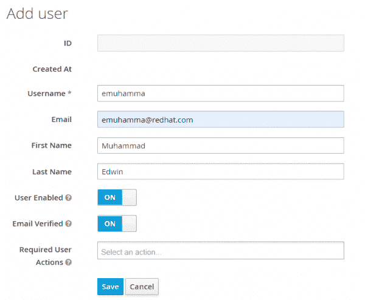
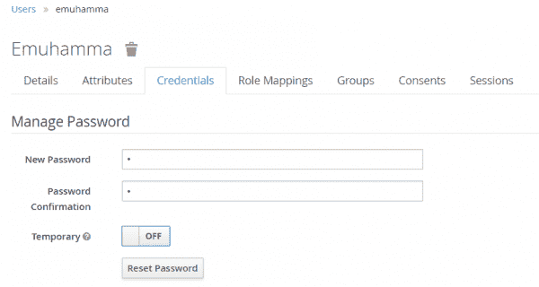
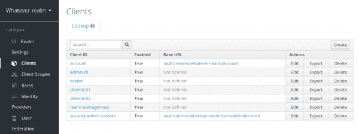
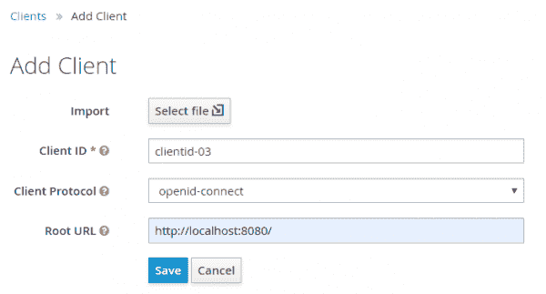
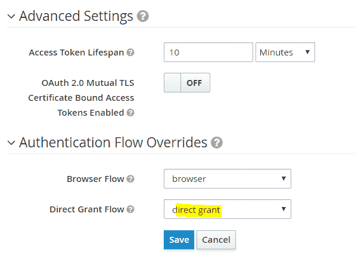
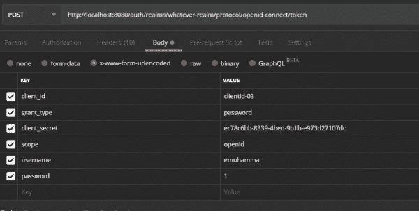

# 使用 Keycloak 的 API 登录和 JWT 令牌生成

> 原文：<https://developers.redhat.com/blog/2020/01/29/api-login-and-jwt-token-generation-using-keycloak>

Red Hat single sign-on (SSO)或其开源版本 Keycloak 是 web SSO 功能的领先产品之一，它基于流行的标准，如安全断言标记语言(SAML) 2.0、OpenID Connect 和 OAuth 2.0。Red Hat SSO 最强的特性之一是，我们可以通过多种方式直接访问 Keycloak，无论是通过简单的 HTML 登录表单，还是 API 调用。在下面的场景中，我们将生成一个 JWT 令牌，然后对其进行验证。所有事情都将使用 API 调用来完成，因此 Keycloak 的 UI 不会直接暴露给公众。

## 

设置用户

首先，我们将在 Keycloak 中创建一个简单的用户，如图 1 所示。

[](/sites/default/files/blog/2019/12/keycloak01-1.png)

图 1:在 Keycloak 中创建一个用户。">

填写所有必填字段，如**用户名**、**名**和**姓**，如图 2 所示。

[](/sites/default/files/blog/2019/12/keycloak02-1.png)

图 2:输入用户的信息。">

设置用户的密码，如图 3 所示。

[](/sites/default/files/blog/2019/12/keycloak03-1.png)

图 3:设置用户密码。">

## 设置客户端

下一步是在我们的领域中创建一个特定的*客户端*，如图 4 所示。Keycloak 中的客户端代表特定用户可以访问的资源，无论是验证用户身份、请求身份信息还是验证访问令牌。

[](/sites/default/files/blog/2019/12/keycloak04-1.png)

图 4:查看您现有的客户端。">

点击**创建**，打开**添加客户端**对话框，如图 5 所示。

[](/sites/default/files/blog/2019/12/keycloak05-1.png)

图 5:创建一个新的客户端。">

填写客户表单中的所有必填字段。请特别注意**直接授权流**(如图 6 所示)，并将其值设置为**直接授权**。另外，将**访问类型**改为**机密**。

[](/sites/default/files/blog/2019/12/keycloak06-1.png)

图 6:覆盖客户端的认证流程。">

最后，将**客户端认证器**字段中的客户端凭证更改为**客户端 Id 和秘密**，如图 7 所示。

[](/sites/default/files/blog/2019/12/keycloak07-1.png)

图 7:设置新客户机的凭证。">

## 测试你的新客户

现在，我们可以通过 REST API 测试新创建的客户机，模拟一个简单的登录。我们的认证 URL 是:

```
http://localhost:8080/auth/realms/&lt;your-realm-name&gt;/protocol/openid-connect/token
```

填写参数并用我们的用户名和密码设置我们的`client_id`和`client_secret`:

```
curl -L -X POST 'http://localhost:8080/auth/realms/whatever-realm/protocol/openid-connect/token' \
-H 'Content-Type: application/x-www-form-urlencoded' \
--data-urlencode 'client_id=clientid-03' \
--data-urlencode 'grant_type=password' \
--data-urlencode 'client_secret=ec78c6bb-8339-4bed-9b1b-e973d27107dc' \
--data-urlencode 'scope=openid' \
--data-urlencode 'username=emuhamma' \
--data-urlencode 'password=1'
```

或者，我们可以使用像 Postman 这样的 REST API 工具来模拟一个 HTTP POST 请求，如图 8 所示。

[](/sites/default/files/blog/2019/12/keycloak08-1.png)

图 8:我们模拟的 HTTP POST 请求。">

结果将是一个有效的 JWT 令牌:

```
{
    "access_token": "eyJhbGciOiJSUzI1NiIsInR5cCIgOiAiSldUIiwia2lkIiAwNjEwLCJpc3MiOiJodHRwO.......wKRTus6PAoHMFlIlYQ75dYiLzzuRMvdXkHl6naLNQ8wYDv4gi7A3eJ163YzXSJf5PmQ",
    "expires_in": 600,
    "refresh_expires_in": 1800,
    "refresh_token": "eyJhbGciOiJIUzI1NiIsInR5cC.......IsInZpZXctcHJvZmlsZSJdfX0sInNjb3BlIjoib3BlbmlkIGVtYWlsIHByb2ZpbGUifQ.ePV2aqeDjlg6ih6SA7_x77gT4JYyv7HvK7PLQW-X1mM",
    "token_type": "bearer",
    "id_token": "eyJhbGciOiJSUz.......A_d_LV96VCLBeTJSpqeqpMJYlh4AMJqN6kddtrI4ixZLfwAIj-Qwqn9kzGe-v1-oe80wQXrXzVBG7TJbKm4x5bgCO_B9lnDMrey90rvaKKr48K697ug",
    "not-before-policy": 0,
    "session_state": "22c8278b-3346-468e-9533-f41f22ed264f",
    "scope": "openid email profile"
}
```

错误的用户名和密码组合会导致 HTTP 401 响应代码和响应正文，如下所示:

```
{
    "error": "invalid_grant",
    "error_description": "Invalid user credentials"
}
```

给你。现在，您已经有了一个配置好的登录 API，可以与 Keycloak 协同工作。玩得开心！

*Last updated: April 1, 2022*