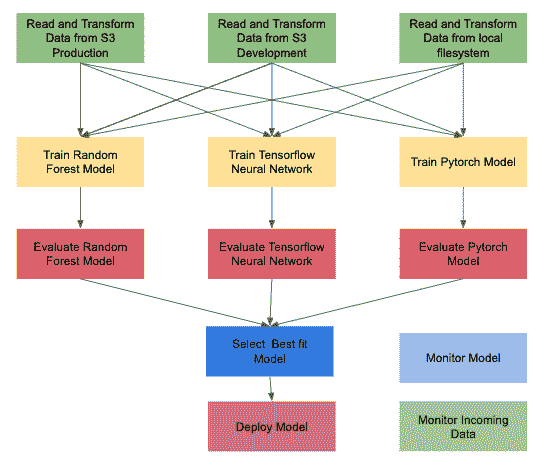
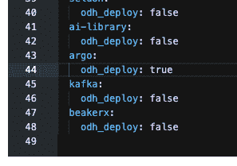
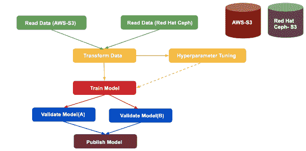
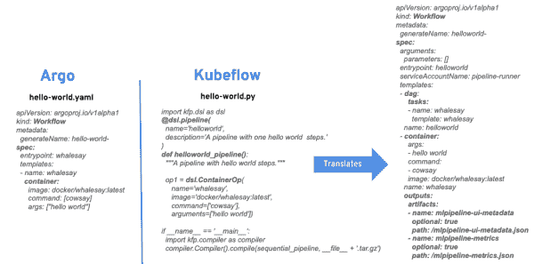
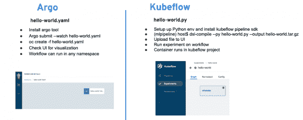

# 在 Red Hat OpenShift 上使用开放数据中心和 Kubeflow 的 AI/ML 管道

> 原文：<https://developers.redhat.com/blog/2019/12/16/ai-ml-pipelines-using-open-data-hub-and-kubeflow-on-red-hat-openshift>

当谈到优化生产级人工智能/机器学习(AI/ML)流程的过程时，工作流和管道是这一努力不可或缺的一部分。管道用于创建可重复、自动化、可定制和智能的工作流。

图 1 给出了一个 AI/ML 管道的例子，其中数据提取、转换和加载(ETL)、模型训练、模型评估和模型服务等功能是作为管道的一部分自动执行的。

[](/sites/default/files/blog/2019/11/Screen-Shot-2019-11-26-at-2.46.17-PM.png)

图 1: AI/ML 示例管道。">

AI/ML 管道有许多属性和功能，包括以下内容:

*   **自动化**:自动执行工作流程步骤的能力，无需任何人工干预。
*   **可重复性**:重复步骤的能力，例如只改变输入参数就重新训练模型或重新评估模型。
*   **工件传递(输入，输出)**:在工作流步骤之间传递数据的能力，有时条件和循环依赖于这些数据。
*   **触发器**:自动触发工作流的能力，无需手动启动管道。日历事件、消息和监控事件等触发器在许多用例中都有使用。
*   **多集群**:跨多个集群运行管道的能力，例如混合云中的情况。在许多使用案例中，数据驻留在与处理发生地不同的集群中。
*   **Step 或 DAG(有向无环图)特性**:大多数综合流水线需要 DAG 结构，具有目标、并行处理、条件、循环、暂停/恢复、超时和重试等特性。

现在有很多 AI/ML 管道工具，最流行的原生 Kubernetes 工具是 Argo 和 [Kubeflow](https://www.kubeflow.org/) 管道。在接下来的部分中，我们将描述使用开放数据中心和 Kubeflow 管道，这两种管道都使用 Argo 作为 AI/ML 管道工具。

## 开放式数据中心

[开放数据中心(ODH)](https://opendatahub.io/news/2018-12-04/open-data-hub-overview.html) 是一个开源的端到端 AI/ML 平台，在 [Red Hat OpenShift](https://developers.redhat.com/openshift/) 本地运行。Open Data Hub 是一个元操作器，包括端到端 AI/ML 开发和生产工作流所需的许多工具，可以从 Openshift 4.x 目录社区操作器安装。对于管道开发，ODH 包括 Argo 工作流工具的安装。

[Argo workflow](https://opendatahub.io/docs/getting-started/quick-installation.html) 是一个开源的 [Kubernetes](https://developers.redhat.com/topics/kubernetes/) 容器本地工作流引擎，用于在 Kubernetes 上编排管道。管道步骤被定义为使用 YAML 的本地 Kubernetes 容器。多步骤流水线可以被定义为具有诸如每个步骤的输入/输出、循环、参数化、条件、超时(步骤&工作流级别)和重试(步骤&工作流级别)等特征的 DAG。Argo 定义了一个名为 workflow 的 Kubernetes 定制资源来创建管道。

将 Argo 集成到 ODH 操作符中需要编写一个 Ansible 角色来安装 Argo 所需的清单。它还包括用于名称空间绑定安装的特定的基于角色的访问控制(RBAC)，并特别使用“k8sapi”作为执行器，而不是 docker，因为 Openshift 中的默认注册表是 CRI-O(CRI-O 取代了 Openshift 4.x 中以前提供的 Docker 引擎)。在下一节中，我们将定义安装 ODH 和运行示例 Argo 工作流的步骤。

### 安装和运行 ODH Argo

安装 ODH 的基本要求是 Red Hat Openshift 3.11 或 4.x，分步说明请遵循 [Open Data Hub 快速安装指南](https://opendatahub.io/docs/getting-started/quick-installation.html)。然而，在创建 ODH 实例的第 4 步中，确保为 Argo 组件设置“true ”,如下图 2 所示。

[](/sites/default/files/blog/2019/11/Screen-Shot-2019-11-26-at-3.30.10-PM.png)

图 2:为 CR(自定义资源)文件中的 Argo 组件指定“true”。">

安装完成后，通过检查为 Argo 创建的两个窗格来验证 Argo 已安装:argo-ui 和工作流控制器。要启动 Argo UI 门户，请在网络部分中单击 Argo UI 路线。对于一个简单的测试，我们可以运行 Argo 项目提供的“hello world”示例。用下面的代码创建一个 hello-world.yaml 文件。

```
apiVersion: argoproj.io/v1alpha1
kind: Workflow
metadata:
  generateName: hello-world-
spec:
  entrypoint: whalesay
  templates:
  - name: whalesay
     container:
        image: docker/whalesay:latest
        command: [cowsay]
        args: ["hello world"]
```

从终端，确保您在 ODH 名称空间中，并运行:

```
oc create -f hello-world.yaml
```

检查 Argo 门户网站以查看工作流程进度并查看“hello world”日志消息。对于一个更全面的例子，我们提供了一个示例 DAG 流水线，它包括一个 For 循环、一个条件循环、并行处理和用于远程 S3 桶的工件访问。工作流程如图 3 所示，同时还提供了 YAML 文件。

[](/sites/default/files/blog/2019/11/Screen-Shot-2019-11-26-at-3.37.48-PM.png)

图 3:具有 for 循环、条件循环、并行处理和远程 S3 存储桶的工件访问的示例管道。">

```
apiVersion: argoproj.io/v1alpha1
kind: Workflow
metadata:
  generateName: frauddetection
spec:
  entrypoint: fraud-workflow
  serviceAccountName: argo-workflow
  volumes:
  - name: workdir>
    emptyDir: {}
  templates:
  - name: echo
    inputs:
      parameters:
      - name: message
    container:
      env:
      - name: ACCESS_KEY_ID
        valueFrom:
          secretKeyRef:
            name: keysecret
            key: accesskey
      - name: SECRET_ACCESS_KEY
        valueFrom:
          secretKeyRef:
            name: keysecret
            key: secretkey
      - name: S3_ENDPOINT_URL
        value: "insert s3 url"
      image: alpine:3.7
      command: [echo, "{{inputs.parameters.message}}"]
  - name: whalesay
    container:
      image: docker/whalesay:latest
      command: [sh, -c]
      args: ["sleep 1; echo -n true > /tmp/hyper.txt"]
  - name: volumes-emptydir-example
    container:
      image: debian:latest
      command: ["/bin/bash", "-c"]
      args: ["
        vol_found=`mount | grep /mnt/vol` && \
        if [[ -n $vol_found ]]; then echo \"Volume mounted and found\"; else echo \"Not found\"; fi; sleep 1; echo -n true > /mnt/vol/hyper.txt"]>
      volumeMounts:
      - name: workdir
        mountPath: /mnt/vol
    outputs:
      parameters:
      - name: should-hyper
        valueFrom:
          path: /mnt/vol/hyper.txt
  - name: fraud-workflow
    dag:
      tasks:
      - name: Read-Data-AWS
        template: echo
        arguments:
          parameters: [{name: message, value: Read-Data-AWS}]
      - name: Read-Data-Ceph
        dependencies:
        template: echo
        arguments:
          parameters: [{name: message, value: Read-Data-Ceph}]
      - name: Transform-Data
        dependencies: [Read-Data-Ceph,Read-Data-AWS]
        template: volumes-emptydir-example
      - name: Hyper-Tuning
        dependencies: [Transform-Data]
        template: echo
        when: "{{tasks.Transform-Data.outputs.parameters.should-hyper}} == true"
        arguments:
          parameters: [{name: message, value: Hyper-Tuning}]
      - name: Train-Model
        dependencies: [Transform-Data,Hyper-Tuning]
        template: echo
        arguments:
          parameters: [{name: message, value: Train-Model}]
      - name: Validate-Model
        dependencies: [Train-Model]
        template: echo
        arguments:
          parameters: [{name: message, value: "{{item}}"}]
        withItems:
        - hello world
        - goodbye world
      - name: Publish-Model
        dependencies: [Validate-Model]
        template: echo
        arguments:
          parameters: [{name: message, value: Publish-Model}]
```

从工作流描述中，我们可以看到 S3 设置是从一个 OpenShift secret 传递给模板“echo”的。在参数“should-hyper”为真的条件下，为“超调谐”步骤实现 if 条件。该参数由“转换数据”步骤指定。for 循环示例显示在“验证模型”步骤中，该步骤运行两次，一次使用“hello world ”,另一次使用“goodbye world”作为容器的参数。

### 使用 Kubeflow 管道

Kubeflow 是一个开源 AI/ML 项目，专注于模型训练、服务、管道和元数据。Kubeflow 管道工具使用 Argo 作为执行管道的底层工具。然而，Kubeflow 在 Argo 之上提供了一个层，允许数据科学家使用 Python 而不是 YAML 文件来编写管道。该项目提供了在构建管道时使用的 Python SDK。Kubeflow 还提供了一个管道门户，允许使用特定管道的指标和元数据进行实验。这允许用户使用特定的指标跟踪和重复实验。有关 Kubeflow 项目的详细信息，请访问[kubeflow.org](http://kubeflow.org)。

作为开放数据中心项目的一部分，我们已经在 OCP 4.x 上改编并安装了 Kubeflow。我们的工作可以在 [GitHub 开放数据中心](https://github.com/opendatahub-io/kubeflow)项目上继续。

要运行“hello world”示例工作流，有两种选择:您可以从 Kubeflow 管道门户运行实验并上传 YAML 文件，或者编写工作流的 Python 版本并使用 SDK 编译它，然后在实验中上传到门户。

要比较使用 YAML 和 Python 的“hello world”示例，请参见下面的图 4。如图所示，每个 Python 管道都被转换成带有元数据的 YAML 管道。

[](/sites/default/files/blog/2019/11/Screen-Shot-2019-11-27-at-11.24.16-AM.png)

图 4:YAML 和 Python 格式的“hello world”管道的比较。">

有关运行 YAML Argo 工作流与 Kubeflow Python 工作流的比较，请参见图 5 中的分步说明。如您所见，使用 Python 需要编译代码并将其存储在压缩的 tar.gz 文件中，然后可以上传到 Kubeflow 门户。

[](/sites/default/files/blog/2019/11/Screen-Shot-2019-11-27-at-11.27.04-AM.png)

图 Argo 和 Kubeflow 管道创建的比较。">

## 未来的考虑

许多可用的 AI/ML 管道工具都缺少一些重要的功能，比如触发器。Argo 项目确实包括 Argo events 工具，它提供了运行工作流的触发器，但它仍处于早期阶段。OpenShift cron 作业可以用来触发工作流，但是它们也有局限性，比如触发基于消息流的工作流。监控在管理群集方面也很重要，由 Argo 作为 Prometheus 的指标收集接口提供；然而，缺少对工作流中成功或失败的监控。多集群管道目前还不可用，但 Argo 有一个工具处于早期阶段，它允许在不同的集群中运行工作流步骤。

*Last updated: January 24, 2022*