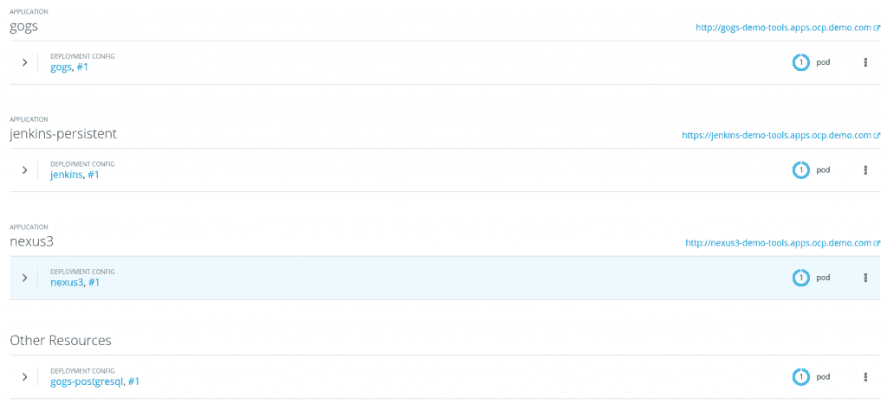
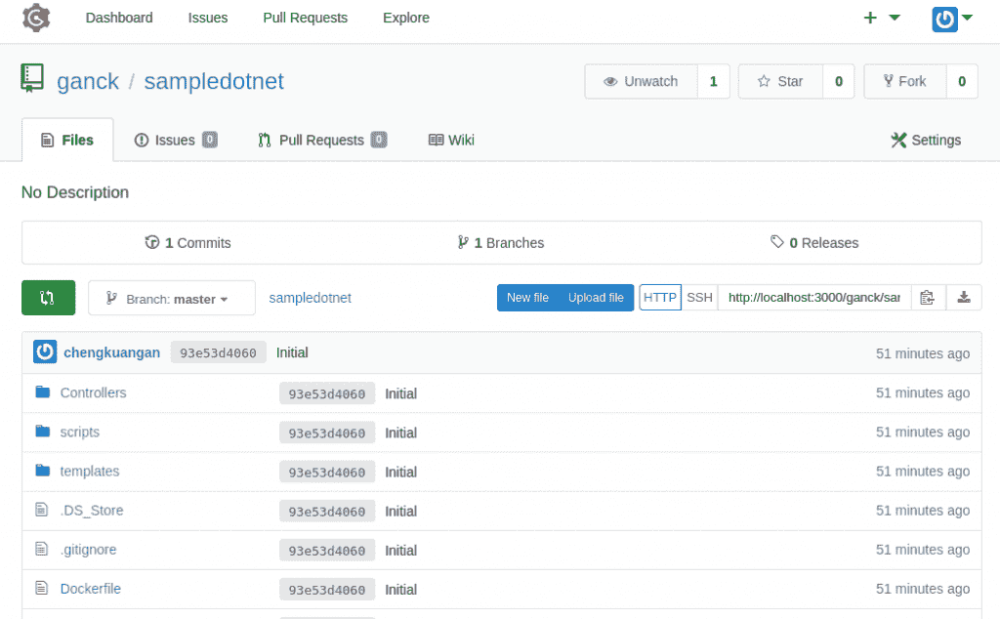
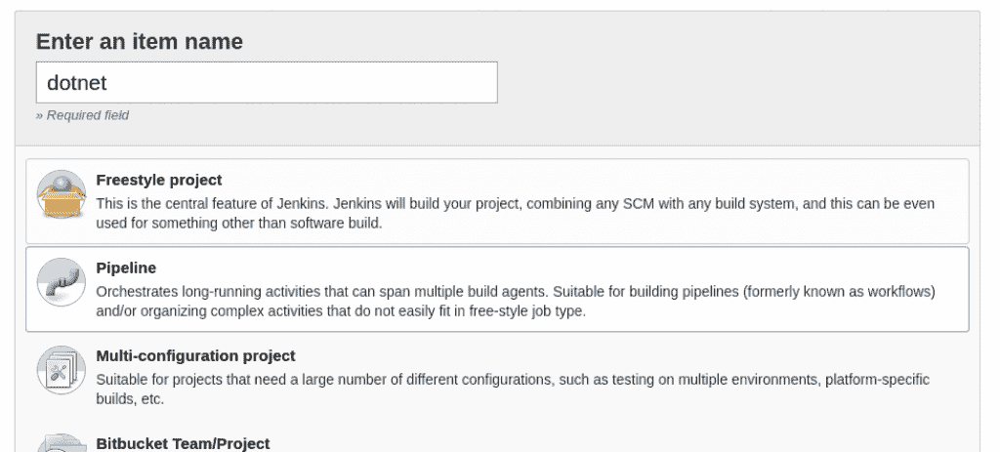
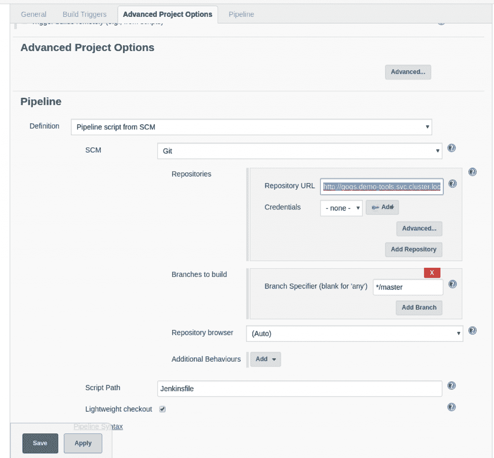

# CI/CD 用于。NET 核心容器在 Red Hat OpenShift 上的应用

> 原文：<https://developers.redhat.com/blog/2019/10/17/ci-cd-for-net-core-container-applications-on-red-hat-openshift>

很多人已经为做了持续集成和持续交付(CI/CD)。NET 核心，但他们可能仍然想知道如何在[红帽 OpenShift 容器平台(OCP)](https://developers.redhat.com/products/openshift) 中实现这个过程。信息是存在的，但没有在结构上记录下来。在本文中，我们将详细介绍这个过程。

## 的 CI/CD 流程。网络应用

CI/CD 流程对于来说相当简单。NET 应用程序，具有以下高级过程:

1.  开始[詹金斯](https://jenkins.io)检查詹金斯文件。
2.  去拿。来自 Gogs 的 NET 核心源代码。
3.  根据配置的管道继续，在这种情况下，这意味着:
    1.  运行`dotnet restore`从 Nexus 存储库中恢复 NuGet 包。
    2.  运行`dotnet publish`构建并发布`.dll`文件。
    3.  运行`oc start-build`来使用发布的`.dll`文件构建容器映像，当`Development`项目中的映像构建完成时，部署或重新部署容器。
    4.  在`Development`项目中标记图像(在这个例子中，标记是`sampledotnet:UATReady-1.0.0`，这触发了从`Development`项目到用户验收测试(`UAT`)项目的图像提取。

`Development`和`UAT`项目所需的 Openshift 工件将在下一节中使用示例模板进行预配置，您可以从 GitHub 下载该模板。

## 配置 OpenShift

**注意:**您可能希望根据您的环境更改一些路径和参数。

要为我们的示例 CI/CD 流程配置 Red Hat OpenShift，请完成以下步骤。

1.  创建您的 OpenShift 项目:

```
oc new-project demo-dev --display-name="Development"
oc new-project demo-uat --display-name="UAT"
oc new-project demo-tools --display-name="CI/CD Tools"
```

2.  应用必要的权限，以便 Jenkins 可以修改和访问`Development`和`UAT`项目。我们还需要授予`UAT`项目从`Development`项目中提取图像的权限:

```
oc policy add-role-to-user edit system:serviceaccount:demo-tools:jenkins -n demo-dev
oc policy add-role-to-user edit system:serviceaccount:demo-tools:jenkins -n demo-uat
oc policy add-role-to-user system:image-puller system:serviceaccount:demo-uat:default -n demo-dev
```

**注意:**如果这些行的结果是“警告:找不到 ServiceAccount 'jenkins”，则可以忽略此消息。

3.  部署必要的 CI/CD 工具:

```
oc new-app -f https://raw.githubusercontent.com/chengkuangan/templates/master/gogs-persistent-template.yaml -p SKIP_TLS_VERIFY=true -p DB_VOLUME_CAPACITY=1Gi -p GOGS_VERSION=latest -p GOGS_LIMIT_CPU=300m -p GOGS_LIMIT_MEM=256Mi -p POSTGRESQL_LIMIT_CPU=200m -p POSTGRESQL_LIMIT_MEM=256Mi -n demo-tools
oc new-app -f https://raw.githubusercontent.com/chengkuangan/templates/master/nexus3-persistent-templates.yaml -p NEXUS_VOLUME_CAPACITY=20Gi -p NEXUS_VERSION=latest -p NEXUS_LIMIT_CPU=1 -p NEXUS_LIMIT_MEM=3Gi -n demo-tools
oc new-app jenkins-persistent -n demo-tools
oc create -f https://raw.githubusercontent.com/chengkuangan/dotnetsample/master/templates/dotnet-jenkins-slave.yaml -n demo-tools
```

**注意:**通常微软的 Team Foundation Server (TFS)用于微软的源代码管理(SCM)；然而，在这个例子中使用 Gogs 主要是因为没有 TFS 可供我试用。如果 TFS 是用例，你将需要为詹金斯安装 TFS 插件，使詹金斯和 TFS 之间的集成。

现在，您可以在 OpenShift 中看到您部署的工具:



您可能会收到一个错误。由于缺少图像流，Net Jenkins slave 无法启动，如下所示:


在这种情况下，上图显示了 Jenkins pod 中的一个错误，表明没有找到 ImageStream `dotnet-22-jenkins-slave-rhel7`。要解决这个问题，您需要在`dotnet-jenkin-slave.yaml`文件中更改以下内容，以便为 ImageStream 设置使用正确的 URL 路径:

```
<image>dotnet-22-jenkins-slave-rhel7:latest</image>
```

或者，您可以修改之前创建的配置映射(在本例中命名为`dotnet-jenkins-slave-22`)。

4.  部署。NET 核心工件。NET 核心模板。请注意参数`--allow-missing-imagestream-tags=true`，它表示在我们运行管道时，在构建映像之前，我们没有任何可用的映像:

```
oc new-app -n demo-dev --allow-missing-imagestream-tags=true -f https://raw.githubusercontent.com/chengkuangan/dotnetsample/master/templates/dotnet-template.yaml -p IMAGE_PROJECT_NAME=demo-dev -p IMAGE_TAG=latest -p APPLICATION_NAME=sampledotnet
oc new-app -n demo-uat --allow-missing-imagestream-tags=true -f https://raw.githubusercontent.com/chengkuangan/dotnetsample/master/templates/dotnet-nobuild-template.yaml -p IMAGE_PROJECT_NAME=demo-uat -p IMAGE_TAG=UATReady-1.0.0 -p APPLICATION_NAME=sampledotnet
```

5.  登录 Gogs 并克隆。来自[https://github.com/chengkuangan/dotnetsample.git](https://github.com/chengkuangan/dotnetsample.git)的 NET Core 示例代码，如下所示:



6.  创建一个 Jenkins 管道项目，如下所示:



7.  将 Git URL 指向 Gogs 存储库 URL:



8.  转到刚刚创建的 Jenkins 项目，点击*立即构建*。的。NET 应用程序将很快被构建和部署。

## 改变。NET 项目文件

下面总结了中所需的更改。NET 项目文件:

1.  将`RuntimeIdentifier`引入到现有的`.csproj`文件中，以表明该项目应该为 Red Hat Enterprise Linux 7 环境构建:

```
  <PropertyGroup>
    <TargetFramework>netcoreapp2.2</TargetFramework>
    <AspNetCoreHostingModel>InProcess</AspNetCoreHostingModel>
    <DockerDefaultTargetOS>Linux</DockerDefaultTargetOS>
    <UserSecretsId>0a9f43ee-3c69-42b2-9766-c1b35bafeebd</UserSecretsId>
    <RuntimeIdentifier>rhel.7-x64</RuntimeIdentifier>
  </PropertyGroup>
```

2.  将 NuGet 包配置添加到`.csproj`和`.deps.json`文件中，以测试 Nexus 是否如 NuGet 包所预期的那样工作。下面显示了此配置更改的一个片段:

```
  <ItemGroup>
    <PackageReference Include="Microsoft.AspNetCore.App" Version="2.2.0"/>
    <PackageReference Include="Microsoft.AspNetCore.Razor.Design" Version="2.2.0" PrivateAssets="All" />
    <PackageReference Include="Microsoft.VisualStudio.Azure.Containers.Tools.Targets" Version="1.4.10" />
    <PackageReference Include="Dapper" Version="1.60.6"/>
  </ItemGroup>
```

3.  为了。为了引用我们在 Nexus 中预定义的存储库，我们需要在项目的根文件夹中创建一个`nuget.config`文件。使用以下配置作为最低设置。注意`<packageSources>`下的`Nexus_Packages`，我们在这里设置了 Nexus 服务器中的代理存储库:

```
  <?xml version="1.0" encoding="utf-8"?>
  <configuration>
      <packageRestore>
          <!-- Allow NuGet to download missing packages -->
          <add key="enabled" value="True" />
          <!-- Automatically check for missing packages during build in Visual Studio -->
          <add key="automatic" value="True" />
      </packageRestore>
      <solution>
          <add key="disableSourceControlIntegration" value="true" />
      </solution>
      <packageSources>
          <add key="Nexus_Packages" value="http://nexus3-demo-tools.apps.ocp.demo.com/repository/nuget.org-proxy/" />
      </packageSources>
  </configuration>
```

4.  在项目的根文件夹中创建以下 Jenkinsfile:

```
#!groovy
def DEV_PROJECTNAME = "demo-dev"
def UAT_PROJECTNAME = "demo-uat"
def BUILDCONFIGNAME="sampledotnet"
def IMAGE_NAME="sampledotnet:latest"
def UATIMAGENAME = "sampledotnet:UATReady-1.0.0"
node('dotnet-22') {
  stage('Clone') {
    checkout scm
  }
  stage('Restore') {
    sh "dotnet restore Test.csproj --configfile nuget.config --force --verbosity d"
  }
  stage('Publish') {
    sh "dotnet publish Test.csproj --no-restore  -c Release /p:MicrosoftNETPlatformLibrary=Microsoft.NETCore.App"
  }
  stage('Build Image') {
    sh "oc -n $DEV_PROJECTNAME start-build $BUILDCONFIGNAME --from-dir=./bin/Release/netcoreapp2.2/rhel.7-x64/publish --follow"
    sh "oc -n $DEV_PROJECTNAME tag $DEV_PROJECTNAME/$IMAGE_NAME $UAT_PROJECTNAME/$UATIMAGENAME"
  }
}
```

**注意:**您可以在 Openshift 中创建管道作为 YAML 配置的一部分。然而，我个人更喜欢将 Jenkinsfile 作为项目文件的一部分保存在源代码控制系统中。

如上面的管道所示，不是使用`dotnet publish`命令来执行恢复和发布过程，而是指定一个`--no-restore`参数。这个设置是为了防止命令自动调用`dotnet restore`命令，这会导致它绕过`nuget.config`直接连接到[nuget.org](http://nuget.org)来下载`nuget`包。我们在发布阶段之前引入了另一个阶段，通过指向`nuget.config`来显式调用`dotnet restore`命令。

我希望这篇文章能帮助你实现 CI/CD。NET 核心使用红帽 OpenShift 容器平台。

### 参考

*   [Red Hat OpenShift 容器指南](https://docs.openshift.com/container-platform/3.11/creating_images/guidelines.html)
*   [。NET Core 2.2 容器入门指南](https://access.redhat.com/documentation/en-us/net_core/2.2/html/getting_started_guide/index)
*   [本教程中使用的示例 dotnet 项目](https://github.com/chengkuangan/)
*   [点网发布命令指南](https://docs.microsoft.com/en-us/dotnet/core/tools/dotnet-publish?tabs=netcore21)
*   [点网恢复命令指南](https://docs.microsoft.com/en-us/dotnet/core/tools/dotnet-restore?tabs=netcore2x)
*   [nuget.config 引用](https://docs.microsoft.com/en-us/nuget/reference/nuget-config-file)
*   [获取文档](https://docs.microsoft.com/en-us/nuget/)

*Last updated: February 17, 2022*