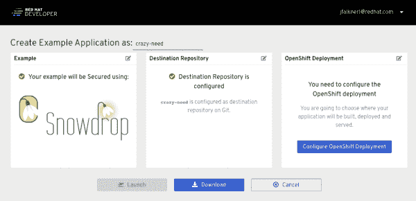

# 扩展对 Spring Boot 2.1.6 和弹簧反应式的支持

> 原文：<https://developers.redhat.com/blog/2019/08/30/extending-support-for-spring-boot-2-1-6-and-spring-reactive>

[红帽应用运行时](https://www.redhat.com/en/products/application-runtimes)最近增加了对 [Spring Boot 2.1.6 运行时](https://access.redhat.com/articles/4310921)的扩展支持，供红帽客户构建 Spring 应用。红帽应用运行时为应用开发者提供了多种运行在[红帽 OpenShift 容器平台](https://developers.redhat.com/openshift/)上的应用运行时。

## Spring Boot 简介

Spring Boot 让你创建基于 Spring 的独立应用。Spring Boot 运行时还与 OpenShift 平台集成，允许您的服务将它们的配置外部化，实现健康检查，提供弹性和故障转移，等等。

## 有什么新鲜事？

此版本引入了对 Spring Boot 2.1.6 的扩展支持，以及两个[技术预览](https://access.redhat.com/support/offerings/techpreview/)特性:

*   [Dekorate](https://github.com/dekorateio/dekorate) ，Kubernetes 的一个 Java 注释处理器，以前以 AP4K 的名字开发。Dekorate 是一个自动更新 Kubernetes 和 OpenShift 配置文件的工具，无需手动编辑单独的 XML、YAML 或 JSON 模板。当在 Maven 项目中声明为依赖项时，de Korea 会自动选择注释，并将它们更改为您在应用程序中设置的属性，自动更新相应的部署配置和资源定义模板。
*   垂直。X Reactive Components，一套用于设计电抗应用的支持启动器。产品化的启动器基于社区发布的 [Spring WebFlux](https://docs.spring.io/spring/docs/current/spring-framework-reference/web-reactive.html#webflux) 和 [Reactor Netty](https://projectreactor.io/docs/netty/release/reference/index.html) ，为 Spring Boot 运行时增加了一组额外的 [Eclipse Vert.x](https://vertx.io) 扩展，扩展了 Spring WebFlux 的反应能力，以包括一个异步 I/O API 来处理各个应用程序组件之间的网络通信。这一新增功能让您可以创建一个完全支持 Red Hat 的反应式堆栈，您可以用它来构建您的 Spring Boot 应用程序。

请参考发行说明，了解新特性的完整列表。

## 开始

[](/sites/default/files/blog/2019/08/Screen-Shot-2019-08-14-at-3.50.38-PM.png)Launcher in action

Launcher in action.

使用[developers.redhat.com/launch](https://developers.redhat.com/launch)，您可以立即创建一个 Spring Boot 应用程序，并直接部署到 [OpenShift Online](http://openshift.com/) 或您自己的本地 OpenShift 集群。该工具提供了一种从零开始创建应用程序(从示例应用程序或导入您自己的应用程序开始)的简单方法，以及一种将这些应用程序构建和部署到 Red Hat OpenShift 的简单方法。

有一些例子可以展示开发人员如何使用 Spring Boot 来构建云原生应用和服务的基本构建块，例如创建安全的 RESTful APIs、实现健康检查、外部化配置、保护资源，或者与基于 [Istio](https://developers.redhat.com/topics/service-mesh/) 项目的 OpenShift 服务网格集成。

## 使用装饰

要开始使用 [Dekorate](http://dekorate.io/) ，您只需要向您的`pom.xml`添加一个依赖项:

```
<dependency>
  <groupId>io.dekorate</groupId>
  <artifactId>kubernetes-annotations</artifactId>
  <version>${project.version}</version>
</dependency>

```

然后，向您的项目添加所提供的注释之一。例如:

```
import io.dekorate.kubernetes.annotaion.KubernetesApplication;

@KubernetesApplication
public class Main {

    public static void main(String[] args) {
      //Your application code goes here.
    }
}

```

当这个项目被编译时，注释将触发在 JSON 和 YAML 中生成一个*部署*，它将在`target/classes/META-INF/dekorate`目录下结束。然后这个部署可以通过`kubectl apply -f target/classes/META-INF/dekorate/kubernetes.yml`应用到您的 Kubernetes 集群。

该注释带有许多可选参数，这些参数可用于定制部署并触发额外资源的生成，如*服务*和*入口*。您可以为各种服务向应用程序添加的其他功能包括:

*   [OpenShift](http://developers.redhat.com/openshift/) 创建图像流和构建配置，并绑定到服务目录服务。
*   Kubernetes 添加标签、注释、环境变量、卷挂载、端口/服务、JVM 选项、init 容器和注入 sidecars。
*   [普罗米修斯](https://prometheus.io)配置监控。
*   [Jaeger](https://www.jaegertracing.io/) 将你的应用连接到分布式追踪。

为了更好地了解 de Korea te 的功能，请查看 Gytis 的博客[如何使用 de Korea te 创建 Kubernetes 清单](https://developers.redhat.com/blog/2019/08/15/how-to-use-dekorate-to-create-kubernetes-manifests/)。

## 用 Spring Boot 和 Eclipse Vert.x 构建反应式应用程序

Spring reactive stack 构建在 [Project Reactor](https://projectreactor.io/) 之上，这是一个实现背压并符合 Reactive Streams 规范的反应库。它提供了 [Flux](https://projectreactor.io/docs/core/release/api/reactor/core/publisher/Flux.html) 和 [Mono](https://projectreactor.io/docs/core/release/api/reactor/core/publisher/Mono.html) 功能 API 类型，支持异步事件流处理。在 Project Reactor 之上，Spring 提供了 [WebFlux](https://docs.spring.io/spring/docs/current/spring-framework-reference/web-reactive.html#webflux) ，一个异步事件驱动的 web 应用框架。使用此堆栈构建的反应式应用程序支持非阻塞、异步、事件驱动的应用程序，这些应用程序具有高度的可伸缩性和弹性。它们还简化了与其他相关反应库的集成，如 [Apache ActiveMQ Artemis](https://activemq.apache.org/components/artemis/) 、 [Apache Kafka](https://kafka.apache.org/) 或 [Infinispan](https://infinispan.org/) (所有这些都通过 [Red Hat 中间件](https://www.redhat.com/en/products/middleware)得到完全支持)。

Red Hat 的这个 Spring reactive 产品为 OpenShift 和独立的 Red Hat Enterprise Linux 带来了 Reactor 和 WebFlux 的好处，并且它为 WebFlux 框架引入了一组 [Eclipse Vert.x](https://vertx.io) 扩展。这一增加允许您保留 Spring Boot 的抽象级别和快速原型功能，并提供一个异步 I/O API，以完全反应的方式处理应用程序中服务之间的网络通信。

要创建一个基本的反应式 HTTP web 服务，请将以下依赖项添加到您的`pom.xml`中:

```
<dependency>
  <groupId>dev.snowdrop</groupId>
  <artifactId>vertx-spring-boot-starter-http</artifactId>
</dependency>

```

这一增加带来了创建反应式应用程序所需的依赖性。接下来，创建一个反应式示例应用程序:

```
package dev.snowdrop.vertx.sample.http;

import org.springframework.boot.SpringApplication;
import org.springframework.boot.autoconfigure.SpringBootApplication;
import org.springframework.context.annotation.Bean;
import org.springframework.web.reactive.function.server.RouterFunction;
import org.springframework.web.reactive.function.server.ServerRequest;
import org.springframework.web.reactive.function.server.ServerResponse;
import reactor.core.publisher.Mono;

import static org.springframework.web.reactive.function.BodyInserters.fromObject;
import static org.springframework.web.reactive.function.server.RouterFunctions.route;
import static org.springframework.web.reactive.function.server.ServerResponse.ok;

@SpringBootApplication
public class HttpSampleApplication {

    public static void main(String[] args) {
        SpringApplication.run(HttpSampleApplication.class, args);
    }

    @Bean
    public RouterFunction<ServerResponse> helloRouter() {
        return route()
            .GET("/hello", this::helloHandler)
            .build();
    }

    private Mono<ServerResponse> helloHandler(ServerRequest request) {
        String name = request
            .queryParam("name")
            .orElse("World");
        String message = String.format("Hello, %s!", name);

        return ok()
            .body(fromObject(message));
    }
}

```

最后，构建并测试:

```
$ mvn clean package
$ java -jar target/vertx-spring-boot-sample-http.jar
$ curl localhost:8080/hello
Hello, World!

```

在 [Spring Boot 运行时指南](https://access.redhat.com/documentation/en-us/red_hat_support_for_spring_boot/2.2/html/spring_boot_runtime_guide/index)中，还有其他几个通过 OAuth2、反应式电子邮件客户端、服务器发送事件等进行身份验证的示例应用。

关于用 Spring Boot 创建反应式 web 服务的更多细节，请参见 Spring 社区文档中的[反应式 REST 服务开发指南](https://spring.io/guides/gs/reactive-rest-service/)。

## 证明文件

运行时团队一直在不断地添加和改进官方文档，以便用 Spring Boot 构建应用程序。这项工作包括发行说明、入门指南和 [Spring Boot 运行时指南](https://access.redhat.com/documentation/en-us/red_hat_support_for_spring_boot/2.2/html/spring_boot_runtime_guide/index)中的更新。

## 开发者互动学习场景

这些[自定进度的场景](https://learn.openshift.com/middleware/rhoar-getting-started-thorntail/)为您提供了一个预配置的 Red Hat OpenShift 实例，无需任何下载或配置即可从您的浏览器访问。使用它来试验 Spring Boot 或了解 Red Hat 应用程序运行时中的其他技术，并了解它如何帮助解决现实世界中的问题:

[](/sites/default/files/blog/2019/08/Screen-Shot-2019-08-14-at-3.54.45-PM.png)

Available self-paced learning guides.

## 为 Spring Boot 争取支持

Red Hat 客户可以通过订阅 [Red Hat OpenShift 应用运行时](https://developers.redhat.com/products/rhoar/overview/)来获得对 Spring Boot 的支持。请联系您当地的 Red Hat 代表或 [Red Hat 销售部](https://www.redhat.com/en/about/contact/sales)，了解如何享受 Red Hat 及其全球合作伙伴网络提供的世界级支持。更多信息可以在[扩展对 Spring Boot 2.x 红帽 OpenShift 应用运行时的支持](https://developers.redhat.com/blog/2019/02/28/spring-boot-2-x-red-hat-openshift-application-runtimes-rhoar/)中找到。

展望未来，根据 [Red Hat 产品更新和支持生命周期](https://access.redhat.com/support/policy/updates/jboss_notes/)，客户可以期待对 Spring Boot 和其他运行时的支持。

### Spring Boot 支持的下一步是什么？

Runtimes Spring Boot 团队不断从客户和更广泛的开源开发者社区获得反馈，同时跟踪上游 Spring Boot 发布的版本。该团队正在根据这些反馈对支持进行更新，并考虑支持来自 Red Hat 和大型 Java 和 Spring 社区的其他模块。

### 红帽的 Spring Boot 支持者背后的人

该产品由 Red Hat 的应用程序运行时产品和工程团队以及上游社区 [Snowdrop](https://snowdrop.me) 共同开发，涉及许多小时的开发、测试、文档编写、测试，并与更广泛的 Red Hat 客户、合作伙伴和 Spring 开发人员社区合作，以整合大大小小的贡献。我们很高兴你选择使用它，并希望它达到或超过你的期望！

### Spring Boot 资源公司

*   [Red Hat OpenShift 应用运行时开发者主页](https://developers.redhat.com/products/rhoar/overview/)
*   [Spring Boot 运行时指南](https://access.redhat.com/documentation/en-us/red_hat_support_for_spring_boot/2.2/html/spring_boot_runtime_guide/index)
*   [Spring Boot 问题跟踪者](https://issues.jboss.org/projects/SB)
*   [open shift 上的 Spring Boot 互动学习场景](https://learn.openshift.com/middleware/courses/middleware-spring-boot/)
*   [雪莲花上游项目](https://snowdrop.me/)

*Last updated: July 28, 2022*