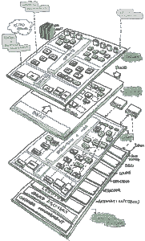

# 云原生应用环境架构简介

> 原文：<https://developers.redhat.com/blog/2019/07/02/introduction-to-cloud-native-application-environment-architecture>

云原生环境架构很难理解。为了帮助应用程序开发人员和软件/系统架构师理解它，我将尝试解释各个部分以及它们如何协同工作。为此，我发现从四个不同的层面来考虑架构是有帮助的:应用软件开发、服务扩展、应用网络和容器编排平台。

在本文中，我将描述第一个技术层:应用软件开发。为了使这些概念更容易形象化，我画了下图。

容器原生或云原生应用程序开发通常被称为公共绿地系统，其中应用程序被分解为微服务。每个微服务都有自己的数据源，独立于其他服务，并且以分布式方式部署。

这种实现的好处是使应用程序更加敏捷和多语言化，隔离问题，并使代码库更小和更易于维护。如果我告诉你这意味着从现在开始生活会变好，那我是在撒谎。

为了实现敏捷、真正可扩展的自动化容器/云原生系统的优势，需要深入考虑应用程序、平台和角色等因素，包括:

*   为场景使用正确的技术
    *   复杂的解决方案有时会矫枉过正
    *   在错误的地方使用错误的解决方案会导致责任的转移
*   持续集成的领域驱动设计
    *   异步事件或 API
    *   如何与现有棕地应用集成

该图大致展示了容器/云原生系统的各种元素如何协同工作，我希望它也能帮助您决定何时或是否引入某项特定的技术。

为了对应用程序开发人员和软件/系统架构师更有意义，我特意将架构分为四个平面。每个平面本身都可以分解成更多的细节。它由许多技术组成，这些技术是根据它们为云原生应用环境带来的基本功能进行抽象的。

## 应用软件开发层

应用软件开发层是关于建模域、如何定义微服务、应该如何部署微服务以及在系统中应用的软件模式，这些模式可以帮助开发一个松散耦合且不断发展的系统。它还涉及应用程序之间的通信技术和模式。

## 服务扩展— Knative

当应用程序不使用时，扩展到零将允许资源优化。这一层充分利用了云计算的特性，但并不是所有的服务都需要它。

## 应用网络—服务网格

这是分布式微服务环境中非常常见的架构功能。有了这一层，就可以对微服务之间的通信进行更好、更统一的控制，并且具有更好的可观察性。DevOps 可以使用这一层来应用通用安全性、故障恢复、部署策略等。，以及设置定制的。这一层为开发人员去掉了许多多余的工作。

## 容器编排平台— Red Hat OpenShift

这是云原生环境架构的基础。它提供了基本和重要的功能，如容器编排、服务发现、CI/CD 自动化、日志记录等。

## 领域驱动的设计和敏捷集成

**领域驱动设计(DDD)** 原则适用于我们在云原生世界中开发应用的方式，通过允许业务用户和开发人员之间更好的沟通，根据领域建模对象，以及设置*边界*来细分复杂的业务需求。DDD 的一个重要方面是持续集成。

**敏捷集成**从微服务和 DDD 的基本概念演变而来。在软件开发中，除了对业务逻辑建模之外，还需要考虑许多其他因素。基于 DDD 的敏捷集成不仅帮助您更好地定义模型和边界，还帮助您更好地定义它们应该如何被不同的功能关注点分开，以及它们如何被物理地部署。敏捷集成有三个主要职责:

*   **核心—** 大部分实现业务逻辑或领域能力的微服务都属于这一类。它们是典型的小型简单微服务的一个很好的例子，在运行时和如何相互通信方面都是轻量级的。
*   **复合—** 设置正确的服务粒度、处理事务、编排和转换各种类型事件的数据都在这里处理。数据和事件的聚合和分离都是在这个类别中完成的。这充当简单的无状态管道，以期望的和合适的格式将事件从一个点引导到另一个点，并且有时需要成为外部 SaaS、棕色地带应用或者甚至有界上下文之外的服务的网关。
*   **控制和调度—** 如果系统只与少数外部系统交互，您可能不需要这个类别。这个类别允许您对系统提供的服务有更深入的了解和更有意义的业务控制。它是一个隐藏来自外部客户端请求的持续的令人烦恼的定制的地方，这些请求需要快速和特别的更改。门面模式适用于这一类别。

应用上述原则将使您能够:

*   从业务需求中获取模型和实体。
*   设定业务领域之间的界限。
*   对代码的性质进行分类，并将其分成独立的、分开的、可部署的微服务实例。

另一个重要的基础问题是这些微服务之间的通信。我相信这些微服务的通信骨干应该大部分是事件驱动的，异步的，所以数据的分布可以是松耦合的，系统会变成反应式的。缺点是这种类型的设计会使事务变得相当复杂，但这可以通过实现事件源等技术来克服。对于边界或外部客户/合作伙伴之间的通信，我强烈建议使用 API，原因很简单:

*   这些流程大多是请求和回复的形式，这是 REST API 的自然默认行为。
*   契约定义和存储库管理技术在 API 领域更加成熟。

下一次，我将讨论事件中不同类型的数据以及如何处理它们，以及如何在云原生应用程序环境中实现数据一致性。我还将在我的云原生应用概述中查看所有其他层:服务扩展、应用网络和容器编排平台。

*Last updated: July 12, 2019*