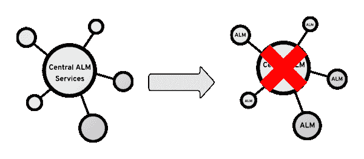
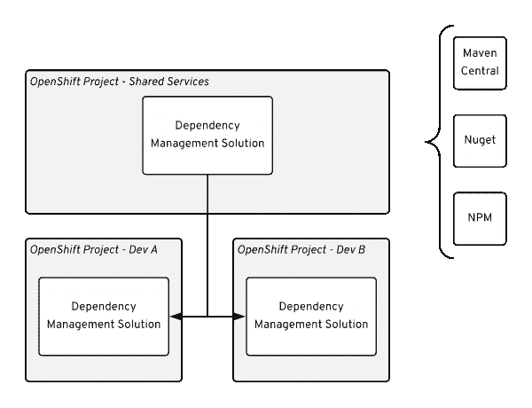

# 面向容器本地开发的应用生命周期管理

> 原文：<https://developers.redhat.com/blog/2019/06/11/application-lifecycle-management-for-container-native-development>

容器原生开发主要是关于一致性、灵活性和可伸缩性。传统的应用程序生命周期管理(ALM)工具通常不是这样，导致 it:

*   给开发速度设置了人为的障碍，从而影响了实现价值的时间，
*   在基础架构中产生单点故障，并且
*   僵化会扼杀创新。

最终，开发人员是昂贵的，但是他们是他们所构建的领域的专家。由于开发团队通常被视为产品团队(拥有其应用程序的整个生命周期和支持)，因此他们必须控制将应用程序交付到生产环境所依赖的端到端流程。这意味着分散 ALM 过程和支持该过程的工具。在本文中，我们将探索这种方法，并查看几个实现场景。

Figure 1 - Move from centralised ALM to decentralised ALMFigure 1: Move from centralized ALM to decentralized ALM.">

## 管道

虽然这种方法将更多的控制权放在了开发人员手中，但这也意味着他们要对发布的内容直接负责。为了解决这个问题，应用交付的自动化变得比非容器化的世界更加重要。它彻底改变了信任的领域— *作为一个组织，你现在应该信任容器交付的过程，而不是容器本身的内容*。

这是一种更加面向工厂的方法，当应用于容器平台中运行的每个项目时，它允许组织扩展其应用程序交付，而不会导致显著的治理开销。Red Hat 通过以前的容器相关项目发现，解决这个问题的有效方法是通过管道，尽管许多流行的构建自动化工具也可以实现相同的最终结果。

为此，我们经常建议创建一个*开发实践社区*(名称受当地影响)，该社区将拥有容器平台内的管道开发。开发实践社区将由在平台上工作的开发团队的代表组成，并寻求围绕技术和方法推动标准，同时还充当知识转移和支持的论坛。

开发实践社区将创建一个管道步骤库(Jenkins 术语中的*共享库*),可用于创建特定于技术的(Java、.NET，Node.js 等。)为对直接参与平台兴趣有限的用户提供参考管道，或者为特定用例提供定制管道。

这个共享库将以下列方式派生:

*   捕捉给定技术堆栈的应用交付路径上的关键步骤。与平台、开发、业务和安全涉众一起开展这项活动，就“最低限度的好处”的共同定义达成一致
*   在共享库中创建步骤，以满足发现评估过程中捕获的所有要求。
*   积极审核这些步骤，以向相关方证明合规性。这可能包括自动化测试结果捕获、容器 CVE 扫描、代码覆盖/质量评估和自动化批准。
*   使用这个步骤库创建符合“最小好”定义的参考管道。
*   向组织内更广泛的开发社区开放/内部来源共享库，以允许利益相关者扩展、定制和贡献可重复的步骤和进一步的引用管道，从而增加环境内库的功能。
*   确保记录步骤和参考管道。共享库的良好文档对于推动采用是至关重要的。一个完美实现的、糟糕记录的解决方案对任何人都没有实际用处。这些步骤现在是平台基础设施的一部分，应该被视为平台基础设施的一部分。

以这种方式使用管道允许平台提供商驱动两种不同的行为:

1.  没有兴趣或不需要直接与容器平台交互的用户可以直接利用构建自动化。管道允许他们获取源代码，并通过必要的治理步骤门交付生产就绪的容器映像，与容器平台的交互几乎为零。
2.  了解管道和集装箱化技术的用户，如果想要或需要在核心步骤之上添加他们自己定制的步骤，完全有能力这样做。他们必须确保这些步骤也满足开发实践社区和相关涉众提出的治理需求。

这些都不是一次性的行动。管道生命周期的管理和维护与应用程序本身的管理和维护一样重要。

*   开发实践社区必须不断地评估开发社区的需求，并根据需要改进和细化管道和步骤。开发社区也应该被允许派生、适应和推回共享库的变更。
*   对于平台提供商来说，责任更多的是以容器化的方式提供这些管道所依赖的技术和能力。他们还必须确保这些功能保持最新，并相应地管理这些容器的生命周期。
*   企业必须有效地管理不断变化的应用程序需求，并理解和接受这些变化可能在自动化解决方案中产生的依赖性。
*   安全团队必须不断评估新的实践、需求、标准和技术，并与业务部门、开发人员和平台提供商合作，以合理和可控的方式实现这些需求。

所有这些方面都依赖于所有利益相关者之间的持续沟通和持续反馈循环，包括了解环境、实施变更以及审查变更对管道和共享库整体使用的影响。

Figure 2 - Shared Library LifecycleFigure 2: Shared Library lifecycle.">

对于所有相关的人来说，以“康威定律”的情况结束完全是浪费时间和精力。然而，围绕管道和容器本地开发致力于基于标准的良好实践为开发人员提供了一条源代码和生产之间阻力最小的路径，并允许每个利益相关者快速认识到容器化的好处。

## 断开的环境

在一个分离的环境中，尽可能遵循分散的 ALM 原则是明智的。但是，妥协总是会有的。一个关键的折衷方案通常围绕着依赖关系管理——如何确保一个应用程序在一个没有直接连接到公共互联网的容器平台中拥有所有的构建和运行时依赖关系？

与完全连接的环境一样，使用依赖管理解决方案(例如， [Sonatype Nexus](https://www.sonatype.com/nexus-repository-sonatype) 或 [JFrog Artifactory](https://jfrog.com/artifactory/) )在断开连接的环境中向自动化构建过程呈现依赖是一种良好的实践。

一旦有了内容，开发人员就可以为他们的项目建立自己的依赖管理解决方案，并与集中式实例进行对话。这种方法允许他们避开容器平台中依赖关系的集中单一真实来源的明显缺陷。

通常，我们称之为“硬断开”(与公共互联网完全没有物理连接)或“软断开”(对公共互联网的访问被严格限制在某些主机或协议上)。在任一情况下，都不需要对内容进行直接监管。管道中内置的步进门最好配置为自动扫描应用程序依赖性，并在发现漏洞、勘误表或许可证问题时失败。

### 硬断开场景

在这种情况下，内容在公共互联网连接上下载，然后上传到离线环境中所选择的依赖关系管理解决方案，在那里可以由环境中的自动化工具解决。这一过程可能是手动的且耗时的。

Figure 3 - Hard Disconnect ScenarioFigure 3: Hard disconnect scenario.">

### 软断开场景

在这种情况下，依赖关系管理解决方案被允许通过代理或者被列入白名单以直接允许访问公共互联网。这个过程允许到包含依赖项的存储库的单个受控连接。这个场景要灵活得多，因为向环境提供内容不需要手动交互。

Figure 4 - Soft Disconnect ScenarioFigure 4: Soft disconnect scenario.">

## 结论

抱歉，我撒谎了。没有结论。您正在创建构建块，您的容器原生开发将在其整个生命周期中依赖于这些构建块——并且该生命周期应该处于不断的审查中。

然而，通过分散您的自动化依赖项并开放您与这些依赖项交互的方式，您为开发社区提供了扩展其活动的方式，以满足所有相关利益方不断变化的需求，而不会成为传统方法的[遗产的受害者。](https://www.halfarsedagilemanifesto.org/)

*Last updated: September 3, 2019*