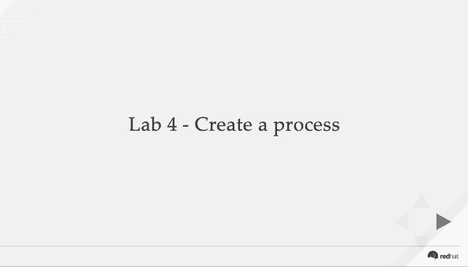

# 现代业务逻辑工具研讨会，实验 4:创建流程

> 原文：<https://developers.redhat.com/blog/2019/05/24/modern-business-logic-tooling-workshop-lab-4-create-a-process>

自从开始更新展示如何开始使用现代业务逻辑工具的[免费在线规则和流程自动化研讨会](https://bpmworkshop.gitlab.io/#/)以来，您已经在流程自动化方面取得了很大进步。更新从从 JBoss BPM 到 Red Hat Decision Manager 和从 JBoss BPM Suite 到 Red Hat Process Automation Manager 开始。

在之前的实验中，我们向[展示了如何在你的笔记本电脑上安装 Red Hat Decision Manager](https://developers.redhat.com/blog/2018/12/19/modern-business-logic-tooling-workshop-lab-1-installation/) ，[如何创建一个新项目](https://developers.redhat.com/blog/2019/04/01/modern-business-logic-tooling-workshop-lab-2-create-a-new-project/)，以及[如何创建一个领域模型](https://developers.redhat.com/blog/2019/04/19/modern-business-logic-tooling-workshop-lab-3-create-a-domain-model/)。本文重点介绍了 Red Hat Process Automation Manager 的最新实验室更新，在这里您可以学习设计流程。

我们去实验室看看，好吗？

### 实验 4:创建流程

本实验是学习开发过程集成项目的最新一步。这是一个如何设计你的第一个流程的逐步指南。

最简单的方法是[直接进入实验 4](https://bpmworkshop.gitlab.io/rhpam/lab04.html) :

如果对研讨会的任何部分有不清楚的意见或反馈，请联系我们。

敬请关注即将到来的下一次实验室更新！

*Last updated: May 23, 2019*