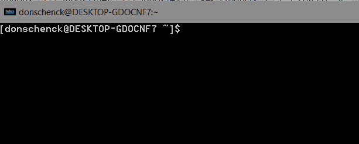
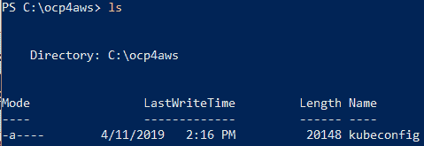

# AWS 上的 Red Hat OpenShift 4.0 开发者预览版:在 Windows 上运行

> 原文：<https://developers.redhat.com/blog/2019/04/23/red-hat-openshift-4-0-developer-preview-on-aws-up-and-running-with-windows>

https://youtu.be/fXgAKlaBOGs

在之前的一篇文章中，[“AWS 上的 OpenShift 4.0 开发者预览版启动并运行”](https://developers.redhat.com/blog/2019/03/07/openshift-4-0-developer-preview-on-aws-is-up-and-running/)我包含了使用 macOS 或 Linux 安装和管理您的 Red Hat OpenShift 4.0 集群的说明。由于我最近在我的技术组合中添加了一台 Windows 10 PC，我决定尝试使用 Windows 作为我的唯一选择。

得知安装程序`openshift-install`不适用于 Windows，我很难过。但是，像任何不会被否定的开发者一样；我找到了一个方法。

成功的关键是拥抱 Linux 的 Windows 子系统。有了这个工具，您就可以下载并安装在 AWS 上启动 Red Hat OpenShift 4.0 集群所必需的程序，然后切换到 Windows 上的 PowerShell 进行登录和开发。在我的例子中，我的代码是用 C#编写的，虽然我使用的 WSL Linux(Fedora Remix)安装了 vi，但我想用 Visual Studio 代码来工作。Windows 是我的舒适区；我为什么要被迫离开它？另外，我知道怎么退出 VS 代码(**咧嘴* *)。

## 概观

这是计划，TL；博士:

1.  启用 WSL (Windows)。
2.  安装一个 Linux 发行版(Windows)。
3.  配置 AWS (Linux)。
4.  安装 openshift-install (Linux)。
5.  启动集群(Linux)。
6.  安装用于 Windows (Windows)的 OpenShift CLI。
7.  将配置文件从 WSL 复制到 Windows(两者)。
8.  从 Windows 登录(Windows)。

## 但是首先...

强烈推荐阅读前面提到的文章[《AWS 上的 OpenShift 4.0 开发者预览版启动并运行》](https://developers.redhat.com/blog/2019/03/07/openshift-4-0-developer-preview-on-aws-is-up-and-running/)，部分细节在此不再赘述。如果你不理解所有的 Linux 命令，也不用担心；重要的是要知道需要采取什么步骤。

## 启用 WSL

PowerShell 命令是:

```
Enable-WindowsOptionalFeature -Online -FeatureName Microsoft-Windows-Subsystem-Linux
```

## 安装一个 Linux 发行版

在你的 Windows PC 上进入微软商店，安装你选择的 Linux 发行版。对于这篇文章，我花了 5 美元，选择了“Fedora Remix”发行版。如果你安装一个不同的发行版，与包相关的命令会有所不同(例如，Fedora 的“yum”和 Ubuntu 的“apt-get”)。然而，其余的将是相同的。

安装发行版并打开一个终端窗口。



## 配置 AWS

为此，请遵循 AWS 安装页面上 [Red Hat OpenShift 4.0 的第一步和第二步的说明。](https://developers.redhat.com/download-manager/link/3867591?)

## 安装 openshift-install

来自开发者预览版的指令是基于浏览器的。也就是说，你访问一个网页，点击一个按钮来下载比特。我们不会用那个。我们将使用`wget`从命令行下载这些位。

使用发行版的软件包管理工具来确保安装了`wget`。在我的 Fedora Remix 发行版上，我必须运行`sudo yum install -y wget`。

打开您选择的 Windows 浏览器并访问 [openshift 安装程序发布网页](https://github.com/openshift/installer/releases)。右键单击“openshift-install-linux-amd64”的链接，并选择将链接复制到本地剪贴板的选项。然后切换到您的 Linux 终端窗口，这样您就可以粘贴链接并运行命令:

```
wget <paste-the-link-in-here>
```


在你看到下载到你的 WSL 中的 Linux 发行版之前，你会看到一些超长的 URL 滚动而过。

使用以下命令重命名下载的位:

```
mv openshift-install-linux-amd64 openshift-install
```

现在，使用以下命令使其可执行:

```
chmod +x openshift-install
```

## 启动集群

现在您的 Linux 发行版上已经有了 OpenShift 安装程序。您可以采取必要的步骤在 AWS 上启动您的 Red Hat OpenShift 4.0 集群。如果您遵循了上面的“配置 AWS”步骤，您将获得所需的访问 ID 和密钥。

您也可以从前面提到的[安装页面](https://cloud.openshift.com/clusters/install)中复制拉取秘密。

当您在 Linux 终端中使用以下命令时，神奇的事情就开始发生了:

```
./openshift-install create cluster
```

耐心点。我发现安装一个集群需要 24 分钟。不用担心；值得等待。

## 为 Windows 安装 OpenShift CLI

安装完成后，您的集群将启动并运行。在此之前，您将无法登录，但您可以继续操作，确保 OpenShift 命令行工具`oc`已安装在您的 Windows PC 上。在 PowerShell 命令行中，运行:

```
choco install -y openshift-cli
```

同样，如果你的 Windows 机器上没有安装 [Chocolatey](https://chocolatey.org/) ，停止一切操作，立即获取它。有那么好。

## 将配置文件从 WSL 复制到 Windows

这是您从 Linux 过渡到 Windows 的部分，这将允许您从 PowerShell 命令行运行一切——如果您愿意，也可以从 VS 代码内部运行。

安装完成后，集群启动并运行，配置文件将被写入您的 Linux 发行版的文件系统。文件是`/home/<your-username>/auth/kubeconfig`。我们需要将该文件复制到一个可以从 Windows PowerShell 中读取的位置。

到目前为止(2019 年 4 月)，WSL 文件系统映射到 Windows 文件系统，如下所示:

**/mnt/c** (Linux)映射到 **C:\** (Windows)

**注意:**未来版本的 Windows 10 将使 WSL 和 Windows 之间共享数据文件变得更加容易。现在，为了安全起见，我们将复制配置文件。

因此，我们可以创建一个目录——为了简单起见，我是在 C: drive 的根目录下创建的——然后使用 Linux 的`cp` (copy)命令将配置文件转移到 Windows。

在 PowerShell 中:

```
mkdir C:\ocp4aws
```

在 Linux 中:

```
sudo cp /home/<username>/auth/kubeconfig /mnt/c/ocp4aws
```

切换回您的 PowerShell 终端并移动目录`C:\ocp4aws`。目录内容列表将显示文件`kubeconfig`，该文件现在可用于您的 PowerShell 会话。



登录前还有一个步骤。

在 PowerShell 中，设置指向您的配置文件的环境变量“KUBECONFIG ”:

```
$env:KUBECONFIG="C:\ocp4aws\kubeconfig"
```

## 停下来。放松呼吸

到目前为止，在 AWS 上登录 OpenShift 4.0 集群是一条曲折的道路，需要很多步骤。好消息是:在这之后，您只需要做两步:设置`$env:KUBECONFIG`环境变量并运行`oc login...`。这意味着，当你明天回到你的电脑，你跑两步，嘣，你连接到你的集群。

换句话说:

```
$env:KUBECONFIG="C:\ocp4aws\kubeconfig"
```

```
oc login -u kubeadmin -p <password-generated-during-cluster-install>
```

## 从 Windows 登录

只需按照 Linux 终端会话中的说明运行该命令。它应该看起来像下面这样—使用不同的密码。

```
oc login -u kubeadmin -p KSiVQ-gww7K-HEaiv-HNnfG
```

**保留这些信息**。您将需要它来再次登录您的集群。

## 后续步骤

要创建或销毁集群，请在 Linux 发行版终端中使用`openshift-install`命令。

创建一个新的集群后，您将拥有一个新的登录密码。创建集群后，它将显示在您的 Linux 发行版终端中。将其复制到剪贴板，粘贴到 PowerShell 中，以便从 Windows 登录。

从 Windows 登录之前，请确保设置了`$env:KUBECONFIG`。

就是这样。现在，您可以在 Windows PC 上创建、使用和销毁 AWS 上的 Red Hat OpenShift 4.0 集群。

*Last updated: May 2, 2019*