# 宣布 Eclipse 2019-03 的 Red Hat code ready Studio 12 . 11 . 0 . ga 和 JBoss Tools 4.11.0.Final

> 原文：<https://developers.redhat.com/blog/2019/04/02/announcing-red-hat-codereadystudio-12-11-0-ga-and-jboss-tools-4-11-0-final-for-eclipse-2019-03>

[JBoss Tools 4.11.0](http://tools.stage.jboss.org/documentation/whatsnew/jbosstools/4.11.0.Final.html) 和[Red Hat CodeReady Studio 12.11](https://developers.redhat.com/products/codeready-studio/overview)为 Eclipse 2019-03 准备好了，正在等你。在本文中，我将介绍新版本的亮点，并展示如何开始。

## 装置

Red Hat CodeReady Studio(以前称为 Red Hat Developer Studio)在安装程序中预装了所有东西。只需从我们的 [Red Hat CodeReady Studio 产品页面](https://developers.redhat.com/products/codeready-studio/overview)下载并运行它，如下所示:

```
java -jar devstudio-<installername>.jar
```

JBoss 工具或自带 Eclipse (BYOE) CodeReady Studio 需要更多:

这个版本至少需要 Eclipse 4.11 (2019-03)，但我们建议使用最新的 [Eclipse 4.11 2019-03 JEE 捆绑包](http://www.eclipse.org/downloads/packages/release/2019-03/r/eclipse-ide-java-ee-developers)，因为这样你就可以预装大多数依赖项。

一旦您安装了 Eclipse，您可以在 Eclipse Marketplace 的“JBoss Tools”或“Red Hat Developer Studio”下找到我们

对于 JBoss 工具，您也可以直接从更新站点下载:

```
http://download.jboss.org/jbosstools/photon/stable/updates/
```

## 什么是新的？

我们这次发布的主要焦点是对基于容器的开发和 bug 修复的改进。Eclipse 2019-03 本身有很多新的很酷的东西，但我将强调 Eclipse 2019-03 和 JBoss Tools 插件中值得一提的几个更新。

### 红帽 OpenShift 3

#### 新的 Red Hat OpenShift 连接助手

当你需要定义一个新的 OpenShift 连接时，你需要提供以下信息:

*   群集 URL
*   用户名和密码或令牌

如果您已经通过 OpenShift Web 控制台登录了您的集群，您可以在剪贴板中复制一个包含集群 URL 和您的令牌的`oc`命令。

因此，从现在开始，有一个新的选项允许您从复制的`oc`命令初始化向导字段:

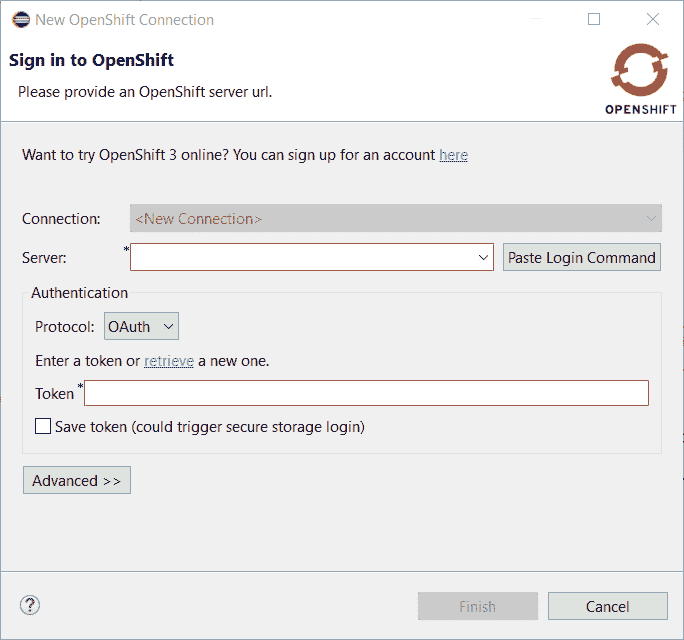

点击`Paste Login Command`按钮，字段将被初始化:

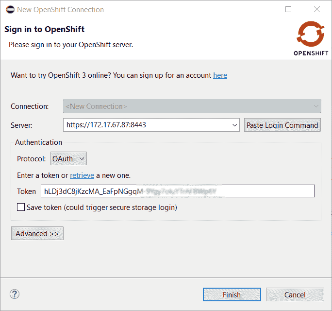

### 服务器工具

#### EAP 7.2 服务器适配器

添加了一个服务器适配器来与 EAP 7.2 一起使用。

#### Wildfly 15 服务器适配器

一个服务器适配器已被添加到 Wildfly 15 中。它增加了对 Java EE 8 的支持。

#### Wildfly 16 服务器适配器

一个服务器适配器已被添加到 Wildfly 16 中。它增加了对 Java EE 8 的支持。

### 休眠工具

#### 新运行时提供程序

添加了新的 Hibernate 5.4 运行时提供程序。它集成了 Hibernate 核心版本 5.4.1.Final 和 Hibernate 工具版本 5.4.1.Final。

#### 运行时提供程序更新

Hibernate 5.3 运行时提供程序现在合并了 Hibernate 核心版本 5.3.9.Final 和 Hibernate 工具版本 5.3.9.Final。

Hibernate 5.2 运行时提供程序现在合并了 Hibernate 核心版本 5.2.18.Final 和 Hibernate 工具版本 5.2.12.Final。

### 专家

#### Maven 支持更新至 M2E 1.11

Maven 支持基于 Eclipse M2E 1.11

### 平台

#### 视图、对话框和工具栏

##### 项目浏览器中用户定义的资源过滤器

*项目浏览器*中的*过滤器和定制…* 菜单现在显示了一个额外的*用户过滤器*标签，可以用来根据资源名称从项目浏览器中排除一些资源。

支持全名和正则表达式。

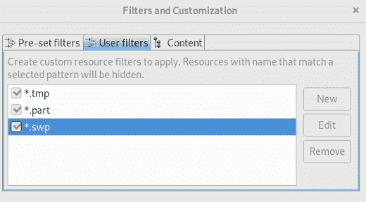

##### 平台中添加了错误日志视图

*错误日志*视图已经从 PDE 项目移动到平台项目。详见 [bug 50517](https://bugs.eclipse.org/bugs/show_bug.cgi?id=50517) 。

##### 复制到安装详细信息中的剪贴板

复制到剪贴板动作已被添加到*安装细节*对话框的所有选项卡中。

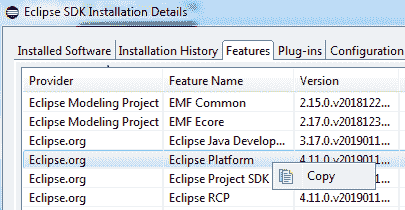

##### 复制并粘贴环境变量

在*启动配置*对话框中的*环境*选项卡现在支持复制和粘贴动作。环境变量以文本数据的形式传输，因此不仅可以在两个不同的启动配置之间进行复制和粘贴，还可以在启动配置和文本编辑器或命令行之间进行复制和粘贴。

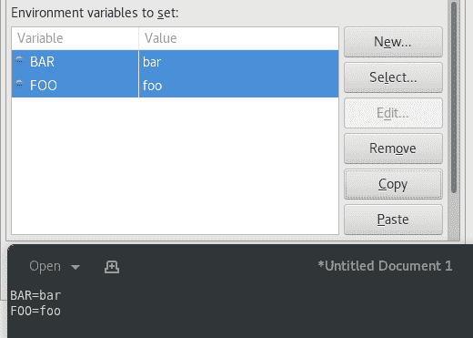

此功能在所有启动配置中都可用，这些配置使用通用的*环境*选项卡。

##### 将项目添加到空工作区的有用链接

当 Eclipse IDE 第一次启动或者使用新的工作空间启动时，对于新用户来说，如何进行可能并不直观。为了帮助用户入门，提供了以下有用的链接，用于将项目添加到工作区:

*   特定于透视图的项目创建向导
*   通用新建项目向导
*   导入项目向导


##### 错误日志视图中的新助记符

在*错误日志*视图的上下文菜单中为*导出条目……*和*事件详细信息*条目添加了新的助记符。


#### 主题和风格

##### 改进了 Mac 的黑暗主题

Mac 的深色主题已得到改进，可以使用 macOS 系统深色外观中的颜色。Eclipse IDE 中一些值得注意的变化是暗窗口标题栏、菜单、文件对话框、组合框和按钮。

**注:**此改动在 macOS Mojave 及更高版本上可用。

之前:

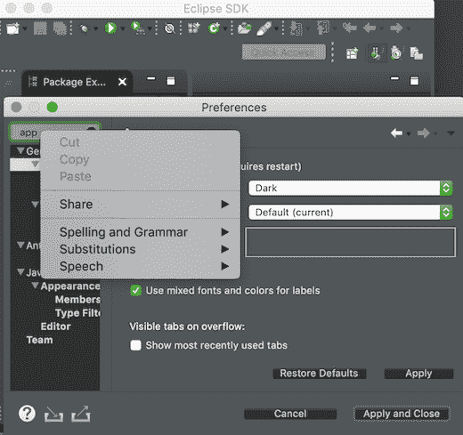

之后:

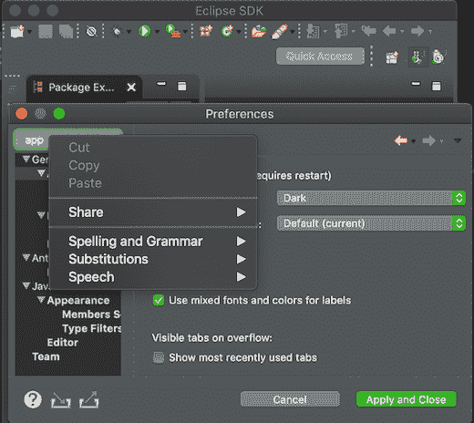

##### 改进了 Windows 的黑暗主题

Windows 中的绘图操作得到了改进，所以自定义绘制的图标现在看起来更好了。例如，查看下面的关闭图标。

之前:


之后:


#### 常规更新

##### 性能改进

在此版本中，多重操作的启动和交互性能再次得到了改进。

### Java 开发工具(JDT)

#### Java 12 支持

##### Java 12

Java 12 已经发布，Eclipse JDT 通过 [Eclipse Marketplace](https://marketplace.eclipse.org/content/java-12-support-eclipse-2019-03-411) 支持 Java 12 for 4.11。值得注意的是，该版本包括以下 Java 12 特性: [JEP 325:切换表达式(预览版)](http://openjdk.java.net/jeps/325)。请注意，这是一个[预览语言功能](http://openjdk.java.net/jeps/12)，因此启用预览选项应该打开。有关该支持的非正式介绍，请参考 [Java 12 Examples wiki](https://wiki.eclipse.org/Java12/Examples) 。

#### 朱尼特

##### JUnit 5.4

JUnit 5.4 已经发布，Eclipse JDT 已经更新为使用这个版本。

##### 测试工厂模板

JUnit Jupiter 现在允许测试工厂方法返回单个`DynamicNode`。模板`test_factory`已经更新，在返回类型中包含了`DynamicNode`。

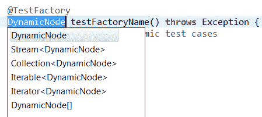

#### Java 编辑器

##### 内容辅助信息弹出窗口中的默认值和常数值

内容辅助建议的附加信息弹出窗口现在显示注释类型元素的默认值:

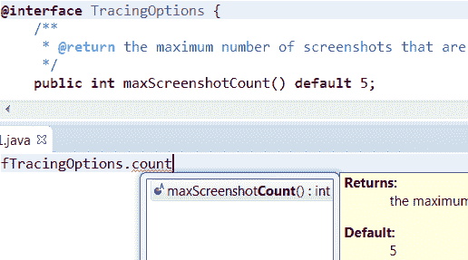

和常量的值:


##### 创建服务提供商方法

如果在一个`module-info.java`文件中定义的服务有一个无效的服务提供者实现，现在可以使用一个*快速修复* (Ctrl + 1)来创建新的提供者方法:

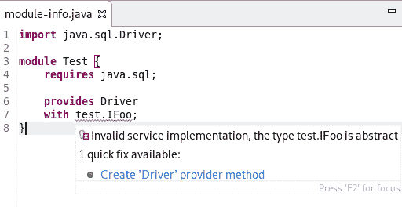

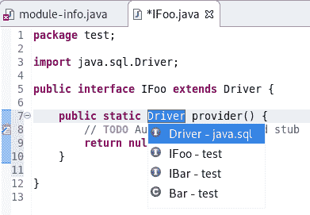

#### Java 格式化程序

##### 二元运算符的换行设置

现在有了各种二元运算符(乘法、加法、逻辑等)的一整节设置，而不是二元表达式的单行换行设置。).有关系运算符(包括等式)和移位运算符的设置，这是旧设置所不包含的。此外，字符串连接现在可以被视为不同于算术和。

这些设置可以在*配置文件编辑器* ( *首选项> Java >代码样式>格式化程序>编辑……*)中的*换行>换行设置>二进制表达式*小节下找到。

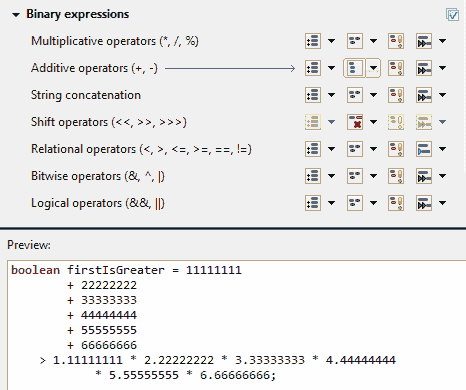

##### 二元运算符的空白设置

二进制表达式中运算符周围的空白现在可以针对不同的运算符组分别进行控制，与换行设置保持一致。

新的*二元运算符*子部分已添加到格式化程序配置文件编辑器中的*空白>表达式*下。

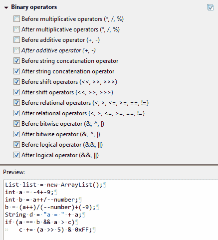

##### 链式条件表达式的换行设置

一串*嵌套的条件表达式*(使用三元运算符)现在可以包装成一个组，所有这些表达式都在同一级别缩进。只有右侧嵌套才有可能。

你可以在*概要编辑器*中的*换行>换行设置>其他表达式*小节下找到*连锁条件*设置。

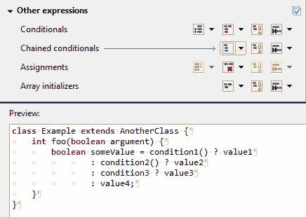

##### 缩进 Javadoc 标签描述

格式化程序配置文件有一个新的设置，它缩进包装的 Javadoc 标签描述。它被称为*在换行时缩进其他标签描述*，与先前存在的*缩进换行@param/@throws 描述*设置形成对比。它影响像`@return`或`@deprecated`这样的标签。

设置可以在*概要编辑器* ( *首选项> Java >代码样式>格式化程序>编辑……*)的*注释> Javadocs* 部分下找到。

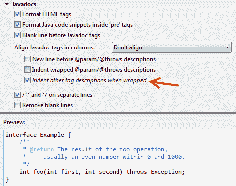

#### 调试

##### 变量视图中表达式的历史记录

*变量*视图现在存储了在*细节*窗格中使用的表达式的历史。你可以从新的下拉菜单中选择一个先前输入的变量表达式的*。该表达式将被复制到 *Detail* 窗格，您可以选择它来执行上下文菜单中的各种操作。*

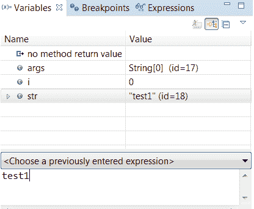

### 还有更多…

您可以在本页的[中找到更多值得注意的更新。](http://tools.stage.jboss.org/documentation/whatsnew/jbosstools/4.11.0.Final.html)

## 下一步是什么？

随着 JBoss Tools 4.11.0 和 Red Hat CodeReady Studio 12.11 的推出，我们已经在着手 Eclipse 2019-06 的下一个版本。敬请关注更多更新。

*Last updated: September 3, 2019*