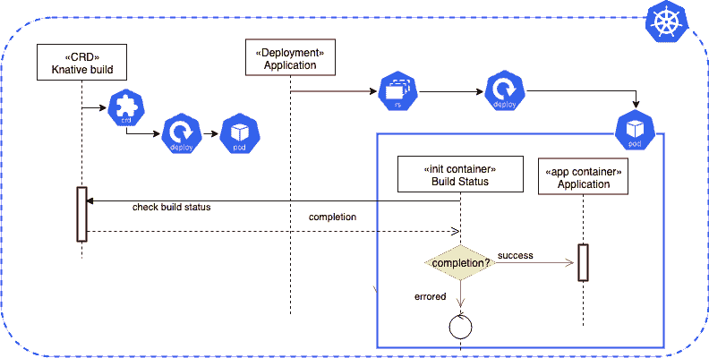

# Init 容器构建模式:使用简单的旧 Kubernetes 部署进行 Knative 构建

> 原文：<https://developers.redhat.com/blog/2019/04/01/init-container-build-pattern-knative-build-with-plain-old-kubernetes-deployment>

随着 Kubernetes 的飞速发展和在企业中的大量采用，开发人员社区现在正在寻找常见 Kubernetes 问题的解决方案，比如模式。在本文中，我将使用 [Init 容器](https://kubernetes.io/docs/concepts/workloads/pods/init-containers/)探索一种新的 Kubernetes 模式。

让我们从产生这个问题的用例开始:[quar kus](https://developers.redhat.com/blog/2019/03/07/quarkus-next-generation-kubernetes-native-java-framework/)——超音速和亚原子 Java——以其惊人的速度和所有新的 Java 应用程序原生构建工件让 [Java](https://developers.redhat.com/topics/enterprise-java/) 开发人员社区兴奋不已。作为兴奋的开发人员之一，我想在 Kubernetes 上快速构建和部署一个 Quarkus 应用程序。

然而，在我们在 Kubernetes 上部署 Quarkus 应用程序之前，我们需要解决以下问题:

*   如何在 Kubernetes 上原生构建容器映像？
*   如何让 Kubernetes 部署在部署应用程序之前等待构建映像。

通过分析这些问题，我们发现它们不仅仅适用于这个用例。对于希望在 Kubernetes 上构建和部署 Java 或其他应用程序的开发人员来说，这些是常见的问题。

那么，解决办法是什么呢？让我们逐一解决这些问题:

### **如何在 Kubernetes 上本地构建容器映像**

在这一点上，Kubernetes 没有提供任何开箱即用的方式来在 Kubernetes 上原生构建应用程序，也就是说，类似于 *kubectl build myapp* 的东西。这让我们寻找可以在 Kubernetes 上构建的东西；幸运的是，我们有 [Knative Build](https://github.com/knative/build) 为我们工作。

“什么？Knative build？我没有运行无服务器应用程序。”当我们谈论 Knative build 时，这是开发人员通常的反应。明确地说，Knative build 不仅仅适用于无服务器的世界；它可以与任何 Kubernetes 集群一起使用，而不需要任何其他 [Knative](https://cloud.google.com/knative/) 组件和 [Istio](https://istio.io/) 。只需在 Kubernetes 集群中安装 Knative build，就可以运行该构建，用给定的源代码制作 Linux 容器映像。

### **如何让 Kubernetes 部署在部署应用程序之前等待构建映像**

Kubernetes 部署必须等到构建完成后才能开始部署自己。这个问题的解决方案是使用 [Init 容器](https://kubernetes.io/docs/concepts/workloads/pods/init-containers/)。向 Kubernetes 部署添加一个 init 容器会使 pod 的容器根据链中前一个容器的完成状态按顺序启动。

如果其中一个 init 容器失败，那么整个部署将被视为失败，init 容器将重新启动。下图解释了该模式在 Kubernetes 中是如何工作的。

例如，下面是一个使用 init 容器的 Kubernetes 部署(参见第 31-36 行):

https://gist.github.com/kameshsampath/b219a1c8cb803233878cc8085426ab46

你可以在这里找到一个完整的端到端示例和[说明](https://github.com/redhat-developer-demos/quarkus-java-builder/blob/master/README.adoc#minikube)关于如何构建一个 Quarkus 应用并部署到你的 Kubernetes 集群。我的同事[Roland Hu](https://github.com/rhuss)和 [Bilgin Ibryam](https://github.com/bibryam) 写了一本很棒的书，叫做*[Kubernetes Patterns](https://kubernetes-patterns.io/)*，解释了很多适用于日常云原生应用开发的模式。

如果你想了解更多的 Knative 基础知识，请查看我们的几个小时的详细的 Knative 教程，它以简单而容易的方式提供了演示和解释概念。

*Last updated: September 23, 2019*