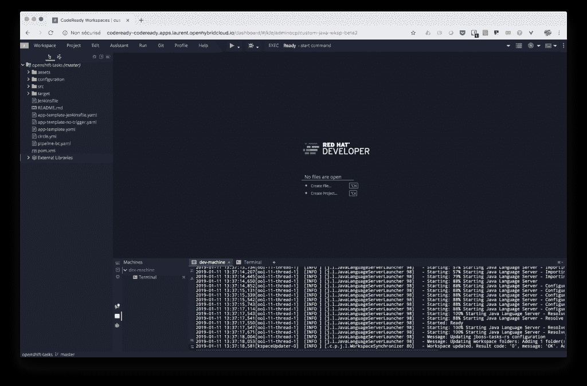
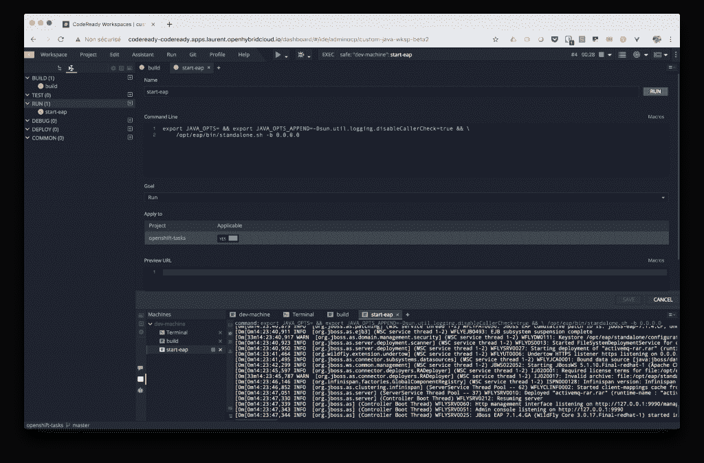
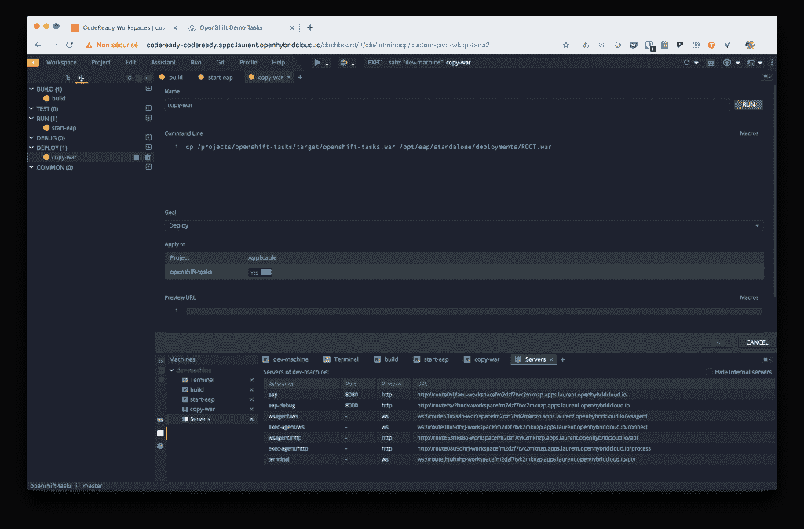
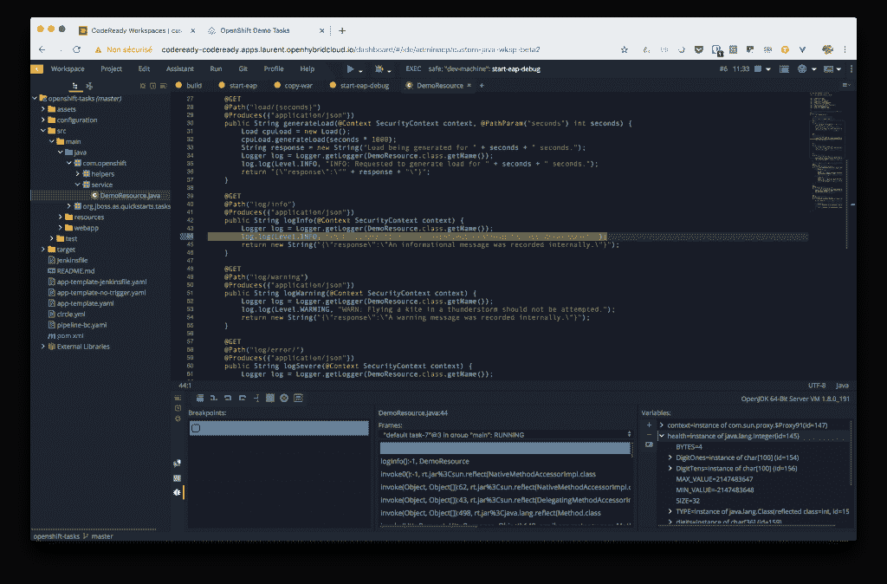
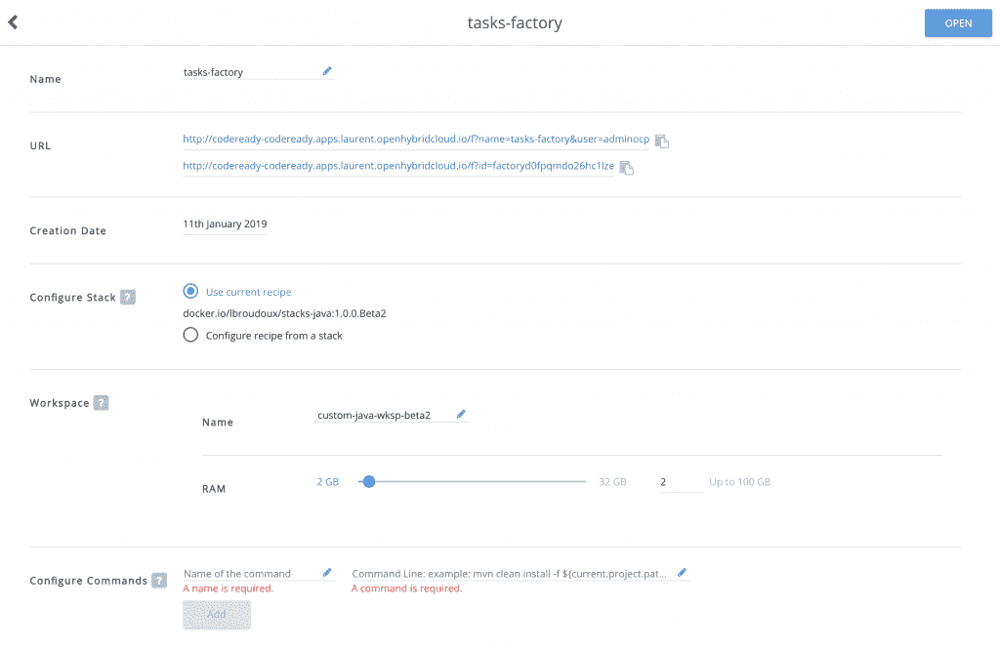
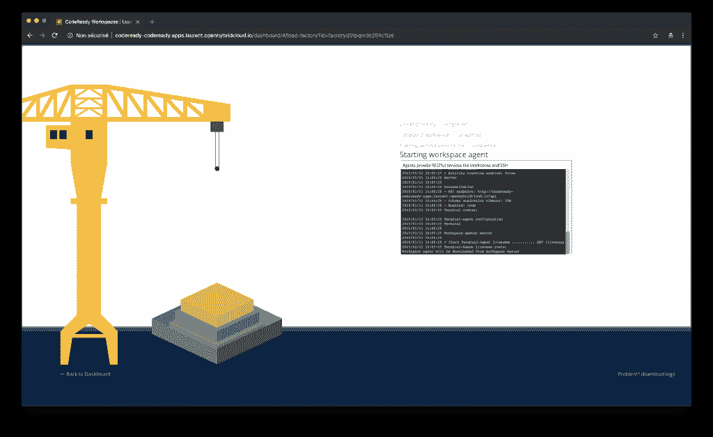

# 用 Red Hat CodeReady 工作区简化您的 JBoss EAP 开发环境:第 2 部分

> 原文：<https://developers.redhat.com/blog/2019/01/28/codeready-workspaces-streamline-jboss-eap-development-part2>

这是我的系列文章的第二部分，讲述如何使用[Red Hat code ready work spaces](https://developers.redhat.com/blog/2018/12/11/codeready-workspaces-openshift/)开发一个 [Java Enterprise Edition](https://developers.redhat.com/topics/enterprise-java/) (现在是 Jakarta EE)应用程序，该应用程序使用[Red Hat JBoss Enterprise Application Platform](https://developers.redhat.com/products/eap/overview/)(JBoss EAP)在 cloud on[Red Hat open shift](https://www.openshift.com/)/[Kubernetes](https://developers.redhat.com/topics/kubernetes/)。在[第一部分](https://developers.redhat.com/blog/2019/01/21/codeready-workspaces-streamline-jboss-eap-development/)中，我们看到了如何:

*   通过扩展 Red Hat 提供的堆栈来自带工具
*   在 Red Hat CodeReady 工作区中注册您自己的堆栈
*   使用您的堆栈创建您的工作区，并嵌入位于 Git 存储库的 JEE 项目

对于第二部分，我们将通过添加一些有助于构建和运行 JBoss EAP 项目的设置和命令来配置工作区。然后我们将看到如何使用本地 JBoss EAP 实例来部署和调试我们的应用程序。最后，我们将创建一个工厂，以便我们能够共享我们的工作，并为任何需要在我们的项目中进行协作的人提供一个按需配置的开发环境。

## 配置 JBoss EAP 工作区

在前一篇文章中，我们最终得到了一个为 Java 配置的工作区，但是缺少一些依赖项。一个额外的步骤通常是必要的:表明你正在处理一个 Maven 项目。设置工作空间的用户只需完成一次。为此，进入*项目* > *更新项目配置*并启用 *JAVA* 部分下的 *Maven* 。一旦完成，一个额外的*外部库*项目就会出现在你的项目树中。现在，您可以打开 Java 文件，体验代码导航、Java 补全等等。

[](https://developers.redhat.com/blog/wp-content/uploads/2019/01/crw-workspace-maven.png)

现在您应该能够启动您的第一个构建命令了。使用*运行* > *命令面板*或`Shift+F10`快捷键打开*命令面板*。您将看到`build`命令是在您创建工作区时定义的，您可以双击它来运行它。

[](https://developers.redhat.com/blog/wp-content/uploads/2019/01/crw-workspace-commands.png)

几秒钟后，您将在`build`命令的专用控制台中看到成功的构建。

[](https://developers.redhat.com/blog/wp-content/uploads/2019/01/crw-workspace-build.png)

不错！您现在可以开始修改代码并进行一些重构。我们能够编辑、编译和打包代码，但是让我们看看如何在 JBoss EAP 实例中进行本地测试。

### 添加一些 JBoss EAP 命令

让我们从添加一个新命令开始，该命令用于启动包含在堆栈映像中的 JBoss EAP 实例。在项目树视图的上方，您会发现右边有一个图标，允许您打开命令管理视图。你会看到命令被分为*构建*、*测试*、*运行*、*调试*、*部署、*和*公共*目标。在*运行*部分，创建一个新的*自定义*命令，您将调用`start-eap`并添加以下命令:

```
export JAVA_OPTS= && export JAVA_OPTS_APPEND=-Dsun.util.logging.disableCallerCheck=true && \
	/opt/eap/bin/standalone.sh -b 0.0.0.0
```

你现在可以通过*命令面板*或菜单栏上的*运行*蓝色箭头来启动该命令。该命令在其自己的控制台中执行，您应该会看到如下所示的输出，表明您的 JBoss EAP 7.1 实例已经启动并正在运行。

[](https://developers.redhat.com/blog/wp-content/uploads/2019/01/crm-workspace-start-eap.png)

现在让我们将应用程序部署到正在运行的实例中。为此，让我们在*部署*部分创建一个新命令，并将其命名为`copy-war`。添加下面的命令并执行它。

```
cp /projects/openshift-tasks/target/openshift-tasks.war /opt/eap/standalone/deployments/ROOT.war
```

这使得先前构建的 WAR 档案能够部署到我们的 JBoss EAP 实例的部署文件夹中。现在，实例应该在几秒钟内就可以热部署它了。您现在可能想要检查您的应用程序并使用它。在命令控制台的右边，点击+按钮并选择*服务器*。这将打开一个新视图，显示与连接到您的工作区的不同服务器相对应的 URL。还记得我们在堆栈配置中声明的`eap`服务器吗？Red Hat CodeReady 工作区使用这些信息来创建一个新的 OpenShift 路径，允许您访问已部署的应用程序！

[](https://developers.redhat.com/blog/wp-content/uploads/2019/01/crw-workspace-servers.png)

只需将 URL 复制并粘贴到您的浏览器中，您就会看到我们的测试应用程序正在运行。

目前，我们只是创建了简单的命令来部署打包的 WAR，但是您也可以调用一些命令来使用展开的目录结构和 JSP 和静态资源的热重载。例如，我使用下面的`build-dev`命令来初始化 JBoss EAP 实例的部署文件夹中的目录结构:

```
mvn clean package -f ${current.project.path}/pom.xml && \
	mkdir /opt/eap/standalone/deployments/ROOT.war && \
	cp -R ${current.project.path}/target/openshift-tasks/* /opt/eap/standalone/deployments/ROOT.war/ && \ 
	touch /opt/eap/standalone/deployments/ROOT.war.dodeploy
```

我使用下面的`update-dev`命令来刷新这个目录，并强制重新部署应用程序:

```
mvn -DskipTests package -f ${current.project.path}/pom.xml && \
	cp -R ${current.project.path}/target/openshift-tasks/* /opt/eap/standalone/deployments/ROOT.war/ && \
	touch /opt/eap/standalone/deployments/ROOT.war.dodeploy
```

### 排除故障

Red Hat CodeReady 工作区工具也可以用于调试您的应用程序。为此，像往常一样在*调试*部分创建一个新命令。让我们称之为`start-eap-debug`，并在那里放入下面的命令，包括我们在堆栈定义中使用的调试标志和端口`8000`:

```
export JAVA_OPTS= && export JAVA_OPTS_APPEND=-Dsun.util.logging.disableCallerCheck=true && \
	/opt/eap/bin/standalone.sh -b 0.0.0.0 --debug 8000
```

现在使用调试模式启动 JBoss EAP 实例。在再次启动之前，您可能想要停止正在运行的实例:您可以通过在顶部的 *EXEC* 菜单栏中查找`start-eap`正在运行的进程并单击蓝色方块来实现。您的实例现在以调试模式启动，您必须在 IDE 中启动调试会话。在这样做之前，请记住在*运行*菜单中的*编辑调试配置*项允许您使用端口`8000`配置到远程 JBoss EAP 实例的连接，如下所示。

[](https://developers.redhat.com/blog/wp-content/uploads/2019/01/crw-workspace-debug-config.png)

您现在可以通过*运行* > *调试* > *远程 EAP* 菜单项启动调试会话。IDE 连接到`localhost:8000`并切换到 debug 透视图。你现在可以打开一些类似于`/src/main/com/openshift/service/DemoResource.java`文件的 Java 类。单击第 44 行放置一个断点。现在转到托管你的应用的浏览器标签，点击`Log Info`按钮；您应该看到调试会话在工作区中启动，并填满了*帧*和*变量*面板。

[](https://developers.redhat.com/blog/wp-content/uploads/2019/01/crw-workspace-debug.png)

### 与工厂共享您的工作

设置一切并不难，但这需要一点时间，而且容易出错。Red Hat CodeReady Workspaces 提供了一个*工厂*的概念，以便能够重现和复制工作区配置。使用工厂，您可以轻松地为您的项目带来新的合作者，只需一次单击即可获得所有内容！

让我们为我们的工作空间创建一个工厂。从 Red Hat CodeReady 工作区仪表板中，选择左侧垂直菜单上的*工厂*菜单项，然后为您的工厂命名并选择您想要用作基础的工作区。选择*创建*，然后在详细信息屏幕中浏览工厂属性:

[](https://developers.redhat.com/blog/wp-content/uploads/2019/01/crw-factory-new.png)

工厂最重要的属性是它的 URL，它可以用于启动一个新的工作区，其中嵌入了我们添加到原始工作区的所有配置和命令。一个 URL 可能与漂亮的徽章结合在一起，提供对任何`README`或维基页面的即时访问。


只需将其中一个 URL 复制并粘贴到浏览器选项卡中，或者单击一个徽章，您将看到这个漂亮的 crane 动画按需构建您自己的工作空间，允许您快速开始新项目的协作。

[](https://developers.redhat.com/blog/wp-content/uploads/2019/01/crw-factory-startup.png)

既然您的合作者的工作空间已经启动并运行，她可以开始编码并轻松地向您的原始源代码存储库提交拉请求。但是我将把这个主题留给以后的文章。

## 开始吧！

我们已经通过本教程了解了 Red Hat CodeReady 工作区如何允许您配置开发环境，并轻松地在您的组织中复制和分发它。基于云/浏览器的嵌入式 IDE 提供了您快速开始项目协作所需的一切，同时通过源代码集中化和访问身份验证为您提供了安全性。Red Hat CodeReady Workspaces 为您提供了更高的安全性和更快的入门速度，它还确保您的代码可以在所有开发人员的机器上运行。

最重要的是，注册测试版很容易。[访问产品页面](https://developers.redhat.com/products/codeready-workspaces/overview)获取代码和您需要了解的关于产品的一切信息。

## 另请参见:

*   [使用 Red Hat CodeReady 工作区简化您的 JBoss EAP 开发环境:第 1 部分](https://developers.redhat.com/blog/2019/01/21/codeready-workspaces-streamline-jboss-eap-development/)
*   [open shift(Beta)的 CodeReady 工作区——它也能在他们的机器上工作](https://developers.redhat.com/blog/2018/12/11/codeready-workspaces-openshift/)
*   [月食 Che 7 来了真的很热:第一部](https://developers.redhat.com/blog/2018/12/18/eclipse-che-7-coming-part-1/)

```

																*Last updated:
							February 21, 2019*

```