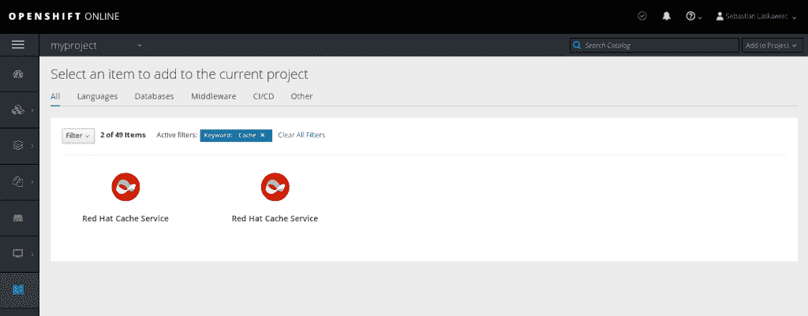
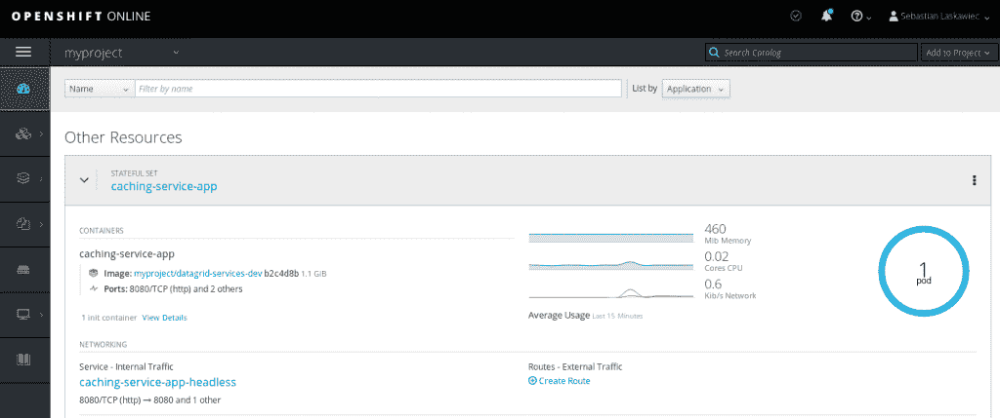

# 在 OpenShift 上自动缩放 Red Hat 缓存服务

> 原文：<https://developers.redhat.com/blog/2018/08/08/autoscaling-red-hat-cache-service>

今年早些时候，Red Hat 宣布了 Red Hat Cache 服务，这是一种分布式内存缓存服务，运行在 [Red Hat OpenShift](https://www.openshift.com/) 上。[红帽数据网格](https://developers.redhat.com/products/datagrid/overview/)被用作缓存服务的核心。缓存服务是你可以通过 [OpenShift 服务目录](https://blog.openshift.com/whats-new-in-openshift-3-7-service-catalog-and-brokers/)轻松安装在 OpenShift 上的东西之一。你可以在[Red Hat open shift Online](https://www.openshift.com/products/online/)Pro 层找到缓存服务。(或者，您可以按照[安装手册](https://github.com/jboss-container-images/datagrid-7-image/blob/datagrid-services-dev/documentation/cache-service.asciidoc#installing-red-hat-cache-service-into-service-catalog)在您自己的 [Red Hat OpenShift 容器平台](https://developers.redhat.com/products/openshift/overview/)上安装缓存服务。)

缓存服务根据其预定的容器大小自动计算用户存储量。一般是 512MB。更有趣的是，缓存服务可以在接近全部内存容量(~ 97–98%)的情况下运行。

自动内存调整为您提供了一个很好的机会来尝试新的[水平 Pod 自动缩放器](https://docs.openshift.com/container-platform/3.9/dev_guide/pod_autoscaling.html)(它现在支持基于内存和自定义指标的自动缩放)。自动缩放器监控容器使用的内存量，并根据这一测量结果添加或删除缓存服务窗格。

## 演示

首先，从服务目录实例化一个新的缓存服务。然后等待几分钟，直到它准备好。

下一步是基于以下定义创建水平 Pod 自动缩放器:

https://gist.github.com/slaskawi/3d0b4aed6c352c4ac2f9827d3c4fd237

一旦一个 pod 达到容器内存的 92 %, open shift 就会启动另一个。

接下来，Red Hat 数据网格将形成两个(或三个)节点的集群，这将增加整个系统的容量。值得注意的有趣的事情是，内存不会下降到 pod 编号 0。它将保持在同一水平。这是因为缓存服务使用的所有者数量等于 1，并且状态传输将群集中的数据洗牌降至最低。

接下来，将一些数据加载到数据网格中。一种方法是在同一个项目中创建一个 Red Hat Enterprise Linux (RHEL) pod，并使用数据进行 REST 调用:

https://gist.github.com/slaskawi/43667383c67f6c8d60bed2eb05ab0cfd

上面的命令旋转出一个新的 RHEL 吊舱，并将 TTY 附加到它上面。这样，我们将能够从项目内部调用 curl 命令:

https://gist.github.com/slaskawi/ccaafac852a228d6ec54d0f9ff421031

上面的命令在默认缓存中插入 1000 个条目。每个条目大约是 10KB。根据容器的大小，我们可能会增加循环中的迭代次数，或者调整命令以将数据插入不同的键前缀。

一旦容器达到缩放限制，水平窗格自动缩放将创建另一个窗格。

## 结论

自动伸缩 Red Hat 缓存服务是根据负载增加整体系统容量的一种非常好的方式。因为缓存服务是基于逐出(当达到内存限制时删除最不常用的键)和堆外的。它被设计为在不断添加数据时达到 97–98%的容量。由于新数据“推出”旧条目，容器只会向上扩展，永远不会向下扩展。

尝试自动缩放 Red Hat 缓存服务，以提高系统的整体容量。