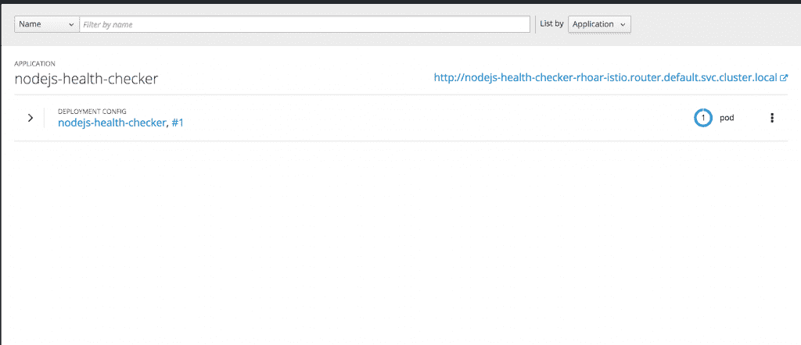
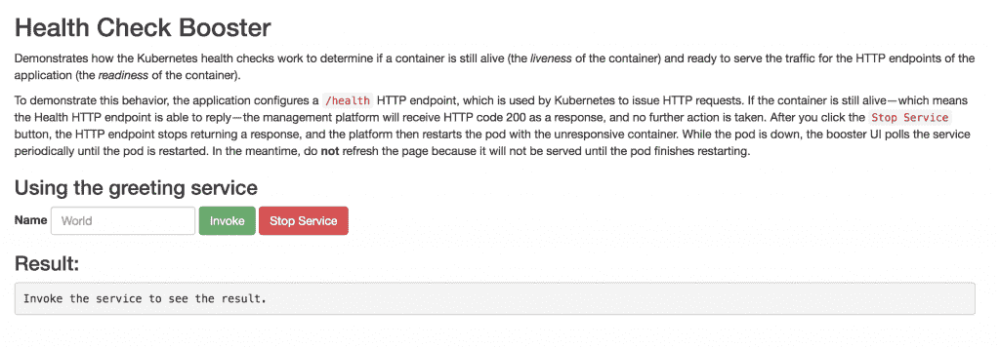
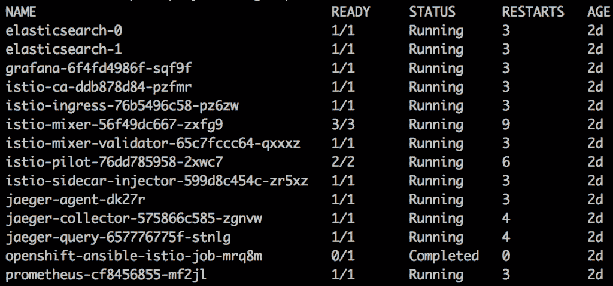
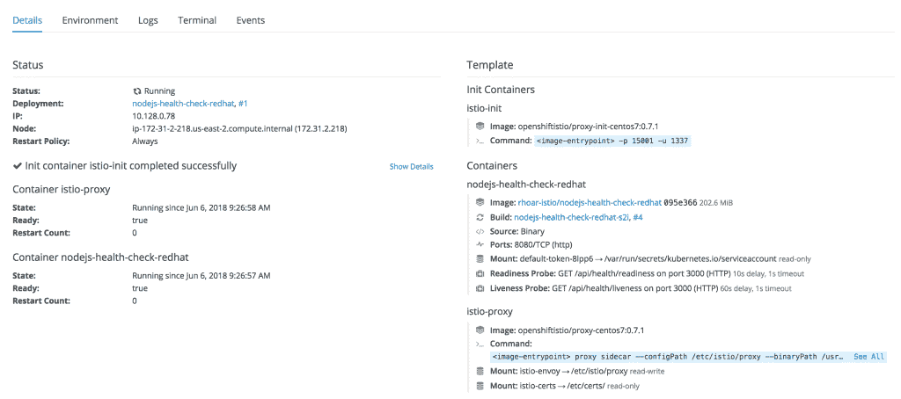
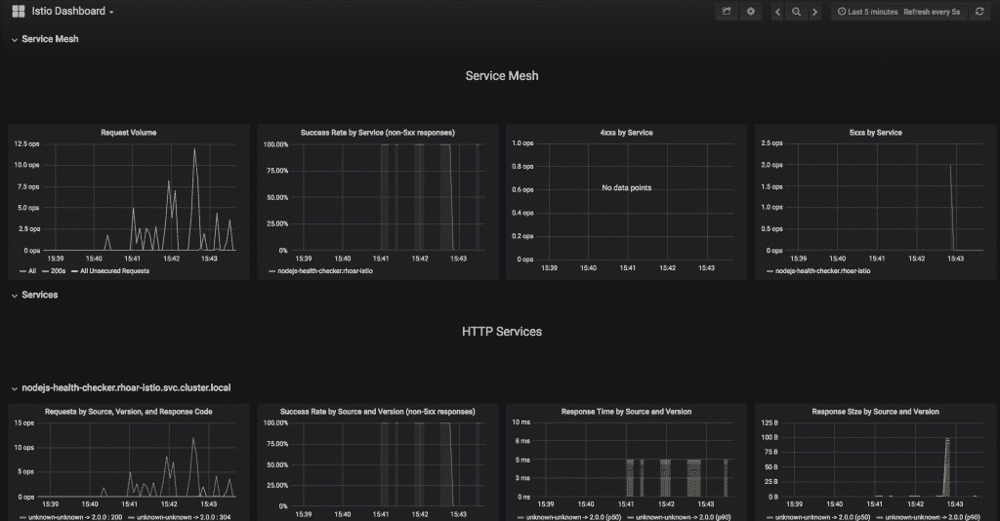

# 使用 Red Hat OpenShift 应用程序运行时和 Istio 构建容器原生 Node.js 应用程序

> 原文：<https://developers.redhat.com/blog/2018/06/11/container-native-nodejs-istio-rhoar>

对于在基于 Kubernetes 的应用程序环境(如 Red Hat OpenShift)上工作的开发人员来说，要想充分利用这些技术提供的显著优势，需要考虑很多事情，包括:

*   我如何与编排层通信，以表明应用程序运行正常，可以接收流量？
*   如果应用程序检测到系统故障，会发生什么情况？应用程序如何将故障传递给编排层？
*   我如何准确地跟踪我的应用程序之间的流量，以便识别潜在的瓶颈？
*   作为标准工具链的一部分，我可以使用哪些工具轻松部署我的更新应用程序？
*   如果我在我的服务之间引入一个网络故障会发生什么，我如何测试这个场景？

这些问题是构建容器本地解决方案的核心。在 Red Hat，我们将*容器原生*定义为符合以下关键原则的应用程序:

*   DevOps 自动化
*   单一关注原则
*   服务发现
*   高度可观察性
*   生命周期一致性
*   运行时间限制
*   过程可处理性
*   图像不变性

这看起来像是核心应用程序逻辑上的大量开销。 [Red Hat OpenShift 应用运行时(RHOAR)](https://developers.redhat.com/products/rhoar/overview/) 和 [Istio](https://developers.redhat.com/topics/service-mesh/) 为开发人员提供了工具，让他们在编码和实现方面以最小的开销遵守这些原则。

在这篇博客文章中，我们特别关注 RHOAR 和 Istio 如何结合起来为 DevOps 自动化、生命周期一致性、高可观察性和运行时限制提供工具。

**注意:本文基于 Istio 的 0.7 版本，这是撰写本文时的最新版本。我们不建议将此版本的 Istio 用于生产部署，因为一些关键功能仍处于 alpha/beta 状态。虽然 Istio 发展迅速，但我们认为，一旦它成为可行的产品，开发人员学习和理解充分利用该技术的能力是非常重要的。**

## 先决条件

*   红帽 Openshift 容器平台 3.9 (RHOCP)或 Minishift Istio 构建:[https://github.com/openshift-istio/origin/releases](https://github.com/openshift-istio/origin/releases)
*   `oc`使用集群管理员权限对 RHOCP 进行命令行访问
*   Node.js 版本 8.6.0

**注意:由于在安装阶段需要管理员权限，Istio 在 Red Hat OpenShift Online 上不可用。**

## **建立 RHOAR 项目**

我们将从 RHOAR health check booster repo 开始:
[https://github . com/Bucharest-gold/nodejs-health-check-red hat](https://github.com/bucharest-gold/nodejs-health-check-redhat)。
使用以下命令克隆该存储库:

```
$ git clone https://github.com/bucharest-gold/nodejs-health-check-redhat
```

切换到`nodejs-health-check-redhat`文件夹:

```
$ cd nodejs-health-check-redhat
```

安装`npm`依赖项:

```
$ npm install
```

在 OpenShift 中创建一个名为`rhoar-istio`的新项目:

```
$ oc new-project rhoar-istio
```

部署 RHOAR booster 应用程序:

```
$ npm run openshift
```

部署完成后，您应该会看到如下输出:

```
 2018-06-01T14:06:35.037Z INFO build nodejs-health-check-redhat-s2i-1 complete
 2018-06-01T14:06:37.923Z INFO creating deployment configuration nodejs-health-check-redhat
 2018-06-01T14:06:37.927Z INFO creating new route nodejs-health-check-redhat
 2018-06-01T14:06:37.963Z INFO creating new service nodejs-health-check-redhat
 2018-06-01T14:06:38.063Z INFO route host mapping nodejs-health-check-redhat-rhoar.router.default.svc.cluster.local
 2018-06-01T14:06:38.106Z INFO complete
```

在 OpenShift 中，应该已经部署了应用程序，并且 pods 应该正在运行，如下所示。



这里需要注意的关键是路由主机映射 URL，在本例中是`http://nodejs-health-checker-rhoar-istio.router.default.svc.cluster.local`。正确配置 DNS 后，您应该能够导航到此 URL 并看到以下页面:



我们将很快使用这个 UI 来触发容器重启。

让我们看一下代码，看看这个 booster 应用程序演示了什么。
查看`app.js`，我们可以看到以下内容，这意味着应用程序正在创建 Express web 框架的实例:

```
const app = express();
```

下面一行表示应用程序在启动时将变量`isOnline`设置为`true`:

```
let isOnline = true;
```

该应用程序正在定义一个自定义的活跃度探测器，如果`isOnline`设置为 true，该探测器将返回“OK ”:

```
const options = {
	livenessCallback: (request, response) => {
		return isOnline ? response.send('OK') : response.sendStatus(500);
	}
};

```

该应用程序正在定义一条路线`/api/stop`，允许用户将`isOnline`的值设置为`false`:

```
app.use('/api/stop', (request, response) => {
	isOnline = false;
	return response.send('Stopping HTTP server');
});
```

该应用程序使用`kube-probe` npm 模块来提供就绪性和活性探测:

```
const probe = require('kube-probe');
```

探针模块通过 app 对象(Express 的实例)调用:

```
probe(app, options);
```

当您在 OpenShift 控制台中查看窗格时，您应该会看到如下内容:


这表明准备就绪探测器正确地通知 OpenShift 集装箱准备就绪。

从路由公开的 UI 中，当您单击**停止服务**按钮时，您应该在 OpenShift 中看到一个指示，表明 OpenShift 已经检测到活跃度探测器已经失败，并且正在尝试重新启动容器。

所以这是 RHOAR 提供的非常酷的“开箱即用”功能，触及了容器原生设计的三个关键原则:DevOps 自动化、生命周期一致性和高可观察性。

## 为什么要用 Istio？

以下摘自 Istio 网站:

> Istio 提供了一个完整的解决方案，通过提供对服务网格整体的行为洞察和运营控制来满足微服务应用的各种需求。它在服务网络中统一提供许多关键功能:
> 
> **交通管理。**控制业务和 API 调用在服务之间的流动，使调用更加可靠，使网络在面对不利条件时更加健壮。
> **服务身份和安全。**在网格中提供具有可验证身份的服务，并提供保护服务流量的能力，因为服务流量流经不同信任度的网络。
> **政策强制执行。**将组织策略应用于服务之间的交互，确保访问策略得到执行，资源在消费者之间得到公平分配。策略更改是通过配置网格来实现的，而不是通过更改应用程序代码。
> **遥测。**了解服务之间的依赖关系以及它们之间流量的性质和流动，提供快速识别问题的能力。

简而言之，在我们的项目中引入 Istio 将会提供许多关于流量管理、监控和容错的工具，从而为高观测性原则带来许多好处。

例如，在对开发人员的实现影响最小的情况下，Istio 将生成如下跟踪信息:


上面的屏幕截图显示了一个请求在一个服务网格中命中三个微服务的轨迹。下面的屏幕截图显示了一个有向非循环图中的相同网格，它也是由 Istio 记录的信息生成的。


## 安装 Istio

首先，我们将使用以下说明安装 Istio:[https://github . com/open shift-Istio/open shift-ansi ble/blob/Istio-3.9-0 . 7 . 1/Istio/installation . MD](https://github.com/openshift-istio/openshift-ansible/blob/istio-3.9-0.7.1/istio/Installation.md)

**在主节点:**

转到包含主配置文件(`master-config.yaml`)的目录，例如`/etc/origin/master`。

用以下内容创建一个名为`master-config.patch`的文件:

```
admissionConfig:
 pluginConfig:
  MutatingAdmissionWebhook:
   configuration:
    apiVersion: v1
    disable: false
    kind: DefaultAdmissionConfig
kubernetesMasterConfig:
 controllerArguments:
  cluster-signing-cert-file:
  - ca.crt
  cluster-signing-key-file:
  - ca.key
```

运行以下命令来修补`master-config.yml`文件，并重新启动原子 OpenShift 主服务:

```
cp -p master-config.yaml master-config.yaml.prepatch

oc ex config patch master-config.yaml.prepatch -p "$(cat ./master-config.patch)" > master-config.yaml
systemctl restart atomic-openshift-master*
```

为了运行 Elasticsearch 应用程序，需要对每个节点上的内核配置进行更改；这种变化将通过`sysctl`服务来处理。

用以下内容创建一个名为`/etc/sysctl.d/99-elasticsearch.conf`的文件:

```
vm.max_map_count = 262144
```

执行以下命令:

```
sysctl vm.max_map_count=262144
```

在拥有以集群管理员权限登录的`oc`用户的机器上，在本地克隆`openshift-istio`存储库:

```
$ git clone https://github.com/openshift-istio/openshift-ansible.git

$ cd openshift-ansible/istio
```

运行 Istio 安装程序模板:

```
$ oc new-app istio_installer_template.yaml --param=OPENSHIFT_ISTIO_MASTER_PUBLIC_URL=<master public url>
```

验证安装:

```
$ oc get pods -n istio-system -w
```

您应该会看到类似如下的列表:



一旦所有的 pod 成功运行，就会创建许多新的路由，例如，下面的屏幕截图中所示的那些路由:


花点时间看看这些路由公开的接口；在我们开始使用 Istio 代理边车之前，这个阶段不会有任何数据。

既然已经安装并运行了 Istio，我们需要配置 Node.js 应用程序部署来包含 Istio 代理 sidecar。Istio 被配置为将代理边车添加到任何包含注释`sidecar.istio.io/inject: "true"`的部署中。

## 更改活动/就绪探测器正在侦听的端口

如果活动/就绪探测器与 app 路由位于同一端口，Istio sidecar 代理将无法正常运行。为了解决这个问题，我们将把 Node.js 应用程序中探测器的端口改为 3000。

为此，我们通过向`app.js`添加以下内容来添加一个额外的 Express web framework 实例，该实例侦听端口 3000:

```
const health = express();

…

probe(health, options);
health.listen(3000, function(){
	console.log('App ready, probes listening on port 3000');
})
```

完整的`app.js`文件现在将如下所示:

```
const path = require('path');
const express = require('express');
const bodyParser = require('body-parser');
const probe = require('kube-probe');
const app = express();
const health = express();
app.use(bodyParser.json());
app.use(bodyParser.urlencoded({extended: false}));
app.use(express.static(path.join(__dirname, 'public')));
// Expose the license.html at http[s]://[host]:[port]/licences/licenses.html
app.use('/licenses', express.static(path.join(__dirname, 'licenses')));
let isOnline = true;
//
app.use('/api/greeting', (request, response) =&gt; {
if (!isOnline) {
	response.status(503);
	return response.send('Not online');
}
const name = request.query ? request.query.name : undefined;
	return response.send({content: `Hello, ${name || 'World!'}`});
});
app.use('/api/stop', (request, response) =&gt; {
	isOnline = false;
	return response.send('Stopping HTTP server');
});
const options = {
	livenessCallback: (request, response) =&gt; {
		return isOnline ? response.send('OK') : response.sendStatus(500);
	}
};
probe(health, options);
health.listen(3000, function(){
	console.log('App ready, probes listening on port 3000');
})
module.exports = app;

```

## 更新 deployment.yml 文件

我们需要对`.nodeshift/deployment.yml`文件进行如下修改。新增内容以绿色突出显示。
变更以红色突出显示:

```
spec:
 template:
  metadata:
   labels:
    app: nodejs-health-check-redhat
    name: nodejs-health-check-redhat
   annotations:
    sidecar.istio.io/inject: "true"
 spec:
  containers:
  - name: nodejs-health-check-redhat
   ports:
   - containerPort: 8080
    protocol: TCP
    name: http
   readinessProbe:
    httpGet:
     path: /api/health/readiness
     port: 3000
     scheme: HTTP
    failureThreshold: 3
    initialDelaySeconds: 10
    periodSeconds: 5
    successThreshold: 1
    timeoutSeconds: 1
   livenessProbe:
    httpGet:
     path: /api/health/liveness
     port: 3000
     scheme: HTTP
    failureThreshold: 2
    initialDelaySeconds: 60
    periodSeconds: 3
    successThreshold: 1
    timeoutSeconds: 1
   resources:
    limits:
    cpu: 200m
    memory: 400Mi
   requests:
    cpu: 100m
    memory: 200Mi

```

让我们单独来看看这些变化。

为了让 Istio metrics 正确识别应用，模板必须在`metadata`中有一个“应用”标签:

```
metadata:
labels:
 app: nodejs-health-check-redhat
 name: nodejs-health-check-redhat
```

Istio 边车注入器被配置为将边车代理添加到包括`sidecar.istio.io/inject: "true"`注释的任何部署中。所以我们将它添加到`metadata`下:

```
annotations:
&nbspsidecar.istio.io/inject: "true"
```

对于要记录为 HTTP 的数据，容器必须有一个名为`http`的端口定义。

```
- name: nodejs-health-check-redhat
 ports:
 - containerPort: 8080
  protocol: TCP
  name: http
```

如前所述，我们将探头端口从 8080 更改为 3000:

```
readinessProbe:
 httpGet:
  path: /api/health/readiness
  port: 3000
  scheme: HTTP
 failureThreshold: 3
 initialDelaySeconds: 10
 periodSeconds: 5
 successThreshold: 1
 timeoutSeconds: 1
livenessProbe:
 httpGet:
  path: /api/health/liveness
  port: 3000
  scheme: HTTP
 failureThreshold: 2
 initialDelaySeconds: 60
 periodSeconds: 3
 successThreshold: 1
 timeoutSeconds: 1
```

最后，我们还添加了一些资源约束来进行通信，以 OpenShift 此容器将消耗的所需 CPU 和内存:

```
resources:
 limits:
  cpu: 200m
  memory: 400Mi
 requests:
  cpu: 100m
  memory: 200Mi
```

## 创建 service.yml 文件

为了让 Istio 将我们应用的流量视为 HTTP，我们需要在`.nodeshift`文件夹中创建一个`service.yml`文件，该文件需要包含以下内容:

```
spec:
 ports:
 - name: http
  port: 8080
  protocol: TCP
  targetPort: 8080
```

## 重新部署应用程序

首先，删除现有的部署配置:

```
$ oc delete dc/nodejs-health-check-redhat

$ oc delete service nodejs-health-check-redhat

$ oc delete route nodejs-health-check-redhat
```

运行`npm run openshift`来重新部署应用程序。

部署完成后，您应该会在 OpenShift 控制台中看到以下内容:


**注意:上面的截图显示 nodejs-health-check-redhat 窗格中现在有两个容器就绪(2/2 ),这表明 Istio sidecar 代理正在应用程序容器旁边运行。**

当您单击运行窗格时，您应该会看到如下容器列表:



导航到 UI 路由，例如`http://nodejs-health-check-redhat-rhoar.router.default.svc.cluster.local/`，并执行一些请求。同样值得点击**停止服务**按钮来测试 Istio 如何处理服务不可用。

## 在 Istio 中检查结果

如果您现在查看我们在`istio-system`项目中创建的`grafana`路由，您应该会看到类似下面的截图，它清楚地显示了我们的应用程序的流量以及响应时间、失败和成功率。



查看 Jaeger 控制台，您还应该看到大量的活动，例如:


## 总结

对于应用程序开发人员来说，构建基于容器的解决方案似乎是一项具有挑战性的任务，会增加很多开销。使用 RHOAR 和 Istio 的组合将会处理很多这样的问题，让应用程序开发人员专注于实现业务逻辑。

这些工具使开发人员能够更轻松地控制 OpenShift 应用程序的部署，与服务编排框架进行交互，监控应用程序的性能，了解应用程序与其他应用程序(服务网格)的关系，以及引入和测试系统故障。开发人员不需要学习如何容器化他们的应用程序或在应用程序级别实现任何度量或跟踪工具；这都是以最小的配置提供的。

*Last updated: June 10, 2018*