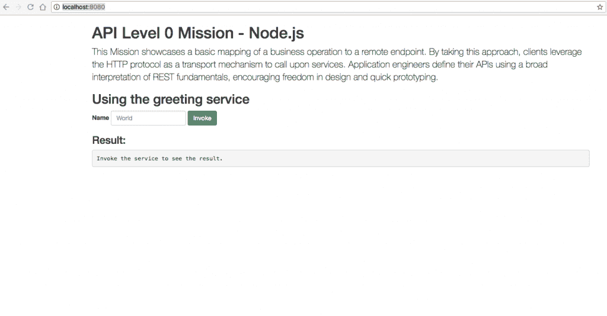
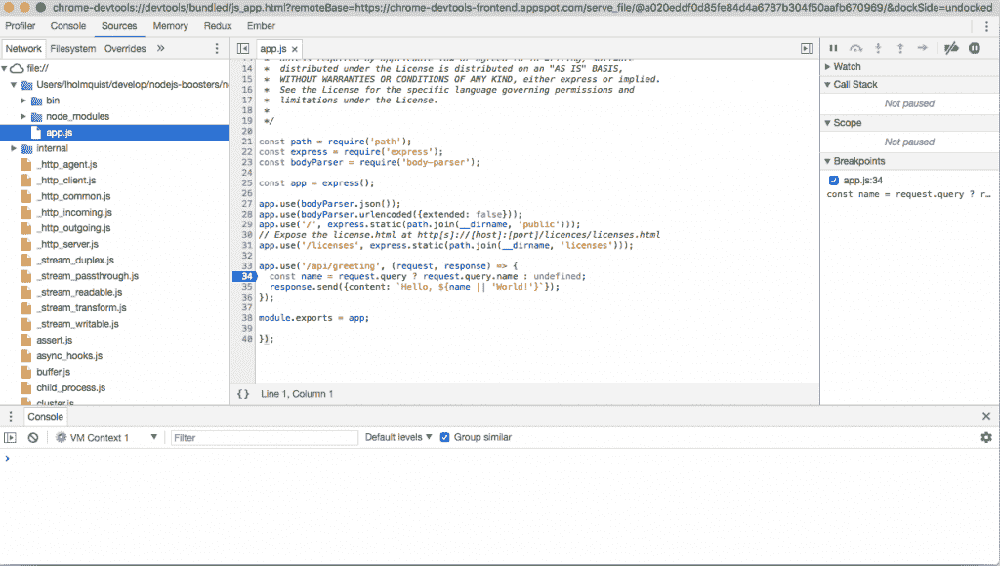
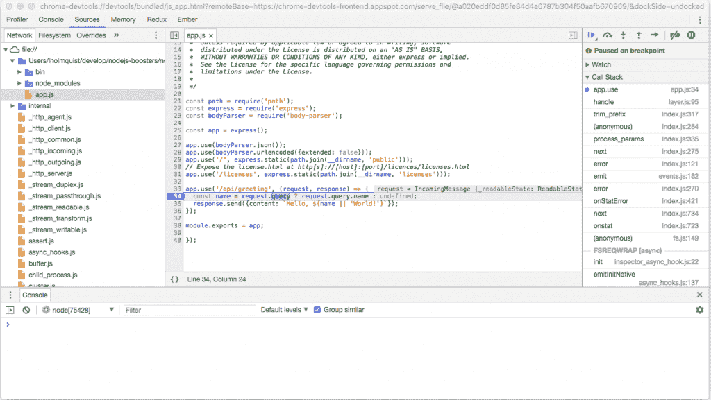
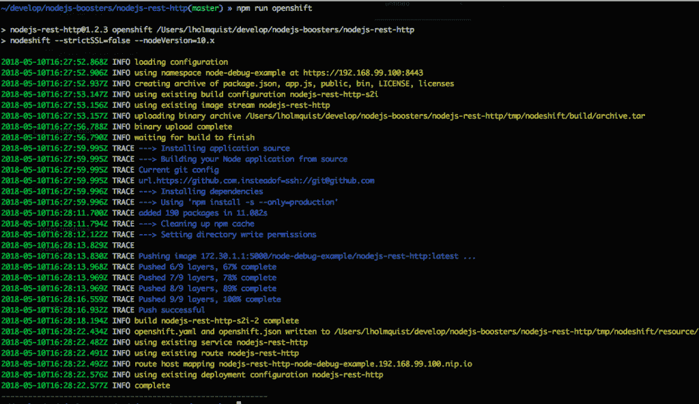
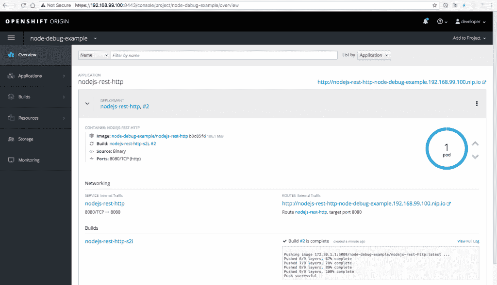
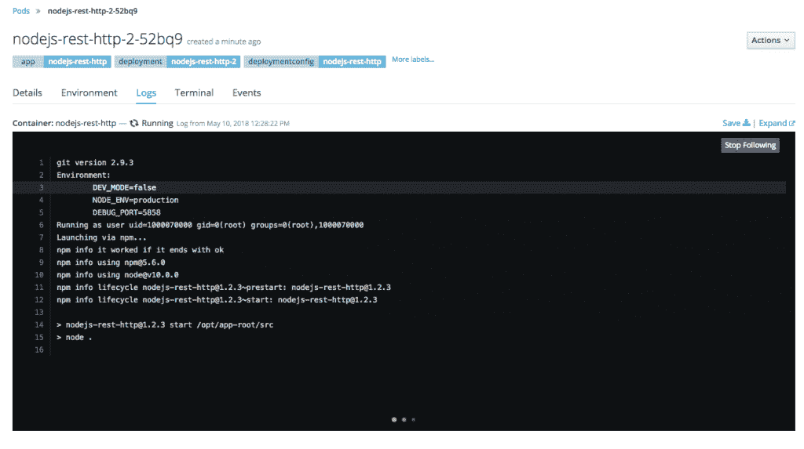
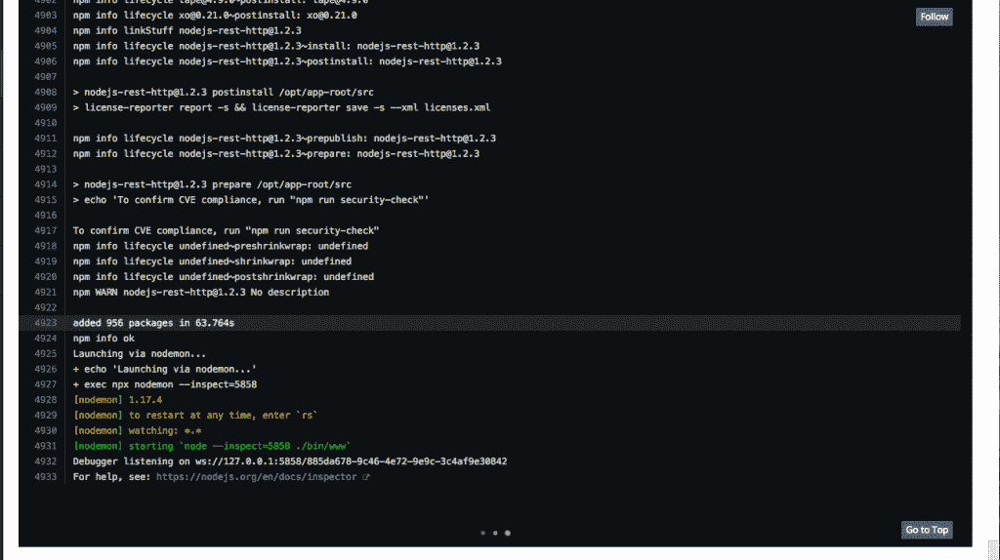
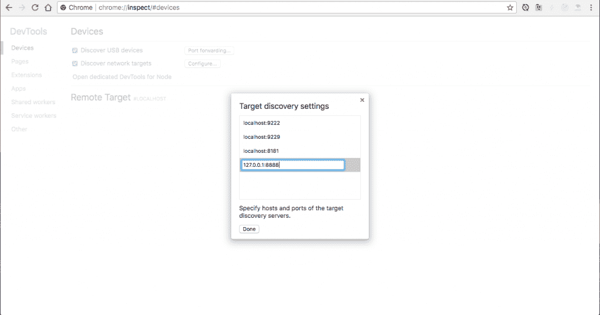
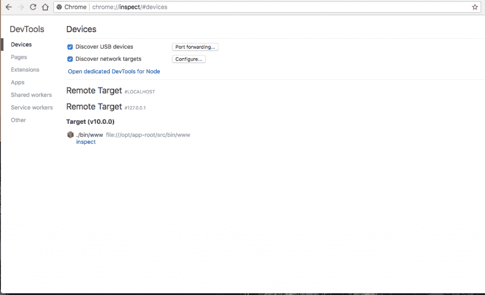
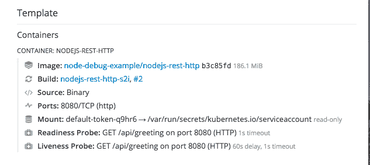

# 如何用 Chrome DevTools 在 OpenShift 上调试你的 Node.js 应用

> 原文：<https://developers.redhat.com/blog/2018/05/15/debug-your-node-js-application-on-openshift-with-chrome-devtools>

**(编辑:2019 . 11 . 22)本帖使用的节点图片，无论是社区`centos7`还是`product`，都不再更新维护。对于社区图像，请使用位于此处的基于通用基础图像(UBI)的节点图像:[registry.access.redhat.com/ubi8/nodejs-10](http://registry.access.redhat.com/ubi8/nodejs-10)**

**如需 Node.js 的完整支持产品版本，请查看红帽软件收藏 Node.js 图片， [RH SCL Node.js](https://access.redhat.com/containers/#/registry.access.redhat.com/rhscl/nodejs-10-rhel7) 。**

最近，我写了一篇名为[Zero to Express on OpenShift in Three Commands，](https://developers.redhat.com/blog/2018/04/16/zero-express-openshift-3-commands/)的帖子，展示了如何使用 Node.js s2i(源到图像)图像尽快开始使用 Node.js、Express 和 open shift，这些图像最近作为 [Red Hat OpenShift 应用程序运行时](https://developers.redhat.com/blog/2018/03/12/rhoar-nodejs-annoucement/) (RHOAR)的一部分发布。

这篇文章将补充上一篇文章，展示我们如何使用 Chrome Developer Tools(DevTools)inspector 开始调试和检查我们正在运行的代码。

### 入门指南

和上一篇文章一样，这里有一些必要的先决条件。您需要安装 [Node 8.x](https://nodejs.org) 和 [npm 5.2](https://www.npmjs.com/) 或更高版本。npm 附带了官方的 node 发行版，所以如果你安装来自 Nodejs.org[的 Node](https://nodejs.org)，你应该没问题。

您还需要访问 OpenShift 环境或 Red Hat Container Development Kit(CDK)minishift 环境。对于这个例子，我将使用 minishift。你可以在这里找到关于启动和运行 minishift[的说明。对于我的本地微移位，我使用以下命令启动它:](https://developers.redhat.com/products/cdk/hello-world/)

```
$ minishift start --memory=6144 --vm-driver virtualbox
```

当然，你需要安装 Chrome 浏览器。你可以在这里得到。

### 第一步

在我们开始尝试在 OpenShift 上调试我们的应用程序之前，让我们先回顾一下我们是如何在本地完成这项工作的。如果您已经熟悉这是如何工作的，那么请随意跳到下一部分。

#### 获取应用程序

我们在上一篇文章中创建的应用程序是一个通用的应用程序框架，所以让我们使用一些更有用的东西。我们将使用[REST API 0 级示例](https://github.com/bucharest-gold/nodejs-rest-http)，它是 RHOAR 的助推器之一。

克隆回购:

```
$ git clone https://github.com/bucharest-gold/nodejs-rest-http
```

转到目录:

```
$ cd nodejs-rest-http
```

安装依赖项:

```
$ npm install
```

运行应用程序:

```
$ npm run start
```

应用程序应该在`localhost:8080`运行，看起来像这样:



这是一个非常基本的 Hello World REST 应用程序。

让我们看看那个`npm run start`在做什么。在我们的`package.json`文件中，在`scripts`部分，我们可以看到:

```
// package.json
{
  "name": "nodejs-rest-http",
  ....
  "scripts": {
    ....
    "start": "node ."
  },
  "main": "./bin/www",
  ....
}

```

`start`只是调用`node`,因为也有一个`main`属性，它将使用该属性作为入口点。

所以真的，`npm run start`和`node ./bin/www`是一样的。

#### 本地调试

现在让我们再次启动应用程序，但这一次我们希望能够在 Chrome DevTools 中检查代码。

这一次，我们将像这样启动应用程序:

```
$ node --inspect ./bin/www
```

运行该命令后，您应该会看到类似这样的内容:

```
Debugger listening on ws://127.0.0.1:9229/9f332ec3-f7e9-4558-a67d-3ef8d13947cc
For help, see: https://nodejs.org/en/docs/inspector

```

现在，打开 Chrome，在地址栏输入`chrome://inspect`。您应该会看到类似这样的内容:


然后点击`inspect`链接，这将打开 Chrome DevTools 窗口。它看起来会像这样:


我们可以看到有许多文件可以访问。我们真的不需要担心这些，因为这些文件是在节点进程启动时加载的。我们对`app.js`文件感兴趣。

让我们设置一个断点，这样我们就可以在调用 REST API 时检查它。

要设置断点，只需单击左侧装订线上的行号。让我们把断点设在第 34 行。



切换到运行在`http://localhost:8080/`上的示例 UI，在名称字段中键入一些内容，然后单击**调用**按钮。

检查器窗口应该获得焦点，执行应该在我们设置的断点处暂停。



在这里，我不打算详细介绍您可以检查的所有内容，因为它与任何源代码调试器都相似。

### OpenShift

既然我们已经看到了如何在本地运行应用程序的情况下连接到调试器，那么让我们看看当应用程序在 OpenShift 上运行时，如何连接到应用程序。

首先，我们需要将我们的应用程序放在一个 OpenShift 集群上。如前所述，我将使用 minishift，这样我就可以在本地计算机上运行 OpenShift。

运行之后，确保您已经登录(我使用 developer/developer)，并创建一个新项目来部署我们的应用程序:

```
$ oc login
```

```
$ oc new-project node-debug-example
```

#### 部署到 OpenShift

要部署我们的应用程序，请运行以下命令:

```
$npm run openshift
```

npm 脚本使用一个名为 [Nodeshift](https://www.npmjs.com/package/nodeshift) 的模块来完成部署到 OpenShift 的所有繁重工作。

您的控制台输出应该如下所示:



这篇文章不会深入讨论 Nodeshift 是如何工作的，但是请关注不久的将来关于 Nodeshift 的文章。

如果您也导航到 OpenShift 控制台(我的控制台位于`https://192.168.99.100:8443/console/`)并单击您的项目(`node-debug-example`，您应该会看到您部署的应用程序:



单击该 URL，将把您带到您的应用程序，它看起来应该与我们在本地运行它时看到的没有任何不同。


返回主概览页面，单击蓝色圆圈内部。这将把您带到我们的应用程序正在运行的实际 pod。然后点击**日志**标签。



我们可以看到我们的应用程序正在运行，并且有一个值为 5858 的`DEBUG_PORT`环境变量，但是应用程序没有使用`--inspect`标志启动，因为默认情况下，`NODE_ENV`环境变量被设置为`production`。

#### OpenShift 上的调试

我们需要在“开发”模式下部署我们的应用程序。有几种方法可以做到这一点。我将使用控制台 UI 向我们的部署配置添加一个环境变量。

如果您点击返回到**概述**屏幕，然后点击部署名称(`nodejs-rest-http`)，您将进入部署屏幕。

导航到**环境**选项卡。在这里，我们将添加一个名为`NODE_ENV`的新环境变量，其值为`development`。


设置新变量将触发新的部署。

这个部署可能需要更长的时间才能激活，因为我们现在实际上正在安装来自`package.json`的所有开发依赖项。

如果我们像以前一样单击窗格并查看日志，我们可以看到正在发生的`npm install`活动。

我们的节点应用程序现在将由 [Nodemon](https://nodemon.io/) 启动，这对本文并不重要。

现在我们可以看到，节点进程是用`--inspect`标志启动的，调试器正在监听 127.0.0.1。



#### 端口转发

但是那是本地的，所以我们如何把 DevTools 连接到那？我们使用`oc port-forward`命令:

```
$ oc port-forward $(oc get po | grep nodejs-rest-http | grep Running | awk '{print $1}') 8888:5858
```

这里发生了很多事情，让我们来分析一下。

`port-forward`需要一个 pod 名称，这就是那个`$()`里面的内容。

`oc get po`会得到豆荚。

`grep nodejs-rest-http`将只显示该行中有`nodejs-rest-http`的窗格。

`grep Running`将过滤列表以仅显示正在运行的 pod。

然后，`awk`语句将输出那些`grep`搜索的第一列，在本例中是 pod 名称:类似于`nodejs-rest-http-3-fzgk4`。每一次部署时，末尾的字符会发生变化，这就是我们做这个小声明的原因。

最后一位`8888:5858`，表示我们将在端口 8888 上本地监听(您的计算机)，然后将这些请求转发到端口 5858(在 OpenShift 上)。

所以和之前一样，转到`chrome://inspect`，但是这次我们需要添加`127.0.0.1:8888`这样我们就可以连接了。点击**配置**按钮并添加这些值:



现在应该有一个带有`inspect`链接的远程目标:



一旦您点击了`inspect`链接，您就可以像我们在本地示例中所做那样开始检查和调试您的应用程序。


### 快速笔记

如果您注意到您的“问候”端点在您没有与之交互的情况下被调用，这是正常的。该应用程序有一个指向该端点的就绪性和活性探测器。



**注意:**在本例中，我们使用的是位于的[10 . x 社区 s2i 图像。](https://hub.docker.com/r/bucharestgold/centos7-s2i-nodejs/tags/)

要在 OpenShift 上使用完全支持的 Node.js 版本，您只需要添加`--dockerImage`标志。

这将集成 Node.js (8.x)的 Red Hat OpenShift 应用程序运行时版本，作为我们产品订阅的一部分，您可以获得完整的生产和开发人员支持。

这可能看起来像这样:

```
// package.json
{
  "name": "nodejs-rest-http",
  ....
  "scripts": {
    ....
    "openshift": "nodeshift --strictSSL=false --dockerImage=registry.access.redhat.com/rhoar-nodejs/nodejs-8"
  },
  ....
}

```

### 概述

虽然我们使用了一个非常简单的应用程序作为示例，但是这篇文章展示了开始调试运行在 OpenShift 上的应用程序所需的最小设置。

### 进一步阅读

*   [节点转移](https://www.npmjs.com/package/nodeshift)
*   [Minishift 文档](https://docs.openshift.org/latest/minishift/index.html) / [红帽容器开发工具包文档](https://developers.redhat.com/products/cdk/docs-and-apis/)
*   [Node.js 检查标志](https://nodejs.org/en/docs/inspector)
*   [Red Hat OpenShift 应用程序运行时(RHOAR)](https://developers.redhat.com/blog/2018/03/12/rhoar-nodejs-annoucement/)

*Last updated: January 28, 2020*