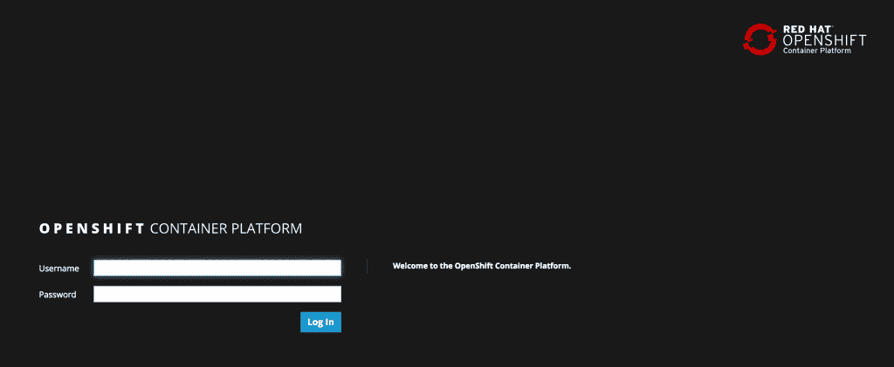
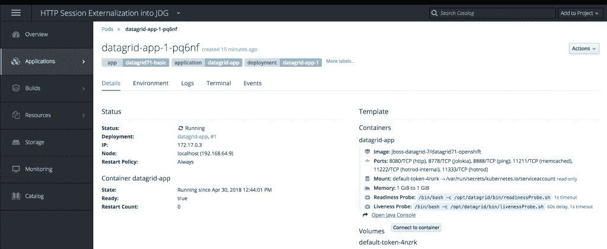
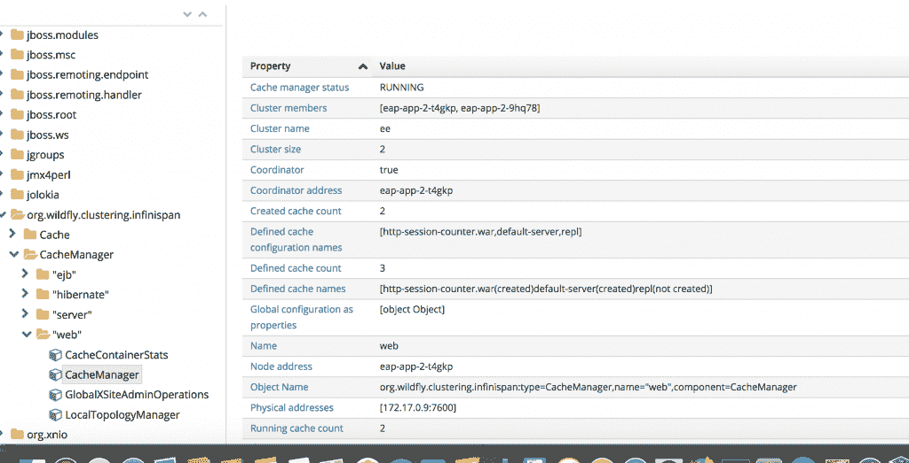
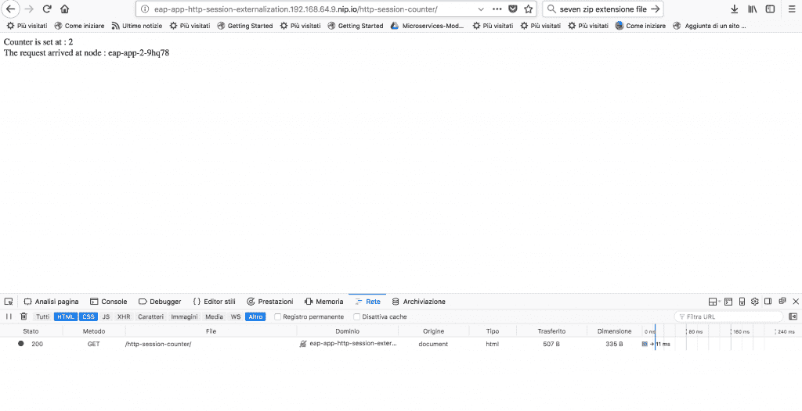

# OpenShift 3.9 环境中的外部化 HTTP 会话

> 原文：<https://developers.redhat.com/blog/2018/05/04/externalized-http-session-in-openshift-3-9>

在本文中，我将展示如何实现一个常见的用例，这种用例在将一个经典的 Java EE 应用程序迁移到 Red Hat OpenShift 环境时经常出现。

## **场景**

通常，经典的 Java EE 应用程序在 HTTP 会话中存储用户信息，比如概要文件的配置。在典型的生产场景中，有几个应用服务器实例构建一个集群，用于实现高可用性、故障转移和负载平衡。为了确保跨应用服务器实例保留有状态信息，您必须按照 [Java EE 7 规范](http://download.oracle.com/otn-pub/jcp/java_ee-7-fr-spec/JavaEE_Platform_Spec.pdf)EE . 6.4 节“Servlet 3.1 需求”中的描述来分发会话

但是如何在 xPaaS 环境中做到这一点呢，比如 OpenShift，在这里您通常会部署一个无状态的应用程序。

推荐的方法是重新访问您的应用程序，以使其无状态；这样你就可以用更好的方式伸缩它，没有问题。然而，当客户评估 xPaaS 环境的使用时，一个常见的要求是在不使用 修改 的情况下迁移应用。

## **解决方案**

这个问题的解决方案是在 Red Hat JBoss Enterprise Application Platform(EAP)实例集群中分发应用程序。但是你可以通过 将 JBoss EAP 到 Red Hat JBoss Data Grid 的 HTTP 会话外化来改进你的架构 。

JBoss 数据网格可以用作 JBoss EAP 中特定于应用程序的数据的外部缓存容器，比如 HTTP 会话。这允许独立于应用程序对数据层进行扩展，并使可能位于不同域中的不同 JBoss EAP 集群能够从同一个 JBoss 数据网格集群中访问数据。使用它，您可以在如下场景中保存您的有状态数据:

*   不可预测的问题导致 Pod 崩溃
*   将应用程序的新版本部署到 xPaaS 环境中

此外，当会话处理大型对象时，外部 JBoss 数据网格集群的使用将保持单个 JBoss EAP 节点的轻量级和堆使用的自由。

## **实施**

对于这个解决方案的实现，我将在 OpenShift 内部使用 JBoss EAP 和 JBoss Data Grid。

### **环境配置**

在本文中，我将使用以下方法实现这个体系结构:

*   适用于我的本地环境的 minishift 1 . 15 . 1 版
*   JBoss EAP 7.1.2
*   JBoss 数据网格 7.1.2
*   OpenShift 3.9
*   阿帕奇人的胃 3.3.9
*   GIT 2.16

### **创建 OpenShift 节点**

第一步是使用 Minishift 创建 OpenShift 机器，以便拥有 xPaaS 环境。我会用 Minishift v1.15.1 和 OpenShift 3.9。

#### **微移**

如果你的机器上没有安装 Minishift，你可以下载 [Red Hat 容器开发工具包](https://developers.redhat.com/products/cdk/download/)。

然后，检查您的 Minishift 安装:

```
$ minishift version
```

您应该获得如下输出:

```
minishift v1.15.1+f19ac09
CDK v3.4.0-2

```

然后使用`minishift start`命令创建 OpenShift 环境，如下例所示。该命令是交互式的，您需要提供您的 Red Hat 订阅管理用户名和密码(与您注册 Red Hat developer program 时使用的用户名和密码相同)。

```
$ minishift start --cpus 4 --memory 6144
```

然后，您将能够使用以下凭据连接到位于 https://192.168.64.9:8443 的 web 控制台:

*   用户名:`developer`
*   密码:`developer`



### **创建项目**

现在您可以创建项目了:

```
$ oc new-project http-session-externalization --display-name="HTTP Session Externalization into JDG" --description="Project to demonstrate how to externalize EAP HTTP sessions into a remote JDG cluster"
```

### **安装 JBoss 数据网格，并将其扩展到三个集群的规模**

使用模板安装 JBoss 数据网格，并创建缓存来存储 HTTP 会话信息:

```
$ oc new-app --template=datagrid71-basic -p CACHE_NAMES=http-session-cache -p MEMCACHED_CACHE=memcached
```

**注意:**为了避免与 JBoss 数据网格版本 7.1.2 相关的问题，您必须将`MEMCACHED_CACHE`的值设置为不同于模板建议的默认值。在上面的命令示例中，我将`MEMCACHED_CACHE`参数的值设置为`memcached`，但是您可以选择除默认值之外的任何值 。

扩展到三个节点:

```
$ oc scale --replicas=3 dc datagrid-app
```

这三个实例使用`openshift.DNS_PING`协议创建一个集群，服务`datagrid-app-ping`负责管理 JBoss 数据网格实例之间的通信。该服务通过`datagrid71-basic`模板 构建，用于创建 JBoss 数据网格 app。

#### **验证 JBoss 数据网格集群**

要验证集群组成，请转到**应用程序→pod**，并选择其中一个名为`datagrid-app-x-xxxxx`的 pod。


然后点击**打开 Java 控制台**。



在 JMX 树中选择**JBoss . datagrid-infinispan→cache manager→clustered→cache manager**，验证**集群大小**的值；应该是`3`。


### **在 JBoss EAP 应用程序中部署您的应用程序**

现在是部署应用程序的时候了。您有两种策略来构建和部署它:

*   使用 JBoss EAP 模板之一和 GIT 源存储库
*   使用二进制构建、WAR 工件和正式的 JBoss EAP 容器映像

我将展示 和 的两种实现。

#### **JBoss EAP 模板和 GIT 源代码库**

为了创建应用程序，请执行以下命令:

```
$ oc new-app --template=eap71-basic-s2i -p SOURCE_REPOSITORY_URL=https://github.com/mvocale/http-session-counter-openshift.git -p SOURCE_REPOSITORY_REF= -p CONTEXT_DIR= -e JGROUPS_PING_PROTOCOL=openshift.DNS_PING -e OPENSHIFT_DNS_PING_SERVICE_NAME=eap-app-ping -e OPENSHIFT_DNS_PING_SERVICE_PORT=8888 -e CACHE_NAME=http-session-cache
```

通过这种方式，您将启动一个存储在 GIT 存储库中的源代码构建，它创建一个映像，最后，使用前面定义的变量部署您的应用程序。

#### **二进制构建和 JBoss EAP 容器映像**

有时，您必须在一个有一些限制的环境中工作，这会给 Maven 构建这样的操作带来麻烦。在这种情况下，您应该编译您的项目，以便拥有一个可部署的工件，然后使用它来发布您的应用程序。

在这种情况下，您应该克隆示例 GIT 项目:

```
$ cd ~/Projects
$ git clone https://github.com/mvocale/http-session-counter-openshift.git
```

然后使用 Maven 编译项目:

```
$ mvn clean package
```

之后，创建一个存储工件和 JBoss EAP 配置文件的目录(使用您可以在项目的配置目录中找到的 `standalone-openshift.xml`文件):

```
### Set to my user_home ####
$ cd
### Create a directory deploy_dir ####
$ mkdir deploy_dir
### Create a directory configuration ####
$ mkdir deploy_dir/configuration
$ cd deploy_dir/
### Copy the artifact ####
$ cp ~/Projects/http-session-counter-openshift/target/http-session-counter.war .
### Copy the JBoss EAP configuration file ####
$ cp ~/Projects/http-session-counter-openshift/configuration/standalone-openshift.xml configuration
```

现在将应用程序部署到 OpenShift 中:

```
#### Create a new build based on binary strategy ####
$ oc new-build registry.access.redhat.com/jboss-eap-7/eap71-openshift --binary=true --name=eap-app
### Set the current position to my user_home where I previous created the deploy_dir directory ####
$ cd
#### Start a new build ####
$ oc start-build eap-app --from-dir=~/deploy_dir
#### Create a new app and set the cluster attribute for JBoss EAP and the remote cache name where I want to store HTTP session information ####
$ oc new-app eap-app -e JGROUPS_PING_PROTOCOL=openshift.DNS_PING -e OPENSHIFT_DNS_PING_SERVICE_NAME=eap-app-ping -e OPENSHIFT_DNS_PING_SERVICE_PORT=8888 -e JGROUPS_CLUSTER_PASSWORD=myPwd$!! -e CACHE_NAME=http-session-cache
```

然后，您应该修补部署配置，以便在由`new-app`操作创建的`eap-app`服务中公开 Jolokia 端口。最简单的方法是使用 web 控制台。进入**应用→部署**，选择`eap-app`部署配置。


然后选择**动作→编辑 YAML** 进行更新。


现在使用以下代码更新部署配置的`ports`部分:

```
ports:
  - containerPort: 8080
    name: http
    protocol: TCP
  - containerPort: 8443
    name: https
    protocol: TCP
  - containerPort: 8778
    name: jolokia
    protocol: TCP
```

现在创建并公开 JBoss EAP 集群配置所需的服务:

```
$ oc expose dc eap-app --port=8888 --name=eap-app-ping --cluster-ip=None
```

最后，创建访问应用程序所需的路由:

```
$ oc expose svc/eap-app
```

### **将应用扩展到两个集群的规模**

应用程序部署完成后， 不管选择了什么部署策略 ，您都应该能够使用以下命令来扩展您的应用程序:

```
$ oc scale --replicas=2 dc eap-app
```

#### **验证 JBoss EAP 集群**

要验证集群的组成，应该执行与 JBoss 数据网格相同的步骤。唯一的区别是，你需要进入**应用程序→窗格**并选择其中一个名为`eap-app-x-xxxxx`的窗格。

然后打开 Java 控制台后，选择**org . wildly . clustering . infinispan→cache manager→web→cache manager**，验证**集群大小**的值；应该是`2`。



这两个实例使用`openshift.DNS_PING`协议创建一个集群，服务`eap-app-ping`负责管理 JBoss EAP 实例之间的通信。如果您想使用`KUBE_PING`作为构建集群的协议，您必须执行以下步骤:

```
#### Create a service account of the name eap-service-account for EAP 7 ####
$ oc create serviceaccount eap-service-account -n http-session-externalization

#### Assign a view permission to the service account in the current project namespace ####
$ oc policy add-role-to-user view system:serviceaccount:$(oc project -q):eap-service-account -n $(oc project -q)

#### Also assign the default service account the view access ####
$ oc policy add-role-to-user view system:serviceaccount:$(oc project -q):default -n $(oc project -q)
```

然后，您应该在部署配置中更改/添加以下环境变量:

```
 JGROUPS_PING_PROTOCOL=openshift.KUBE_PING
 OPENSHIFT_KUBE_PING_NAMESPACE=http-session-externalization (the value is the project name)
 OPENSHIFT_KUBE_PING_LABELS=eap-app (the value is the application name)
```

### **测试 HTTP 会话外部化**

为了测试，我将使用 Firefox 浏览器及其开发工具，尤其是网络组件。

首先执行，`oc get routes`并确定 JBoss EAP pods 的服务 URL。

```
$ oc get routes
```

输出应该类似于以下内容:

```
eap-app eap-app-http-session-externalization.192.168.64.9.nip.io eap-app 8080-tcp None

```

将 URL 复制到 web 浏览器并附加上下文路径`/http-session-counter`；在会话中，计数器被设置为`1`。

启用**开发者工具**的**网络**工具，然后重新运行/刷新同一个 URL 计数器现在被设置为`2`，如下图所示:



现在，在开发工具中选择记录并执行`copy -> copy as cURL`。

将结果粘贴到终端并执行操作。计数器应该继续增加:

```
$ curl 'http://eap-app-http-session-externalization.192.168.64.9.nip.io/http-session-counter/' -H 'Host: eap-app-http-session-externalization.192.168.64.9.nip.io' -H 'User-Agent: Mozilla/5.0 (Macintosh; Intel Mac OS X 10.13; rv:59.0) Gecko/20100101 Firefox/59.0' -H 'Accept: text/html,application/xhtml+xml,application/xml;q=0.9,*/*;q=0.8' -H 'Accept-Language: it-IT,it;q=0.8,en-US;q=0.5,en;q=0.3' --compressed -H 'Cookie: JSESSIONID=TvkZgWtyxDIW-Cxr63CyzbsO2G4i3UKaCsq3pY_m.eap-app-1-49d68' -H 'Connection: keep-alive' -H 'Upgrade-Insecure-Requests: 1'
```

输出将是这样的:

```
<!DOCTYPE html PUBLIC "-//W3C//DTD HTML 4.01 Transitional//EN" "http://www.w3.org/TR/html4/loose.dtd">
<html>
<head>
<meta http-equiv="Content-Type" content="text/html; charset=UTF-8">
<title>Http Session Counter</title>

</head>
<body>
 Counter is set at : 3 <br/>
 The request arrived at node : eap-app-1-49d68
</body>
</html>
```

现在缩小应用程序的规模，以模拟可能导致 pod 被破坏和重新创建的所有类型的问题:

```
#### This will shut down all the JBoss EAP pods ####
$ oc scale --replicas=0 dc eap-app
```

然后再次纵向扩展集群:

```
#### This will create two fresh new JBoss EAP pods ####
$ oc scale --replicas=2 dc eap-app
```

如果您从浏览器和通过`curl` 从终端执行相同的测试 ，您应该注意到计数器值仍然增加。

### **建筑要点**

刚刚实施的实施要点如下 :

1)您必须通过`web.xml`文件将您的应用程序标记为可分发:

```
<?xml version="1.0" encoding="UTF-8"?>
<web-app  xmlns:xsi="http://www.w3.org/2001/XMLSchema-instance" xsi:schemaLocation="http://xmlns.jcp.org/xml/ns/javaee http://xmlns.jcp.org/xml/ns/javaee/web-app_3_1.xsd" version="3.1">
    ...
    <distributable/>
    ...
</web-app>
```

JBoss EAP 实例必须构建一个集群，以便激活 HTTP 会话复制功能。

JBoss EAP 和 JBoss 数据网格之间的通信在`standalone-openshift.xml`:`infinispan subsystem`->-`web`缓存容器->-`remote-store`这一段定义:

```
<subsystem >
    ...
    <cache-container name="web" default-cache="repl" module="org.wildfly.clustering.web.infinispan">
        ...
        <replicated-cache name="repl" mode="ASYNC">
            <locking isolation="REPEATABLE_READ"/>
            <transaction mode="BATCH"/>
            <remote-store remote-servers="remote-jdg-server"
                 cache="${env.CACHE_NAME}" socket-timeout="60000"
                 preload="true" passivation="false" purge="false" shared="true"/>
        </replicated-cache>
        ....
    </cache-container>
</subsystem>
```

4)`remote-jdg-server`是一个出站套接字连接，在`standalone-openshift.xml` : `socket-binding-group` - > `outbound-socket-binding`这一段中定义:

```
<socket-binding-group name="standard-sockets" default-interface="public" port-offset="0">
    ...
    <outbound-socket-binding name="remote-jdg-server">
        <remote-destination host="${env.DATAGRID_APP_HOTROD_SERVICE_HOST:127.0.0.1}" port="${env.DATAGRID_APP_HOTROD_SERVICE_PORT:11222}"/>
        </outbound-socket-binding> 
</socket-binding-group>
```

5)服务`datagrid-app-hotrod`自动向吊舱提供`env.DATAGRID_APP_HOTROD_SERVICE_HOST`和`env.DATAGRID_APP_HOTROD_SERVICE_PORT`的值。在 OpenShift 中，服务使用下面的模式自动添加环境变量:`${SVCNAME}_SERVICE_HOST`，其中`${SVCNAME}`是服务名。

### **结论**

您已经看到了如何在 xPaaS 环境(如 OpenShift)中保留旧式的 Java EE 应用程序行为。这对于将有状态应用程序移植到云环境而不影响应用程序很有用。这样，使用这个实现，您可以将应用程序的有状态部分从应用服务器移动到数据层。您可以将此视为迈向无状态和云就绪应用的第一步。

*Last updated: April 7, 2022*