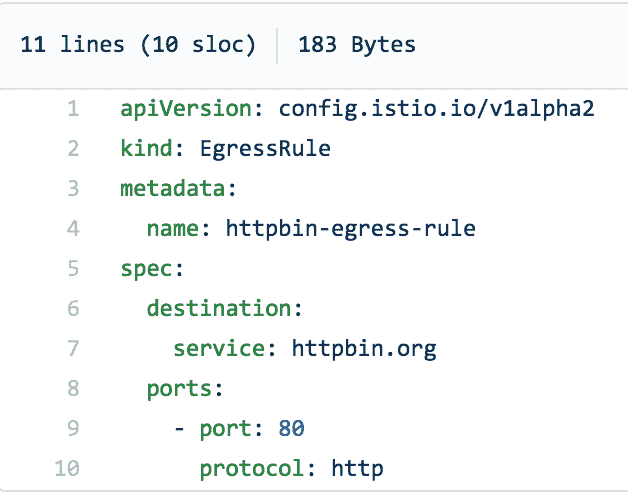
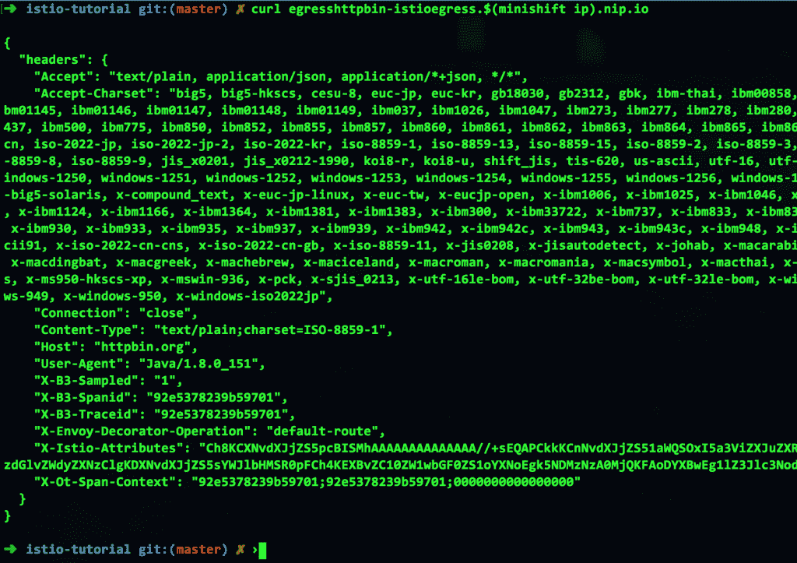

# Istio 出口:从礼品店出去

> 原文：<https://developers.redhat.com/blog/2018/05/01/istio-egress-exit-through-the-gift-shop>

将 Istio 与 Red Hat OpenShift 和 Kubernetes 配合使用，让微服务的生活更加轻松。隐藏在 Kubernetes pods 内部，使用 Istio 服务网格，您的代码可以(大部分)独立运行。通过简单地使用 Istio sidecar 容器模型，性能、易修改性、跟踪等都变得可用。但是，如果您希望您的微服务与您的 OpenShift/Kubernetes/pods 环境之外的另一个服务进行对话，该怎么办呢？

进入 Istio 出口。

【这是我的 Istio 服务网系列 十篇 **[介绍的第九篇。我之前的文章是](https://developers.redhat.com/topics/service-mesh/)[第八部分:Istio 智能金丝雀发布:投产](https://developers.redhat.com/blog/2018/04/24/istio-smart-canary-launch/)。]**

## 垃圾箱在那里，完成了吗

简单地说，Istio Egress 允许您访问 Kubernetes pods 之外的资源(即服务)。在开箱即用的 Istio 支持环境中，流量根据内部 IP 表在 pod 集群内部和集群之间路由。这种隔离的方法很好...直到您需要访问其他地方的服务。

出口使您能够绕过这些 IP 表，无论是基于出口规则还是针对某个 IP 地址范围。

作为一个例子，我们将使用一个向`httpbin.org/headers`发出 GET 请求的 Java 程序。

(如果您不熟悉`httpbin.org`，它是测试外发服务请求的绝佳资源。)

如果我简单地从命令行运行`curl http://httpbin.org/headers`，我会看到如下内容:

如果我将浏览器指向该 URL，我会看到:

显然，测试正在完成它的工作，并返回传递给它的头。

## 在盒子里思考

接下来，我将获取一些使用这个 URL 的 Java 代码，并在 Istio 中运行这些代码。(你可以通过访问[我们的 Istio 教程](https://github.com/redhat-developer-demos/istio-tutorial#egress)来自己做这件事。)在构建了图像并在 OpenShift 中运行它之后，我可以使用`curl egresshttpbin-istioegress.$(minishift ip).nip.io`来调用它，它给了我这样的结果:

等等。刚刚发生了什么？几分钟前它还在工作。“没找到”是什么意思？？就在那里！我只是把它扔掉了。

## 将网络带到(IP)桌面上

责备(或感谢)伊斯蒂奥。记住:Istio 是一个 sidecar 容器，处理您的发现和路由(以及一堆其他东西，正如过去八周的博客帖子所指出的)。因此，IP 表仅限于您的内部服务。因为`httpbin.org`在我们的集群之外，所以它不可用。这就是 Istio Egress 出手相救的地方。

又来了。

而不改变你的源代码。

又来了。

通过实现下面的 Egress 规则，我们可以指导 Istio(如果您愿意，可以通过广阔的万维网)寻找一个服务——在本例中是`httpbin.org`。从这个文件(`egress_httpbin.yml`)中可以看出，功能相当明显:

实现这条规则就像一行程序一样简单:

`istioctl create -f egress_httpbin.yml -n istioegress`

然后，我可以使用命令`istioctl get egressrules`查看出口规则:

最后，我可以再次运行`curl`命令，并看到正确的结果:

## 跳出框框思考

如你所见，Istio 与他人合作愉快。虽然您可以创建由 Kubernetes 管理的 OpenShift 服务，并将所有内容保存在 pods 中，并根据需要进行伸缩，但您仍然能够在环境外部使用服务，而无需更改源代码...我提到过吗？

* * *

### “Istio 简介”系列的所有文章:

*   第 1 部分:[Istio 服务网格介绍](https://developers.redhat.com/topics/service-mesh/)
*   第 2 部分: [Istio 路线规则:告知服务请求去哪里](https://developers.redhat.com/blog/2018/03/13/istio-route-rules-service-requests/)
*   第 3 部分: [Istio 断路器:如何处理(池)弹出](https://developers.redhat.com/blog/2018/03/20/istio-circuit-breaker-pool-ejection/)
*   第 4 部分: [Istio 断路器:当出现故障时](https://developers.redhat.com/blog/2018/03/27/istio-circuit-breaker-when-failure-is-an-option/)
*   第五部分: [Istio Tracing &监控:你在哪里，速度有多快？](https://developers.redhat.com/blog/2018/04/03/istio-tracing-monitoring/)
*   第 6 部分: [Istio 混沌工程:我打算这么做](https://developers.redhat.com/blog/2018/04/10/istio-chaos-engineering/)
*   第七部: [Istio 黑暗发射:特勤局](https://developers.redhat.com/blog/2018/04/17/istio-dark-launch-secret-services/)
*   第 8 部分: [Istio 智能金丝雀发布:投产](https://developers.redhat.com/blog/2018/04/24/istio-smart-canary-launch/)
*   第 9 部分: [Istio 出口:通过礼品店出口](https://developers.redhat.com/blog/2018/05/01/istio-egress-exit-through-the-gift-shop/)
*   第十部分: [Istio 服务网格博客系列回顾](https://developers.redhat.com/blog/2018/05/07/istio-service-mesh-blog-series-recap/)

*Last updated: September 3, 2019*