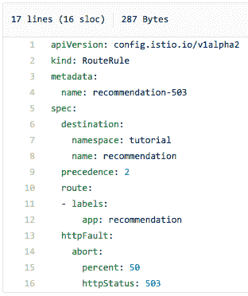
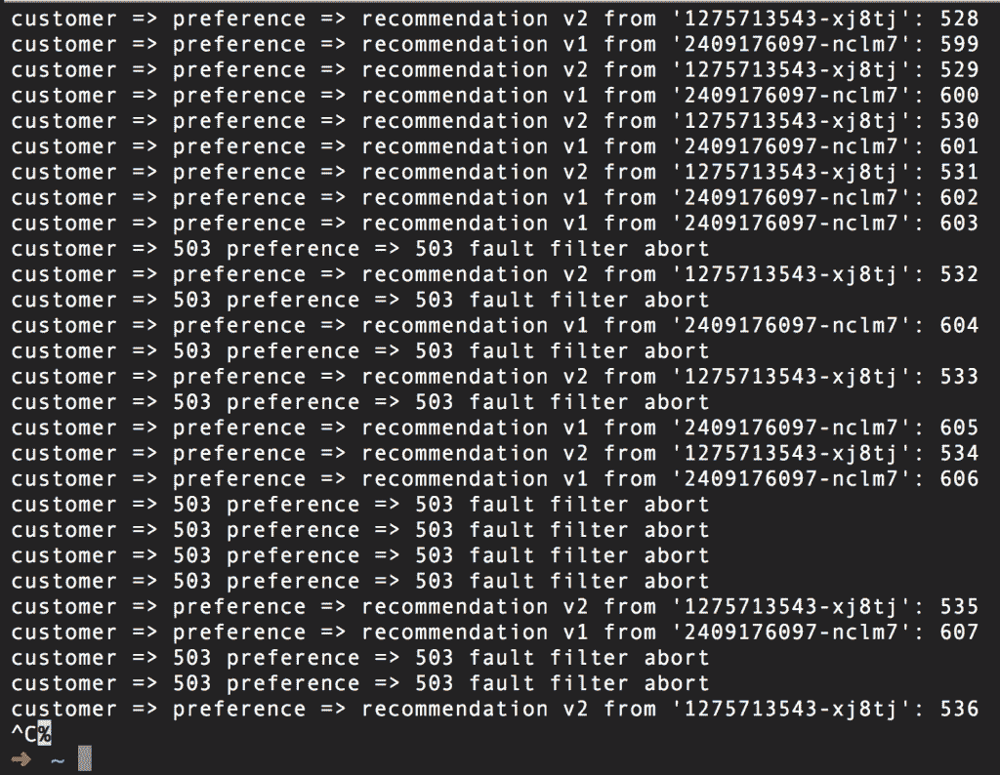
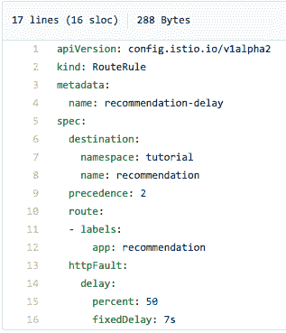
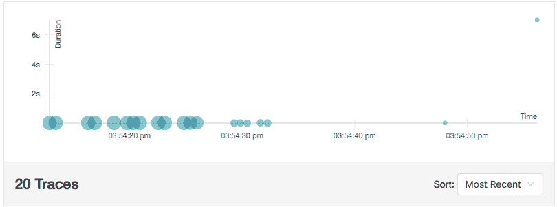
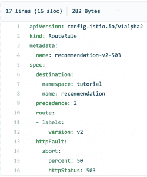
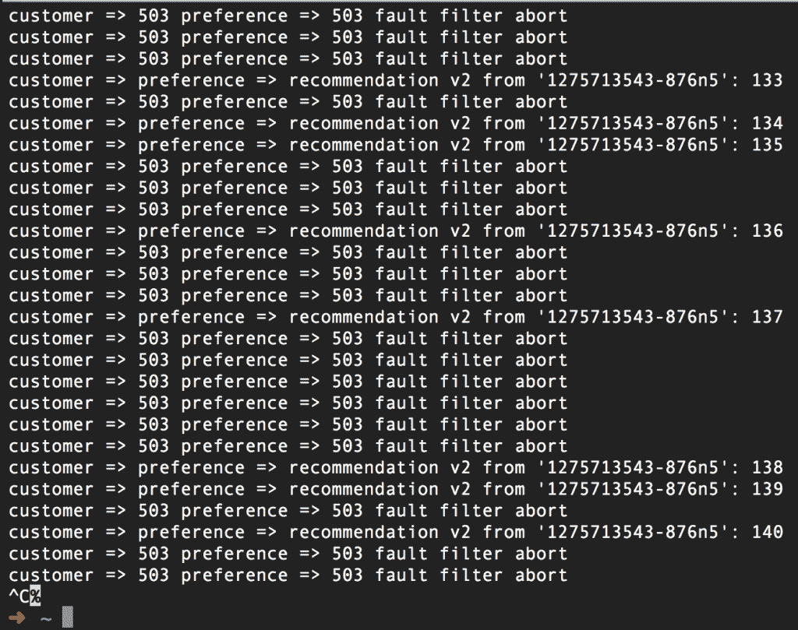
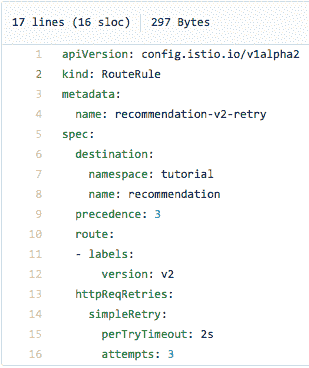
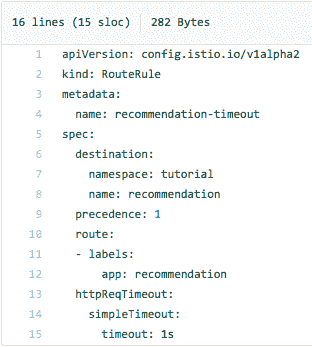
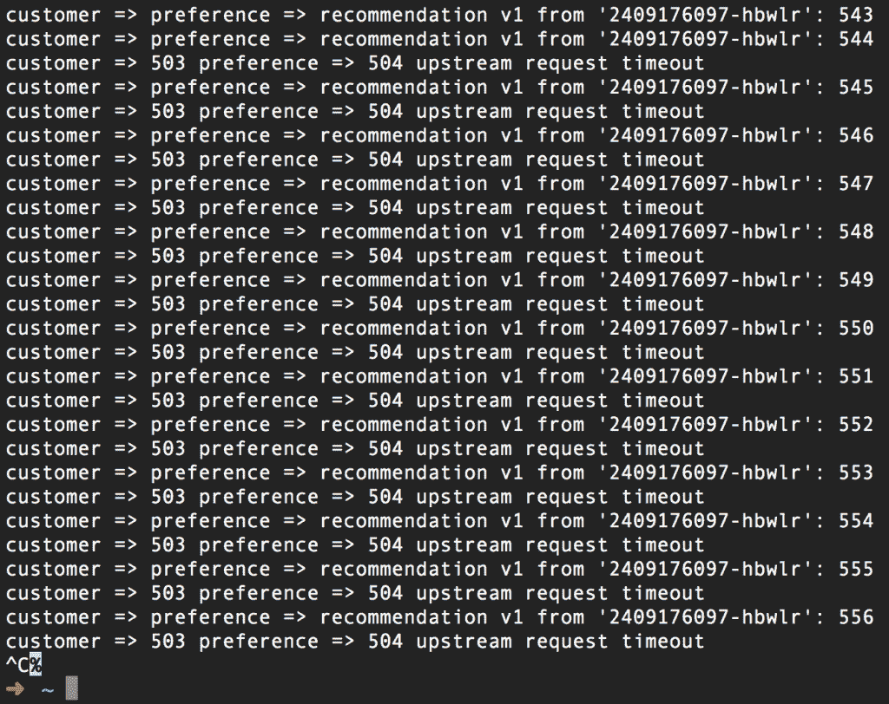

# Istio 混沌工程:我打算这么做

> 原文：<https://developers.redhat.com/blog/2018/04/10/istio-chaos-engineering>

如果你在东西坏掉之前就把它们打碎，这会让你休息一下，它们就不会坏掉了。

(显然，这是管理层面的材料。)

【这是我十周**[Istio 服务网系列](https://developers.redhat.com/topics/service-mesh/)** 介绍的第六部分。我之前的文章是[第五部分:Istio 追踪&监控:你在哪里，你的速度有多快？](https://developers.redhat.com/blog/2018/04/03/istio-tracing-monitoring/) ]

测试软件不仅具有挑战性，而且非常重要。测试正确性是一回事(例如，“这个函数是否返回正确的结果？”)，但是测试网络可靠性故障(分布式计算的八大谬误之首)完全是另一项任务。挑战之一是能够模拟故障或将故障注入系统。在你的源代码中这样做意味着改变你正在测试的代码，这是不可能的。你不能测试没有添加错误的代码，但是你想测试的代码没有添加错误。因此，错误注入的致命拥抱和[海森伯格](https://en.wikipedia.org/wiki/Heisenbug)的引入——当你试图观察它们时，缺陷就消失了。

让我们看看 Istio 是如何让这一切变得如此简单的。

## 我们现在都很好，谢谢你...你好吗？

这里有一个场景:两个 pod 正在运行我们的“推荐”微服务(来自我们的 [Istio 教程](http://bit.ly/istio-tutorial))，一个标记为“v1”，另一个标记为“v2”。如您所见，一切都运行良好:

(顺便说一下，右边的数字只是每个 pod 的计数器)

一切都进展顺利。良好的...我们现在不能这样了，对吧？让我们找点乐子，打破常规- *而不改变任何源代码*。

## 让你的微服务休息一下

下面是 yaml 文件的内容，我们将使用它来创建一个 Istio 路由规则，该规则有一半时间会中断(503，服务器错误):

请注意，我们指定 503 错误有 50%的几率被返回。

这是另一个针对微服务运行的`curl`命令循环的屏幕截图，在我们实现了 route 规则(如上)之后。请注意，一旦生效，无论哪个 pod (v1 或 v2)是端点，一半的请求都会导致 503 错误:

要恢复正常操作，只需删除路由规则；在我们的例子中，命令是`istioctl delete routerule recommendation-503 -n tutorial`。“Tutorial”是运行本教程的 Red Hat OpenShift 项目的名称。

## 拖延战术

在测试系统的健壮性时，生成 503 错误是很有帮助的，但是预测和处理延迟更令人印象深刻，而且可能更常见。微服务的缓慢响应就像一颗让整个系统生病的毒丸。使用 Istio，您可以在不修改任何代码的情况下测试延迟处理代码。在第一个例子中，我们夸大了网络延迟。

注意，*在*测试之后，你可能需要(或者渴望)改变你的代码，但是这是你主动的，而不是*被动的*。这是正确的代码测试反馈代码测试...循环。

这里有一个路由规则...你知道吗？Istio 这么好用，yaml 文件这么好理解，我就让它自己说吧。我相信您会立即看到它的作用:

有一半时间我们会看到 7 秒钟的延迟。注意，这不像源代码中的睡眠命令；Istio 在完成往返之前将请求保持 7 秒钟。由于 Istio 支持 [Jaeger tracing](https://developers.redhat.com/blog/2018/04/03/istio-tracing-monitoring/) ，我们可以在 Jaeger UI 的这个截屏中看到效果。注意图表右上方的长时间运行的请求——用了 7.02 秒:

这个场景允许您测试和编码网络延迟。当然，删除路由规则会消除延迟。再说一次，我讨厌反复强调这一点，但它非常重要。我们在没有改变源代码的情况下引入了这个错误。

## 永远不会放弃你

与混沌工程相关的另一个有用的 Istio 特性是重试服务 N 次的能力。想法是这样的:请求服务可能会导致 503 错误，但重试可能会奏效。也许一些奇怪的边缘情况导致服务第一次失败。是的，你想知道并解决它。与此同时，让我们保持系统正常运行。

所以我们希望一个服务偶尔抛出一个 503 错误，然后让 Istio 重试这个服务。嗯...如果有一种方法可以在不改变代码的情况下抛出 503 错误就好了。

等等。Istio 可以做到。我们在几段前已经这样做了。

使用下面的文件，我们的“推荐-v2”服务一半时间会抛出 503 个错误:

果然，一些请求失败了:

现在我们可以引入 Istio 的重试特性，使用这个漂亮的配置:

我们已将此路由规则配置为最多重试 2-3 次，每次尝试之间等待两秒钟。这将减少(或有希望消除)503 错误:

简单回顾一下:我们让 Istio 为一半的请求抛出 503 错误，还让 Istio 在 503 错误后执行三次重试。结果，一切都很好。通过不放弃，而是使用重试，我们遵守了我们的诺言。

我有没有提到我们在不改变源代码的情况下做了所有这些事情？我可能提到过。只需要两条 Istio 路线规则:

## 永远不会让你失望

现在是时候转身反其道而行之了；我们想要一个场景，在放弃请求尝试之前，我们只需要等待一段时间。换句话说，我们不会在等待一个缓慢的服务时减慢所有的速度。相反，我们将放弃请求，并使用某种后备位置。亲爱的网站用户，不要担心...我们不会让你失望的。

Istio 允许我们为请求建立一个超时限制。如果服务时间超过超时时间，将返回 504(网关超时)错误。同样，这都是通过 Istio 配置完成的。然而，我们确实在源代码中添加了一个 sleep 命令(并在一个容器中重新构建和部署代码)来模拟一个缓慢的服务。在这一点上，没有真正的无接触方法；我们需要慢速代码。

在将三秒睡眠添加到我们的建议(v2 映像和重新部署容器)之后，我们将通过 Istio 路由规则添加以下超时规则:

如您所见，我们在返回 504 错误前一秒钟提供了推荐服务。在实现了这个路由规则(以及我们的建议:v2 服务中内置的三秒睡眠)之后，我们得到了以下结果:

## 我以前在哪里听过这个？

令人厌烦地重复:我们能够在不改变源代码的情况下设置这个超时功能。这里的价值在于，您现在可以编写代码来响应超时，并使用 Istio 轻松测试它。

## 现在都在一起

通过 Istio 将混沌注入到系统中，是将代码推向极限和测试健壮性的一种强有力的方式。后退、隔板和断路器模式与 Istio 的故障注入、延迟、重试和超时相结合，以支持您构建容错的云原生系统。使用这些技术(结合 [Kubernetes](https://developers.redhat.com/topics/kubernetes/) 和 [Red Hat OpenShift](https://developers.redhat.com/products/openshift/overview/) ，给你进入未来所需的工具。

让自己休息一下。

* * *

### “Istio 简介”系列的所有文章:

*   第一部分:[Istio 介绍；它制造了一个网状的东西](https://developers.redhat.com/topics/service-mesh/)
*   第 2 部分: [Istio 路线规则:告知服务请求去哪里](https://developers.redhat.com/blog/2018/03/13/istio-route-rules-service-requests/)
*   第 3 部分: [Istio 断路器:如何处理(池)弹出](https://developers.redhat.com/blog/2018/03/20/istio-circuit-breaker-pool-ejection/)
*   第 4 部分: [Istio 断路器:当出现故障时](https://developers.redhat.com/blog/2018/03/27/istio-circuit-breaker-when-failure-is-an-option/)
*   第五部分: [Istio Tracing &监控:你在哪里，速度有多快？](https://developers.redhat.com/blog/2018/04/03/istio-tracing-monitoring/)
*   第 6 部分: [Istio 混沌工程:我打算这么做](https://developers.redhat.com/blog/2018/04/10/istio-chaos-engineering/)
*   第七部: [Istio 黑暗发射:特勤局](https://developers.redhat.com/blog/2018/04/17/istio-dark-launch-secret-services/)
*   第 8 部分: [Istio 智能金丝雀发布:投产](https://developers.redhat.com/blog/2018/04/24/istio-smart-canary-launch/)
*   第 9 部分: [Istio 出口:通过礼品店出口](https://developers.redhat.com/blog/2018/05/01/istio-egress-exit-through-the-gift-shop/)
*   第十部分: [Istio 服务网格博客系列回顾](https://developers.redhat.com/blog/2018/05/07/istio-service-mesh-blog-series-recap/)

*Last updated: September 3, 2019*