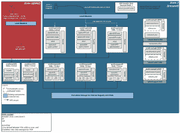
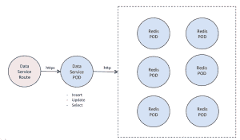
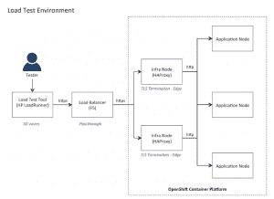

# Red Hat OpenShift 容器平台负载测试技巧

> 原文：<https://developers.redhat.com/blog/2018/04/02/red-hat-openshift-container-platform-load-testing-tips>

东南亚国家联盟(ASEAN)的一家大型银行计划使用微服务和容器技术开发一种新的移动后端应用程序。他们希望该平台能够以 5，000 TPS 的速度支持 10，000，000 名客户。他们决定使用 [Red Hat OpenShift 容器平台](https://developers.redhat.com/products/openshift/overview/) (OCP)作为这个应用程序的运行时平台。为了确保该平台能够支持他们的吞吐量需求和未来增长率，他们已经对其基础架构和模拟服务进行了内部负载测试。本文将分享负载测试 Red Hat OpenShift 容器平台的经验教训。

### **红帽 OpenShift 容器平台架构**

下图显示了 OCP 在非生产环境中的部署架构，即负载测试环境。OCP 版本是 3.5 版。

该架构由 2 个基础设施节点、3 个主节点、3 个应用节点和 3 个记录和度量节点组成。负载均衡器是 F5，持久存储是 NFS:

*图片 1:红帽 OpenShift 容器平台部署架构*

## **负载测试场景**

为了进行负载测试，银行创建了一个模拟 REST 服务来模拟他们的移动后端服务。该服务被称为“数据服务”,它负责从持久存储中添加、更新和选择数据。“数据服务”使用 Node.js 框架开发，持久存储基于 Redis 数据缓存技术。“数据服务”和“Redis”都作为吊舱部署在 OCP 上。“数据服务”暴露为安全路由:

*图 2:负载测试服务模型*

HP LoadRunner 是我行标准的非功能性测试工具。因此，对于这个负载测试，银行使用 HP LoadRunner。

安全路由使用边缘终端 TLS。对于边缘终止，TLS 终止发生在路由器上，然后将流量代理到其目的地。路由器前端服务 TLS 证书，所以必须配置到路由中，否则 [路由器的默认证书](https://docs.openshift.com/container-platform/3.5/install_config/router/default_haproxy_router.html#using-wildcard-certificates) 将用于 TLS 终止。对于这个测试，路由器的[默认证书](https://docs.openshift.com/container-platform/3.5/architecture/core_concepts/routes.html#edge-termination)被使用:

*图 3:负载测试 SSL 场景*

## **负载测试活动和结果**

银行已经执行了负载测试和微调，以实现预期的吞吐量结果。这些是他们已经完成了几周的负载测试活动:

### **1。使用默认配置的负载测试(HP LoadRunner)**

*   2 个基础节点(4 个核心),带 2 个路由器。
*   3 个应用节点(8 个内核)。
*   1 个数据服务盒和 6 个中继盒。
*   1 台带 50 个 vuser 的 HP LoadRunner 服务器。

| 号 | 数据服务 | 基础节点 CPU 内核 | 数据服务舱数量 | E2E 吞吐量 | 数据服务响应时间 | E2E 响应时间 | 基础架构节点 CPU 使用率 | 数据服务 CPU 使用率 |
| 1 | 添加服务 | 4 个内核 | 1 在下 | 350 TPS | 1 毫秒 | 150 毫秒 | 25% | 低(< 1 核心) |

**结果观察:**

*   与预期吞吐量相比，E2E 吞吐量太低。服务级别的响应时间不到 1 毫秒，而 E2E 响应时间为 150 毫秒。根本原因的罪魁祸首可能是路由器节点的 TLS 终止过程。
*   2 个基础架构节点只能有 2 个路由器单元，并且不能再横向扩展。在 Red Hat 的支持下，银行注意到 路由器 pod 是一个“特殊”的 pod，它打开/使用节点主机的端口 80。因此，1 个路由器只能部署在 1 个基础架构节点上。
*   路由器盒的 CPU 被限制为 1 核，不能增加。在红帽支持下，银行发现 HAProxy 的默认 nbproc 为 1。 nbproc 是路由器 pod 中产生的 HAProxy 进程数。 另外， nbproc=1 是 OCP 唯一支持的值。【】
*   基础架构节点的 CPU 利用率非常低，仅限于一个内核。在红帽支持下，银行发现在红帽 OpenShift 容器平台中的 ，HAProxy 路由器作为单个进程运行。[[Ref](https://docs.openshift.com/container-platform/3.7/scaling_performance/routing_optimization.html#scaling-performance-optimizing-router-haproxy-cpu-affinity)
*   例如，通过使用配置图定制 HAProxy 路由器，可以使用 CPU 锁定来提高性能。【[re F3](https://docs.openshift.com/container-platform/3.5/install_config/router/customized_haproxy_router.html#using-configmap-replace-template)】

**下一个动作:**

根据上述观察结果(并与 Red Hat 讨论后)，银行决定调整基础设施和配置，如下所示:

*   对于基础设施节点，将 CPU 核心数量从 4 个增加到 8 个。
*   调整路由器配置:
    *   设置 nbproc=6
    *   设置 cpu-map

### **2。带路由器配置调整的负载测试(HP LoadRunner)**

*   2 个基础节点(8 核),带 2 个路由器。
*   3 个应用节点(8 个内核)。
*   6 个数据服务盒和 6 个中继盒。
*   1 台带 50 个 vuser 的 HP LoadRunner 服务器。

通过这种配置，他们发现吞吐量显著提高。但是，数据服务的响应时间和数据服务 pod 的 CPU 利用率仍然很高。因此，银行决定将 pod 的数量从 1 个增加到 6 个。下表显示了负载测试结果:

| 号 | 数据服务 | 基础节点 CPU 内核 | 数据服务舱数量 | E2E 吞吐量 | 数据服务响应时间 | E2E 响应时间 | 基础架构节点 CPU 使用率 | 数据服务 CPU 使用率 |
| 1 | 添加服务 | 8 核 | 6 在下 | 600 TPS | 1 毫秒 | 20 毫秒 | 80% | 0.3 芯 |

**结果观察:**

*   E2E 吞吐量提高了约 2 倍，基础设施节点的 CPU 得到了充分利用。
*   e2e 响应从 150 毫秒显著降低至 20 毫秒。
*   负载可能会更多地流向数据服务，因此它必须扩展到 6 个单元来处理更多的工作负载。
*   基础设施节点的 CPU 利用率非常高。
*   银行发现错误-27774“在尝试协商 SSL 连接期间服务器关闭连接”在 HP LoadRunner 工具中出现了很多次。当此错误开始出现时，吞吐量开始下降。误差率在 5%左右。此外，负载测试工具的 CPU 利用率非常高，大约为 80-90%。

**下一个动作:**

基于上述发现，我行决定对基础设施和配置进行如下调整:

*   将基础架构节点中的 CPU 内核数量从 8 个增加到 16 个。
*   调整路由器配置:
    *   设置 nbproc=15
    *   设置 cpu-map
*   将 HP LoadRunner 服务器的数量从 1 台增加到 2 台。

### **3。带路由器配置调整的负载测试**

*   2 个基础节点(16 核),带 2 个路由器。
*   3 个应用节点(8 个内核)。
*   6 个数据服务舱和 6 个 Redis 舱。
*   2 台 HP LoadRunner 服务器，配备 50 台 vuser。

| 号 | 数据服务 | 基础节点 CPU 内核 | 数据服务舱数量 | E2E 吞吐量 | 数据服务响应时间 | E2E 响应时间 | 基础架构节点 CPU 使用率 | 数据服务 CPU 使用率 |
| 1 | 添加服务 | 16 个内核 | 6 在下 | 1000 TPS | 1 毫秒 | 20 毫秒 | 30% | 0.3 芯 |

**结果观察:**

*   E2E 的吞吐量从 600 TPS 提高到 1000 TPS。
*   增加基础架构节点的 CPU 核心数量会将 CPU 利用率从 80%降至 30%。
*   银行仍然发现错误-27774 在 HP LoadRunner 工具上大量出现。当此错误开始出现时，吞吐量开始下降。误差率在 1%左右。超过 80%的-27774 "错误可能是由于 HP LoadRunner 配置本身造成的。
*   银行对 HAProxy 配置做了一些调整，包括 maxconn、tune.bufsize、tune.ssl.default-dh.param、stats timeout、超时检查。无论如何，他们发现这些参数对我们的测试结果没有任何影响。

**下一个动作:**

*   由于 HP LoadRunner 出现错误-27774，银行决定使用 JMeter 开发另一种负载测试工具。

### **4。用 JMeter** 进行负载测试

*   2 个基础节点(16 核),带 2 个路由器。
*   3 个应用节点(8 个内核)。
*   6 个数据服务舱和 6 个 Redis 舱。
*   1 个 100 线程的 JMeter 服务器。

在银行使用 JMeter 进行负载测试后，他们发现吞吐量显著提高，并且没有错误。但是，数据服务的响应时间仍然很长，而且数据服务 pod 的 CPU 利用率也很高。因此，他们决定将数据服务舱的数量从 6 个增加到 9 个。下表显示了负载测试结果:

| 号 | 数据服务 | 基础节点 CPU 内核 | 数据服务舱数量 | E2E 吞吐量 | 数据服务响应时间 | E2E 响应时间 | 基础架构节点 CPU 使用率 | 数据服务 CPU 使用率 |
| 1 | 添加/更新服务 | 16 个内核 | 6 在下 | 3500 TPS | 1 毫秒 | 20 毫秒 | 30% | 0.3 芯 |
| 2 | 选择服务 | 16 个内核 | 6 在下 | 5000 TPS | 1 毫秒 | 20 毫秒 | 30% | 0.3 芯 |

**结果观察:**

*   E2E 的吞吐量显著提高，几乎达到了他们的目标。
*   负载可能更多地流向数据服务，因此它必须扩展到 9 个单元来处理更多的工作负载。
*   JMeter 作为一个负载测试工具，对上述结果起着至关重要的作用。它提供了一个不同的视角，并为微调 HAProxy 之外的其他组件打开了一个新的视野。
*   以前低吞吐量的根本原因可能来自 HP LoadRunner 本身。

**下一个动作:**

*   即使 JMeter 的负载测试结果非常好，银行仍然需要继续寻找 HP LoadRunner 的根本原因，因为它是银行的标准非功能测试。

### **5。在 HP LoadRunner** 上进行一些配置更改的负载测试

*   2 个基础节点(16 核),带 2 个路由器。
*   3 个应用节点(8 个内核)。
*   6 个数据服务舱和 6 个 Redis 舱。
*   2 台 HP LoadRunner 服务器，50 个用户。

在调查 HP LoadRunner -27774 错误后，该银行发现，如果他们将 keep-alive 从 true 更改为 false，则-27774 错误率会大幅降低。然而，他们在负载测试服务器中发现了另一个高 CPU 利用率的错误。

他们还改变了每个进程运行的最大线程数(MaxThreadPerProcess ),以便能够处理更多的线程。 他们还将负载测试工具服务器的数量从 2 台增加到了 5 台。 随着这些变化，他们得到了这些结果:

| 号 | 数据服务 | 基础节点 CPU 内核 | 数据服务舱数量 | E2E 吞吐量 | 数据服务响应时间 | E2E 响应时间 | 基础架构节点 CPU 使用率 | 数据服务 CPU 使用率 |
| 1 | 添加服务 | 16 个内核 | 6 在下 | 5800 TPS | 1 毫秒 | 20 毫秒 | 30% | 0.3 芯 |

**结果观察:**

*   HP LoadRunner 的负载测试结果符合客户的吞吐量预期。
*   负载测试工具配置正在影响负载测试结果。

**下一个动作:**

*   由于基础架构节点的 CPU 利用率约为 30%,我行将基础架构节点的 CPU 内核数量从 16 个减少到 8 个。然后他们会再次进行负载测试。他们希望获得适用于其平台的基础架构节点规模指南。
*   本次负载测试基于 [路由器默认证书](https://docs.openshift.com/container-platform/3.5/install_config/router/default_haproxy_router.html#using-wildcard-certificates) 进行 TLS 终止。银行将使用他们的认证并继续进行负载测试。
*   该银行将对其后端系统、前端应用程序和安全基础设施进行更多的 E2E 集成测试。

## **本次负载测试的经验教训和主要观察结果**

1。调整路由器是增加吞吐量和 E2E 响应时间的重要活动。以下是一些提高 HAProxy 性能的方法:

*   为路由器分配足够的基础架构节点，分配更高的 CPU 来处理更多的请求，尤其是在使用带有边缘终止或重新加密 TLS 的安全路由时。
*   调整 HAProxy 配置中的 nbproc 值，以映射进程与 CPU 内核。这是比较实验性的；这意味着您必须找到最佳的 nbproc 值与您的可用 CPU:
    *   *示例* :与将 nbproc 值最大化为 4 相比，4 个 CPU 节点的 nbproc=2 通常会提供更多的吞吐量。
*   使用 DeploymentConfig 中的 ROUTER_MAX_CONNECTIONS 环境变量增加 maxconn 配置。在 OCP 3.5 中，我们可以修改 HAProxy 配置的 maxconn 值，以增加默认值 2000。
*   您可能还需要分别使用:ROUTER_DEFAULT_CONNECT_TIMEOUT、使用 ROUTER_DEFAULT_SERVER_TIMEOUT 的超时服务器、使用 ROUTER_DEFAULT_CLIENT_TIMEOUT 的超时客户端来调整超时连接的值。

2。选择的负载测试工具是影响负载测试结果的一个重要因素。最好尝试另一个负载测试工具，以确保性能下降的根本原因是在 OCP，而不是在负载测试工具本身:

*   HP LoadRunner 错误“尝试协商 SSL 会话期间服务器关闭连接”80%以上是由于 HP LoadRunner 配置问题造成的。这些链接[[k](http://performancetestinglearnings.blogspot.sg/2015/02/workarounds-for-shut-connection-during.html)][[l](http://commonlrissues.blogspot.sg/2015/04/vugen-replay-errors-for-https-sites.html)][m]提供了如何排除故障的信息。
*   负载测试工具的其他候选是 JMeter[]和 Gatling[[o](https://gatling.io)】。

3。监控和横向扩展服务，以确保它能够处理工作负载。

*Last updated: January 18, 2022*