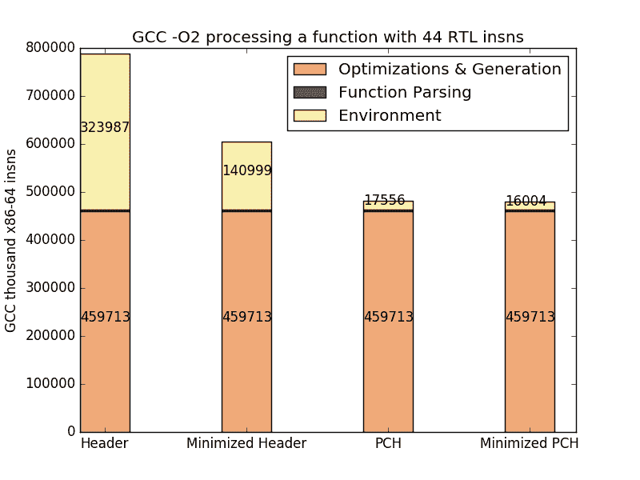
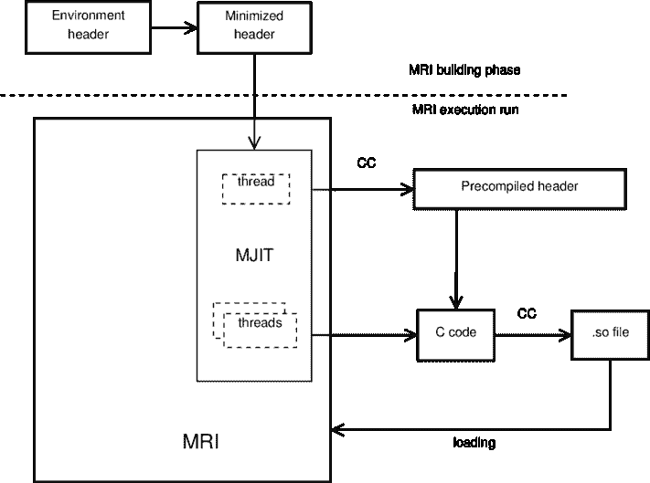
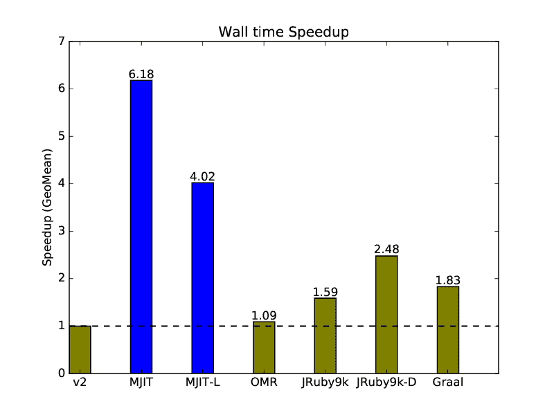
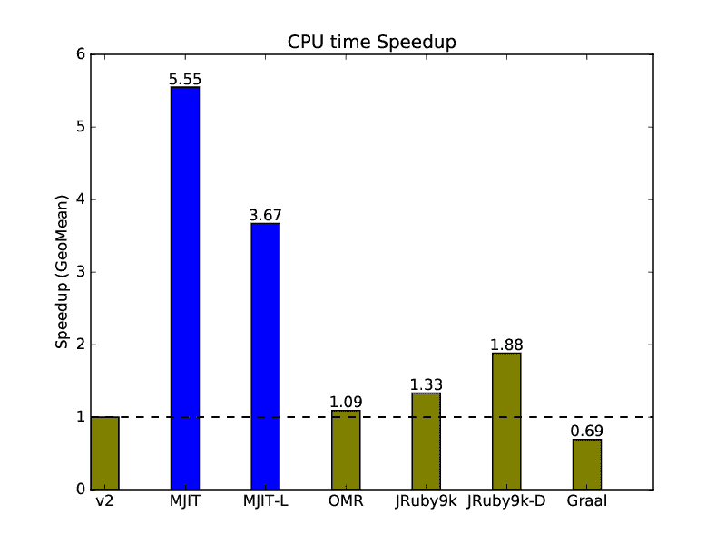
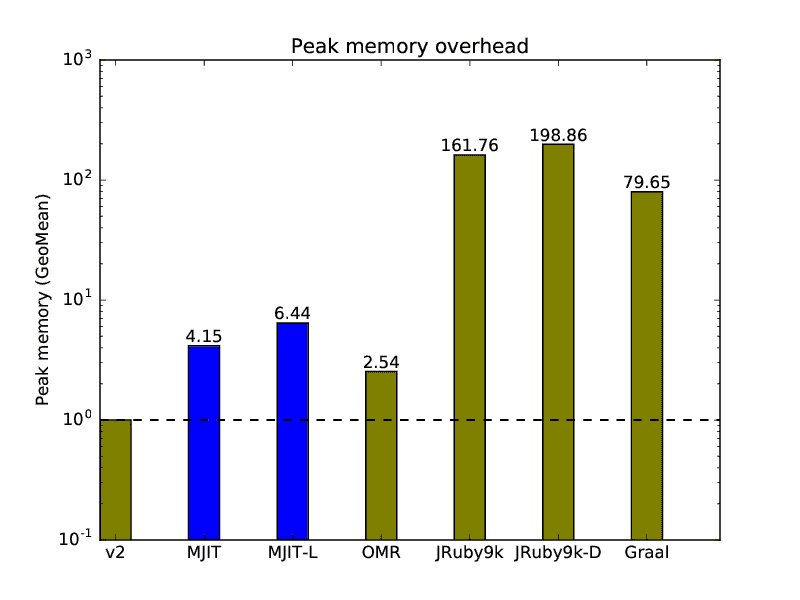
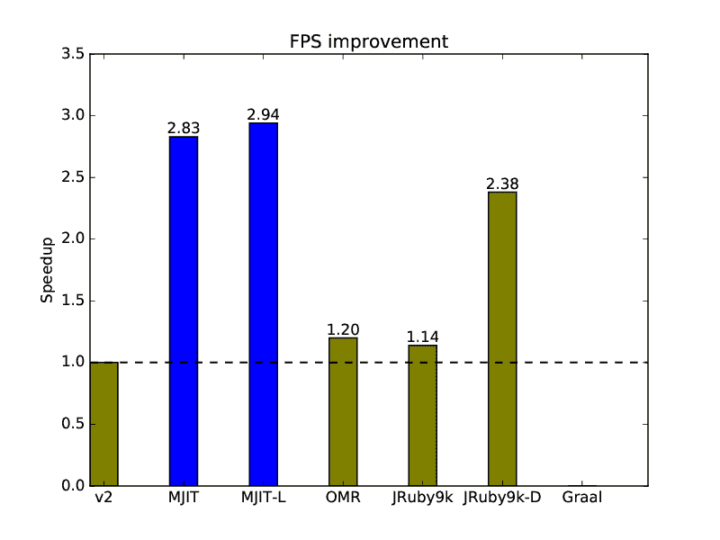
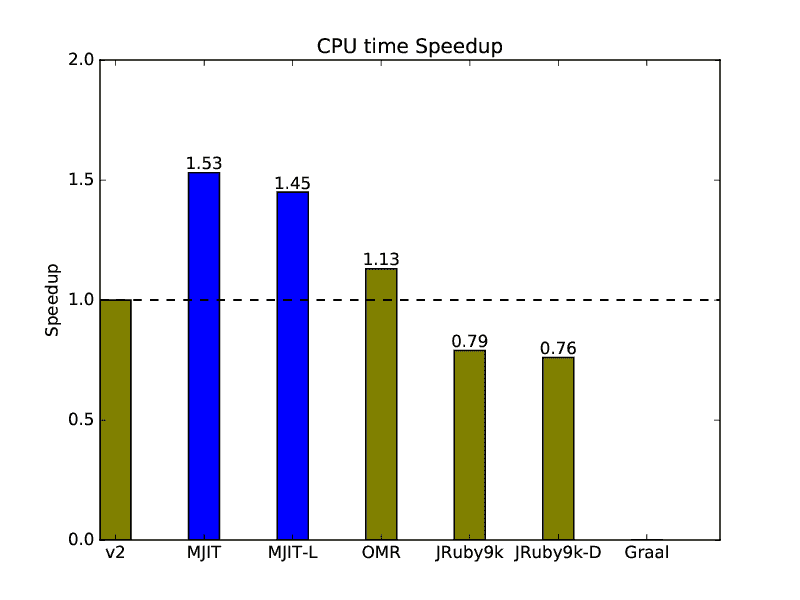
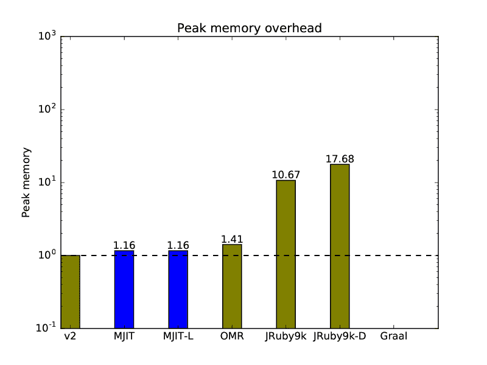

# 朝着 Ruby 3x3 的性能目标前进

> 原文：<https://developers.redhat.com/blog/2018/03/22/ruby-3x3-performance-goal>

这篇博文是关于我通过引入新的虚拟机指令和一个 [JIT](https://en.wikipedia.org/wiki/Just-in-time_compilation) 来提高 [CRuby](https://github.com/ruby/ruby) 性能的工作。它大致基于[我在日本广岛](https://www.youtube.com/watch?v=qpZDw-p9yag) [RubyKaigi 2017](http://rubykaigi.org/2017) 上的演讲。

许多 Ruby 人都知道，Ruby 的作者 [Yukihiro Matsumoto](https://en.wikipedia.org/wiki/Yukihiro_Matsumoto) (Matz)为 CRuby 版本 3 的性能设立了一个非常雄心勃勃的目标。版本 3 应该比版本 2 快 3 倍。

通过引入一个字节码[虚拟机](https://en.wikipedia.org/wiki/Virtual_machine) (VM)，Koichi Sasada 做了一项伟大的工作，将 CRuby 版本 2 的性能提高了大约 3 倍。所以我猜测为 CRuby 版本 3 设立同样的目标是有象征意义的。

我做了很多 GCC 基准测试，我发现基准测试是一个非常敏感的话题。人们总是在关于基准测试的所有事情上意见不一致:使用什么样的基准，使用什么样的选项，如何度量，甚至如何呈现结果。当您实现一个新的 GCC 优化时，经常会有人提供一个基准，在这个基准上优化会产生负面的结果。

因此，我不想触及应该使用什么样的基准作为实现 CRuby 版本 3 性能目标的标准这一话题。我只是认为马茨的目标是 CRuby 需要另一个主要的性能改进。

## 1.RTL 指令

为了实现基本的性能提升，我们需要一个方便的中间表示来分析 Ruby 程序。实现优化和 JIT 代码生成也是必要的。

数据相关性分析是实现这些目标的关键。从[栈机器](https://en.wikipedia.org/wiki/Stack_machine)指令很难揭示依赖信息。因此，在优化编译器时从不使用堆栈机器指令。通常优化编译器使用明确包含操作数和结果的[元组](https://en.wikipedia.org/wiki/Tuple)。例如，GCC 有一种这样的中间语言。它被称为[寄存器传输语言](https://gcc.gnu.org/onlinedocs/gccint/RTL.html) (RTL)。所以我决定在 CRuby 中对新的中间表示使用相同的术语。

在这里，您可以看到将两个局部变量的值相加并将结果放入另一个局部变量的代码与当前的 CRuby stack 机器指令集和建议的 RTL IR 的外观如何。

对于堆栈指令，我们首先将局部变量 *b* 和 *c* 的值放入堆栈，然后`opt_plus`指令从堆栈中取出它们，将它们相加并将结果放回堆栈。最后一条指令从堆栈中取出结果，并将其赋给局部变量 *a:*

```
 getlocal_OP__WC__0 <b index>
      getlocal_OP__WC__0 <c index>
      opt_plus
      setlocal_OP__WC__0 <a index> 
```

对于 RTL，我们只有一条带有显式操作数和结果的`plus`指令:

```
 plus <a index>, <b index>, <c index> 
```

### 1.1.使用 RTL 指令进行解释

正如我前面提到的，我们需要 RTL 来进行分析和 JIT 代码生成。我们也可以用它来解释。有很多文献(例如，这里是我的文章或 T2 的另一篇被频繁引用的文章)说 RTL 指令比基于堆栈的指令解释起来更快。这是因为 RTL 需要更少的指令来执行相同的代码，这导致了更少的指令调度开销。RTL 解释速度更快的另一个原因是指令操作数和结果的内存流量更少。这个原因在文献中经常被忽略。对于最近的 CPU 来说，调度不再那么重要，因为现代处理器有更好的分支预测单元。RTL 指令的操作数和结果的更少存储器流量成为更重要的因素。然而，在修复最近发现的[幽灵漏洞](https://googleprojectzero.blogspot.ca/2018/01/reading-privileged-memory-with-side.html)后，哪个因素更重要可能会改变。

Ruby 是一种非常[动态的编程语言](https://en.wikipedia.org/wiki/Dynamic_programming_language)。程序员甚至可以重新定义内置运算符，例如整数的加号运算符。因此，CRuby 中的典型 VM 指令必须做很多事情。因此，转换到 RTL 语的影响比其他不太活跃的语言要小。

在某些情况下，堆栈机器指令可以比 RTL 更好地工作。下表显示了堆栈和 RTL 指令的特性。粗体用于支持特定指令的功能:

| 特征 | 堆栈 insns | RTL insns |
| --- | --- | --- |
| Insn 长度 | **更短** | 更长的 |
| Insn 号 | 更多 | **小于** |
| 电码长度 | **小于** | 更多 |
| 操作数解码 | **小于** | 更多 |
| 代码数据位置 | **更** | 较少的 |
| Insn 调度 | 更多 | **减** |
| 内存流量 | 更多 | **小于** |

一种指令格式是否优于另一种取决于环境。

例如，如果我们有相同数量的指令，堆栈指令将被解释得更快，因为操作数解码开销更少，大小更小，数据局部性更好。对于主要由方法调用组成的代码，在堆栈模式下处理操作数时，可能会发生这种情况。

因为更快的 RTL 解释是一个普遍的意见，我已经决定使用 RTL 的解释了。

使用 RTL 进行解释也简化了 JIT 实现，因为我们可以在解释器和 JIT 代码之间共享大量执行 RTL 指令的 C 代码。这是基于对 C [内嵌函数](https://en.wikipedia.org/wiki/Inline_function)的大量使用。例如，实现 RTL `plus`指令的部分代码如下所示:

```
static inline int plus_f(rb_thread_t *th, rb_control_frame_t *cfp,
                         CALL_DATA cd, VALUE *res,
                         rindex_t res_ind,
                         VALUE *op1, VALUE *op2) {
  if (FIXNUM_2_P(*op1, *op2))
      && BASIC_OP_UNREDEFINED_P(BOP_PLUS,
                                INTEGER_REDEFINED_OP_FLAG)) {
    *res = fix_num_plus(*op1, *op2);
    return 0;
  } else if (FLONUM_2_P(*op1, *op2)
             && BASIC_OP_UNREDEFINED_P(BOP_PLUS,
                                       FLOAT_REDEFINED_OP_FLAG)) {
    ...
  }
  ...
} 
```

这个函数是从解释器中调用的，也是由 JIT 生成的代码中的一部分。

### 1.2.RTL 一代

产生 RTL 指令有两种主要方法。我们可以从堆栈指令中生成它们。因为我们使用 RTL 指令来解释，我假设堆栈指令将只在 RTL 代存在。因此，起初我认为直接从 cru by[AST](https://en.wikipedia.org/wiki/Abstract_syntax_tree)节点生成 RTL 是一种更好的方法。所以我完全重写了 CRuby 的 [compile.c](https://github.com/ruby/ruby/blob/trunk/compile.c) 文件，以便从 AST 节点生成 RTL。

但是在和 Koichi Sasada 讨论之后，我意识到这不是正确的方法。现有的堆栈指令已经是 CRuby 公共接口的一部分。例如，有一个 Ruby 调试器正在使用它们。所以出于兼容性的原因，唯一可能的方法是保留堆栈指令作为 RTL 生成的中间步骤。目前我正致力于从现有的堆栈指令中生成 RTL。

### 一点三。RTL 操作数

有一个有趣的问题，什么样的变量和值应该被用作 RTL 指令的操作数。我们只能使用临时变量，并使用特殊的指令将它们加载并存储到局部变量或实例变量中。这对解释器的性能没有什么意义，因为我们将拥有与堆栈机器指令相同数量的指令，只有 RTL 指令会更长。

我们可以允许实例变量作为操作数。我们可以对其他作用域的局部变量做同样的事情。这将使操作数解码复杂化。这也将使 JIT 实现复杂化，因为 RTL 用于 JIT 代码生成。我用不同的操作数做了一些实验，发现只使用最内部作用域的临时变量和局部变量可以得到最好的性能结果。

### 1.4.RTL 并发症

为 CRuby 实现 RTL 有些复杂。实际上，任何 RTL 指令都可能是对 Ruby 程序员定义的方法的调用。例如，程序员可以为整数定义不同的加法方法。在 CRuby 虚拟机中，调用总是将结果放在栈顶，这对应于 RTL 中的一些临时。然而，RTL 指令的目标操作数在许多情况下不是临时的。

我们有一个开销很小的解决方案。如果一个指令实际上是一个方法调用，我们在调用后改变返回程序计数器来执行一个移动指令。此移动指令作为原始指令的一部分嵌入。例如，加号指令将移动操作数操作码作为其第一个操作数:

```
 plus <move insn opcode>, <call data>, dst, op1, op2 
```

方法调用后，此操作数将被视为特殊移动指令的开始:

```
 <move insn opcode>  <call data>, dst, op1, op2 
```

### 1.5.RTL 指令组合和专业化

为了减小 RTL 码的大小并加快其解释速度，我们还生成了专门的指令，例如具有已知 fixnum 值的中间操作数的加法。这里有一个例子。(`t<index>`和`l<index>`对应表示临时变量和局部变量的索引):

```
 val2temp t1, 10
  plus     t2, l1, t1    -->      plusi t2, l1, 10 
```

我们还组合了频繁出现的比较和分支指令对:

```
 lt t1, l1, t2                                
  bt Label, t1           -->     btlt Label, l1, t2 
```

专门化和指令组合优化减少了指令数量和整体代码大小。

### 1.6.推测指令生成

通常，CRuby 指令会对操作数类型进行多次检查。例如，加号指令检查操作数类型，并执行 fixnum 或浮点加法或字符串连接。如果我们事先知道操作数的类型，我们可以使用更简单的指令。我们可以分析程序并推断其类型。RTL 非常适合做这件事。但是算法会很复杂，并且只能显示一些类型。并且只有在基本操作没有被重新定义的情况下，推断出的类型才会为真。

有一种更简单的方法来揭示类型。执行指令的代码可以检查操作数，并将指令转换成使用特定操作数类型的新指令。新指令仍然检查类型。如果它们与预期的不匹配，则该指令被转换成使用任何操作数类型的指令。

例如，*加*指令可以改成 *iplus* 或 *fplus* 分别只作用于 fixnum 或 double 操作数。如果这些指令被赋予了意外的操作数类型，它们将被更改为指令 *uplus* (通用且不可更改的加号)，该指令适用于任何操作数。而且这个指令以后再也不改了。


看似投机指令无利可图。它们也执行操作数类型检查，尽管检查较少。但是这些指令对 JIT 非常重要，因为它们在 JIT 代码中创建了大型的扩展基本块。c 编译器能够很好地优化这些扩展的基本块。

### 1.7.RTL 教学现状及未来工作

那么，RTL 指令的实施现状如何呢？RTL 的指示大多奏效。在 CRuby 测试套件中没有回归。几何平均性能提升约 27%。这是用我使用的一套小基准来衡量的。你可以在我的 [github 库](https://github.com/vnmakarov/ruby/tree/rtl_mjit_branch)中找到它们。总体而言，根据基准测试，使用 RTL 会导致 110%到 7%的执行速度下降。在[opt 胡萝卜](https://github.com/mame/optcarrot)基准测试中，RTL 执行的指令数量少了约 23%,尽管执行指令的总长度多了约 19%。

当我写上述语句时，我需要保留堆栈指令作为 RTL 生成的中间步骤。目前，我在 CRuby 的大部分工作时间都花在了实现堆栈指令的 RTL 生成上，而不是已经存在的 AST 生成上。

## 2.吉特舞乐

不幸的是，仅仅使用 RTL 指令并没有让我们显著地接近 Ruby3x3 的性能目标。只有专用于特定 Ruby 程序的机器代码才能做到这一点。这实际上意味着我们必须使用 JIT 编译。这是一个比 RTL 更有趣的话题。

### 2.1.JIT 实施方法

实现 JIT 有许多可能的方法。我考虑了其中的几个:

1.  例如，我们可以像为 [Lua](http://luajit.org/) 所做的那样编写自己的 JIT。
2.  我们可以将我们的 JIT 建立在广泛使用的优化编译器 [GCC](https://gcc.gnu.org/) 或 [LLVM](https://llvm.org/) 的基础上。
3.  最后，我们可以使用现有的通用或专用 JIT，如 [JVM HotSpot JIT](https://en.wikipedia.org/wiki/HotSpot) 或 [Chrome V8](https://en.wikipedia.org/wiki/Chrome_V8) 。

让我们考虑一下这些方法的优缺点。

#### 2.1.1.从头开始编写我们自己的 JIT

实现我们自己的 JIT 的优点是对代码的完全控制、小尺寸和快速编译。但这也意味着要付出巨大的努力来实现大量的优化，并将 JIT 移植到新的目标上，同时也为持续的维护带来了巨大的负担。

这对我来说可能是一个有趣的项目，但我没有足够的时间来实施或甚至参与这样的项目。尤其是当我相信我可以用另一种方法达到更好的结果时。

#### 2.1.2.使用广泛使用的优化编译器

通用优化编译器可以用来实现 JIT。在这里，我认真考虑的只有 GCC 和 LLVM。它们生成高度优化的代码。为了达到这样的优化程度，**自 GCC** 的 2.95 版本以来，已经有 2000 多人为其贡献了代码。GCC 和 LLVM 应用广泛，具有可移植性。GCC 目前**支持 49 个目标**和更多子目标。

它们是可靠的，并且经过了广泛的测试。例如，每年 GCC 社区都要花半年时间来修复下一个即将发布的 GCC 版本的错误。自从 GCC 2.95 以来，我们已经有**大约 9 万份问题报告**和**超过 1.6 万名记者**。

此外，GCC 和 LLVM 不会创建新的依赖项，因为它们已经被用于编译 CRuby。

当然，与其他 JIT 相比，GCC 和 LLVM 的编译速度要差一些，但这主要是因为包含了更多的优化。

也许在未来，CRuby 还需要一个更快的 JIT 编译器。但是，即使在这种情况下，GCC 或 LLVM 仍然可以作为第 2 层 JIT 编译器用于更频繁运行的代码。

#### 2.2.3.使用现有的 JIT

我们可以使用现有的 JIT，并且有一些严肃的 JIT 框架。但是，惊喜！几乎所有这些都已经被用于 Ruby 实现。这充分说明了 Ruby 的受欢迎程度。因此，如果我使用现有的 JIT，这将只是现有工作的重复。

尽管如此，即使是最佳优化和广泛测试的 JIT， [JVM HotSpot JIT](https://en.wikipedia.org/wiki/HotSpot) ，其优化也比 GCC 或 LLVM 少。许多 GCC 优化不是在 JVM 中实现的，或者是以一种低于标准的方式实现的。例如，与 GCC 和 LLVM 版本相比，JVM 自动矢量化表现平平。

我看到一份[报告](https://www.reddit.com/r/programming/comments/66zdvf/java_vs_c_app_performance_gary_explains/)，在 SHA1 计算基准测试中，JVM 仅获得 40%的 GCC 性能。另一个例子是 [Falcon](https://llvm.org/devmtg/2017-10/slides/Reames-FalconKeynote.pdf) ，一个 Java JIT 第二层(服务器)编译器的基于 LLVM 的实现。 [Falcon 在小矢量基准测试上可以获得比 JVM 服务器编译器好几倍的性能](https://github.com/giltene/GilExamples/tree/master/VectorizationExample-benchmarks)。

再举几个例子:WebKit JavaScript 从基于 LLVM 的 JIT 转移到它自己的 JIT 实现。他们实现了大约 20 项优化，并将编译速度提高了大约 5 倍。尽管如此，他们报告说，新的 JIT 在广泛使用的 JavaScript 基准测试中具有几乎相同的性能。现在他们有一个持续的负担，要在几个目标上维护他们自己的 JIT。

再比如俄罗斯科学院系统编程研究所[做的一个研究项目。我很久以前在那里工作，相信他们的结果。他们用 JavaScript V8 实现了一个基于 LLVM 的 JIT。他们取得了比 V8 JIT](http://www.ispras.ru/en/) 略好的性能[。](http://llvm.org/devmtg/2016-09/slides/Melnik-LLV8.pdf)

WebKit 和 V8 JITs 是高质量的项目。许多聪明人都在研究它们，这些例子中的性能结果可以认为是非常接近的。但是在我看来，基于 GCC 和 LLVM 的 JIT 是赢家，尤其是对于长时间运行的服务器程序。在长时间运行的程序上，GCC 和 LLVM 的优化潜力最终会显露出来。长期运行的服务器程序是 Ruby 的主要应用领域。

### 2.2.使用 GCC 或 LLVM 实现 CRuby JIT

我希望我给出了一个令人信服的使用 GCC 或 LLVM 实现 Ruby JIT 的例子。尽管如此，还是有几种可能的方法来使用这些编译器。

JITted 代码不是独立的代码。它与虚拟机的其他部分进行交互。这里我使用术语 **environment** 来表示 JITted 代码可能使用的 VM 声明集。

基于 GCC 或 LLVM 的 JIT 的一种流行方法是使用它们的 JIT 框架，GCC 使用 LibGCCJIT，LLVM 使用 MCJIT 或 ORC。但是我们可以更简单，只为 GCC 和 Clang 生成 C 代码。这里我将使用 LIBGCCJIT 与基于 C 代码生成的方法进行比较。那是因为我更熟悉 LIBGCCJIT。这是最近由我们的红帽团队成员，大卫马尔科姆写的。

这是两种方法的数据流图:


两种方法的红色阶段是不同的。这些包括为环境和 JITted 代码创建 C 编译器中间表示。如果我们可以使这两种方法的运行时间大致相同，或者将它们减少到整个编译过程的一小部分，那么使用 LIBGCCJIT 就没有优势了。C 的定义很稳定。对于 GCC 或 LLVM 的 JIT APIs 来说，情况并非如此。我们不依赖于特定的 C 编译器。生成的 C 代码调试更容易。最后，我们可以重用现有的 VM 声明来创建环境。

实现相同运行时间的一个关键是[预编译头文件](https://en.wikipedia.org/wiki/Precompiled_header) (PCH)。大多数现代 C 编译器都有这个特性。它是为了加速 C++编译而创建的。下图给出了 JIT 编译不同阶段的时间:



我使用了典型的 RTL 指令序列，大约 40 条指令长。如您所见，优化和代码生成占用了大部分时间。生成的实现 RTL 指令序列的 C 函数的解析时间非常短。尽管如此，即使我们丢弃了所有不必要的 VM 声明，解析环境仍然是一项相当大的任务。但是当我们为环境使用预编译头时，它的处理时间下降到 3.5%。因此，与本机方法相比，使用 PCH 基本上将 JIT 编译速度提高了大约 2 倍。

LIBGCCJIT(在 x86_64 上为 22.6MB)和 GCC (25.1 MB)的代码大小几乎没有区别。

### 2.3\. MJIT

在我的 JIT for CRuby 实现中，我使用了 C 代码生成和预编译头文件。我把这个实现简单地称为 **MJIT** 。 **M** 这里代表 **M** RI(克鲁比的别称)和 **m** 方法。

下面是说明 MJIT 如何工作的数据流程图:



当构建 CRuby 时，我们从一些 CRuby 包含文件创建环境，然后通过删除不必要的声明来最小化它。这样做的结果是一个预处理的 C 头文件。

当 CRuby 启动时，MJIT 创建一个线程，从最小化的头文件生成一个 PCH。

当 PCH 准备好时，MJIT 中的其他线程为每个 RTL 代码序列生成 C 文件，其中包含一个 C 函数。这些文件包括 PCH。MJIT 启动 C 编译器生成动态加载的库，并加载它们。当 JITted 代码准备好时，它被调用，而不是解释相应的 RTL 代码。这样，JIT 主要与 Ruby 程序解释并行工作，当使用 MJIT 时，不应该存在实时延迟。

### 2 . 3 . 1 MJIT 如何工作的示例

为了更好地理解 JIT 如何与 RTL 一起工作，让我们考虑一个例子。示例 Ruby 程序只是一个带有简单 while 循环的方法。该方法在最后一次迭代时返回变量 *i* 的值:

```
 def loop
       i = 0; while i < 100_000; i += 1; end;
       i
     end 
```

在把这个程序编译成 RTL 之后，我们有了下面的非推测性代码:

```
 ...
     0004 val2loc     3, 0
     0007 goto        15
     0009 plusi       cont_op2, <calldata...>, 3, 3, 1
     0015 btlti       cont_btcmp, 9, <calldata...>, -1, 3, 100000
     0022 loc_ret     3, 16
     ... 
```

这里，局部变量 *i* 的索引为 3。

第一条指令将零分配给 *i* 。

第三条指令将 *i* 加 1。如果我们重新定义整数加运算，它实际上可以是一个方法调用。在这种情况下，方法调用将结果放入堆栈，下一个执行的指令将是 *cont_op2* ，它将结果分配给 *i* 。

第四条指令将 *i* 与 100，000 进行比较，如果小于 100，000，则跳转到第三条指令。同样，指令的比较部分可以是方法调用。在这种情况下，如果在调用之后临时 1(具有索引-1)被设置为真，则指令 *cont_btcmp* 将跳转到第三条指令。

最后一条指令返回变量 *i* 的值。

在执行几次之后，非推测指令 *plusi* 和 *btlti* 测试它们的操作数，并且因为操作数总是整数类型，所以分别变成推测指令 *iplusi* 和 *ibtlti* :

```
 ...
     0004 val2loc     3, 0
     0007 goto        15
     0009 iplusi      _, _, 3, 3, 1
     0015 ibtlti      _, 9, _, -1, 3, 100000
     0022 loc_ret     3, 16
     ... 
```

这里，下划线表示未使用的操作数。

在多次调用该方法后，MJIT 生成以下 C 代码。这与 RTL 电码解释同时进行:

```
 ...
l4:  cfp->pc = (void *) 0x5576729ccd88;
     val2loc_f(cfp, &v0, 3, 0x1);
l7:  cfp->pc = (void *) 0x5576729ccd98;
     ruby_vm_check_ints(th); goto l15;
l9:  if (iplusi_f(cfp, &v0, 3, &v0, 3, &new_insn)) {
       vm_change_insn(cfp->iseq, (void *) 0x5576729ccda6,
                      new_insn);
       goto stop_spec;
     }
l15: flag = ibtlti_f(cfp, &t0, -1, &v0, 200001, &val, &new_insn);
     if (val == RUBY_Qundef) {
       vm_change_insn(cfp->iseq, (void *) 0x5576729ccdd6,
                      new_insn);
       goto stop_spec;
     }
     if (flag) goto l9;
l22: cfp->pc = (void *) 0x5576729cce26;
     loc_ret_f(th, cfp, &v0, 16, &val);
     return val;
     ... 
```

每条指令的代码都有一个标签。我们确保在任何可能发生从 JITted 代码转换回代码解释的地方设置 *pc* (程序计数器)的值。

在我们的示例程序中，推测总是有效的。如果推测对于 *iplus* 和 *ibtlti* 指令是错误的，则函数 *vm_change_insn* 将被调用以将指令改变为非推测变量。在这种情况下，我们还将切换回代码解释，并请求 MJIT 生成机器代码的非推测版本。

用 GCC 编译后，我们得到的机器码基本上如下所示:

```
 ...
  movl  $200001, %eax
  ...
  ret 
```

**没有循环。** `200001`是整数常数`100000`的 CRuby 内部表示。

基于[标量进化分析](https://github.com/gcc-mirror/gcc/blob/master/gcc/tree-scalar-evolution.c)的简单优化负责消除循环。基本上，标量进化在每次迭代中找到一个描述标量变量的值的简单函数。

顺便说一下，JVM 不能对一个循环的大量迭代做到这一点，其他广泛使用的 JIT 也不能。不幸的是，Clang 也不能做到这一点，尽管它也有一个标量进化分析。对于这个特殊的例子，相对于其他 Ruby 实现，我们可以随心所欲地提高 MJIT 的性能。我们只需要增加迭代次数。

### 2.4.MJIT 性能结果

我对 MJIT 和以下积极开发的 Ruby JIT 实现进行了基准测试:

*   克鲁比第二版 (v2)
*   [带有 MJIT 的 cru by 2.4](https://github.com/vnmakarov/ruby/tree/rtl_mjit_branch)使用 GCC (MJIT)和 LLVM (MJIT-L)
*   [OMR Ruby](https://github.com/rubyomr-preview/rubyomr-preview) rev. 57163 使用 JIT (OMR)
*   9.1.8 不带(JRuby9k)和带-Xdynamic (JRuby9k-D)的
*   [Graal](http://www.oracle.com/technetwork/oracle-labs/program-languages/overview/index.html) 红宝石 0.22 (Graal)

我使用了微型和小型基准。您可以在 GITHUB 上我的存储库中的目录 [MJIT-benchmark](https://github.com/vnmakarov/ruby/tree/rtl_mjit_branch/MJIT-benchmarks) 中找到这些基准。我在装有 GCC-6.3 和 Clang-3.9 的 Linux (Fedora Core 25)下的 i3-7100 计算机上运行了它们。我预计它将成为未来几年典型的主流处理器。为了公平起见，每个基准测试在没有 JIT 的情况下运行大约 20-30 秒。这对 Graal Ruby 和 JRuby 获得好的结果很重要，因为它们有很长的启动时间。

我还使用了[opt 胡萝卜](https://github.com/mame/optcarrot)进行基准测试。这是一个中等大小的 Ruby 程序，模拟任天堂游戏电脑。为仿真计算机的图像处理单元(PPU)生成的帧数定义了程序运行的时间。我使用 optro 的默认帧数。这是结果。

#### 2.4.1.相对于 CRuby v2 的微基准墙时间加速:



墙时间主要被人们用于 JIT 性能比较。结果是所有基准测试相对于 CRuby 版本 2 的加速的几何平均值。如您所见，GCC 比 LLVM 更适合 MJIT。

JVM `-Xdynamic`选项对 JRuby 来说非常有利可图。我不知道为什么它没有默认开启。此外，在分析单个基准测试结果时，我得到的印象是 Graal 优化的潜力介于 JVM 客户机(第 1 层)和 JVM 服务器(第 2 层)JIT 编译器之间。

#### 2.4.2.相对于 CRuby v2 的微基准 CPU 时间加速:



人们经常在 JIT 性能比较中忽略 CPU 时间。但是了解你执行一个程序花费了多少资源是很重要的。这对于使用电池的移动设备和云应用程序非常重要，因为在云中使用更多的 CPU 资源是非常昂贵的。

正如我们所看到的，CPU 时间加速变小了，因为我们花费了一些额外的 CPU 资源来生成 JIT 代码。一个有趣的观察是，Graal Ruby 在 JIT 生成方面过于激进，实际上比 CRuby 解释器花费更多的处理器资源。

#### 2.4.3.相对于 CRuby v2 的微基准峰值内存开销:



对于 MJIT，微基准峰值内存消耗包括 GCC 或 LLVM 使用的内存。同样，我们需要花费额外的资源来生成和存储 JIT 代码。JRuby 花了太多内存。这并不奇怪。人们总是抱怨 JVM 使用太多内存，运行 JVM 应用程序需要强大的服务器。

#### 2.4.4.opt 胡萝卜每秒帧数相对于 CRuby v2 的加速:



不幸的是，我无法为 Graal 收集我自己的数据，因为它在 Optcarrot 上崩溃，出现某种类型转换异常(但我可以说，从 Graal 最新版本的初步基准测试来看，它在 optcarrot 上比 MJIT 快 2-3 倍)。与 CRuby 版本 2 相比，使用 LLVM 的 MJIT 实现了将近 3 倍的性能提升。对于更多的帧，使用 LLVM 的 MJIT 要快 3 倍以上。这是因为 MJIT 有足够的时间在更长的基准上编译更多的 RTL 代码。

#### 2.4.5.OptCarrot CPU 时间相对于 CRuby v2 的加速比:



opt 胡萝卜的 CPU 时间结果类似于微基准测试的结果。JRuby 和 Graal 有同样的问题。它比 CRuby 解释器花费更多的处理器资源。

#### 2.4.6.opt 胡萝卜相对于 CRuby v2 的峰值内存开销:



正如我们所看到的，opt 胡萝卜的 MJIT 峰值内存开销很小。Optcarrot 是一个使用更多数据的更大的程序。我希望 Ruby on Rails 的内存开销与此类似，甚至更小。

### 2.5.我建议使用 GCC/LLVM 进行 JIT

以下是我对如何使用 GCC 或 LLVM 作为任何编程语言的 JIT 的建议:

1.  不要用 MCJIT，ORC 或者 LIBGCCJIT。这看起来很不正统，我猜这些框架的开发者会强烈反对我的观点。我相信我的工作证明了没有必要使用复杂、不稳定和难以调试的接口，因为它们没有显著的性能优势。
2.  使用预编译头。它们大大提高了编译速度。
3.  在解释的同时生成 JIT 代码。这是另一个策略，以提高性能，并确保没有任何计划放缓。
4.  使用内存中的文件系统(`/tmp`在 Linux 中通常被挂载为内存中的文件系统)来存储预编译头文件和生成的 C 文件。
5.  注意代码是如何优先进行 JIT 以获得好的结果的。我发现这很重要。目前，MJIT 选择调用最频繁的代码首先进行 JIT。可能有更好的方法，对它们进行研究可以成为一个研究项目的好主题。

### 2.6.MJIT 的现状和未来方向

我希望我可以说 Ruby on Rails 可以与 MJIT 一起工作。不幸的是，情况远非如此。与 RTL 的 MJIT 开发正处于非常早期的阶段。代码仍然不稳定。目前它只通过了 CRuby 自举测试。

正如我之前所写的，我还需要实现从堆栈指令生成 RTL，而不是从 AST 生成。

所以我相信我至少还需要一年的时间让代码变得稳定和更有用。

在 MJIT 中实现用 Ruby 或 C 编写的 Ruby 方法的内联也需要这个时间。基本上，这可以在 AST 或 RTL 级别或使用 C 编译器内联来完成。实现内联的最佳方法是一个值得在单独的博客文章中讨论的话题。

Takashi Kokubun 提议实现一个版本的 [MJIT，直接使用堆栈指令](https://github.com/ruby/ruby/pull/1782)。这个项目进展顺利，很有机会[被 CRuby first](https://www.ruby-lang.org/en/news/2018/02/24/ruby-2-6-0-preview1-released/) 采用。这将是朝着正确方向迈出的良好一步。尽管如此，我认为从长远来看，RTL 能够带来更好的 JIT 性能结果，并将为在 CRuby 中开发新的优化打下坚实的基础。

我不知道我的项目的哪些部分最终会出现在 CRuby 存储库中，以及何时出现。即使项目中的一些想法将在未来的 CRuby JIT 中使用，我也会很高兴。

最后，我想说，我的目标不一定是创建最快的 Ruby JIT，而是创建一个简单的、易于调试和维护的 JIT(不仅仅是对我而言)，不引入新的对 CRuby 的依赖，也没有许可和专利问题。

*Last updated: October 18, 2018*