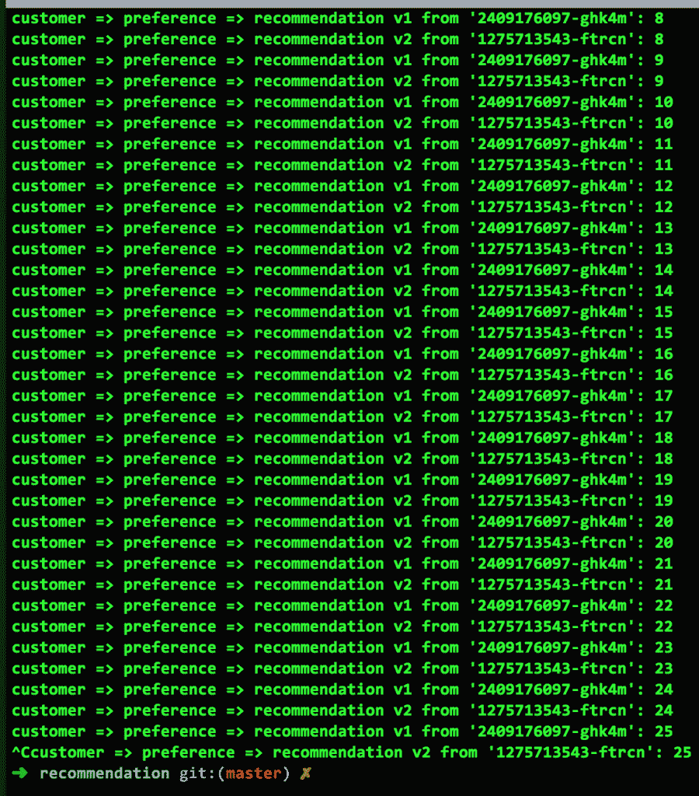
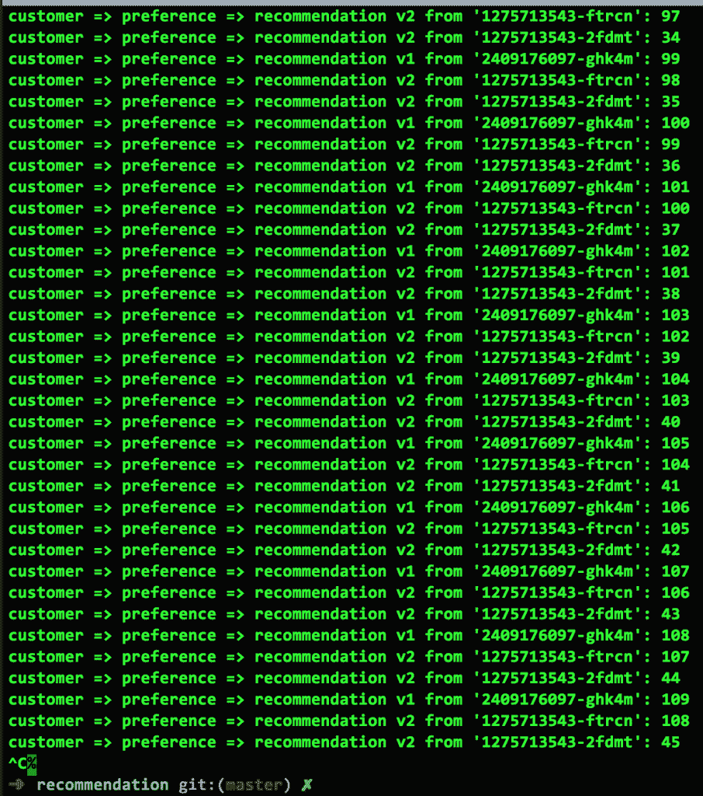
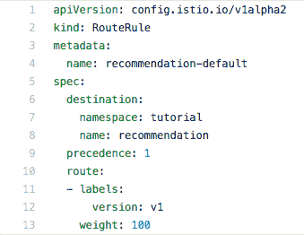
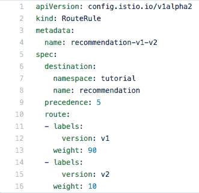
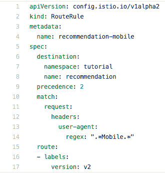

# Istio 路线规则:告知服务请求的去向

> 原文：<https://developers.redhat.com/blog/2018/03/13/istio-route-rules-service-requests>

[OpenShift](https://developers.redhat.com/products/openshift/overview/) 和 [Kubernetes](https://developers.redhat.com/topics/kubernetes/) 做了很好的工作来确保对你的[微服务](https://developers.redhat.com/topics/microservices/)的呼叫被路由到正确的 pod。毕竟，这是 Kubernetes 存在的理由之一:路由和负载平衡。但是，如果您想要定制路由，该怎么办呢？想同时运行两个版本怎么办？Istio 路由规则如何处理这种情况？

【这是我为期十周的**[Istio 服务网系列](https://developers.redhat.com/topics/service-mesh/)** 介绍的第二部分。我之前的文章是[第 1 部分:Istio 简介；它使一个网状的东西](https://developers.redhat.com/blog/2018/03/06/introduction-istio-makes-mesh-things/)。想看视频吗？点击这里查看视频版本。 ]

路由规则是决定路由的规则。虽然可能的配置会变得非常复杂，但总体功能仍然很简单:基于某些参数和 HTTP 头值路由请求。让我们看一些例子。

## 预设立方结构:50/50 Split

这个示例允许您使用两个版本的微服务。我们姑且称它们为“v1”和“v2”，运行在 OpenShift 中。每个都运行在自己的 Kubernetes 管理的 pod 中，默认行为是均衡的循环路由。每个 pod 将根据其微服务实例或副本的数量接收一定百分比的请求。有了 Istio，我们可以改变这种平衡。

对于这个例子，我们有两个在 OpenShift 中运行的“推荐”服务的部署，名为“推荐-v1”和“推荐-v2”。

在图 1 中，我们看到了每个服务运行各自微服务的一个实例的结果，它们之间的分布是均匀的。看截图，可以清楚的看到 1 - 2-1-2-...模式。这是 Kubernetes 的默认路由:

## 多个版本，加权分布

在图 2 中，我们看到了将 v2 副本的数量增加到两个之后的结果(命令是`oc scale --replicas=2 deployment/recommendation-v2`)。正如您所料，v1 现在的比例是 1/3，v2 是 2/3。122122-...模式很明显:

## 忽略带有 Istio 的版本

使用 Istio，我们可以随心所欲地改变这个分布。例如，我们可以使用以下 Istio yaml 文件将所有流量定向到建议 v1:

以下是一些需要注意的事项。通过使用它们的标签来选择窗格。在本例中，使用了“v1”标签。重量是 100；这意味着 100%的流量将被路由到所有带有 v1 标签的推荐 pod。

## 不均匀的版本分割(金丝雀部署)

接下来，使用权重参数，我们可以将流量导向两个 pod，而不考虑每个 pod 中运行的微服务实例的数量。例如，这里我们将 90%的流量定向到 v1，10%定向到 v2:

## 仅限移动用户

对于我们的最后一个示例，我们将移动用户路由到 v2，而其他所有人都被定向到 v1。这是通过使用正则表达式根据请求头中的用户代理值选择客户机来实现的。

## 你能做什么？

看到这个使用正则表达式根据消息头中的信息选择请求的例子，应该会让创造性的车轮转动起来。这种能力是无限的，因为您可以在源代码中注入头值。

## 运营，而不是开发

请记住，所有这些都是在不对您的代码进行任何更改的情况下发生的；当然，您将值注入请求头的特殊情况除外。开发人员将从 Istio 的知识中受益，并将毫无疑问地在开发测试中使用它。在生产中，Istio 配置很可能是运营团队的一项职能。

我再强调这一点也不为过:*你的源代码*没有变化。您不需要构建新的映像或启动新的容器。这一切都发生在您的源代码之外。

## 让你的思绪游走

因为可以对请求头使用正则表达式，想象一下这有多强大。想把你最大的客户引向你的[微服务](https://developers.redhat.com/topics/microservices/)的特别版本吗？那些使用谷歌 Chrome 浏览器的呢？几乎任何你想要的特征都可以用来引导交通。

## 免费为自己尝试一下

阅读 Istio、Kubernetes 和 OpenShift 是一回事，但你难道不想亲自尝试一下吗？[Red Hat Developer Program](https://developers.redhat.com/)团队已经编写了一份详细而全面的教程，您可以立即使用它来了解这些领先的技术。它是开源的，所以没有成本。它可以在 macOS、Linux 和 Windows 上运行，源代码是 Java 或 node.js(更多语言即将推出)。将您的浏览器指向 [Red Hat 开发者演示 github repo](https://github.com/redhat-developer-demos/istio-tutorial) 并立即开始。

## 接下来:优雅地处理问题

这就是 Istio 路线规则的力量。现在想象一下，如果你可以用这种能力来处理错误。这将在我们的下一篇博文中讨论。
敬请期待！

* * *

### “Istio 简介”系列的所有文章:

*   第 1 部分:[Istio 服务网格介绍](https://developers.redhat.com/topics/service-mesh/)
*   第 2 部分: [Istio 路线规则:告知服务请求去哪里](https://developers.redhat.com/blog/2018/03/13/istio-route-rules-service-requests/)
*   第 3 部分: [Istio 断路器:如何处理(池)弹出](https://developers.redhat.com/blog/2018/03/20/istio-circuit-breaker-pool-ejection/)
*   第 4 部分: [Istio 断路器:当出现故障时](https://developers.redhat.com/blog/2018/03/27/istio-circuit-breaker-when-failure-is-an-option/)
*   第五部分: [Istio Tracing &监控:你在哪里，速度有多快？](https://developers.redhat.com/blog/2018/04/03/istio-tracing-monitoring/)
*   第 6 部分: [Istio 混沌工程:我打算这么做](https://developers.redhat.com/blog/2018/04/10/istio-chaos-engineering/)
*   第七部: [Istio 黑暗发射:特勤局](https://developers.redhat.com/blog/2018/04/17/istio-dark-launch-secret-services/)
*   第 8 部分: [Istio 智能金丝雀发布:投产](https://developers.redhat.com/blog/2018/04/24/istio-smart-canary-launch/)
*   第 9 部分: [Istio 出口:通过礼品店出口](https://developers.redhat.com/blog/2018/05/01/istio-egress-exit-through-the-gift-shop/)
*   第十部分: [Istio 服务网格博客系列回顾](https://developers.redhat.com/blog/2018/05/07/istio-service-mesh-blog-series-recap/)

*Last updated: September 3, 2019*